こんにちは、じんないです。

今回は [Ansible AWX](https://github.com/ansible/awx) を使ってターゲットサーバーに Apache をインストールしてみます。

詳しい話は割愛しますが、Ansible AWX (OSS) は Redhat Ansible Tower (商用) のアップストリーム版です。開発スピードは早いのですがその分バグも多いというのも確かで、筆者も過去に何回か試したのですが色々な問題に行く手を阻まれていました。

直近(記事執筆時)で AWX 8.0 がリリースされ使えそうな感じだったので記事にしてみようと思います。


## モデルケース
- Ansible AWX 8.0.0 (Docker コンテナで稼働)
- 認証タイプ: パスワード認証
- ターゲットサーバー: CentOS 7

Ansible AWX はデプロイ済みでターゲットサーバーに SSH 接続できること前提とします。

## ログイン

Web ブラウザから `http://<web サーバーの IP>` で接続し、ログインします。
デフォルトのアカウントは `admin/password` なので適当に変更しておきましょう。

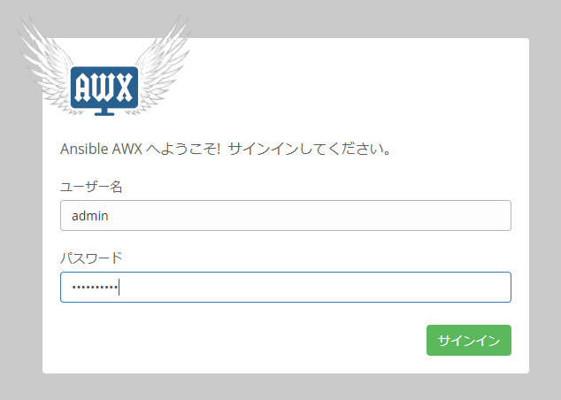

## 認証情報の作成

左ペインの [認証情報] から [+ボタン (新規作成)] をクリックします。

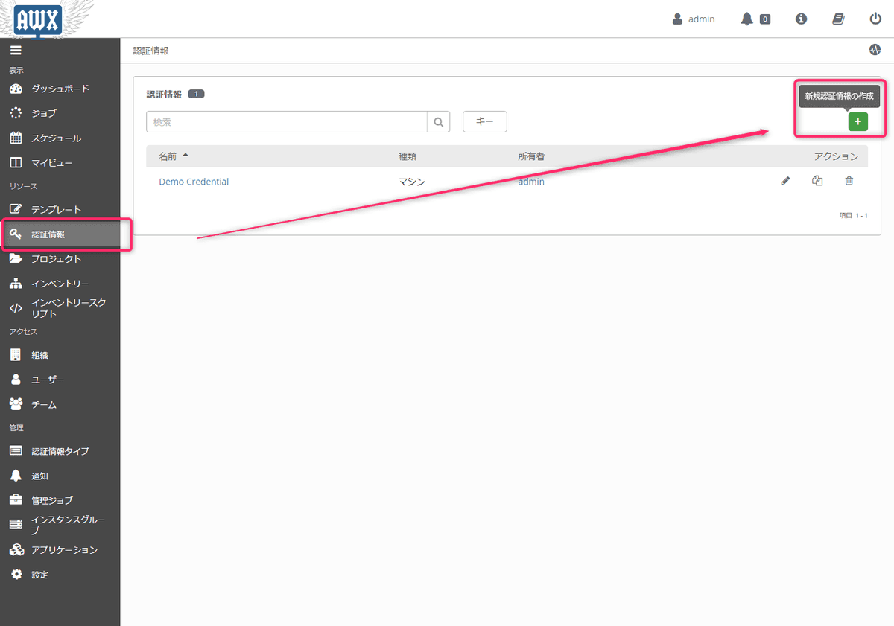

今回はパスワード認証なので**認証情報タイプはマシンを選び**、SSH 接続に必要なユーザー名・パスワードを入力します。
接続するユーザーは sudo が使えるので、**権限昇格方法は sudo を選び**、パスワードを入力します。

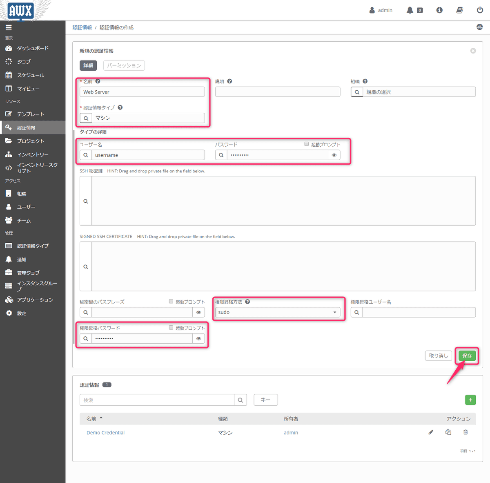

## プロジェクトの作成
### プロジェクトフォルダの作成と playbook の配置

プロジェクトを作成する前に、プロジェクトフォルダを作成しその中に playbook を配置する必要があります。

プロジェクトフォルダのベースディレクトリは `awx/installer/inventory` で定義されています。
`# project_data_dir=/var/lib/awx/projects` がコメントアウトされているので、コメントを外し再構成しておきましょう。
AWX を Ansible で作成している場合は、`ansible-playbook -i inventory install.yml` を実行すれば再構成されます。

プロジェクトフォルダを適当に作ります。今回は `apache` にしました。その下に playbook を配置します。
この playbook ですが、AWX がバリデーションチェックを行っているようで、**構文がおかしい場合は後のジョブテンプレートの作成でリストに表示されないので注意しておきましょう**。

```bash
[root@ansible-awx projects]# pwd
/var/lib/awx/projects

[root@ansible-awx projects]# tree
.
└─ apache
    └─ apache.yml
```

ちなみに apache.yml の中身は apache をインストールするように書いているだけです。

```bash
- hosts: all
  tasks:
    - name: Install apache
      yum: name=httpd state=latest
```

### 新規プロジェクトの作成
AWX に戻り左ペインの [プロジェクト] から [+ボタン (新規作成)] をクリックします。

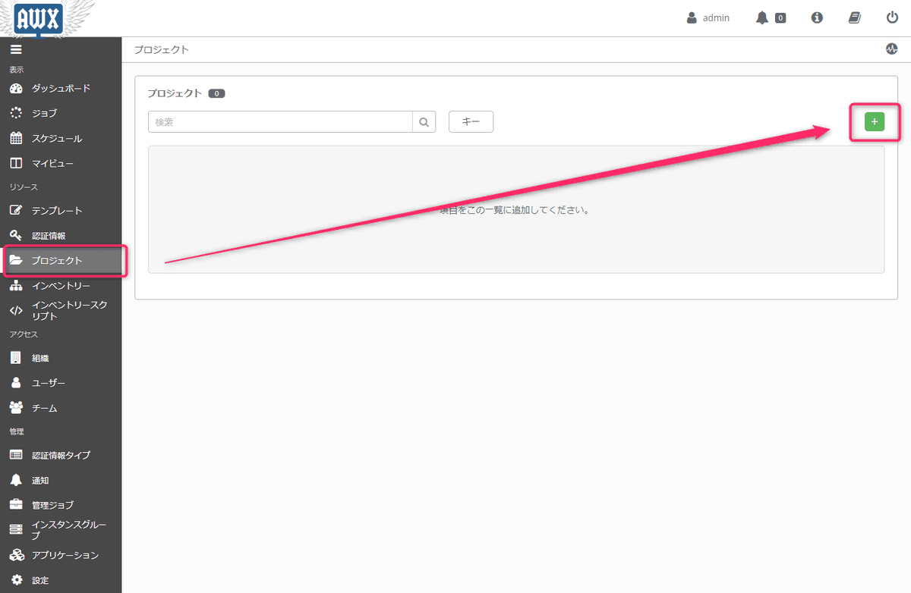

適当なプロジェクト名をつけながら、**SCM タイプは手動を選び**、**PLAYBOOK ディレクトリーで先ほど作成した apache を選択**します。

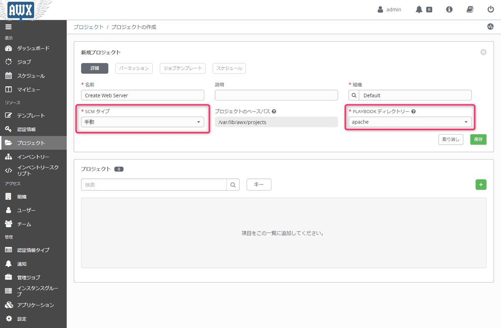

## インベントリーの作成

続いてインベントリーを作成します。
左ペインの [インベントリー] から [+ボタン (新規作成)] をクリックします。

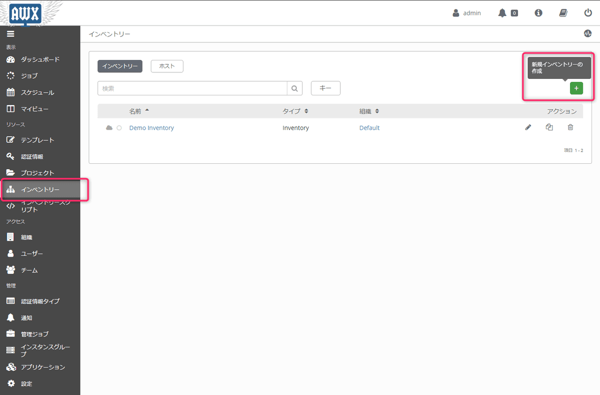

適当に名前を付けて保存します。

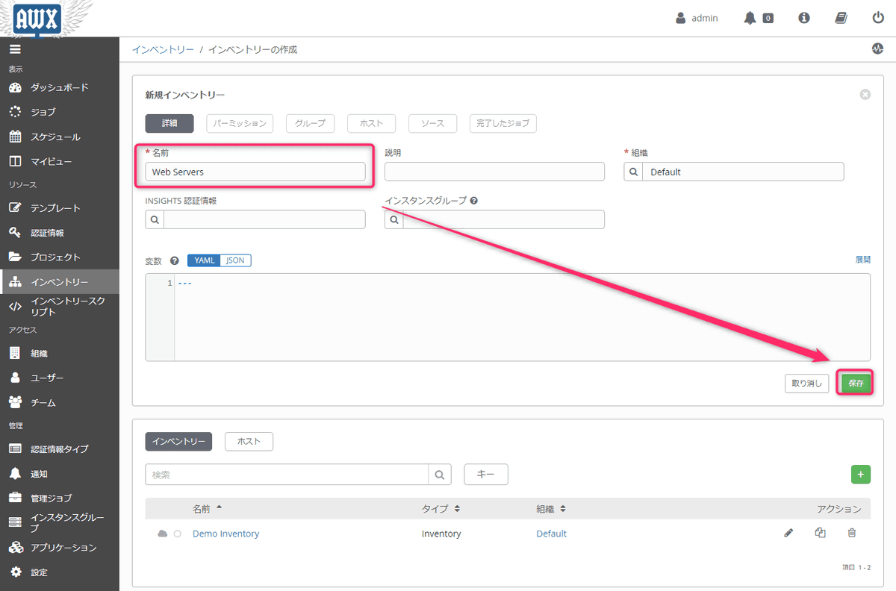

作成したインベントリーの中にグループを作成します。

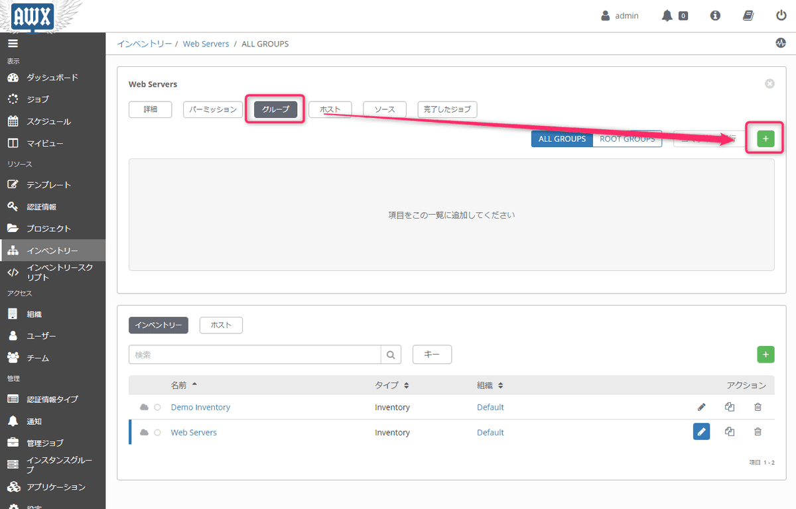

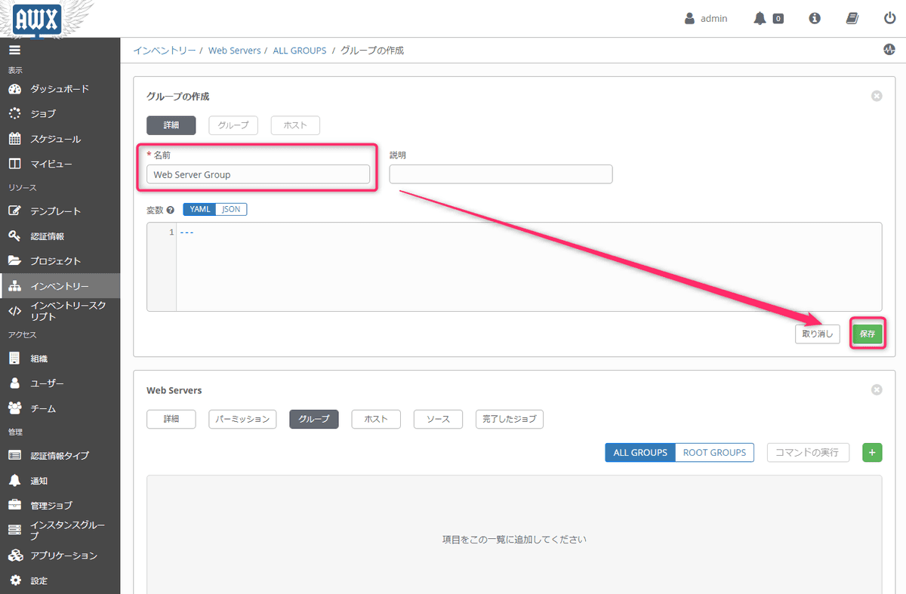

その中にホストを登録します。

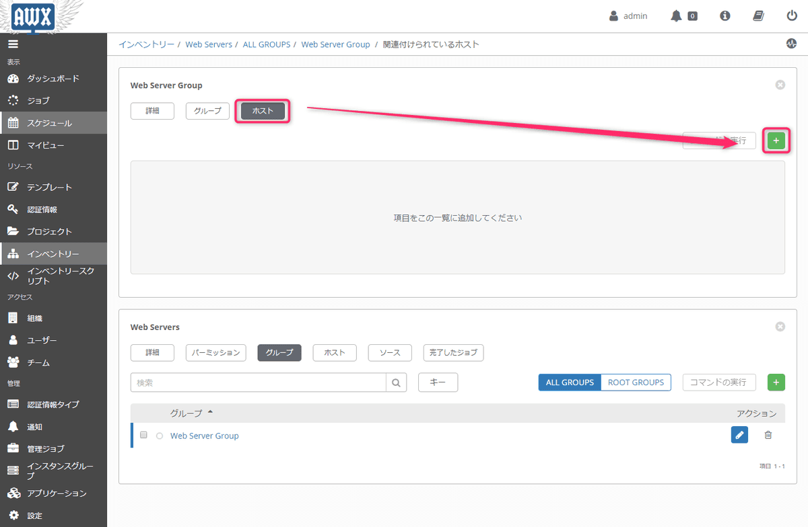

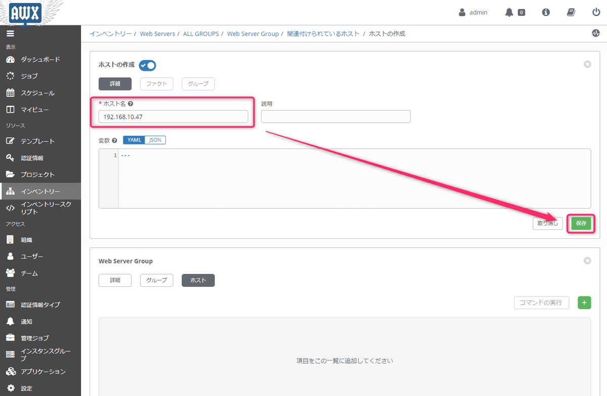

Ansible 2.8 からグループ名のチェックが厳しくなっているようです。
掲載している画像はよくない例ですが、グループ名に半角スペースが含まれていると playbook 実行時に警告がでます。
間隔があく場合はアンダースコア等に置き換えておきましょう。

> [Ansible 2.8 アップデート情報 -機能追加と注意点-](https://www.slideshare.net/akira6592/ansible28update)

## ジョブテンプレートの作成

最後はジョブテンプレートの作成です。
左ペインの [テンプレート] から [+ボタン (新規作成)] をクリックします。

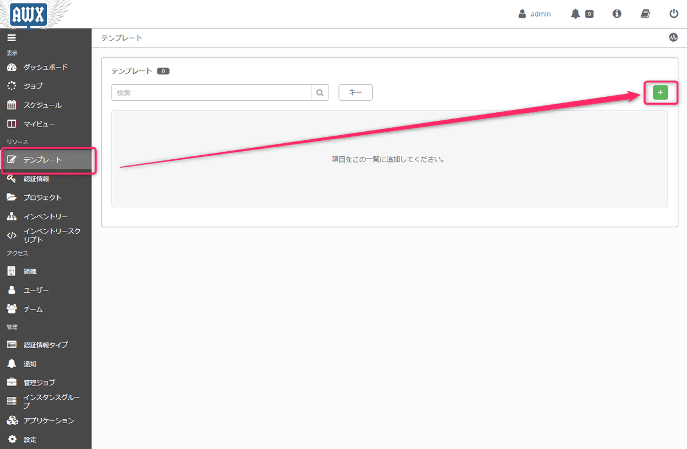

先に作成した、**インベントリー、プロジェクト、playbook**、ターゲットサーバーに接続するための**認証情報**を選択します。
**権限昇格の有効化のチェック**も忘れないようにしておきましょう。

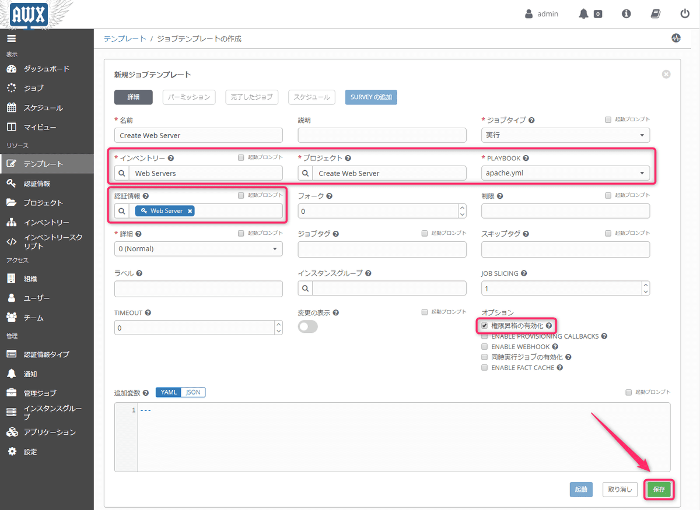

## ジョブ (playbook) の実行

作成したテンプレートの横にある**ロケットのアイコン**をクリックするとジョブがジョブが実行されます。

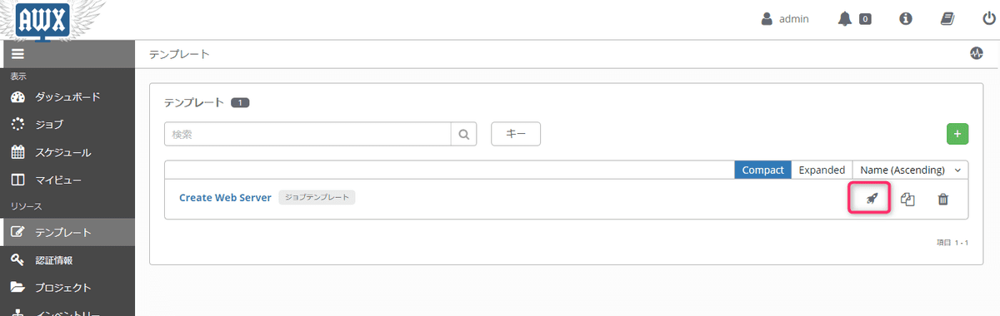

こんな感じでジョブの実行結果を確認できます。

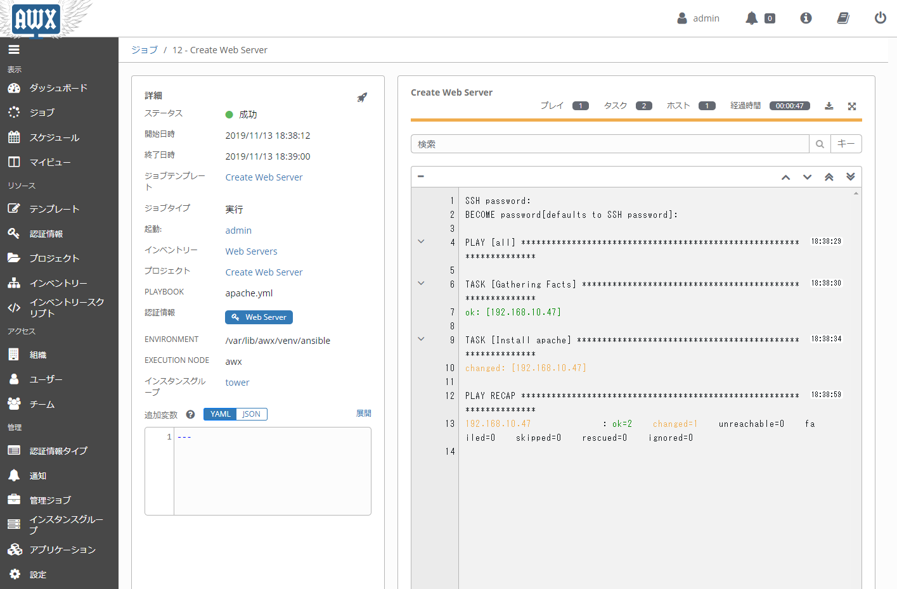

とりあえずこんな感じでやってみました。思ったよりわかりやすい UI だと思います。
ジョブテンプレートを作成するときに、インベントリーとプロジェクトの組み合わせることによって playbook を使い回せるので効率化が図れそうです。

当初 CPU 2コア・メモリ 2GB の環境で動かしていたのですが、playbook が長くなってくるとモッサリ感があったので CPU 4コア・メモリ 4GB で動かしてます。

AWX はインフラ構築の基盤といけたらなと考えてますので、またイケてる記事をリリースしていこうと思います。

ではまた。