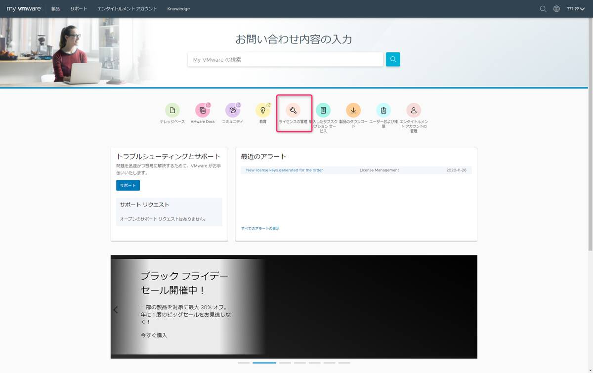
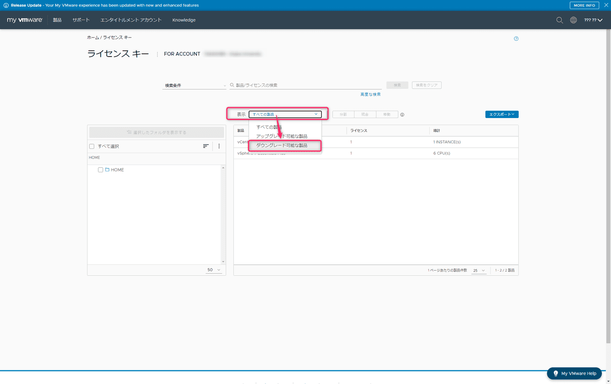
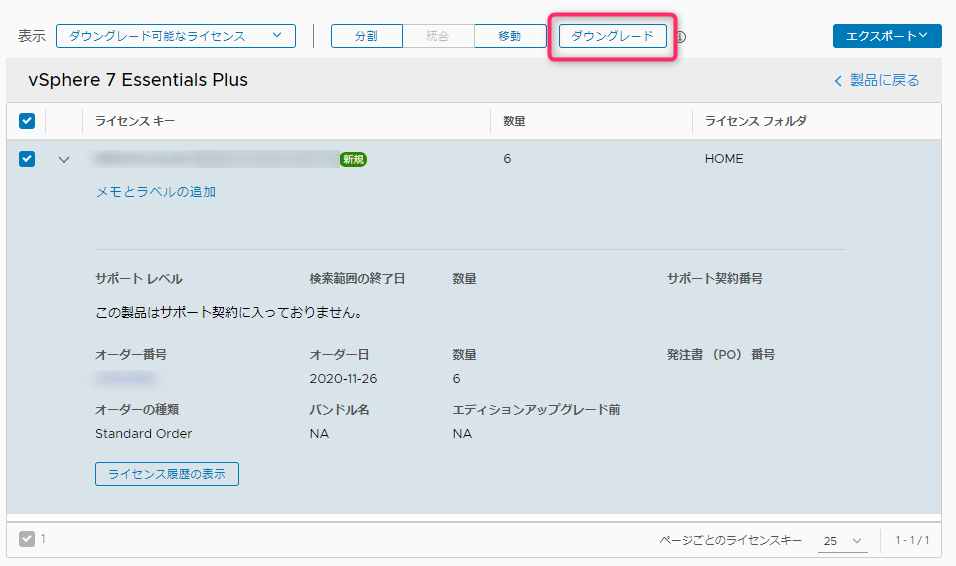
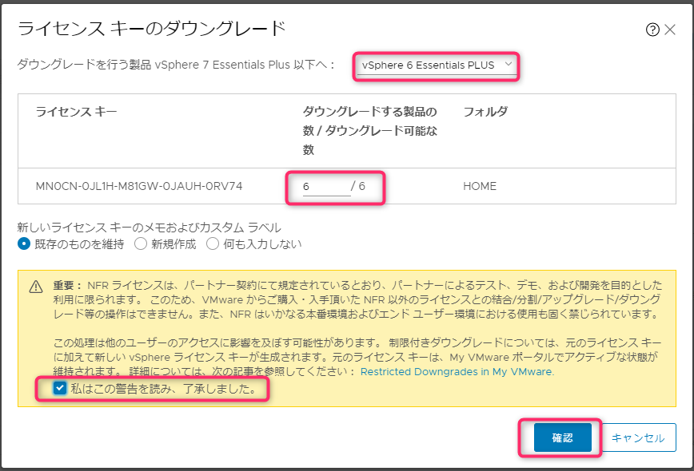

こんにちは、じんないです。

WMware vSphere 

## 前提

My VMware アカウントを取得し、ダウングレード前のライセンスキーを取得済みであることを前提とします。

## ダウングレード手順

My VMware へログインし、ホーム画面から [ライセンスの管理] をクリックします。

表示 [すべての製品] のプルダウンメニューから [ダウングレード可能な製品] を選択します。

ダウングレードしたい製品にチェックし、[ダウングレード] をクリックします。

ダウングレード先の製品や数量を設定し、警告内容にチェックを入れて [確認] をクリックします。

