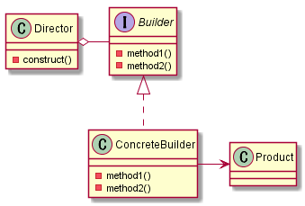
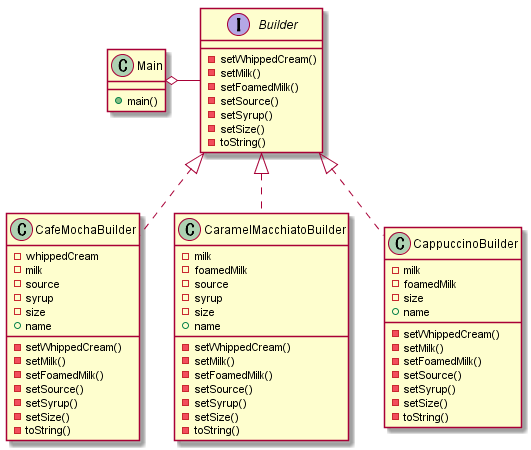

こんにちは。k-so16 です。

某有名カフェでは、コーヒーにトッピングを付けてカスタマイズが出来るのですが、注文の仕方によっては、まるで呪文のような注文になるらしいです。そのような複雑な注文の仕方は覚えられないので、注文ジェネレーターが欲しいところです。

既に作られているとは思いますが、せっかくなので、自分でも作ってみようと思い立ちました。カスタマイズ項目が多いので、トッピングをメソッドチェーンで繋いで追加できるようにジェネレーターを作成します。イメージとしては、 Laravel の QueryBuilder で SQL を組み立てていく感じです。
<!-- GoF の Builder パターンが使えるのではないかと思い、簡易的なジェネレーターを作成してみることにしました。 -->

## 設計
GoF の Builder パターンでは、 Builder クラスが Product クラスのインスタンスを生成するメソッドのインタフェースを持ち、 ConcreteBuilder クラスで Product クラスのインスタンスを生成するメソッドを実装します。 Director クラスの `construct()` メソッドには、インスタンスの生成手順を記述します。

Builder パターンについては、以下の文献を参考にしました。

> [増補改訂版 Java言語で学ぶ デザインパターン入門](https://www.hyuki.com/dp/)

> [7. Builder パターン | TECHSCORE(テックスコア)](https://www.techscore.com/tech/DesignPattern/Builder.html/)

Director クラスの `construct()` メソッドは、常に同じオブジェクトを生成するので、オプションを動的に変更する場合は Builder クラスのメソッドを直接実行する必要がありそうです。今回は、 `main()` メソッドからオプションを組み合わせてオーダーを生成することを考えます。

今回は、カフェモカ、キャラメルマキアート、カプチーノの 3 種類のコーヒーにオプションを付けることを考えます。それぞれを Builder の具象クラス CafeMochaBuilder, CaramelMacchiatoBuilder, CappucinoBuilder としました。各種 Builder クラスのセッターはオプションをセットした自身のオブジェクトを返すものとし、 `toString()` メソッドで、オーダーを文字列として返すものとします。各具象クラスのフィールドには、サイズとオプションの種類を格納するインスタンスプロパティ、コーヒーの名前を格納するクラスプロパティを設定しました。

## 実装
簡易版の実装として、コマンドライン上で動くプログラムを実装しました。実装言語には Java を用いました。ソースコードは **[こちら](https://github.com/k-so16/CoffeeBuilder)** に公開しています。

コマンドライン上で動作するプログラムで、 Main クラスの `main()` メソッド内で各種 Builder クラスの注文を設定しています。 JavaFX や Swing などで GUI からオプションの有無を設定させれば、より簡単にオーダーを作れそうです。

本当は GUI アプリケーションとして作りたかったのですが、 JavaFX は JDK11 から同梱されなくなり、さらに [OpenJFX](https://openjfx.io/) のインストールもうまくいかなかったので、取りやめました。 Swing で実装するという手段もありますが、ロジックとビューの分離がしづらいという建前と、既に GUI アプリケーションにする気力を消失していたという理由から、取りやめました。

コーヒーによっては付かないオプションもあるので、その場合はセッターメソッドの実装だけ用意して、自身のインスタンスを返すのみとしました。付けられないオプションが指定されたらエラーとするのであれば、 InvalidOptionException のような例外クラスを作って、例外を投げるように実装すれば良さそうかなと思います。

## 所感
今回の注文ジェネレーターのアイデアは、 Laravel の QueryBuilder を使って SQL のクエリを動的に生成できることから思いつきました。ちょうど名前も "Query**Builder**" なので、 Builder パターンとして実装できるのではと思いました。

一応、オブジェクトの生成時にセッターの実行順序は知らなくて良いとはいえ、インタフェースを統一して具象クラスでメソッドを実装しているだけなので、もはや Builder パターンではなくなっているのではないかと、実装してから感じました。実際に作る前に、 Laravel の QueryBuilder クラスのソースコードをちゃんと読んでいたら、もう少し違った実装をしていたのかなと思います。 (本記事執筆時点でまだちゃんと読めてない)

以上、 k-so16 でした。デザインパターンの実践って、意外と難しい...