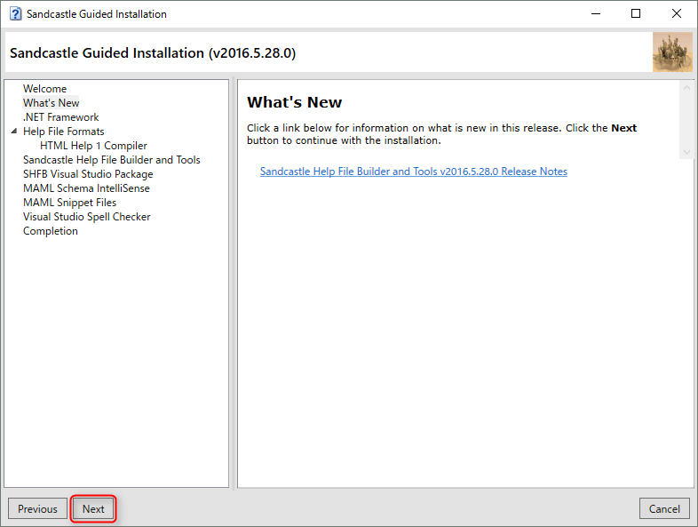
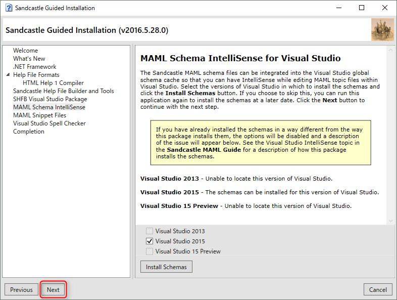

[card url="https://github.com/EWSoftware/SHFB/releases"]

[Sandcastle(XMLコメントからAPIヘルプ生成) | ネスケラボ](http://blog.nextscape.net/research/dotnetenv/sandcastle)

>The selected presentation style (VS2013) does not support one or more of the selected help file formats. Supported formats: HtmlHelp1, MSHelp2, MSHelpViewer, Website

[html - Creating various help formats in a single build in Sandcastle Help File Builder - Stack Overflow](http://stackoverflow.com/questions/31266025/creating-various-help-formats-in-a-single-build-in-sandcastle-help-file-builder)

Sandcastle プロジェクトのプロパティから Help File → Presentation Option の設定を変更する

