パスワード管理サービスの一つである **1Password** のファミリープランを試用しています。今回はメンバーがファミリープランに参加する手順を示します。

## 招待メールから登録

ファミリープランは招待制なので、まずはファミリーアカウントの管理者 (Family Organizer) から招待してもらいましょう。

招待を受けると下記のような **Join なんとか on 1Password** という件名のメールが届くので、 **[Join your family] リンクをクリック**します。

メールが見当たらない場合は迷惑メールフォルダーもチェックしましょう。

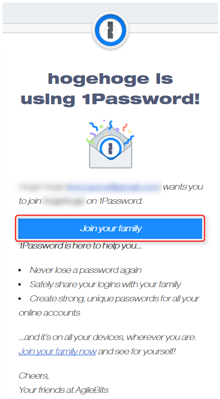

アカウントの設定画面になるので、**名前と名字**を入力して、 [Continue] をクリックします。

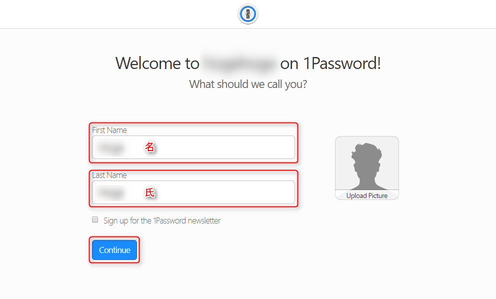

[Sign up for the 1Password newsletter] はニュースレターの申し込みなのでチェックを外したままでよいでしょう。

## 秘密鍵の記録

**Secret Key (秘密鍵) が表示されるので、メモ**しておきます。

この**秘密鍵はサインインや新しいデバイスで認証するときに必要になる**大事なものなので忘れないようにしましょう。ちなみになくしてもこの鍵は復元できません。

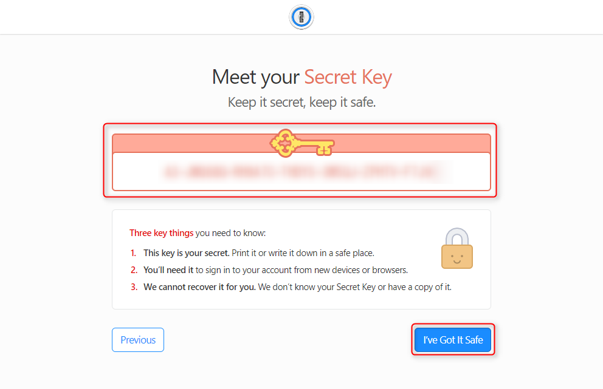

メモったら [I've Got It Safe] をクリックします。

## マスターパスワードの設定

**一番大事なマスターパスワードを設定**します。

「**英数字と記号の組み合わせで覚えやすくランダムなパスワード**」を入力します。無茶な話ですが、他のすべてのパスワードを管理するものになるので、がんばって考えるしかありません。

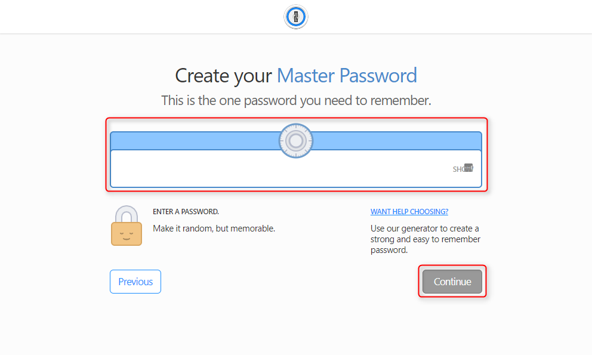

**良好なパスワードだと左下に緑色で KEEP IT UP! と表示される**ので、入力できたら [Continue] をクリックします。

**Almost there!** が表示されるとアカウント登録は完了です。最後にさきほどのマスターパスワードを入力してサインインします。

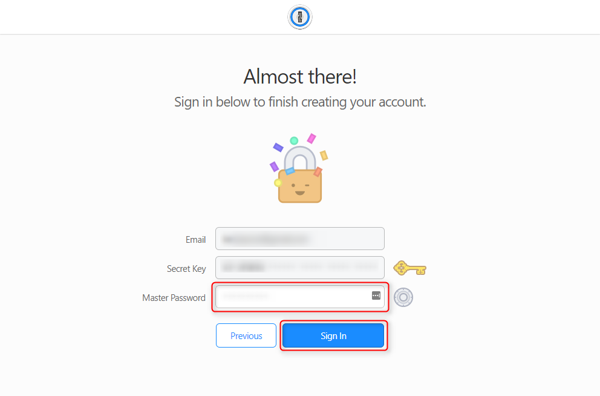

## サインイン

サインイン後、 Emergency Kit の保存を促されるので、 **Save Emergency Kit をクリックして PDF を保存**します。

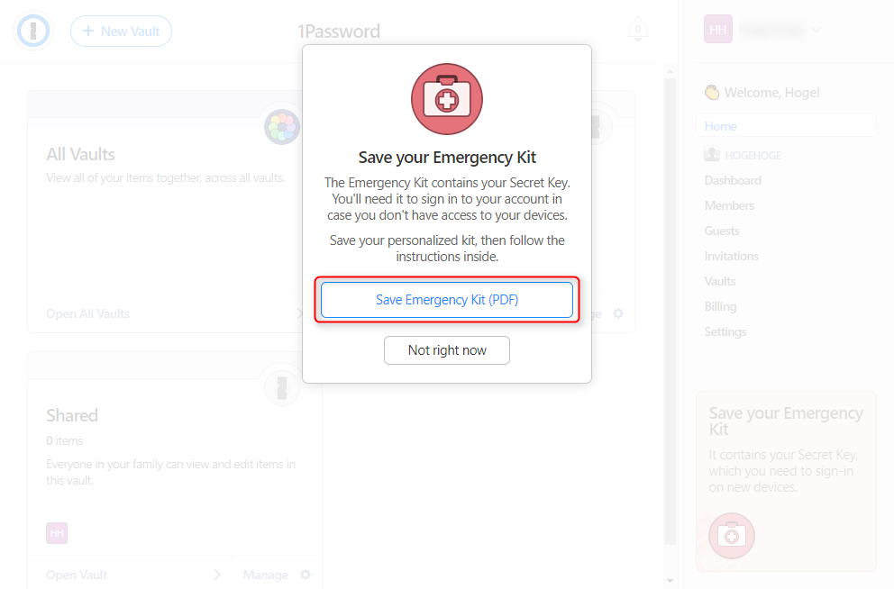

**PDF は印刷し、マスターパスワードを書いて、紙ベースで保存**しておきます。これがあれば安心。やっぱり最後は**紙頼み**です。この紙をトイレに忘れたり、机の上に置きっぱなしにしたりしないようにしましょう。

なお、サインアップが完了すると下記のような Welcome メールが届いています。

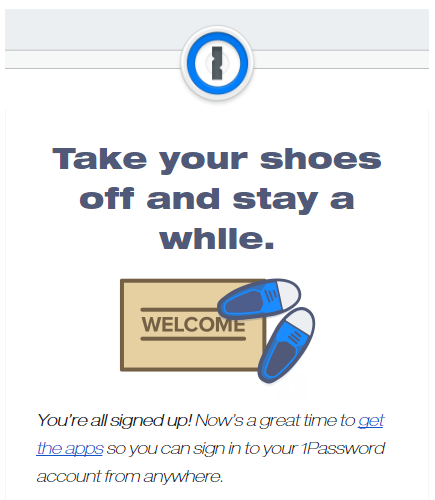

下記のようなホーム画面が開けば OK です。

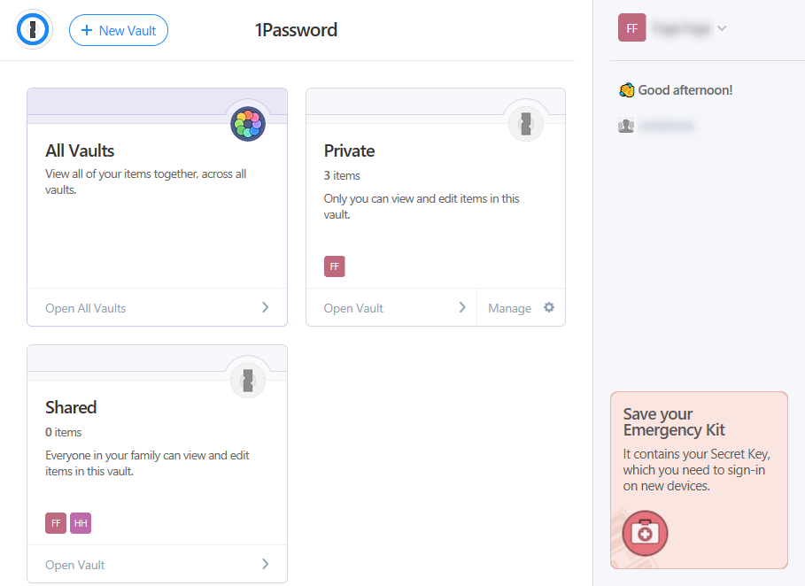

ただ管理者側で「**アカウントを確認** (Confirm)」という操作をしてもらう必要があるため、この初期状態ではほぼなにもできません。管理者がなかなか動いてくれない場合は急かしてみましょう。

## デスクトップアプリのインストール

### アプリのインストール

1Password は、LastPassと違い、Google Chromeの拡張機能を利用するためにもPCにデスクトップアプリのインストールが必要になります。

[Downloads - 1Password](https://1password.com/downloads/)

アプリダウンロードページから mac OS 用 もしくは Windows 用を選択して、ダウンロードします。

ダウンロードしたファイルからインストールし、作成したアカウントでログインします。特に難しいことはありません。

PCのアプリが優秀なため、各種アカウントの管理はこちらから行ったほうが便利です。

### 自動ロック設定

デフォルトではコンピューターをロックすると、 1Password のアプリもロックがかかります。大変セキュアでいいのですが、業務上PCをロック／スリープすることが多いので都度マスターパスワードを求められるのは面倒です。

私は少々ソフトにしています。

歯車アイコンから [Options] を選んで設定画面を開きます。

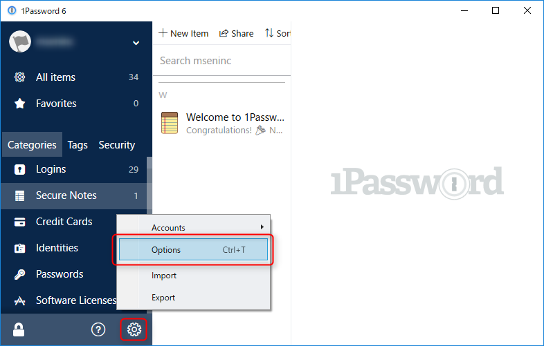

[Security] から [Auto-lock] のところで **Lock when computer is locked** のチェックを外し、 **Lock after computer is idle for** を適当な時間に設定します。数時間ならいいんじゃないでしょうか。

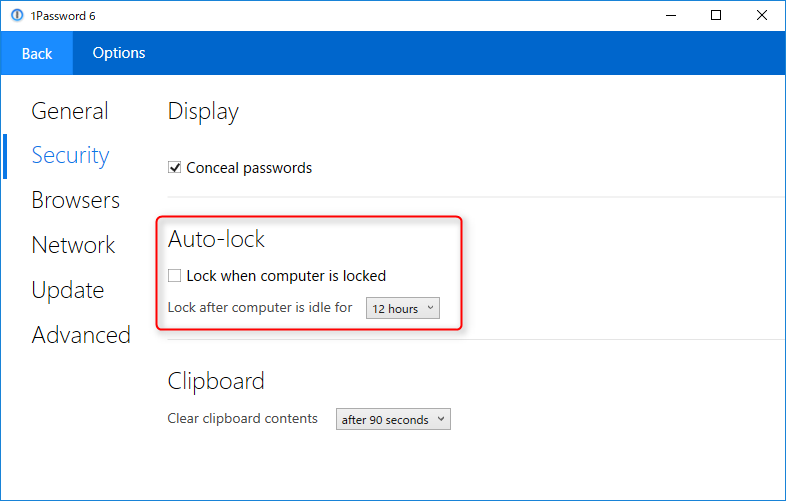

ただし、 **1Password が開いている状態のときはすべてのパスワード見放題**ですので、コンピューターをロックすることを徹底しましょう。

## 拡張機能のインストール

1Password を有効に使うため、ブラウザごとの拡張機能をインストールします。

Google Chrome 用はこちらから。

- [1Password: Password Manager and Secure Wallet - Chrome ウェブストア](https://chrome.google.com/webstore/detail/1password-password-manage/aomjjhallfgjeglblehebfpbcfeobpgk?hl=ja)

### アカウント情報の保存

拡張機能がインストールされた状態で、どこかのサイトにログインすると **Save Login** 画面が表示されます。

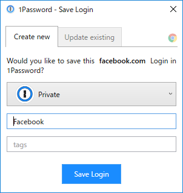

保存先の Vault とサイト名を確認して、 Save Login ボタンを押すと 1Password にアカウントが保存されます。

### アカウント情報の呼出

逆にすでに保存してあるサイトにログインするときは、ログイン画面で右クリックします。コンテキストメニューに 1Password が表示されます。

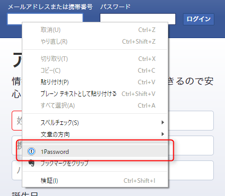

クリックするとそのサイト (ドメイン単位) で 1Password に登録したアカウントが表示されるので、クリックするとユーザー名とパスワードがはまります。

なお、どう保存されているか不明ですが、ジャパンネット銀行のようにアカウント名が 2 つに分かれているようなサイトでも自動入力ができました。

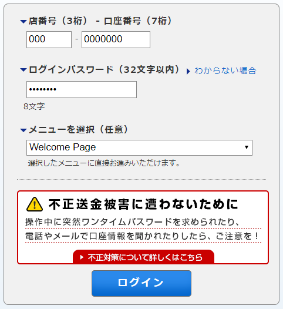

これは便利です。