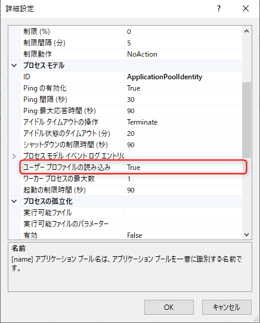

```
2019-12-23 18:03:11.1915||Microsoft.AspNetCore.DataProtection.Repositories.EphemeralXmlRepository|WARN|Using an in-memory repository. Keys will not be persisted to storage. 
2019-12-23 18:03:11.1915||Microsoft.AspNetCore.DataProtection.KeyManagement.XmlKeyManager|WARN|Neither user profile nor HKLM registry available. Using an ephemeral key repository. Protected data will be unavailable when application exits. 
2019-12-23 18:03:11.2102||Microsoft.AspNetCore.DataProtection.KeyManagement.XmlKeyManager|WARN|No XML encryptor configured. Key {da990dba-044b-4efc-929f-e2793d2b3364} may be persisted to storage in unencrypted form. 
```

[\[SOLVED\] Using an in-memory repository. Keys will not be persisted to storage. - ASP.NET Core under IIS - Cypress North](https://cypressnorth.com/programming/solved-using-memory-repository-keys-will-not-persisted-storage-asp-net-core-iis/)

**[ユーザー プロファイルの読み込み] を `True`** に変更



