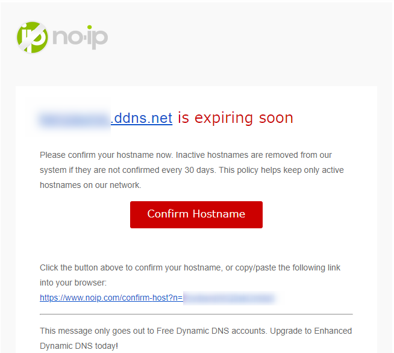
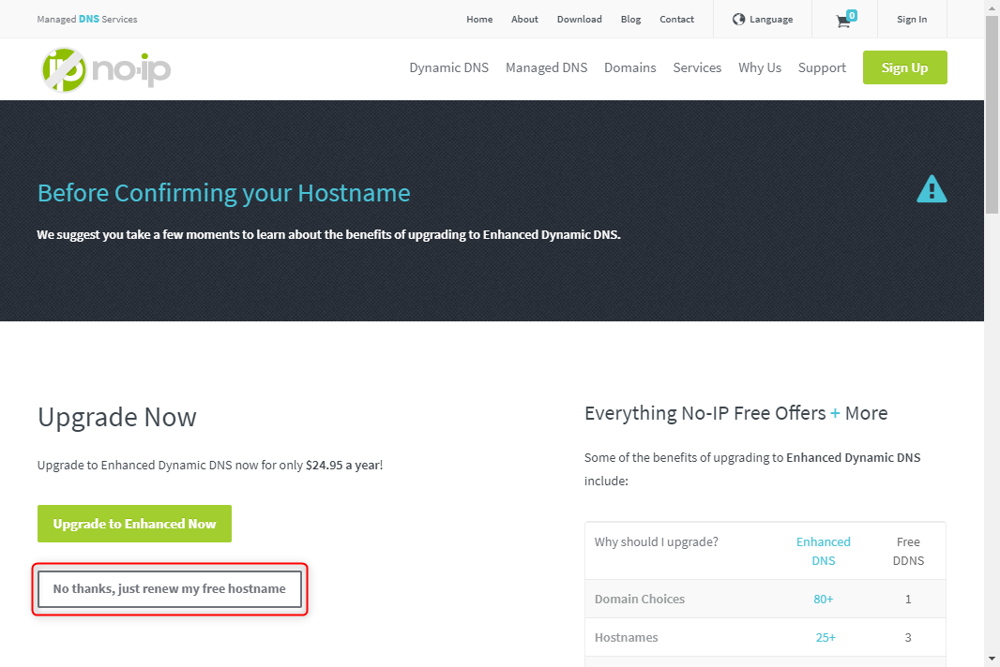
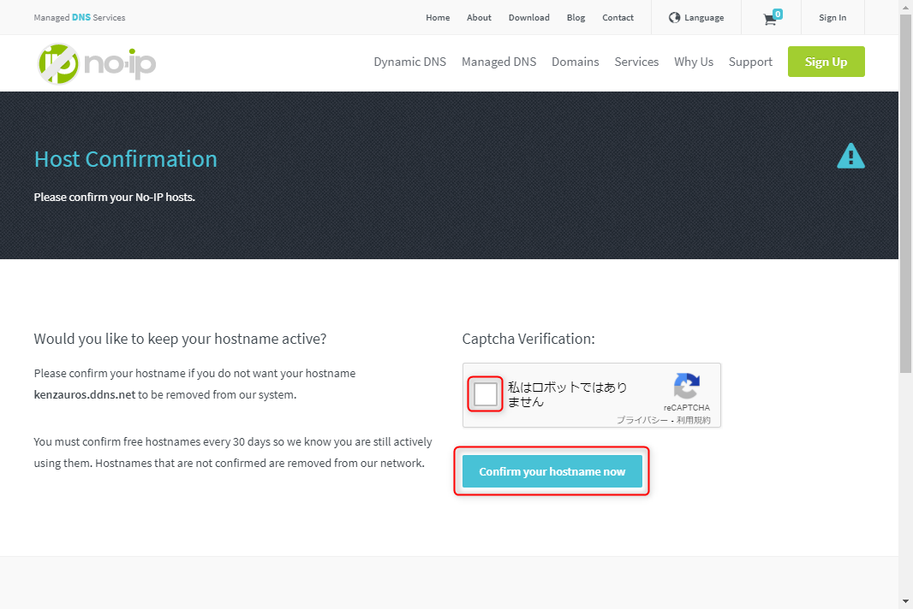

No-IP クライアントのインストール

No-IP に現在のリモート IP アドレスを更新するため、 Raspberry Pi に更新用クライアントをインストールします。

まずソースファイルをダウンロードして展開します。

```sh
pi@gateway:~ $ wget http://www.noip.com/client/linux/noip-duc-linux.tar.gz
pi@gateway:~ $ sudo tar zxvf noip-duc-linux.tar.gz
pi@gateway:~ $ cd noip-<バージョン番号>/
```

ソースファイルをビルドします。

```sh
pi@gateway:~/noip-2.1.9-1 $ sudo make
gcc -Wall -g -Dlinux -DPREFIX=\"/usr/local\" noip2.c -o noip2 
noip2.c: In function ‘dynamic_update’:
noip2.c:1595:6: warning: variable ‘i’ set but not used [-Wunused-but-set-variable]
  int i, x, is_group, retval, response;
      ^
noip2.c: In function ‘domains’:
noip2.c:1826:13: warning: variable ‘x’ set but not used [-Wunused-but-set-variable]
         int x;
             ^
noip2.c: In function ‘hosts’:
noip2.c:1838:20: warning: variable ‘y’ set but not used [-Wunused-but-set-variable]
         int     x, y, z;
                    ^
noip2.c: In function ‘autoconf’:
noip2.c:2538:19: warning: ‘%s’ directive writing up to 255 bytes into a region of size 247 [-Wformat-overflow=]
  sprintf(line, "%s%s%s%s", USTRNG, login, PWDSTRNG, password);
                   ^~               ~~~~~
noip2.c:2538:2: note: ‘sprintf’ output between 16 and 526 bytes into a destination of size 256
  sprintf(line, "%s%s%s%s", USTRNG, login, PWDSTRNG, password);
  ^~~~~~~~~~~~~~~~~~~~~~~~~~~~~~~~~~~~~~~~~~~~~~~~~~~~~~~~~~~~
```

いくつか warning がでていますが、 error がなければ特に気にしなくても問題ありません。

`make install` でインストールします。
```
pi@gateway:~/noip-2.1.9-1 $ sudo make install
if [ ! -d /usr/local/bin ]; then mkdir -p /usr/local/bin;fi
if [ ! -d /usr/local/etc ]; then mkdir -p /usr/local/etc;fi
cp noip2 /usr/local/bin/noip2
/usr/local/bin/noip2 -C -c /tmp/no-ip2.conf

Auto configuration for Linux client of no-ip.com.
```

インストール中に設定内容を聞かれますので、 No-IP のアカウント名、パスワード、更新間隔等を設定します。

```
Please enter the login/email string for no-ip.com  <No-IP のアカウント名>
Please enter the password for user '<No-IP のアカウント名>'  ************<No-IP のパスワード>

Only one host [<登録済みの DDNS 名>] is registered to this account.
It will be used.
Please enter an update interval:[30]  30
Do you wish to run something at successful update?[N] (y/N)  n

New configuration file '/tmp/no-ip2.conf' created.

mv /tmp/no-ip2.conf /usr/local/etc/no-ip2.conf
```

更新間隔はデフォルト 30 分となっていますので、今回はそのままとしました。

次に更新クライアントを実行する init.d を登録します。 Raspberry Pi OS は Debian 系ですので用意されている `debian.noip2.sh` をコピーして使います。

```
pi@gateway:~/noip-2.1.9-1 $ sudo cp debian.noip2.sh /etc/init.d/noip2
pi@gateway:~/noip-2.1.9-1 $ sudo chmod +x /etc/init.d/noip2
pi@gateway:~/noip-2.1.9-1 $ sudo vi /etc/rc.lcal
pi@gateway:~/noip-2.1.9-1 $ sudo /etc/init.d/noip2 stop
pi@gateway:~/noip-2.1.9-1 $ sudo /usr/local/bin/noip2 -C
pi@gateway:~/noip-2.1.9-1 $ sudo /etc/init.d/noip2 start
pi@gateway:~/noip-2.1.9-1 $ sudo /usr/local/bin/noip2 -S
1 noip2 process active.

Process 12227, started as noip2, (version 2.1.9)
Using configuration from /usr/local/etc/no-ip2.conf
Last IP Address set 118.17.163.15
Account kenzauros
configured for:
        host  kenzauros.ddns.net
Updating every 30 minutes via /dev/eth0 with NAT enabled.
```






