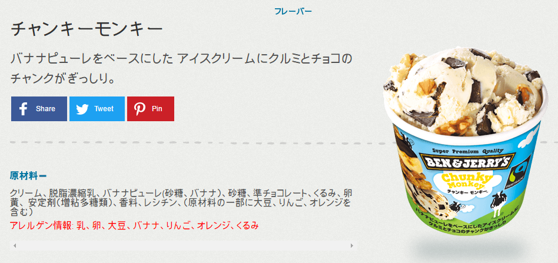

現在、社内スタッフ間でアルゴリズムの宿題が出ているので、毎日解いています。

問題の出題者は、[けんけん](/category/articles-kenken-wrote/)。

解くのは、私(あゆと)、[FHN](/category/articles-fhn-wrote/)、[きよしん](/category/articles-kiyoshin-wrote/#wp-toolbar) の3名です。


アルゴリズムトレーニングの第一回は、**配列の差分**です。

## 問題
array2 に存在して array1 に存在しない要素の一覧を出力せよ。結果の要素は array3 にまとめること。

```
var array1 = [ 'B', 'D', 'E' ];
var array2 = [ 'A', 'X', 'B', 'C', 'D' ];
var array3 =[];

// WRITE YOUR ALGORITHM

```

## あゆと の答え

```
var array1 = [ 'B', 'D', 'E' ];
var array2 = [ 'A', 'X', 'B', 'C', 'D' ];
var array3 =[];

// WRITE YOUR ALGORITHM
var i; //配列1用カウンター
var ii; //配列2用カウンター
var iii; //ちがうよカウンター

for (ii = 0; ii < array2.length; ii++) { //配列2の総当り
  iii = 0; // ちがうよカウンターの数をリセット
  for (i = 0; i < array1.length; i++) { //配列1の総当り
    if (array1[i] !== array2[ii]) { //ちがう時
      iii ++; //ちがうよカウンターの数を貯める
      if (array1.length === iii) { //ちがうよカウンターの数が配列1と同じ場合
        array3.push(array2[ii]); //答え用配列に追加
      }
    }
  }
}

console.log(array3); // 出力: [ 'A', 'X', 'C' ]
```

## [FHN](/category/articles-fhn-wrote/) の答え
```
var array1 = [ 'B', 'D', 'E' ];
var array2 = [ 'A', 'X', 'B', 'C', 'D' ];
var array3 =[];

// WRITE YOUR ALGORITHM
for (var i = 0; i < array2.length; i++) {
  for (var j = 0; j < array1.length; j++) {
    if (array1[j] == array2[i]){
    }
    if (array1[j] !== array2[i]){
    array3.push(array2[i]);
    }
  }
}
​
console.log(array3); // 出力: [ 'A', 'X', 'C' ]
```
**未完成での提出**

## [きよしん](/category/articles-kiyoshin-wrote/#wp-toolbar) の答え
```
// array2のみに存在する要素を検出するためarray2の要素すべてを検証
for(var i = 0; i < array2.length; i++) {
    var isNotExists = true // array1に存在しないという判定フラグ 初期化値はtrue
    // array1の要素を一つずつ比較する
    for(var j = 0; j < array1.length; j++) {
        // array2のチェック対象の要素と同じ値が存在する場合
        if(array2[i] === array1[j]) {
            // array1の残りの要素をチェックする必要がないため、
            // 判定フラグをfalseに変更し、ループを抜ける
            isNotExists = false;
            break;
        }
    }

    // isNotExistsがtrueの場合、チェック対象の要素が
    //  array1に存在しないことになるため、array3に対象の要素を追加
    if(isNotExists){
        array3.push(array2[i]);
    }
}

console.log(array3); // 出力: [ 'A', 'X', 'C' ]
```

## [けんけん](/category/articles-kenken-wrote/)(出題者)の解答例
```
for (var i = 0; i < array2.length; i++) {
  var exists = false;
  for (var j = 0; j < array1.length; j++) {
    if (array1[j] === array2[i]) {
      exists = true;
      break;
    }
  }
  if (!exists) { array3.push(array2[i]); }
}

console.log(array3); // 出力: [ 'A', 'X', 'C' ]
```

## 私のソースコードと解答例の違い
けんけん と きよしん に指摘された事を記載しています。

* break文を使用している為に無駄な処理をさせていない。
* 処理の途中でカウントアップされて、その数がどうなっているかで判断する必要がある場合、
机上デバッグの際、頭の中で計算しながら処理を追っていくことになるので、数え間違いによるバグを引き起こすといった問題も考えられる。
* 上記の事からフラグ変数を用いる。
* ループ変数は、簡単なループでは外側から順に i j k を慣習的に使う。
* ループ変数は可能な限り、for文で宣言する。ループ変数をループ外で使わない事が重要。

## あとがき
私と FHN は初心者なので、本当に勉強になっています。
色んな方のソースコードやアルゴリズムを見ると考えさせられますね～。

## あゆとの雑談部屋
この前、初めて最近人気？のベン&ジェリーズのアイスクリームを食べました。

Ben & Jerry's
[http://www.benjerry.jp/](http://www.benjerry.jp/)

食べたフレーバーは**チャンキーモンキー**


「むむっ…これは…うまい！」

バナナ味のアイスが濃厚で、チョコとクルミが入ってザクザク感がしっかりあります。

サーティーワンのチョコチップ系とナッツトゥユーが一度に味わえる感じなので、美味しくないわけがない。

ただ、値段が300円を越すので、ホイホイ食べられる感じではないですが、サーティーワンや他のアイス屋に行くのを考えたら、ベン&ジェリーズはアリですね。

他にも色々とフレーバーがあるので、全種類制覇目指して、これからちょこちょこ食べていきます。
