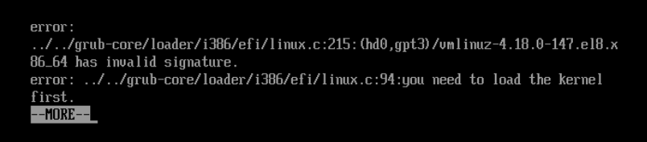
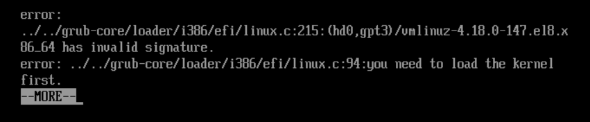

こんにちは。

[前回の記事](/red-hat-enterprise-linux-8-1-on-vmware-esxi/) で、ESX 6.7上にRed Hat Enterprise Linux 8.1 を構築しました。

評価対象の案件がバージョン8.1で進める必要がり、 **Kernel等がアップグレードされないように yum.conf に exclude 設定を実施** していたのですが、 **アップグレード後の再起動で起動不能になる現象が発生** してしまいました。

今回はその解決までの流れを紹介します。

## 経緯

[前回の記事](/red-hat-enterprise-linux-8-1-on-vmware-esxi/)とおりインストールを行い、`dnf -y upgrade` を実行する前に、 **yum.conf のmainセクションに以下の exlude を記載**
```
excludepkgs=kernel* kmod-* perf-* python3-perf-* bpftool-* redhat-release
```

## エラー内容
アップグレードが完了し、再起動の実行までは正常でした。
しかし再起動すると・・・

```
error:
../../grub-core/loader/i386/efi/linux.c:215:(hd0,gpt3)/vmlinuz-4.18.0-147.el8.x86_64 has invalid signature.
error ../../grub-core/loader/i386/efi/i386/efi/linux.c:94:you need to load the kernel first.
```



という状態で起動しなくなってしまいました。。

## 原因

Red Hat カスタマーに問合せをしたところ、以下のような回答がありました。

該当システムは EFI ベースで、障害内容から下記ナレッジの症状に見受けられます。

  [https://access.redhat.com/solutions/5272311](https://access.redhat.com/solutions/5272311)

アップデートの際、shim-*(shim-x64 等)パッケージのバージョンが不具合の対応バージョン以上であるかをご確認ください。

既にアップデートを行って起動が行えなくなっている場合には、ナレッジの対処方法として説明されている通り、レスキューモードで起動し、
shim-* パッケージのアップデートを実施してください。

shim-* パッケージが不具合対応以上のバージョンでも解消しない場合、アップデート後に再起動を行う前に下記情報を取得してご提供ください。

## 解決

インストール直後のスナップショットを取得していましたので、ロールバックを行い、以下の流れで解決しました。

1. **yum.conf のmainセクションに上述した exlude を記載**
1. `dnf -y upgrade shim-*` を実行
```
(省略)
鍵のインポートに成功しました
トランザクションの確認を実行中
トランザクションの確認に成功しました。
トランザクションのテストを実行中
トランザクションのテストに成功しました。
トランザクションを実行中
  準備             :                                                        1/1
  アップグレード中 : shim-x64-15-15.el8_2.x86_64                            1/2
エラー: lsetfilecon: (/boot/efi/EFI/BOOT/BOOTX64.EFI;5f7c8030, system_u:object_r:boot_t:s0) サポートされていない操作です
エラー: lsetfilecon: (/boot/efi/EFI/BOOT/fbx64.efi;5f7c8030, system_u:object_r:boot_t:s0) サポートされていない操作です
エラー: lsetfilecon: (/boot/efi/EFI/redhat/BOOTX64.CSV;5f7c8030, system_u:object_r:boot_t:s0) サポートされていない操作です
エラー: lsetfilecon: (/boot/efi/EFI/redhat/mmx64.efi;5f7c8030, system_u:object_r:boot_t:s0) サポートされていない操作です
エラー: lsetfilecon: (/boot/efi/EFI/redhat/shimx64-redhat.efi;5f7c8030, system_u:object_r:boot_t:s0) サポートされていない操作です
エラー: lsetfilecon: (/boot/efi/EFI/redhat/shimx64.efi;5f7c8030, system_u:object_r:boot_t:s0) サポートされていない操作です

  整理             : shim-x64-15-11.x86_64                                  2/2
  検証             : shim-x64-15-15.el8_2.x86_64                            1/2
  検証             : shim-x64-15-11.x86_64                                  2/2
Installed products updated.

アップグレード済み:
  shim-x64-15-15.el8_2.x86_64

完了しました!
```
一部エラーが・・・大丈夫なのか。。
1. `dnf -y upgrade` を実行

改善せず・・・


1. sosreport を送付し再度解析を依頼　yum -y install sos