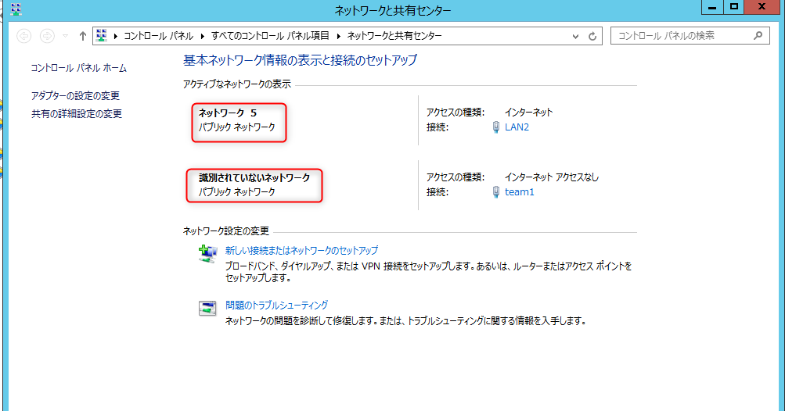

こんにちは。

今回は以前に書いた (以下)　の補足記事です。
[コマンド (PowerShell) でWindowsの「ネットワークの場所」を変える方法](/change-windows-network-location-by-powershell/)

ネットワークを2種類もつサーバーが両方 **パブリックネットワーク** として認識されていてWindows Firewallの制御が細かくできない状態でした。

そこで、以前に書いた記事を参考に **プライベートネットワーク** に変更したのですが、再起動すると再度戻ってしまいました。

このあたりの記事を参考に、グループポリシーで変更してみたところ再起動後も無事
[Windowsで、「識別されていないネットワーク」の種類を「パブリック ネットワーク」から「プライベート ネットワーク」に変更する：Tech TIPS - ＠IT](http://www.atmarkit.co.jp/ait/articles/1012/24/news127.html)

