こんにちは。

突然ですが、複数のGoogleアカウントを使っている方も多いのではないでしょうか。

私もその1人ですが、そのような場合、だいたいChromeのタブはこんな感じになっていませんか。
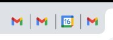

この状態だと、PCの強制終了などでChromeが消えたとき、またタブを開いて・・・と悲しい出来事も発生してしまいます。

ユーザーアカウントごとにChromeのショートカットを作成する方法を紹介します。

## 前提
- nori@... でログインしている状態で masuda@... を追加する

## 手順
早速ですがいきましょう。

Chromeの右上から、ユーザーのアイコンをクリックし追加を選択します。
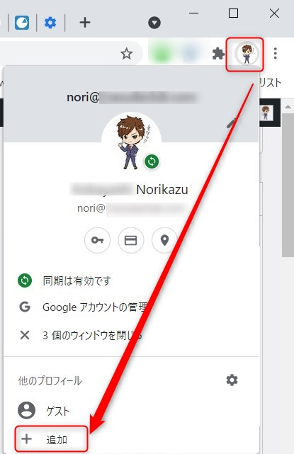

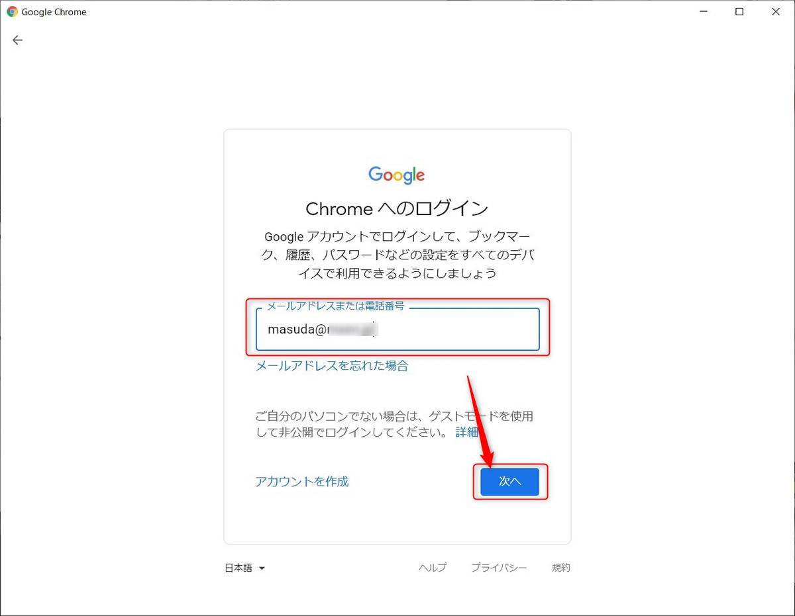

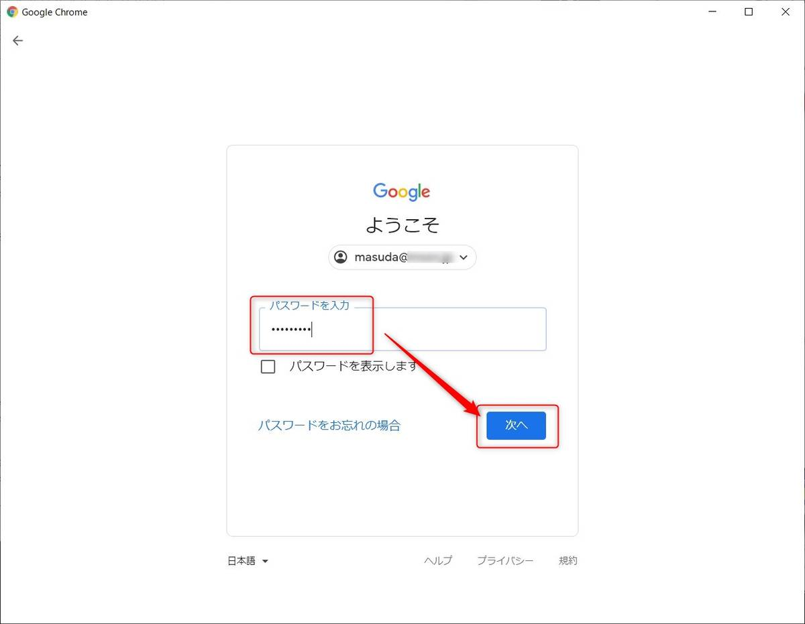

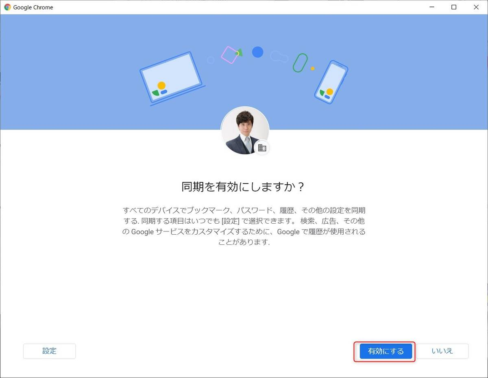

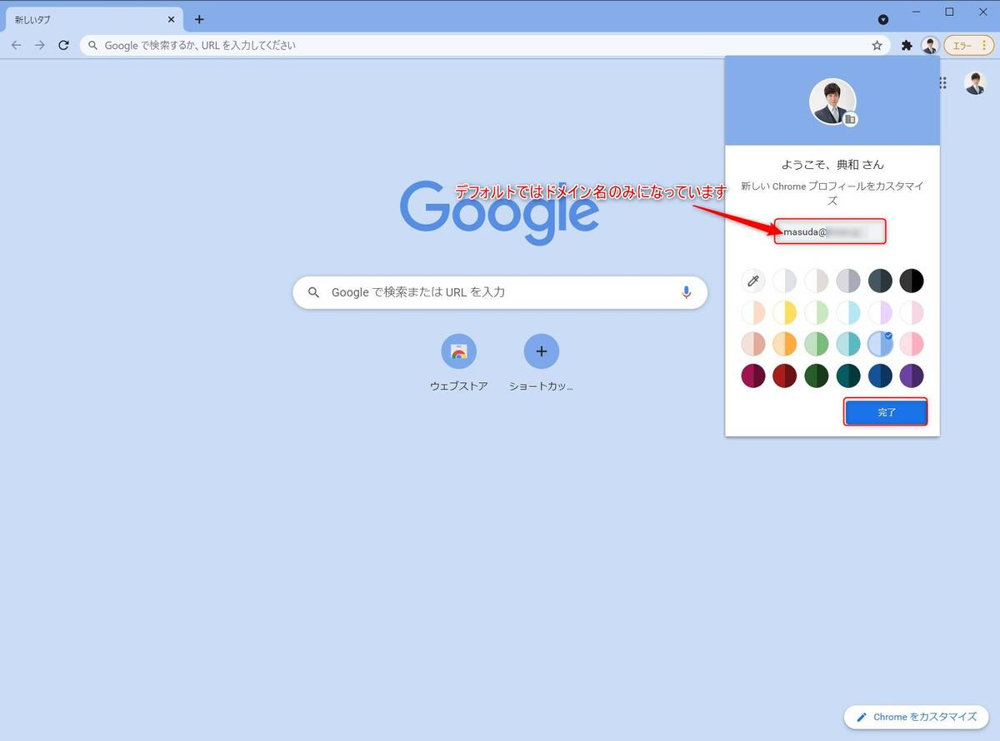

追加されました
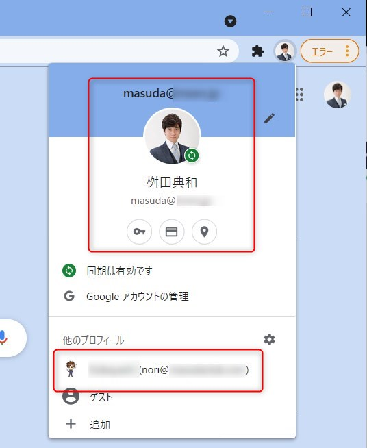

ショートカットも通常のChromeとは別にできます。
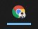

Gmailのログインは再度必要です。
作成したアカウント選択が一つになっている。
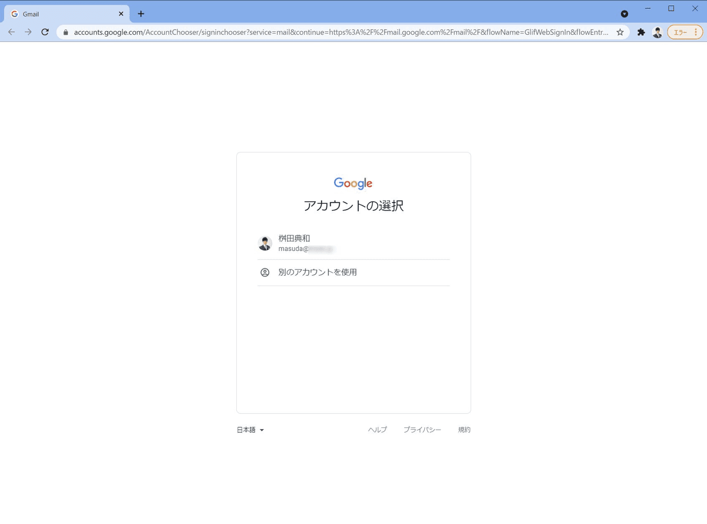

Gmailバッチリ
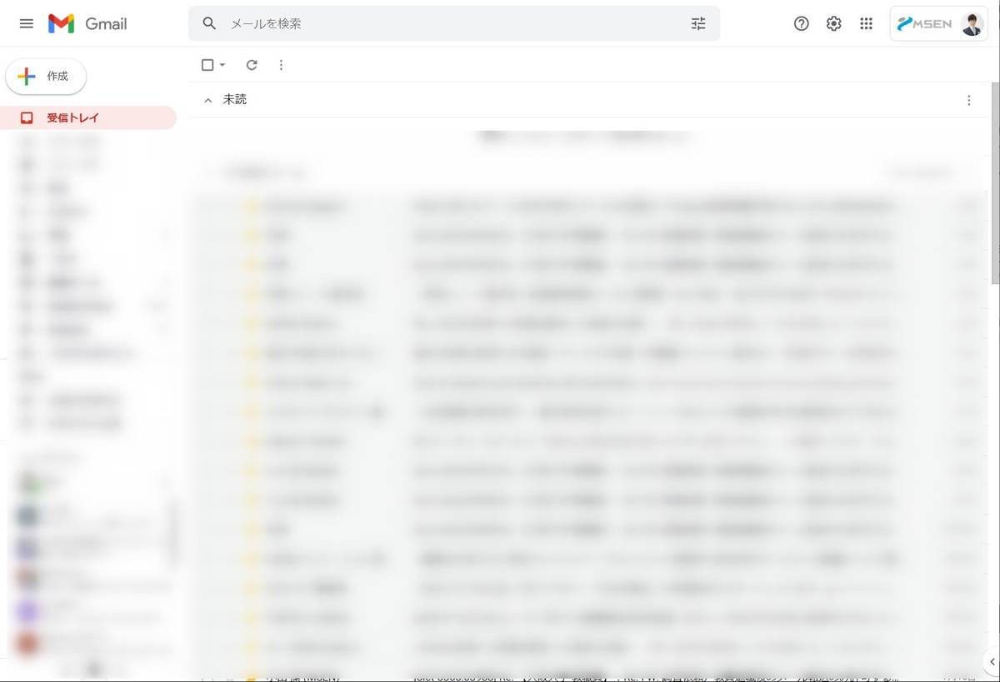

この設定をして、
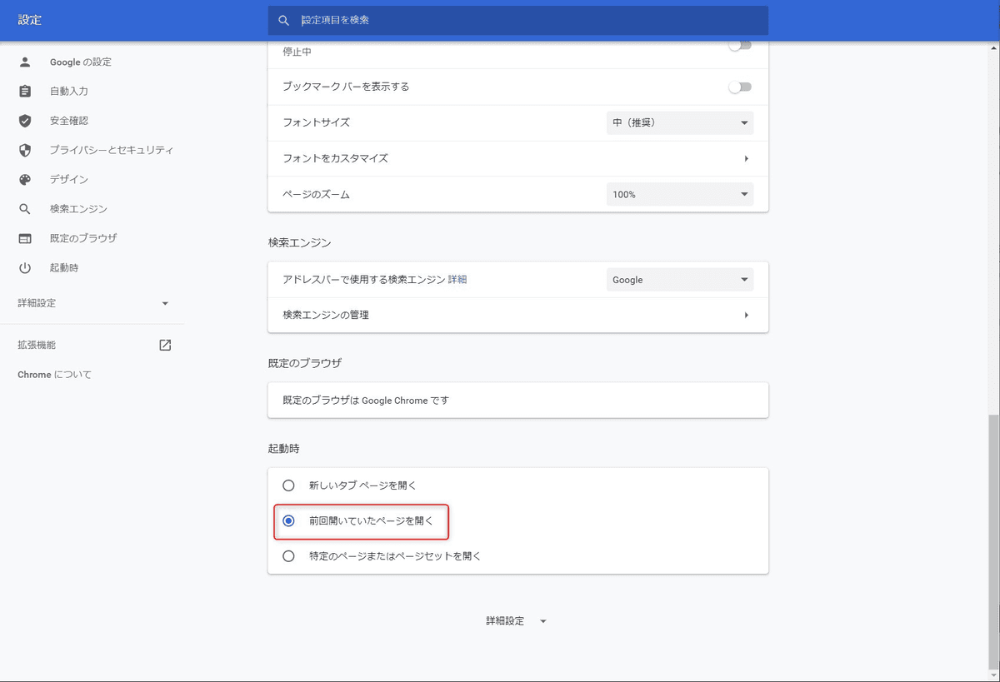

閉じて、開いて

バッチリ

nori@のショートカットも作る
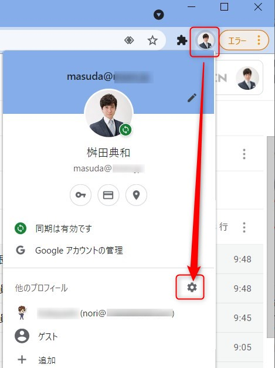

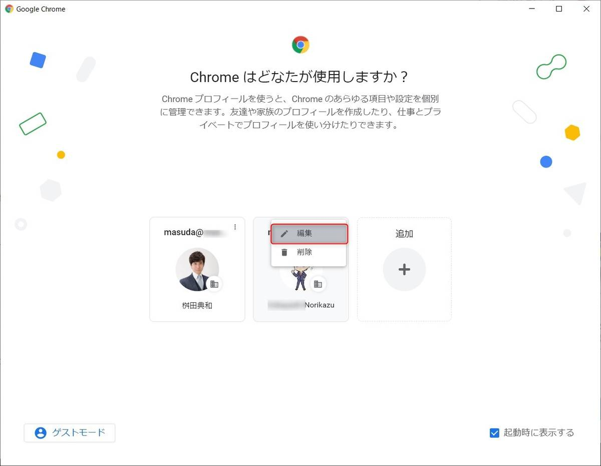

オンに

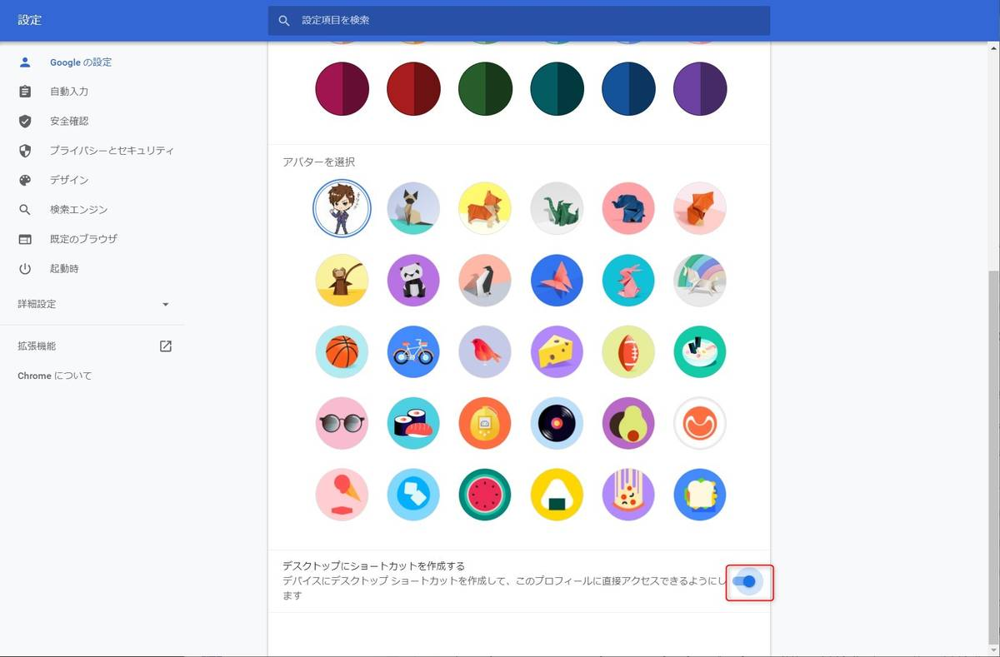

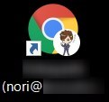

nori@ はデフォルト設定となっているので、開いても通常のChromeと同じになる
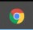

もうひとつ追加

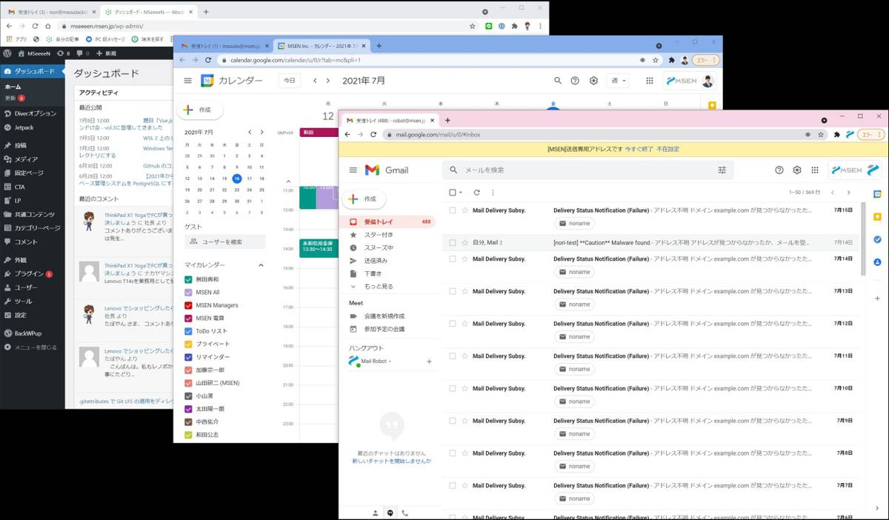

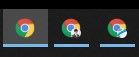

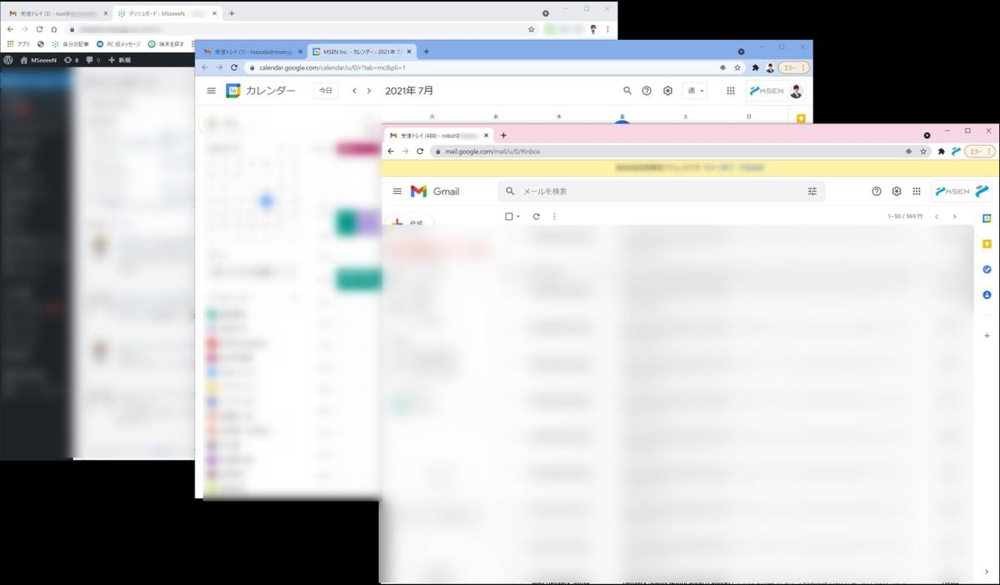

## 注意点
インストールの方法によって拡張機能がそれぞれのプロファイルで再インストールする必要がある。
タブ地獄から救われる（はず）
別物のChromeになるのでタブの結合はできない
キャッシュがカオスにならない

- アップデートはプロファイルごとではなく全て一緒に行われる（1回でいい）

- Google Drive上のファイルを開くと対象のプロファイルがあるChromeで開かれる。但し、複数のユーザーでログインしている場合はことなるプロファイルで開かれることがある。
