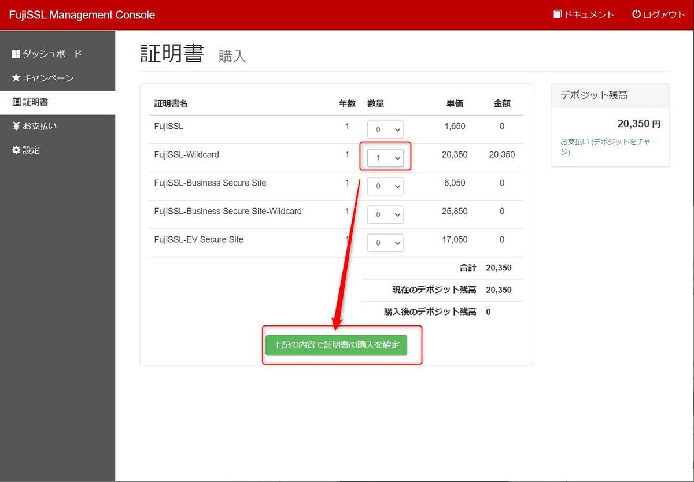

こんにちは。

今回は、Fujissl の[SSLサーバ証明書自動更新システムFujiSSL GO ](https://www.fujissl.jp/fujissl-go/) を使ってみた記事です。

2020年9月からSSL証明書の有効期間は最大1年となりましたが、まだ短縮するような議論もされているようです。
[何度も短縮し過ぎ？！SSL証明書の有効期間がどんどん短くなる理由とは？ | さくらのSSL](https://ssl.sakura.ad.jp/column/shortened-ssl/)

証明書の更新は継続して運用するにはとても面倒なもので、秘密鍵作成→CSR発行→承認依頼→インストール と同じような作業を証明書の枚数分実施する必要があります。

まさに、Fujisslのページに記載されているこれです。


また、期限がありますので更新を忘れてしまっては大変なことです。

弊社も複数枚の証明書管理をしておりますが、自社のドメインを更新しようと思っていたところ、このようなシステムがあることを知り、やってみました。

## ポイント
ポイントは以下のとおりです。
* 手動更新で購入するよりちょっと高い
* FujiSSL で作成した証明書であっても手持ちの証明書をそのまま Fujissl go に移行することはできない
* 証明書をインストールしているサーバーに Fujissl go を稼働させてcronで定期的に更新するイメージ
 
## 

OpenSSL、CurlとPHP5.2以降のバージョンが必要

## 手順
1. FujiSSL Management Console のアカウントを作成する
[Management Console | FujiSSL](https://console.fujissl.jp/)

1. 作成されたアカウントでログインする


1. 証明書を購入する
    1. 購入する証明書の金額を確認

    ↓

    1. デポジットをチャージする( 即反映される )

    ↓

    1. 証明書を購入する ( この時点では有効期間は始まりません )

    ↓


1. コモンネームを設定する
設定から コモンネームを設定します。このとき契約コードと注文コードを控えておきます


1. [利用ガイド](https://console.fujissl.jp/index.php/docs/002) を参考に FujiSSL自動更新クライアントのインストール をインストールします。 /root にインストールします
```
wget http://console.fujissl.jp/files/fujissl-go-0.0.2.zip
unzip fujissl-go-0.0.2.zip 
mv fujissl-go-0.0.2 fujissl-go
cd fujissl-go
php ./bin/fujissl-go create fujissl-go
Created the /root/fujissl-go/.lock directory.
Created the /root/fujissl-go/.logs directory.
設定ファイルを作成しました。(/root/fujissl-go/conf/fujissl-go.conf)

```

config:
  appid: APP-55UBvvHYvAUacyCjAZ6cZSntIQ180
  ordid: ORD-o8A4oMOrJMayS256pDMsy1nSAZ1N0
  fqdn: *.msen.jp
  document_root: /var/lib/redmine/public
  backup_dir: /etc/pki/tls/certs-backup
  private_key: /etc/pki/tls/private/msenjp.key
  certificate: /etc/pki/tls/certs/msenjp.crt
  ca_bundle: /etc/pki/tls/certs/server-chain.crt

実行
php ./bin/fujissl-go regist -c support.msen.jp -f conf/fujissl-go.conf

## 問合せ
1．現在手持ちの証明書を更新することはできないという認識で良いでしょうか？更新の場合、出来るだけ期限間近に購入うするという方法がベターでしょうか？
→上記ご説明の通りでございます。

2．Management Consolから証明書を購入するとその時点で有効期間開始でしょうか？
→FujiSSL-GOのクライアントツールにて証明書発行確認及び証明書の設置完了からっ有効期間開始となります。

3．自動更新とありますが、そのタイミングでデポジットがなければ更新失敗となり、失効するでしょうか？（Management Consoleのデポジットに注意しないといけないのかどうかの確認）
→上記ご説明の通りでございます。
　尚、デポジット不足の場合はその旨、アカウントメールアドレス宛てへ通知されますので併せてご連絡致します。


