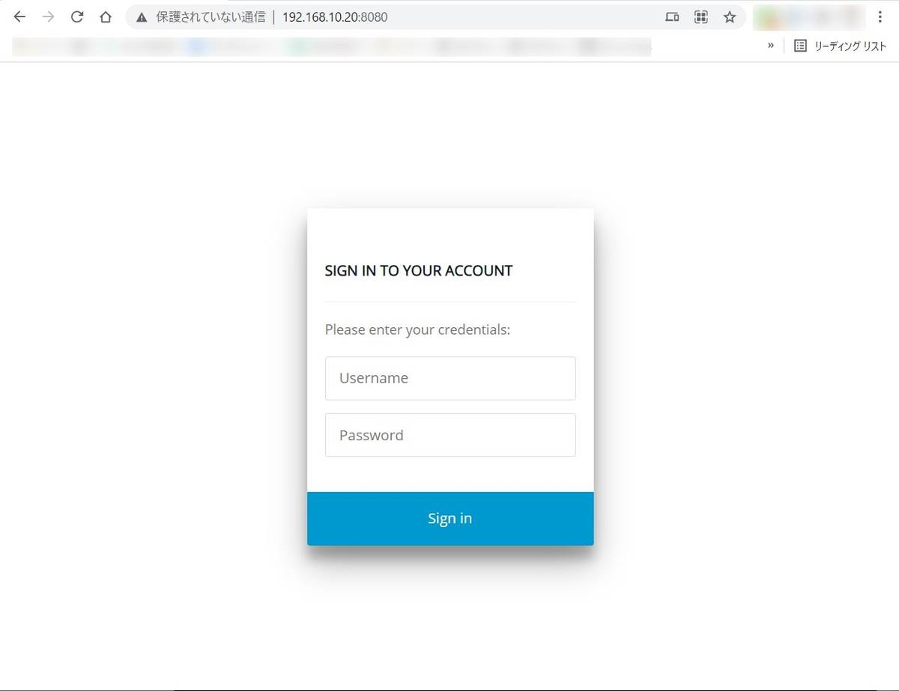
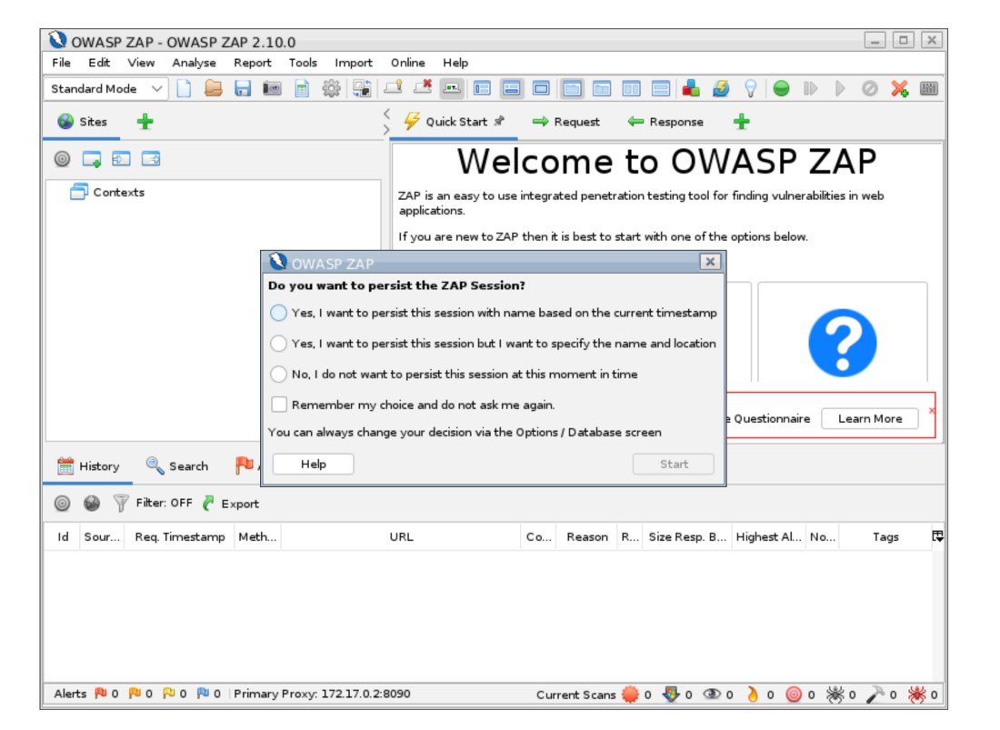
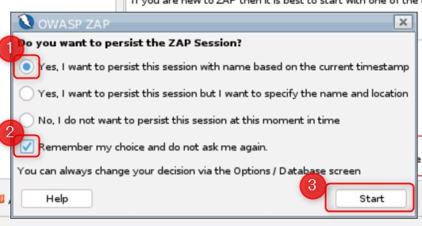
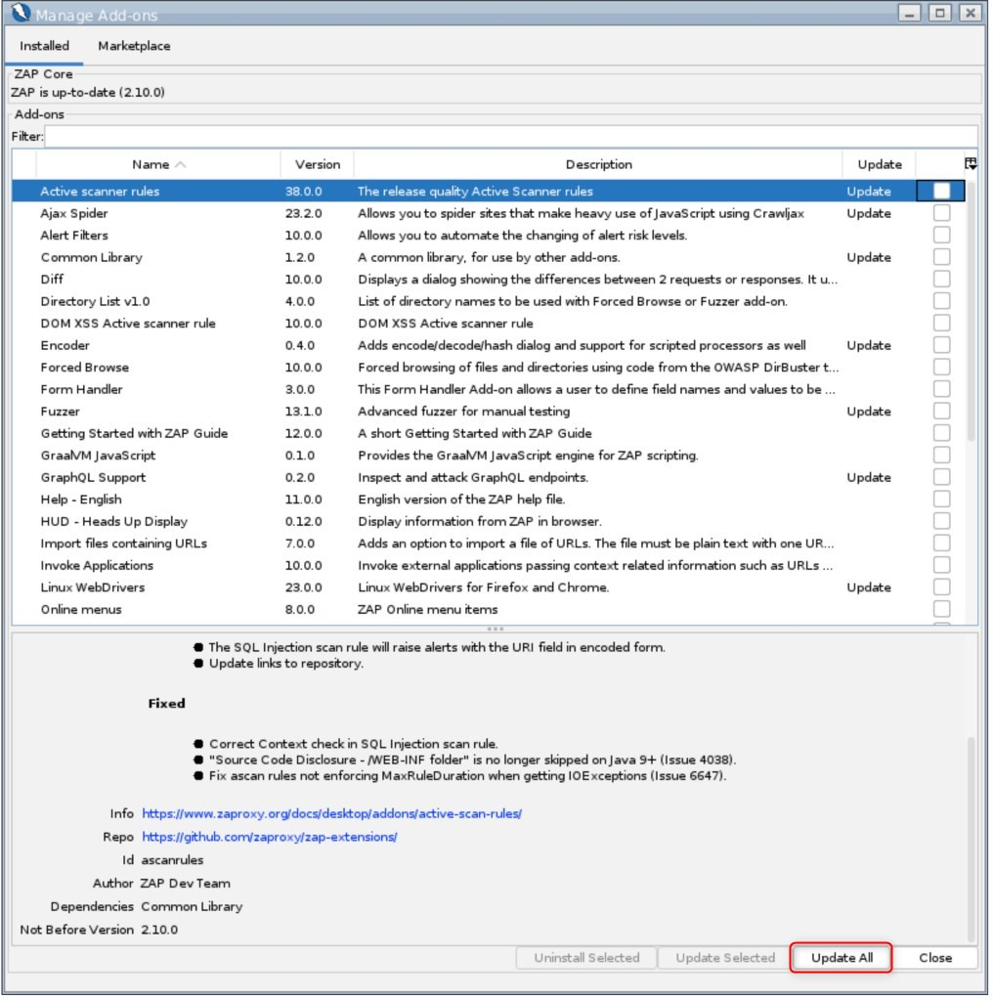
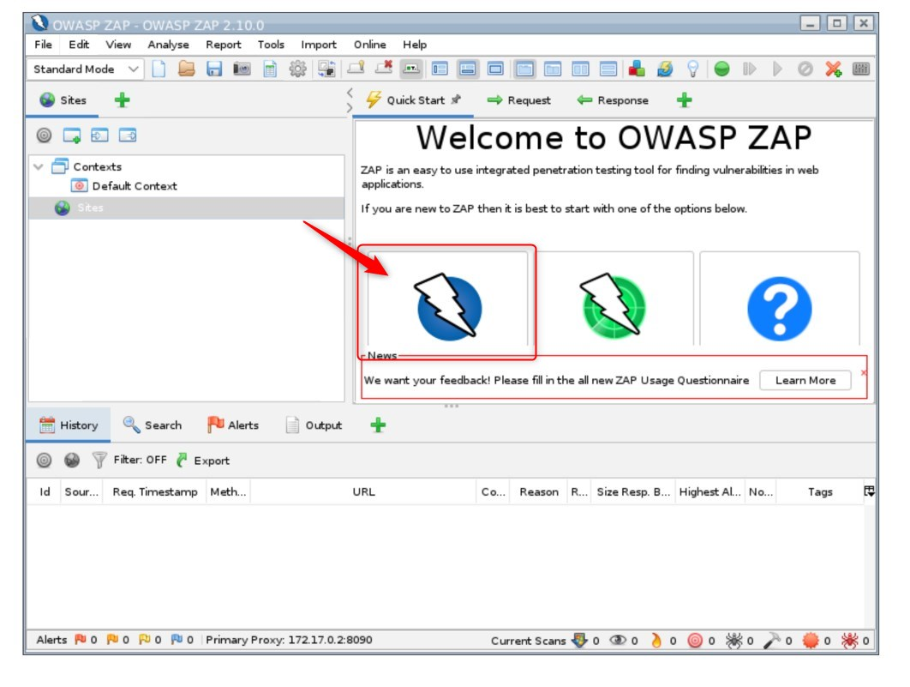

こんにちは。

今回は、Web脆弱性診断ツールの OWASP ZAP の環境を構築し、自社で開発したWebアプリケーションの脆弱性診断を実施してみようと思います。

>OWASP ZAP（**Z** ed **A** ttack **P** roxyの略）は、オープンソースの Webアプリケーションセキュリティスキャナーです。これは、アプリケーションセキュリティに不慣れな人とプロの侵入テスターの両方が使用することを目的としています。
これは、最もアクティブなOpen Web Application Security Project（OWASP）プロジェクトの1つであり、フラッグシップステータスが与えられています。
[ウィキペディア抜粋](https://en.wikipedia.org/wiki/OWASP_ZAP)

## 環境
- ZAPサーバー: CentOS 7 (3.10.0-1160.36.2.el7.x86_64)
    - IPアドレスは `192.168.10.20` とする
- 

## 構築手順
### Docker のインストールと起動
```sh
yum -y install docker
systemctl start docker
systemctl enable docker
```

### Dockerイメージの取得
`docker pull owasp/zap2docker-stable`

出力結果は以下のとおり。
```sh
[root@zap ~]# docker pull owasp/zap2docker-stable
Using default tag: latest
Trying to pull repository docker.io/owasp/zap2docker-stable ...
latest: Pulling from docker.io/owasp/zap2docker-stable
83ee3a23efb7: Pull complete
db98fc6f11f0: Pull complete
f611acd52c6c: Pull complete
a7816ec7dead: Pull complete
6849a0ff6cfd: Pull complete
b731cf37e4b1: Pull complete
5f5c44ad7fb2: Pull complete
2269c44cee9d: Pull complete
4f4fb700ef54: Pull complete
05fd5692a7af: Pull complete
2a5226d95ad1: Pull complete
f5df6eacfab3: Pull complete
ec4ef5688884: Pull complete
7871547a626f: Pull complete
70b55631a0ac: Pull complete
3a7d99b3953f: Pull complete
ee1cc0874c1f: Pull complete
da0fbc89d155: Pull complete
dc3017659a84: Pull complete
Digest: sha256:fa9c69ef7b4b5c6395df2fa50b40146651b87b6a0b019f97d930532bb4e79214
Status: Downloaded newer image for docker.io/owasp/zap2docker-stable:latest
```

- イメージの確認
```sh
[root@zap ~]# docker images
REPOSITORY                          TAG                 IMAGE ID            CREATED             SIZE
docker.io/owasp/zap2docker-stable   latest              7b07a02e2403        5 months ago        1.64 GB
```

### コンテナの起動

以下を参考に起動します。
[OWASP ZAP](https://www.zaproxy.org/docs/docker/webswing/)

```sh
docker run -u zap -p 8080:8080 -p 8090:8090 -i owasp/zap2docker-stable zap-webswing.sh`
```

`http://192.168.10.20:8080/` でログイン画面がでました。


`http://192.168.10.20:8080/zap/` にアクセスするとブラウザの中にJavaっぽいUIが表示されます。



セッションについて聞かれますので一番上の選択肢を選び、**Remember my choice and do not ask me again.** にチェックを入れて再度聞かれないようにします。


インストールされているアドオンをアップデートします。その後、closeボタンをクリックします。


Aitomated scan


