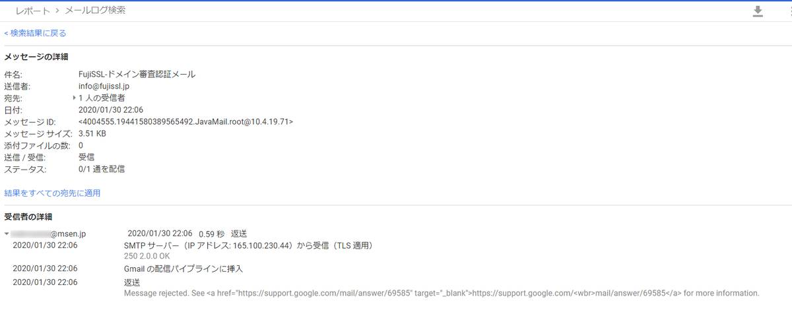

返送されてしまう



[メールが返送または拒否される事象を解決する - Gmail ヘルプ](https://support.google.com/mail/answer/6596?visit_id=637159874051117416-2478479844&rd=1)

Message rejected　となっているので、

これが理由の模様
```
メールが返送された理由
メールの本文やリンクが不審であると判断された。
[Cc] や [Bcc] に多数の宛先が指定されている。
対応策
個人情報の入力が必要なウェブサイトへのリンクを削除します。
多数の宛先にメールを送る必要がある場合は、Google グループを使ってグループを作成し、そのグループ宛てにメールを送信します。
詳しくは、グループの作成方法についての記事をご覧ください。
```

```
λ nslookup -type=mx fujissl.jp
サーバー:  msdc1.wind.msen.jp
Address:  192.168.10.12

権限のない回答:
fujissl.jp      MX preference = 10, mail exchanger = mail.fujissl.jp
```

```
λ nslookup mail.fujissl.jp
サーバー:  msdc1.wind.msen.jp
Address:  192.168.10.12

権限のない回答:
名前:    mail.fujissl.jp
Address:  45.76.244.87
```


