こんにちは。

今回はある案件で、500GB程度のHyper-Vの仮想マシン(VHD)をエクスポートして、ディスク容量を増加させ、その後再度インポートするという内容のものがありましたので、その際に評価した結果を記事にしました。

簡単な図ですが、以下の **①の時間** と **②の時間** を計測します。
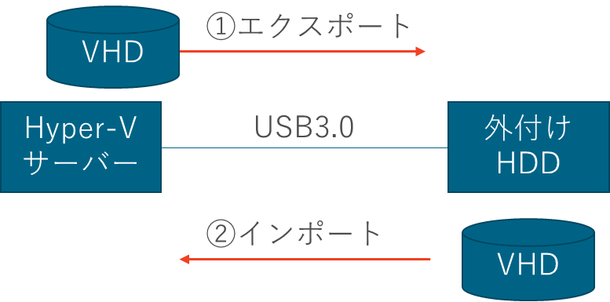

## 評価環境
ホストOS　Windows Server 2016 Standard
仮想OS　Windows Server 2012 R2
仮想OSのCドライブ　500GB
インストール直後のCドライブの空き容量　489GB
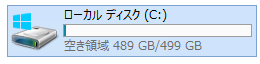

Dドライブ　USB3.0外付けハードディスク

## 固定長で仮想マシンを作成する

先にVHD
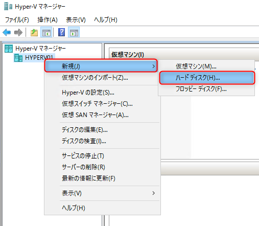

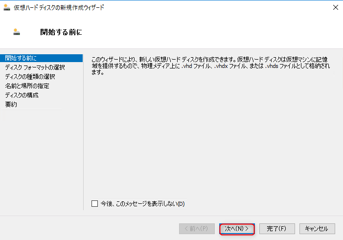

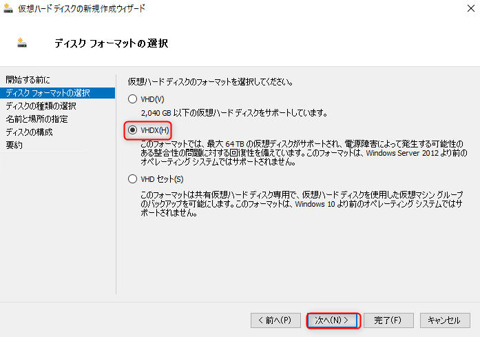

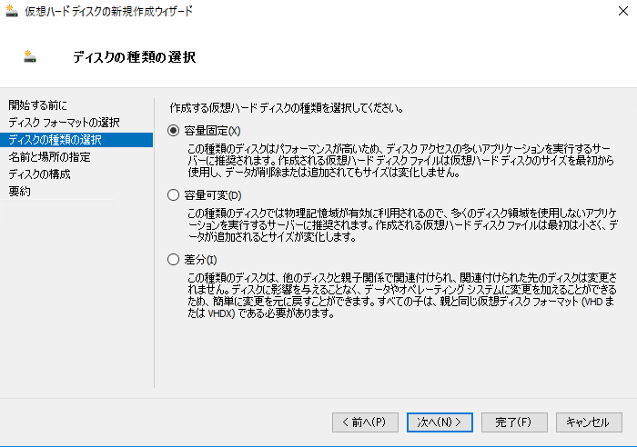

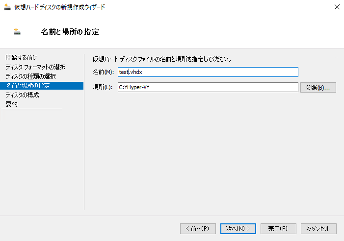

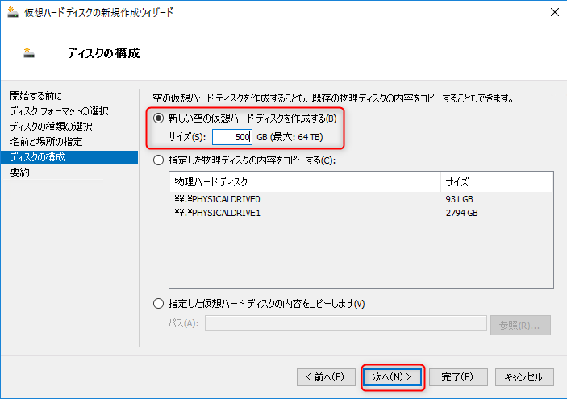

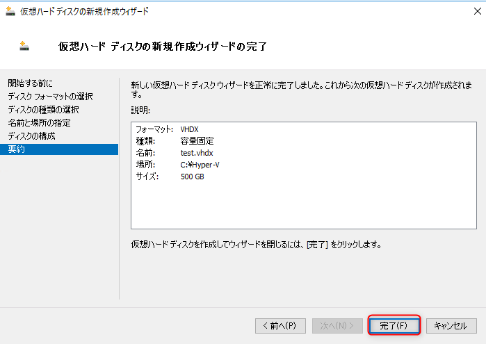

これを指定して仮想マシンを作成する。

## 
VHD=500GB
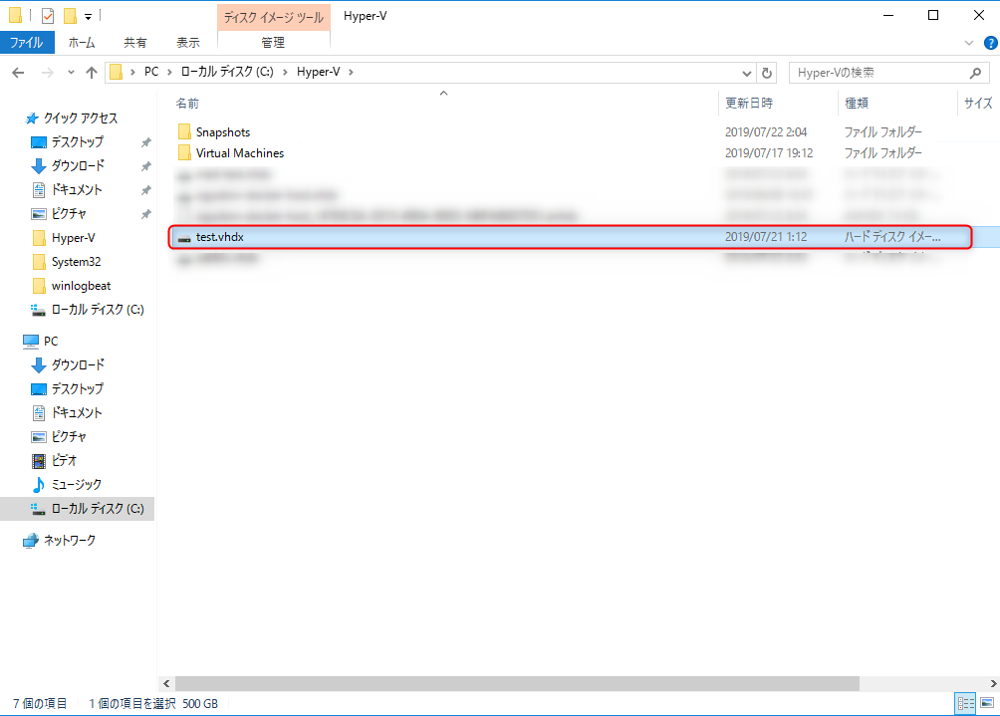

エクスポート(動いたまま)
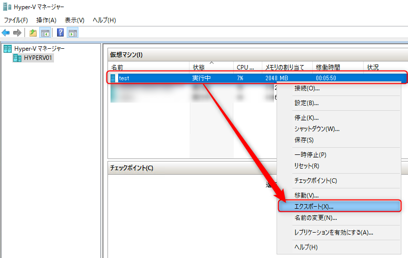

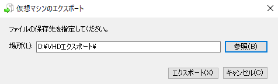

10:11～16:57　
約　6:46で完了

オンラインでも可能だが、エクスポート中は、動作が重くなる。

シャットダウンして、元のディスクを削除。（RAID再構築で消える前提）
Hyper-Vマネージャーから一覧も削除

仮想マシンのインポート
↓
フォルダ指定
↓
復元する（真ん中）を選択※一覧に残ってたらエラーになる
↓
元と同じ場所を指定する

17:19～19:37
約　2:18　

## VHDの容量を増やす

仮想OS上に大きなファイルを作成して、Cドライブを枯渇寸前にします。

以下の記事を参考に大容量のファイルを作成します。
[ダミーファイル作成ソフト – GFileCreator | ぽーたぶるっ！](https://triton.casey.jp/portable/gfilecreator/)

仮想OSを停止します。
Hyper-Vマネージャーから対象の仮想OSの設定を開き、ハードドライブを選択し編集を開きます。
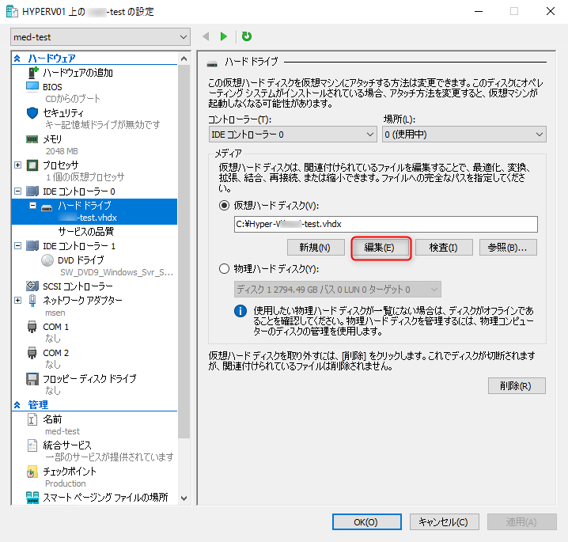

## 可変長から固定長に変更する
ウィザード

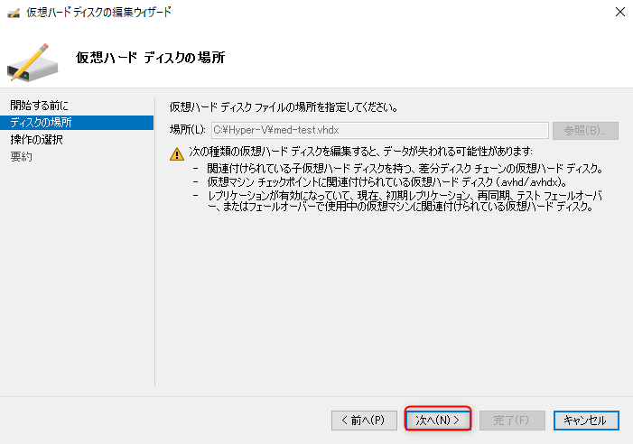

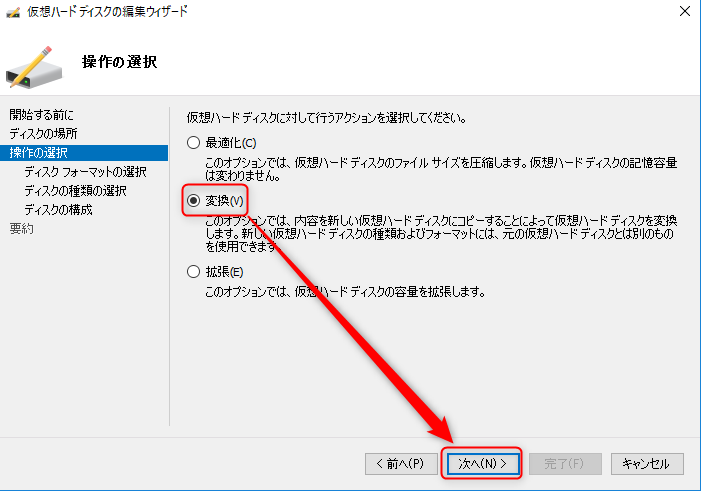

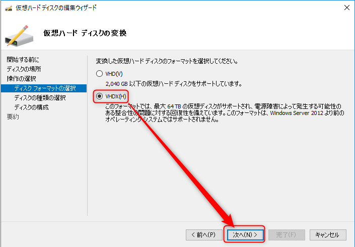

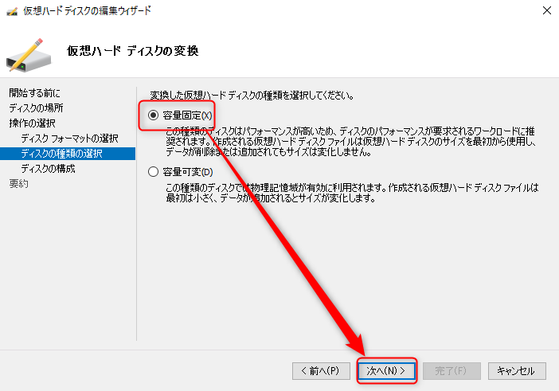

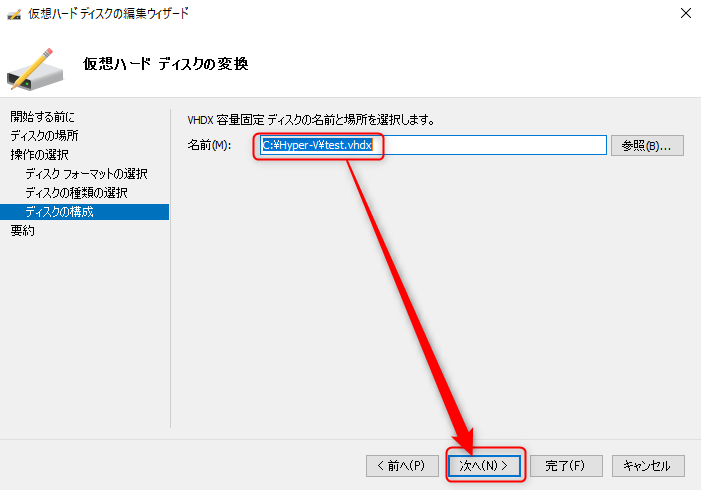

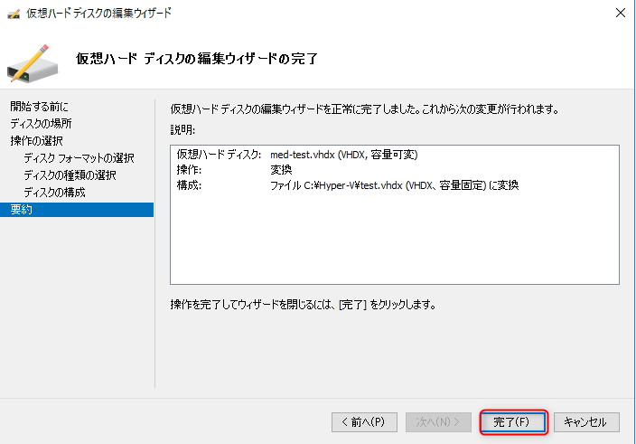

## あとがき
fsutil を利用して、Windows上で大容量のファイルを作成することは出来るのですが、ゼロデータのみで作成されるためVHDの容量が大きくなりません。
[Windows 10対応：巨大サイズのファイルを簡単に作る（fsutilコマンド編）：Tech TIPS - ＠IT](https://www.atmarkit.co.jp/ait/articles/0209/28/news002.html)

100GBのファイルを作成しても、
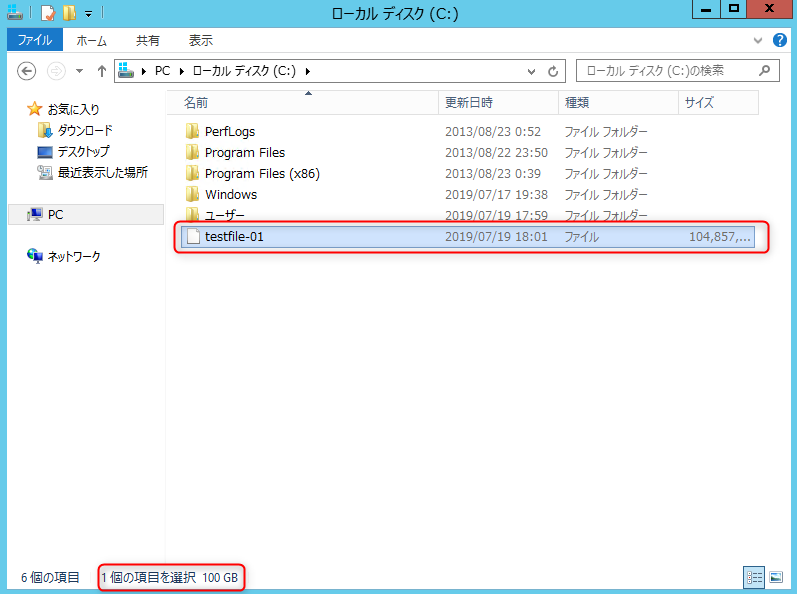

VHDファイルの容量は変わらない。
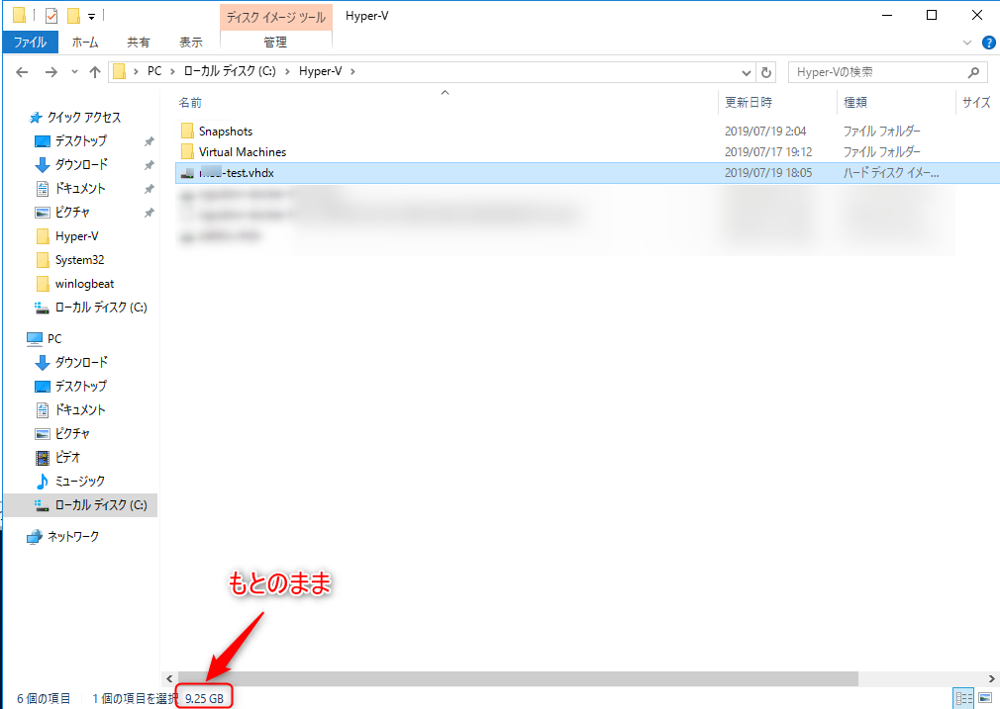