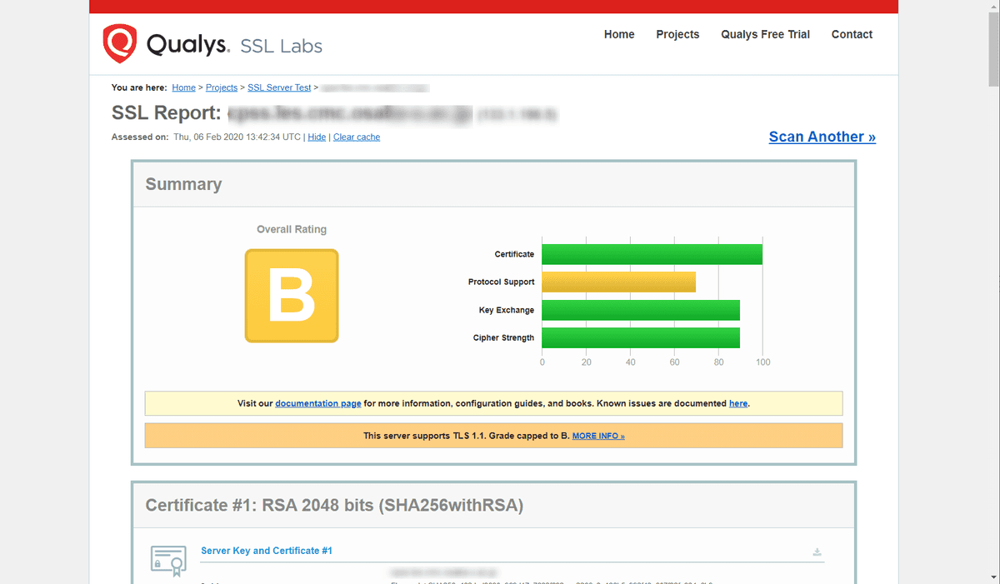
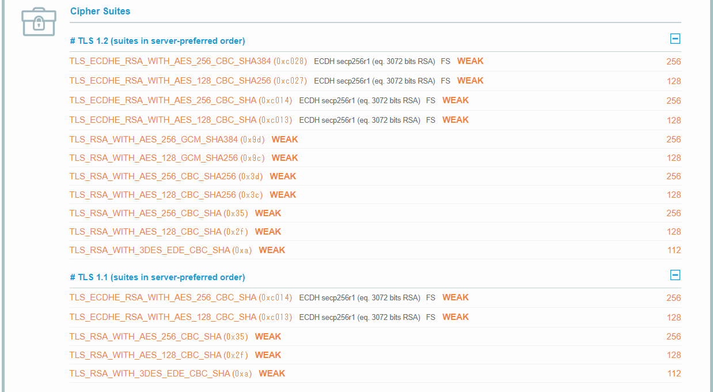

脆弱性を指摘

64ビットブロック暗号であるDESもしくは3DESの暗号が有効でした。CBCモードにおいてDESもしくは3DESの暗号を使用し、大量の通信を取得された場合、誕生日攻撃によってcookie情報などの通信内容を解読されてしまう可能性があります。なお、IDEAの暗号も同様の問題がある可能性があります。

サイトを確認

reg add "HKEY_LOCAL_MACHINE\SYSTEM\CurrentControlSet\Control\SecurityProviders\SCHANNEL\Ciphers\DES 56" /f
reg add "HKEY_LOCAL_MACHINE\SYSTEM\CurrentControlSet\Control\SecurityProviders\SCHANNEL\Ciphers\DES 56" /v Enabled /d 0 /t REG_DWORD /f

reg add "HKEY_LOCAL_MACHINE\SYSTEM\CurrentControlSet\Control\SecurityProviders\SCHANNEL\Ciphers\Triple DES 168" /f
reg add "HKEY_LOCAL_MACHINE\SYSTEM\CurrentControlSet\Control\SecurityProviders\SCHANNEL\Ciphers\Triple DES 168" /v Enabled /d 0 /t REG_DWORD /f

reg add "HKEY_LOCAL_MACHINE\SYSTEM\CurrentControlSet\Control\SecurityProviders\SCHANNEL\Protocols\TLS 1.1\Server" /f
reg add "HKEY_LOCAL_MACHINE\SYSTEM\CurrentControlSet\Control\SecurityProviders\SCHANNEL\Protocols\TLS 1.1\Server" /v Enabled /d 0 /t REG_DWORD /f
reg add "HKEY_LOCAL_MACHINE\SYSTEM\CurrentControlSet\Control\SecurityProviders\SCHANNEL\Protocols\TLS 1.1\Server" /v DisabledByDefault /d 0 /t REG_DWORD /f

