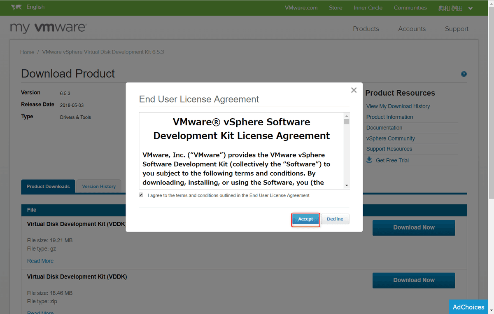

こんにちは。

先日、VMWare ESXi で稼働していた仮想マシンが障害に陥り起動しなくなりました。

そのVMで動作していた、ファイルを救済していと思い、方法をまとめました。

仮想マシン(VMDKファイル)はNFSサーバー上に存在していました。

## 準備
マウント用のLinuxサーバー(CentOS7)を準備します。

先にマウントポイントを作成します。

mkdir /mnt/vm→NFSサーバーをマウント
mkdir /mnt/vm-mount→VMDKをマウント

まず、NFSサーバーをマウントしましょう。

yum -y install nfs-utils
mount 192.168.10.34:/export/vm /mnt/vm/

ターゲットとなる、VMDKファイルを確認します。
実行には、yum -y install openssl　が必要です。

# cd /mnt/vm/login/
[root@ownCloud10-docker login]# ls
global-gw.nvram          login.vmsd     vmmcores-7.gz  vmware-7.log
login-000001-ctk.vmdk    login.vmx      vmmcores-8.gz  vmware-8.log
login-000001-delta.vmdk  login.vmx.lck  vmmcores-9.gz  vmware-9.log
login-000001.vmdk        login.vmxf     vmmcores.gz    vmware.log
login-ctk.vmdk           vmmcores-4.gz  vmware-10.log  vmx-zdump.000
login-flat.vmdk          vmmcores-5.gz  vmware-5.log   vmx-zdump.001
login.vmdk               vmmcores-6.gz  vmware-6.log   vmx-zdump.003

vmdk-mountコマンドを使えるようにインストールします
https://code.vmware.com/ja/web/sdk/65/vddk
※VMWareアカウントが必要になります。

執筆時点で以下のバージョンが最新でした。
https://my.vmware.com/group/vmware/details?downloadGroup=VDDK653&productId=614

上記から、tar.gz 版をダウンロードします。

この際、VMWareアカウントが必要となりますので準備ください。

`VMware-vix-disklib-6.5.3-8315684.x86_64.tar.gz` がダウンロードできました。

準備した、Linuxサーバーにファイルを転送します。

インストールしましょう。

# tar xvfz VMware-vix-disklib-6.5.3-8315684.x86_64.tar.gz
# cd vmware-vix-disklib-distrib/bin64/
# 

