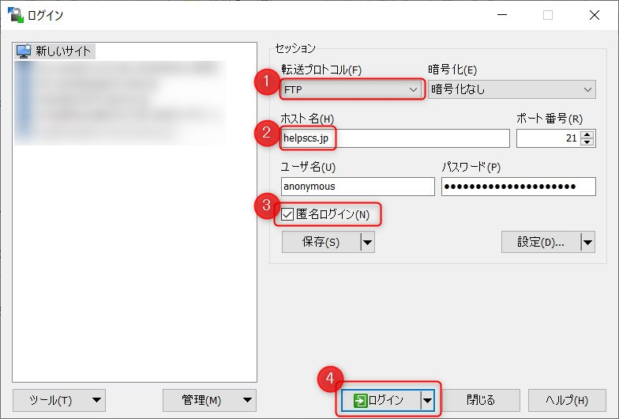
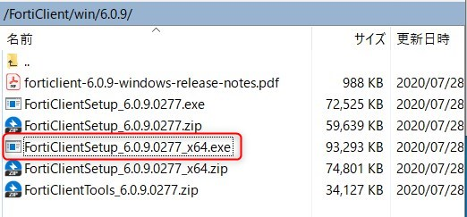
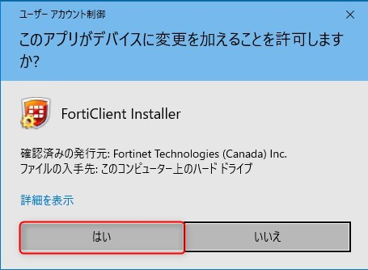
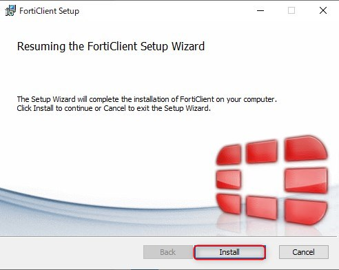
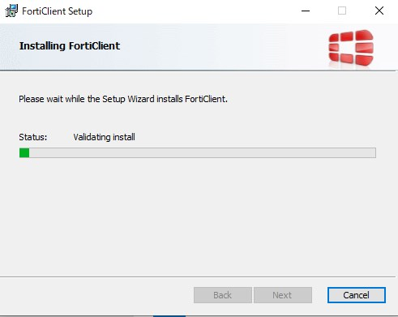
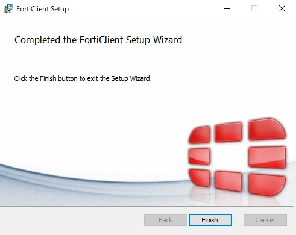
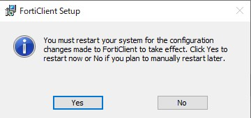
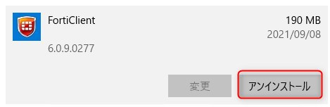
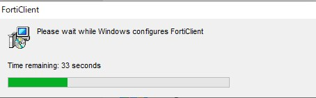
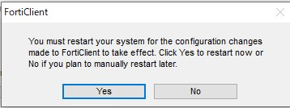

こんにちは。

評価で利用していた **FortiClientを削除しよう** と思ったところ、以下のように **アンインストールボタンがグレーアウトしてアンインストールができません** でした。


結論ですが、 **再度FortiClientをインストールすることでアンインストールできました** 。
インストールが正常に完了していなかった可能性もありますが、**2台で同現象を確認** しました。

## Networld が公開している情報では無理だった
Networld が公開している、以下の情報とおりに実施してもグレーアウトは解消せずアンインストールできませんでした。

[10266 FortiClientのアンインストールができない](https://tec-world.networld.co.jp/faq/show/10266)

## 再度インストールするとアンインストールできた
SCSK社のお力をお借りし、以下からインストーラーをダウンロードします。

[FortiGate： FortiClientソフトウェア ダウンロード ｜ SCSK株式会社](https://www.scsk.jp/product/common/fortinet/download_forticlient.html)

インストールしたバージョンが `6.0.9` なので `ftp://helpscs.jp/FortiClient/win/6.0.9/FortiClientSetup_6.0.9.0277_x64.exe` となりますが、ChromeからFTPがダウンロードできなかったので、WinSCPでダウンロードしました。

WinSCPの設定は以下を参考にしてください。

```
転送プロトコル: FTP
ホスト名: helpscs.jp
匿名ログイン: チェック
```



これで接続が出来るので、`FortiClient→win→6.0.9` と移動し、 `FortiClientSetup_6.0.9.0277_x64.exe` をダウンロードします。



ダブルクリックで実行し、以下のように進みます。（再起動が発生します）











再起動明けで再度確認すると **アンインストールボタンが押せる** ようになっています。



無事、アンインストールができました。



**再起動が必要** でした。


