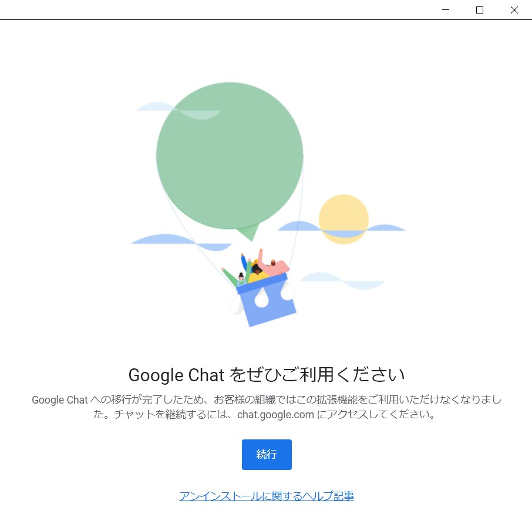
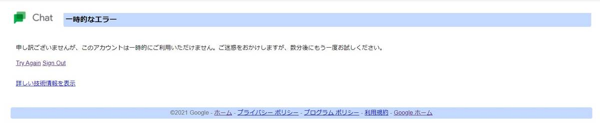
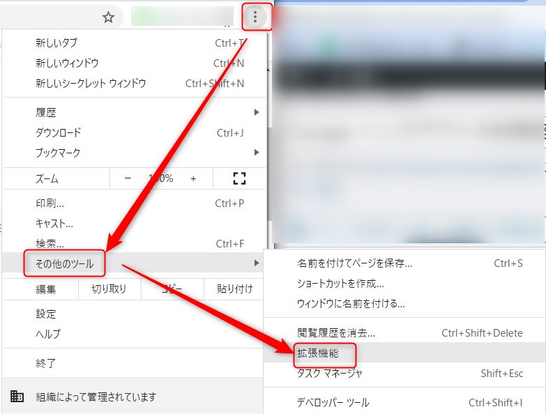
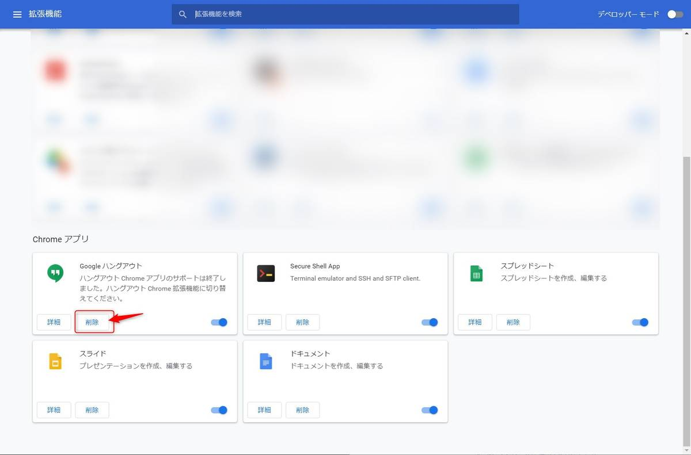

こんにちは。

今回は短い記事です。

Google ハングアウトの終了に伴い、ログインすると以下の案内が突然表示されるようになりました。

私と同じように突然この画面が表示された方はいませんか？

**続行ボタン** をクリックするとこのエラーになります。

私は、1ヶ月程前からでしょうか。

放置していたのですが、PC起動時になどで勝手に表示されて嫌になってきたので解消させた記録です。

ヘルプ記事でも十分でしたが、聞いてみたかったのでGoogleサポートに確認したところ、

> ハングアウトのアプリ利用が終了したため、この画面が表示されるようになりました

と、教えてもらいました。

また、原因としては以下のどちらかとのことでした。

1. Google Chrome の拡張機能として利用　→　拡張機能の削除が必要となります。
1. WindosやMacのスタンドアロンアプリとして利用　→　アプリの削除が必要となります。

私の場合は、拡張機能のほうでした。

早速削除しました。

↓

ユーザーを分けて複数のChromeを使いわけている方は全てのユーザーで拡張機能を削除してください。

サポートから最後に、

> 今後、ハングアウトを利用する場合は、ブラウザアクセスを推奨しております。
[Google ハングアウト](https://hangouts.google.com/)

と教えていただきました。

それでは次回の記事でお会いしましょう。