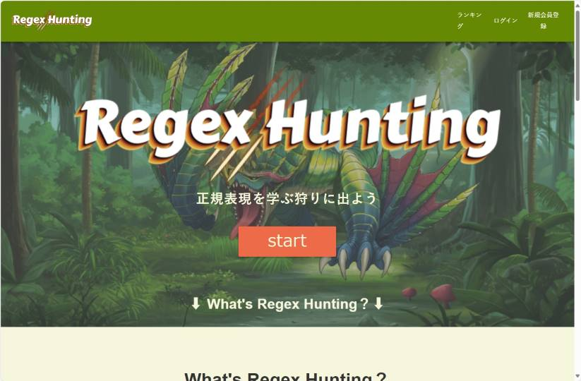
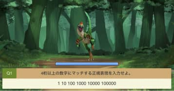
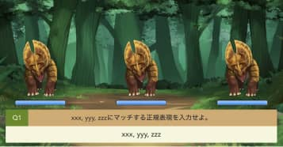
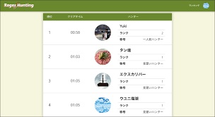

## はじめに
こんにちは。5月に入社させていただいたkoyaです。

初めてブログを書く今回は、正規表現を勉強する際に使用した*Regex Hunting*というゲームについて書こうと思います。

初心者の私でもゲームをしながら楽しく学ぶことができたので、是非読んでみていただけると幸いです!

## Regex Huntingとは

まず、Regex Huntingとは、出現する凶悪なモンスターを倒しながら、正規表現が学べる学習ゲームです。

個人開発者のハガユウキさんという方が開発し、現在も運用しているそうです。

レベルは*初級・中級・上級の3レベル*存在し、中級・上級へと上がるたびに、敵であるモンスターもどんどん手強くなっていきます。

ただ、ゲームオーバーになっても、間違った問題はすべて解説してくれるので安心ですね。

## いざ、初級に挑戦！

初級の内容は、文字クラスを中心とする問題がモンスターによって出題されました。

文字クラスを初心者の私なりに復習すると、  
[012][0-9][^0-9]など、[  ]の中のいずれかを選ぶ時に使う正規表現のことでした。
(¥dや¥Sなどの略記法で表すこともできました。)

最初は中々難しかったですが、ゲーム終了後の解説を使用して、再度復習をすることでクリアできました。

## 中級編

初級をクリアしたので、次は中級編に挑戦してみました。
中級編は最大量指定子、キャプチャグループを中心とする問題が出題されました。

こちらも難しかったですが、間違えた分野を復習することで、なんとかクリアできました。

## 上級編

最後は上級編です。
初心者の私にとって、上級編はぐっと難易度が上がりました。

モンスターも強くなっていて、中々HPが減らないのも手強かったです...!!  
しかしこちらも楽しみながらマッチする正規表現を考え、復習し、クリアできました。

ゲーム形式だと楽しみながらアウトプットすることができるのでいいですね。

## Regex Huntingをもっと楽しむために

ゲームをするだけでも楽しいですが、Regex Huntingではアカウントを作成することもできます。  
アカウントを作成すると、学習頻度や、最速タイムを確認、記録できるようになります。

更に、全世界のハンターの最速タイムもランキング形式で掲載されるので、
ほかのハンターと競いながら楽しく学習することもできます。

## 最後に

今回は正規表現が学べる学習ゲーム、Regex Huntingについて紹介させていただきました。  

どうしてもインプットだけになってしまいがちな正規表現の学習が、このゲームを通してアウトプットでき、実際に使うことで理解度もぐっと深まりました。  
また、受け身で勉強するのではなく、日々の学習したことを復習で自主的にアウトプットして、もっと楽しんで能動的に学習に取り組んでいくべきだと感じました。

今回のことをきっかけにして、成長できるよう更に勉強を重ねていきます。

最後まで読んでいただき、ありがとうございました。

[Regex Huntingスタートページ](https://www.regex-hunting.com/ "Regex Hunting")
