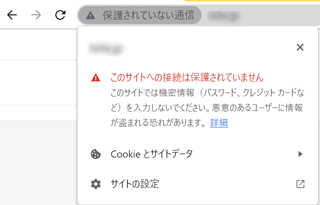
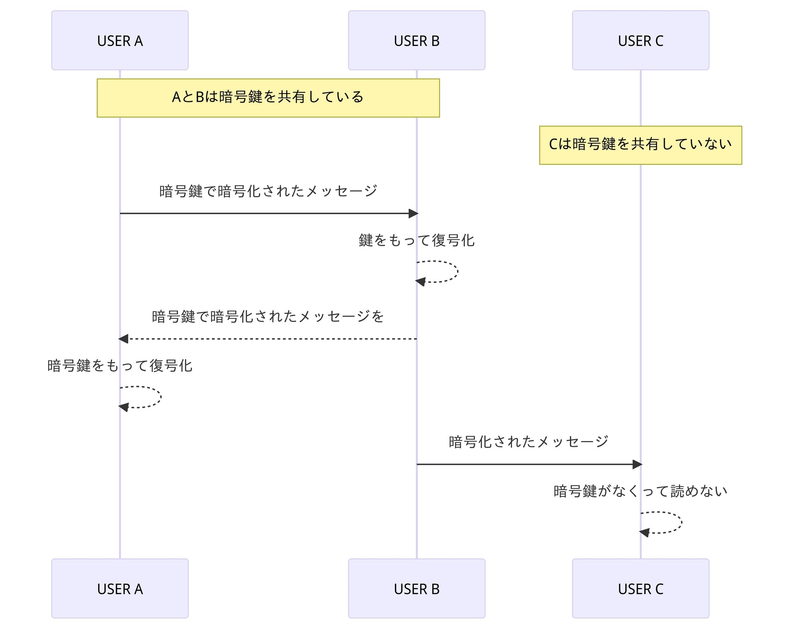
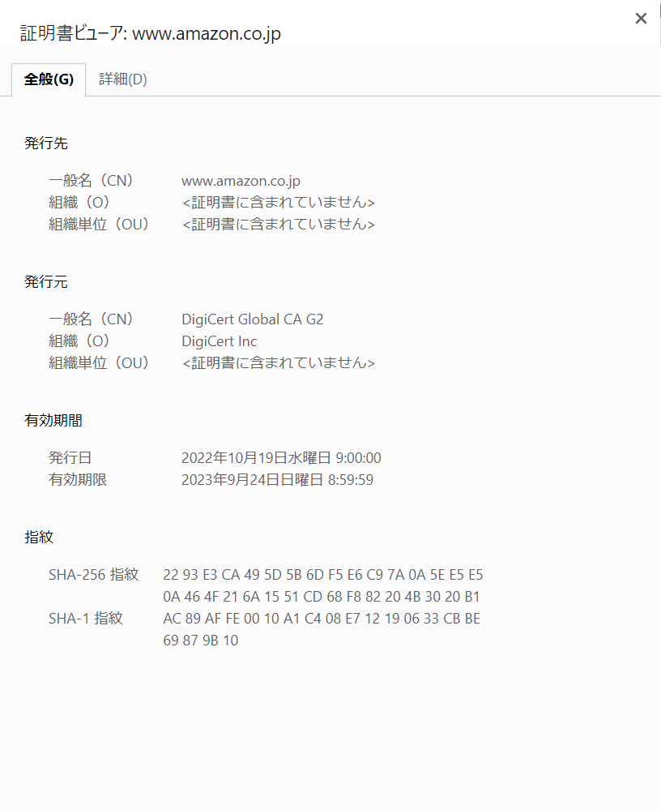
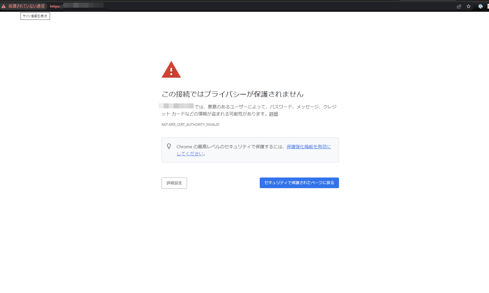
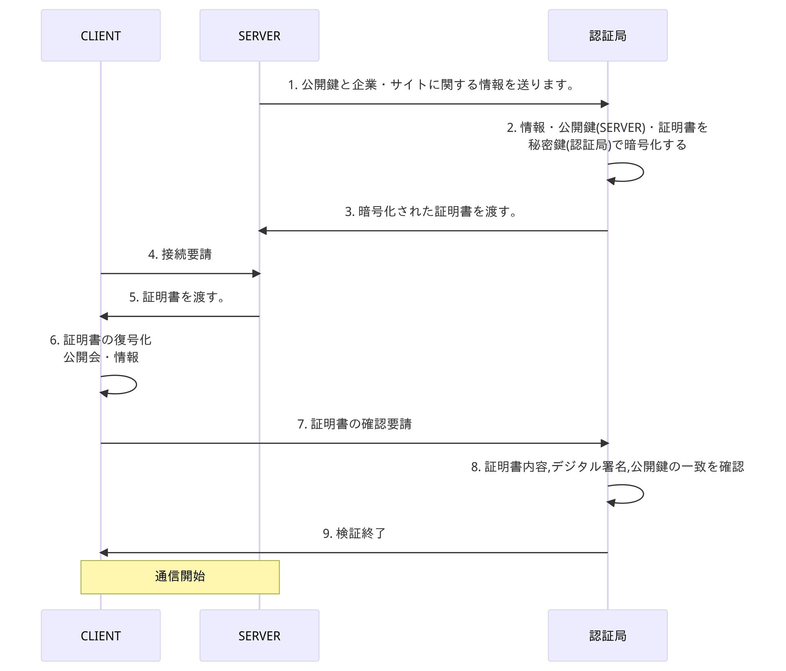
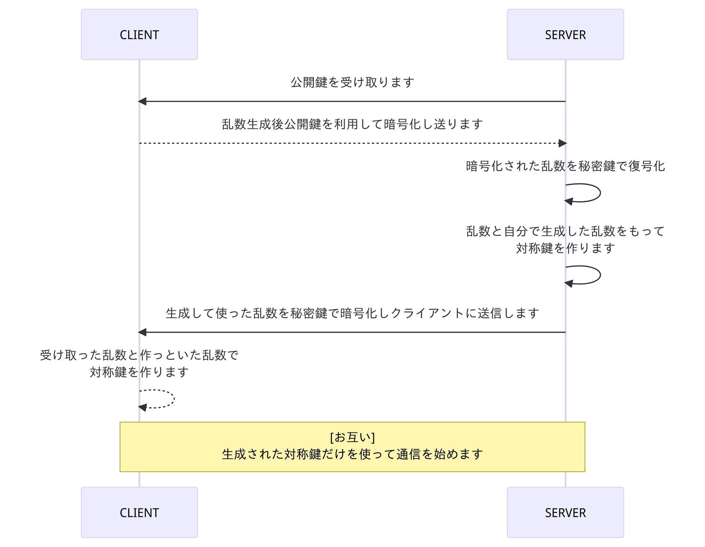
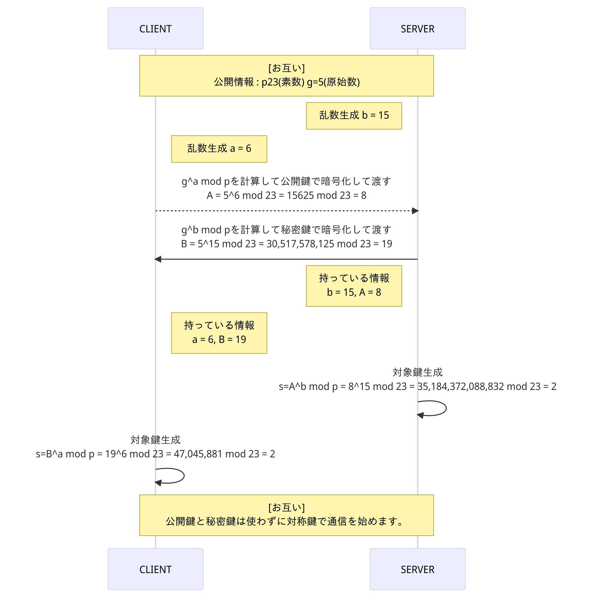
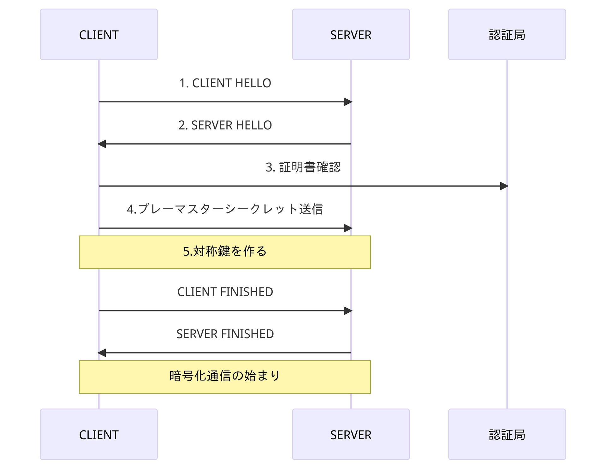

## 初めまして

初めまして。今年の４月 IT エンジニアになったリリです。

今回の記事を書くようになったのは韓国の友達が会社の先輩にされた質問からでした。

> HTTP と HTTPS の違いはなに？
>" HttpSecure 守られている Http... " 
> 住所に見える鍵の意味は？
> ...
だけ答えて怒られたという話を聞いた後に思いました。

私も聞かれたら上手に説明できそうにはないなと思いましたのでこの記事を書くことを決めました。

私もまだ新人エンジニアなので怒られないぐらい返事できたらいいなと思いながら頭の中の HTTPS の知識を語っていこうと思います。

## HTTP と HTTPS 何が違うの？

### HTTP とは？
HTTP？HTTPS？一応 HTTP からなんなの？と思うのが普通です。
> HTTP は " Web ページ間のデータ通信規約 "<br>分かりやすく言えば " WebPage の合言葉 "。

ログインする際のWebが何を送るのかを見て見ます。
```vbnet
POST /login HTTP/1.1
Host: www.example.com
Content-Type: application/x-www-form-urlencoded
Content-Length: 27

userid=myUserID&password=1q2w3e4r%T
```
" ID と パスワード をあらかじめ用意した形で送る " のがHTTPの通信です。
<h5>IDとパスワードが見えますか？</h5>


### HTTPの危険性



HTTP は上記の HTTP サイトでの警告文見たくパスワード、クレジットカードなどの情報が盗んで悪用される恐れがあります。上の例で見たようにHTTPの場合情報を盗まれたらすぐ分かります。

そのまま使うと危ないそこで登場したのがHTTPSです。

HTTPSはHTTPと違ってどうやって情報を守るのか
大きく2つに分けて説明していきます。

 - 内容の暗号化
    内容を誰かが持ってっても内容は暗号化されていて普通の方法では見られません。

 - 認証局によるサイトの認証
    このサイトは安全ですと認証してくれる会社が金と適切なサイトなのかを審査したあと信頼できる会社に対して証明書を与えます。

## 暗号化

### HTTPのメッセージを隠すための暗号化
` HTTP ` は上のメッセージで見たように盗まれたらすぐわかることができます。なので ` HTTPS ` ではこの問題を解決するために送るデータを暗号化しました。
情報を盗まれても読めなければ問題ないですからね。

```javascript
<暗号化された HTTPS のメッセージ>

01100100 11101000 10110011 01101111 11001010 10100111 00101101 10010100
11001011 10101110 00100001 10011001 11100100 01101010 10110101 10001010
10101101 10011111 11000100 00101110 11001101 01110011 10001011 10101101
...
```

見ても何が何なのか分かりません。これを見る方法は元の文字に戻す ` 暗号鍵 ` を持っている人だけです。

### 暗号化をするための暗号鍵

パソコンどうしてどんな暗号をするのかを決めて送るには ` 暗号鍵 ` が必要になります。<br>
暗号鍵を持っている人たちどうではお互いどのように暗号化するのかを知っているため復号もできます。
結果暗号鍵を持っている人だけが暗号の中身を見ることができます。



しかしこのまま使ったら大きな問題があります。暗号鍵を持っている人であれば誰もが情報を読むことができるようになります。

もっと保安を強くしてみます。

### 秘密鍵と公開鍵

暗号鍵は保安のために2つの鍵にかれました。

- 秘密鍵（プライベートキー）: サーバーだけが保持し、外部に公開しない鍵
  - 秘密鍵で暗号化されたものは**公開鍵でしか開けられない**
- 公開鍵（パブリックキー）: サーバーがユーザーに鍵証明書とともに配布する鍵
  - 誰もが持つことができる公開されている鍵
  - 公開鍵で暗号化されたものは**秘密鍵でしか開けられない**

#### データ転送　サーバー ⇒ クライアント
1. 秘密鍵を用いて暗号化をした後ユーザーに内容を共有します。
2. ユーザーたちは公開鍵を使ってその内容を見ることができます。


#### データ転送　クライアント ⇒　サーバー
1. ユーザーがIDとパスワードまたはクレジットカードの情報を公開鍵で隠してサーバーへ送ります。
2. 他のユーザーは公開鍵だけ用いているのでこのIDとパスワードまたはクレジットカードの情報を見ることができないです。
3. サーバーは秘密鍵を持っているため鍵を使って内容を見ることが可能になっています。

これでユーザーがサーバーへ送る情報は秘密鍵を持っているサーバーだけが見ることができるようになりました。
まだ問題が残っていますがそれを解決するために別のものを見てきます。

## 認証局

### 認証局とは？
2番目は認証局による認証です。簡単に言いますと金をもらって認証してくれる会社のことです。当然金だけでは無理で審査があります。どんなサイトにも証明書を与えてしまったら信頼度が落ちますからね。


上記の写真は 認証会社 DigiCert Global CA G2 からAmazonに対し発給した証明書です。

### 証明書がいない場合
- サイトを入る前に警告が出ます。
- サイトを入った後にも保護されてないサイトという警告が出ます。


HTTPSであるものの、認証局からの証明書が発行されていない場合、上記の写真に表示される警告ページで確認する必要があります。

証明書をそのまま送信すると、中間で待ち構えている悪意のある者による攻撃の標的になる可能性があります。そのため、サーバーと個人の通信を保護するためには、第三者が通信内容を読めないようする必要があります。そこで ` 暗号化 ` の出番です。

### 証明書と鍵交換



ここからは秘密鍵、公開鍵、認証局の証明書を使って公開鍵と証明書をユーザーがもらう方法から見ていきます。

#### １. 公開鍵と企業・サイトに関する情報を送ります。
    サーバーが認証局に登録する過程で公用鍵と企業やサイトの情報などを送ります。

#### ２. 情報・公開鍵(サーバー)・証明書を秘密鍵(認証局)で暗号化する
#### ３. 暗号化された証明書をサーバーに渡す。
    ここには認証局の情報・サイト・企業の情報・証明書などが入ってます。
#### ４. 接続要請
    認証局の証明が必要です。
#### ５. 証明書を渡す。
    渡された証明書は認証局の秘密鍵であんごうかされているので認証局の公開鍵で見れます。
#### ６. 証明書の復号
    渡された情報を認証局の公開鍵でもう一回暗号化後にまた認証局に渡します。
#### ７. 証明書の確認要請
    渡された証明書は認証局の秘密鍵だけで復号ができます。
#### ８. 証明書内容、デジタル署名、公開鍵の一致を確認
    認証局は証明書が存在するのかまたは証明書・公開鍵・情報などが誰かによって変更されてるのでは無いのかを検証します。

#### END - 証明書交換
ただ暗号化したよりはましになりました。信頼できる会社からもオッケーサインも出ました。
しかしまだ問題が残っています。

<h4>公開鍵をそのまま使う行為です</h4>

大きな問題点が2つあります。
1. 遅い
    - 対称鍵に比べて計算量が多いです
2. 保安性
    - 公用鍵を持っているほかのユーザーが中間から情報を盗むことができます。

なのでサーバーとクライアント個人さんだけ使う鍵**対称鍵**が必要になります。

## 対称鍵



対称鍵作成のプロセスの安定性を見て見ます。
#### １. 公開鍵を受け取ります。
    公開鍵は誰でももらえるので中間から盗まれてもかまいません。
#### ２. 乱数生成後公開鍵を利用して暗号化し送ります。
    乱数の暗号化は公開鍵を使ったので秘密鍵を持っているサーバーだけが見れます。
#### ３. 暗号化された乱数を秘密鍵で復号かします。
#### ４. 乱数と自分で生成下乱数をもって対象鍵を作ります。
    3, 4はサーバーの中で行われているので問題ありません。
#### ５. 生成して使った乱数を秘密鍵で暗号化してクライアントに送信します。
    サーバーが送った乱数は他のユーザーも見れますが最初にクライアントが送った乱数が無いと使えない数です
#### ６. 受け取った乱数と作っといた何数で対称鍵を作ります。
    送った乱数ともらった乱数をもらったクライアントだけが

#### END - 対称鍵

## Diffie - Hellman を使った暗号化の例

鍵交換する際にはいろんなアルゴリズムを使いますがそのうち分かりやすいアルゴリズムを1つ持ってきたのが Diffie - Hellman アルゴリズムです。



お互い乱数は交換せずに秘密鍵と公開鍵のみを用いて対称鍵を作るのに成功しました。
 Diffie - Hellman は HTTPS で使われている暗号化アルゴリズムの1つです。

## SSL/TLS

### SSLとTLS
実は今まで読んでくれた 暗号化 と 証明書は SSL/TLSの説明の為に語ったものであります。

HTTPで暗号化と証明書を使って安全に通信する。それが SSL / TLS です。

> ちなみに TLS は SSL3.0をベースに開発されて SSL4.ゼロからは存在していません。
> 現在 SSL/TLSと呼ばれるほとんどは TLS 1.2または1.3のことです。

なので TLS だけを説明したいと思います。

### TLSのハンドシェイク

TLSのハンドシェイクとはクライアントがサーバーと通信を始めようと売る際に今までやってきた鍵交換・証明書確認・暗号化のすべてがここで行われます。



#### １.Clien Hello
クライアントがサーバーに [Hello] というメッセージを送信することでハンドシェイクが始まります。
Clien Helloのメッセージには下記の内容が含まれています。
- クライアントがどんなバージョンのTLSを使えるのか
- どんな暗号化の方式ができるかのリスト
- クライアントランダムというランダムのバイト配列

#### ２.Server Hello
Client HelloをもらったサーバーがクライアントにServer Helloのメッセージを送ります。
Server Helloのメッセージには下記の内容が含まれています。
- サーバーの証明書
- サーバーが選んだ暗号化の方式
- サーバーランダムのバイトの配列

#### ３.認証
クライアントがサーバーからもらった証明書を認証局に確認します。

#### ４.プレマスタシークレット
クライアントがランダムの文字配列を生成してサーバーに送ります
当然公開鍵で暗号化されたためサーバー以外の人が見ることはできません。

> ここで用意された**プレマスタシークレット**は「 Diffie - Hellman 」で見ると p(素数)とg(原始数)になります。

#### ５.対称鍵の生成
クライアントランダム、サーバーランダム、プレマスタシークレットを用いて対称鍵を生成します。

> お互い同じ結果が出るのは Diffie - Hellman アルゴリズムで確認できました。

#### ６.クライアント準備完了
対称鍵をもって準備完了のメッセージをサーバーに飛ばします。

#### ７.サーバーの準備完了
サーバーもクライアントに準備完了のメッセージを送ります。

#### ８.ハンドシェイク終了
対称鍵を用いて暗号化通信を始めます。

### END - TLS_ハンドシェイク

TLSがどんな動きをするのか見たから少し説明をして記事を終えようかなと思います。

TLSは HTTP の上でいろんな保安通信をするためのプロトコールです。
そして HTTP の上にTLSを使って守られている HTTP こそが HTTPS になります。

## 最後に
ここまで読んでいただきありがとうございます。
次の記事は ChatGpt に関して書いていこうと思っています。

それでは次の記事でお会いしましょう。
