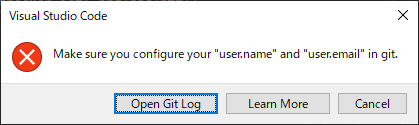

## 挨拶
こんにちはリリです。パソコンのリセット後 VS Code で Git の設定途中下記のようなメッセージが表示されました。



Git でユーザー情報の設置を忘れて GitHub のリポジトリから Clone 後、コミットを押したことが原因でした。

## ユーザー情報確認方法

```bash
# ユーザー名確認
git config user.name

# メールアドレス確認
git config user.email
```

上のコマンドを cmd または VS Code ターミナルに入力して、何も出力されない場合ユーザー情報が登録されてないことを意味します。


## ユーザー情報設定方法
ユーザー情報が無いことを確認しましたので情報を設定していきます。

```bash
# ユーザ名の設定
git config user.name [ユーザ名]

# メールアドレスの設定
git config user.email [メールアドレス]
```

設定後にもう一度情報確認コマンドを入力して確認をしてみました。

「後でノートパソコンでモザイク」

問題なく出力されています。


## ユーザー情報確認方法
ユーザー名とメールアドレスを忘れている場合は GitHub から確認が可能です。

ユーザー名は GitHub の右上のプロフィールアイコンを押すことで確認できます。
「スクショ」

ユーザーメールセッティングのEmail で確認できます。
「スクショ」
「スクショ」