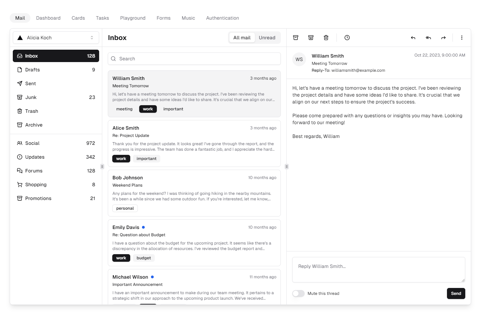
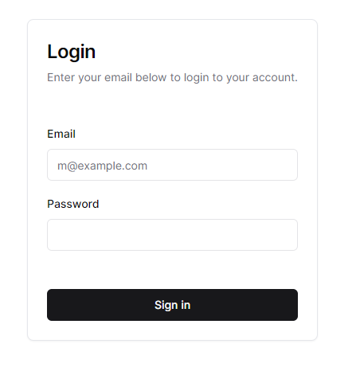
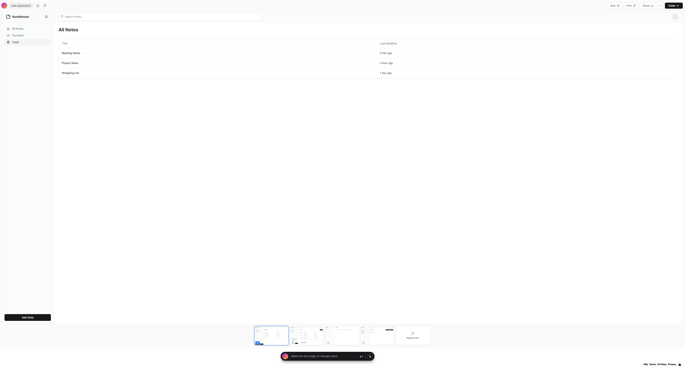
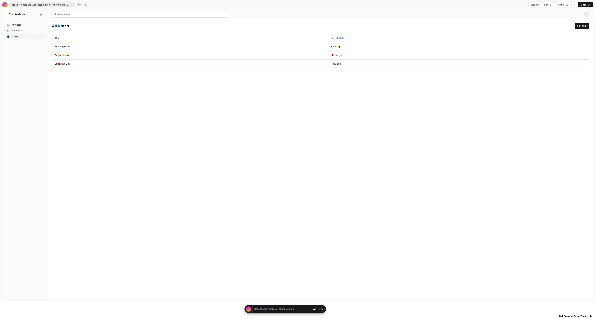
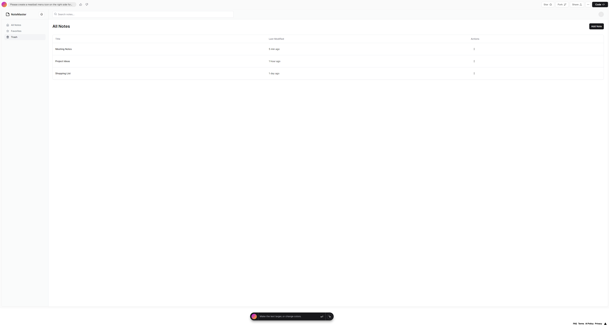
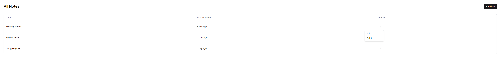
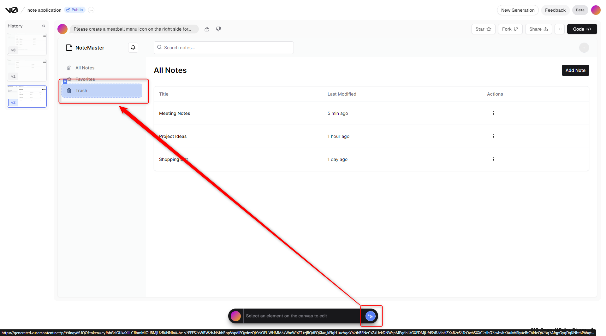
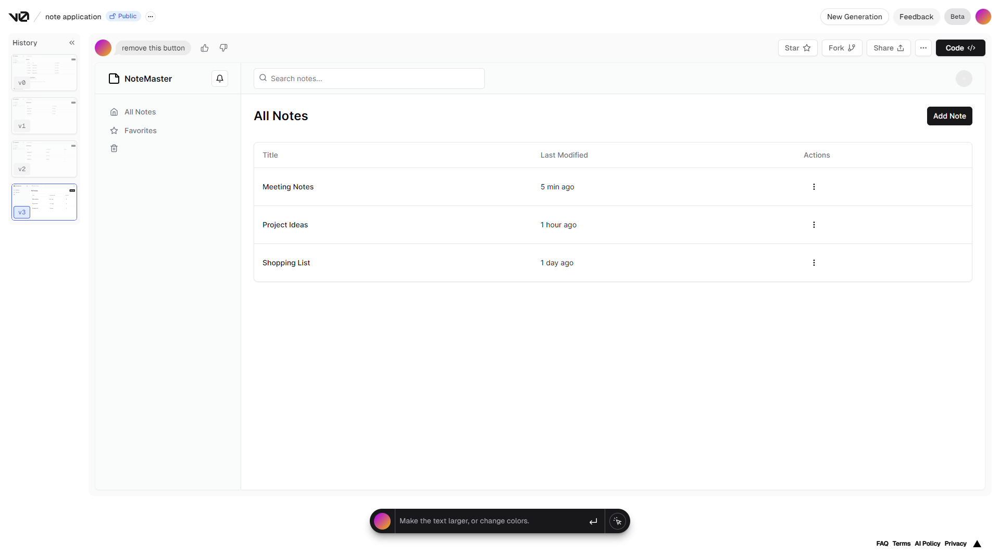
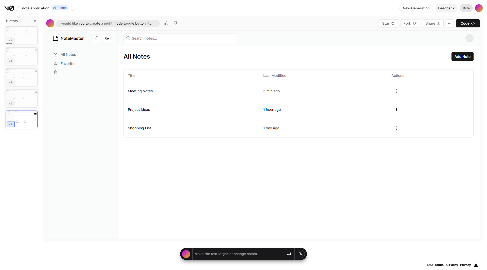
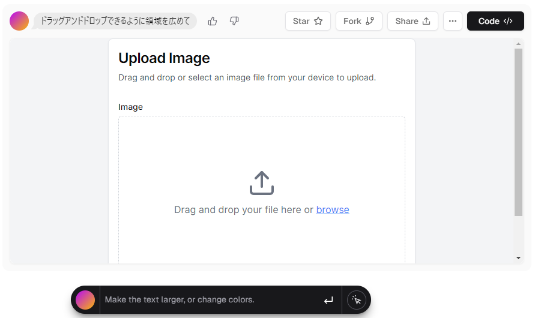

## 始めに
こんにちはリリです、本日は登場してからは少し時間が経ちましたがやっと使ってみることができるようになった AI **V0.dev** のレビューをしていこうと思います。

## V0.dev

V0 は Next.js を開発したことで有名な Vercel 社の フロントエンドを作成してくれる生成型 AI です。  
現在はベータの段階なので WaitList に登録して待っていましたがなぜかメールはまだ来てない状態で使用可能になっていました。

## V0 を利用する前に

### デザインは ShadcnUI
v0 は Radix UI と TailwindCSS を使って作られた [shadcn/ui](https://ui.shadcn.com/) を利用して生成されます。下記の二枚の写真は shadcn/ui の例と v0 に作らせた簡単な Login Form です。

## ページの全体の作成
プロンプトを書く人にもよると思いますが 5回の命令でどこまで作れるかを見るため作ってみました。
クレジットの軽減と AI の精度を上げるかと思い ChatGPT に英語で Prompt を作ってもらって入力しましたが日本語も直接入力可能です。

> V0：Note Application.

最初からいい感じのノートアプリケーションが作られました。しかし「Add Note」の位置を変えたいです。

> V1：Please relocate the 'Add Note' button to the top right corner of the All Notes Div.

ChatGpt の時もそうでしたが命令をどれだけ正確に入れるかが大事ですね。ノートの追加はこれで問題なさそうです。  
編集と削除機能が欲しいですね。ミートボールメニューを使って「修正」と「削除」を追加してみます。

> V2：Please create a meatball menu icon on the right side for the detailed menu of the Note List.

ここで少し残念ながらミートメニューではなくケバブメニューが登場しました。しかし機能としては問題なく動いていますので気にせず進みましょう、
ちなみにのこケバブメニューには「削除」と「編集」はまだ命令してないのに追加されていました。優秀ですね。

ゴミ箱は使わないのでいらないと思いました。ここで新たな機能「Pick And Edit」を使ってみます。
欲しい部分のみを選択して修正できます。

> V3：remove this button

ボタンは消えたもののアイコンが残っていますね。この場合は Pick And Edit よりは直接プロンプトを作成した方がいい選択だったかもしれませんね。

> V4：I would like you to create a night mode toggle button, it would be even better if it can turn night mode on and off

最後にナイトモードのボタンが追加されました。  

残念ながらここまでクレジットを全部使い果たしました。
結果は[こちら](https://v0.dev/t/CivcwS3u0ow)

### コンポーネントの作成

プログラムの全体のみならずコンポーネントだけ作成できます。下記のアップロードコンポーネントの場合はデザインのみではなくアップロード機能まで備えているコンポーネントです。

結果は[こちら](https://v0.dev/t/cce3ewBuYew)

## 感想
Web デザインは想像以上でした。デザインを作った後バックエンドとの連動の作業は V0 の役割ではないため、このままフロントエンドとして使うことはできません。
しかしコンポーネントのデザイン作成時間を相当減らしてくれるのはサイドプロジェクトを作る際に生産スピードが高まると思いますので登録を検討しています。

ベータの段階ですがサブスクリプションすることを真面目に考えるようになるいい AI でした。
