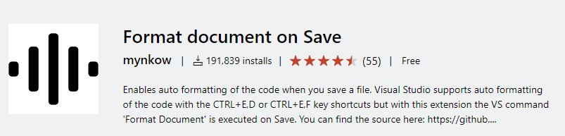

## 始めに
こんにちはリリです。本日は Visual Studio の拡張機能
皆さんはコードレビューで「コード整形」を指摘されたことがありましたか？私は数え切れないほどありました。
たしかにドキュメントのフォーマット（Ctrl + K + D）を押したはずなのにコミット後に確認すればどこがずれていますもんね。
私が整形を漏れなくする日より自動化させた方が早いと判断してセーブを押した時に整形をするように設定をしようとした瞬間気付きました。

> もし拡張機能にあるのでは？

私が不便であればすでに誰かが解決してくれているいい世の中です。本日紹介する拡張機能は「[Format Document On Save](https://marketplace.visualstudio.com/items?itemName=mynkow.FormatdocumentonSave)」セーブするときに Ctrl + K + D の整形を走らせてくれる拡張機能です。



## 導入方法
1. Visual studioのタブメニューで「拡張機能」→「拡張機能管理」をクリックします。


2. Format Document On Save を検索してダウンロードします
[image3]


3. ダウンロードするだけで適用されますがもしも適用がされなかったら一度 Visual Studio を再起動を試してください

試しにコードの最後でスペースなどを入れてセーブを押して整形がセーブと一緒にされたら無事に適用されているということです。

## 使用する際の注意点

### セーブするすべてに整形が走ります

これはいい機能でもありますが少し気になる点でもあります。ビルドする際に変更してセーブしてなかったすべてのファイルをセーブし始めてそのすべてのファイルに整形をしてくれるということです。
ビルドする際にほんの少し重くなるという点があります。逆に言えば「すべて保存」1つですべてのファイルを整形させることも可能ということです。


### 「ドキュメントのフォーマット」の範囲外は確認していく必要があります

Ctrl + K、Ctrl + D を押して行う「ドキュメントのフォーマット」の機能です。
なので下記のようにメソッドのパラメーター内での改行した際のインデントは整形ができないので注意する必要があります。

```:title=整形ができない.cs
WindowsFunction.AutoFormat(
    "All Documnets",
    enumFile.AllFile,
    null,);
```

## 終わりに

昔はコードの整形でよく指摘されていました。それで変更したファイルすべてに整形をかけたりして時間をかけていましたが「自動整形」のおかげで別のところを確認していく時間が増えました。
