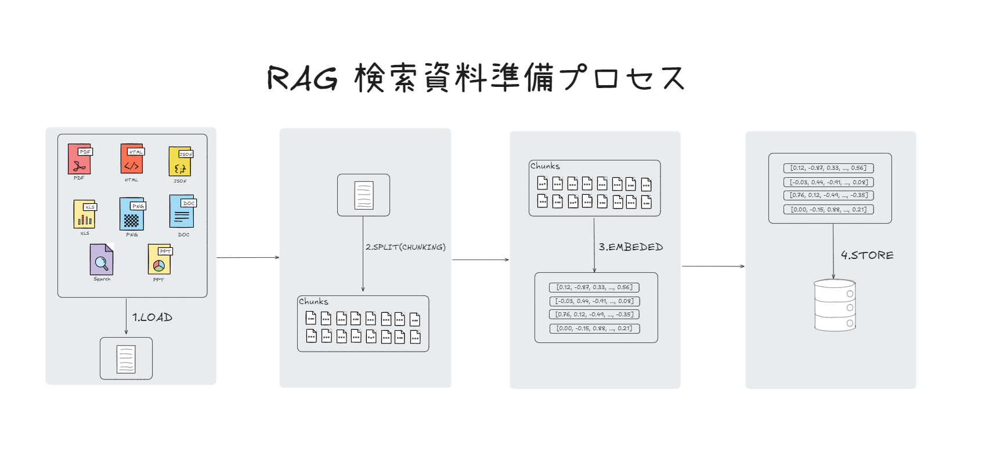
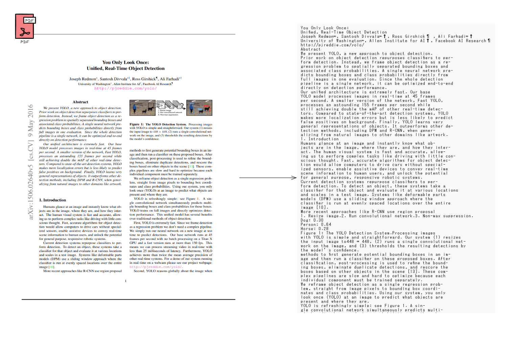
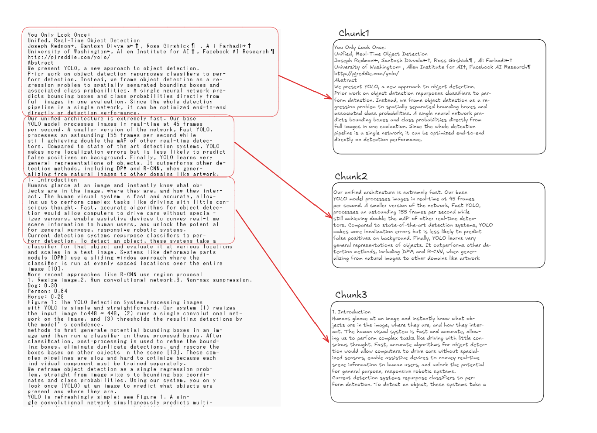
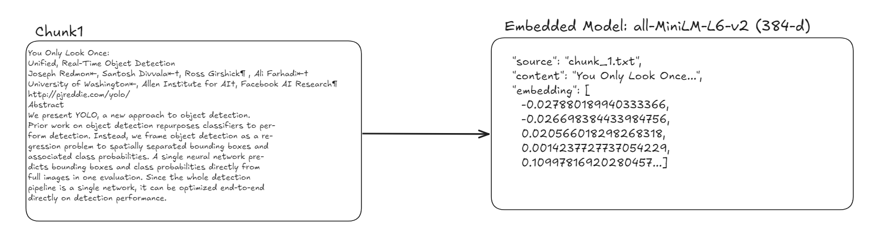

## 挨拶

こんにちは、リリです。今回は LLM が参照する資料である**ナレッジデータ**を準備する過程について紹介していきます。

## ナレッジデータとは？
ナレッジデータとは、LLM が回答生成の参考にする外部情報です。PDF、TXT、CSV、HTMLなどのドキュメント形式や、構造化されたデータベースなども含まれます。質問に対して適切な回答を生成するため、これらの情報を検索・抽出し、生成AIと組み合わせて使います。

## ナレッジデータ準備の過程

Load → Split　→ Embedded → Store この4つ段階を得てナレッジデータは準備されます。

### ファイルの読み込み（Load）

最初は準備したファイルをプログラムに取り込む**読み込み**の段階です。
txt や csv などの形式は読み込みが容易ですが、業務上で扱う文書の多くは PDF 形式ですね。

下記は、 **PDF をテキストに変換した結果の一例**です。

余談ですが PDF は論文から始め社内文書または PPT をもとに PDF 化したいろんな PDF ファイルが存在していてロードの際一番気にする部分ではないかと思います。

### 2. テキストの分離（SPLIT） 

読み込んだデータは「チャンク（ chunk ）」と呼ばれる単位に分割する **チャンキング（ chunking ）** という処理が必要になります。
このようにテキストを分割するのは LLM が入力として処理できるトークン数に上限があるためです。この上限を超えた部分はモデルで処理されず、無視されるか、エラーになることがあります。
また、テキストが長すぎる場合重要でない情報を含む可能性があります。それが RAG の精度低下につながる原因となることもあります。

#### チャンクの役割

チャンクを作成する際は、各チャンクがそれ単体でも意味を持ているように分割することが重要です。
そのため、文や句、段落など、文書の構造に基づいて分割する方法がよく用いられます。

#### チャンクのサイズ

各チャンクのサイズは、その利用目的に応じて調整可能です。大規模言語モデル（LLM）への入力制限や運用コストを鑑みながら、アプリケーションに最適なサイズを設定する必要がある。たとえば、単語数または文字数を基準としてチャンクを分割する等の方法が考えられる。

下記は、テキストを一度 chunk として分割する例です。

### 3. 埋め込み

分割されたチャンクは、その意味的情報が保持されたまま、ベクトル（数値配列）へと変換されます。このプロセスを「埋め込み（ Embedding ）」と称します。

このベクトルは、後続の検索処理において活用され、生成AIが回答を生成する際に参照される情報源として提供されます。

利用する埋め込みモデルは、その用途および要求される精度に応じて適切に選定される必要があります。

#### 埋め込みモデルの選定

多言語への対応性や専門用語に対する適応性を考慮したうえでモデルを選定することが重要です。たとえば、日本語文書を取り扱う場合には、日本語に特化したモデルを使用しないと精度低下の可能性があります。

#### 更新時の再埋め込み

ナレッジデータが更新された場合、該当部分に対する再埋め込みが必須となります。変更差分のみを処理する設計とすることで、効率的な運用が実現可能です。

### 4. 格納

埋め込み処理が完了したベクトルは、「ベクトルデータベース（ Vector DB ）」へと格納されます。
このデータベースでは、ユーザーからの質問に対して最も関連性の高いチャンクを検索（類似検索）し、その検索結果が回答生成に活用されます。
代表的なベクトルDBとしては、Chroma、Weaviate、FAISS などが挙げられます。

#### 検索品質への直接的影響

ベクトルDBのパラメーター（距離関数、類似度スコアの閾値など）は、検索精度に大きな影響を与えます。目的に応じた適切なチューニングが不可欠です。

#### スケーラビリティの考慮

データ量の増加に伴い、検索速度やストレージ要件が変動するため、初期段階から拡張性を見据えた設計が望ましいと言えます。

#### メタデータの付加

各チャンクに「文書名」や「ページ番号」などのメタデータを付加しておくことで、検索結果のフィルタリングやユーザーインターフェース（UI）表示において有用となります。

## 終わりに

ここまで、RAG のしくみとナレッジデータの準備についてざっくり紹介してきました。
次は、今回説明した処理を実際にコードを Ollama と langchain を用いて WSL の上で作ってみる予定です。よかったら次の記事も読んでみてください。
