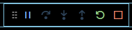
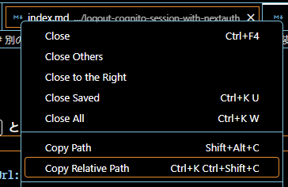
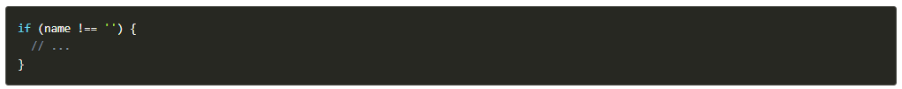
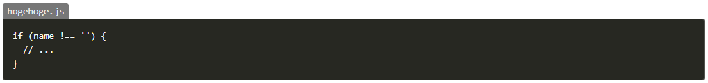
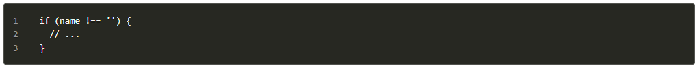
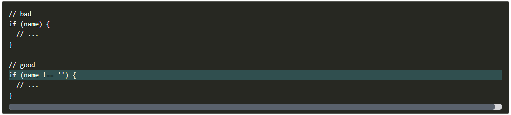
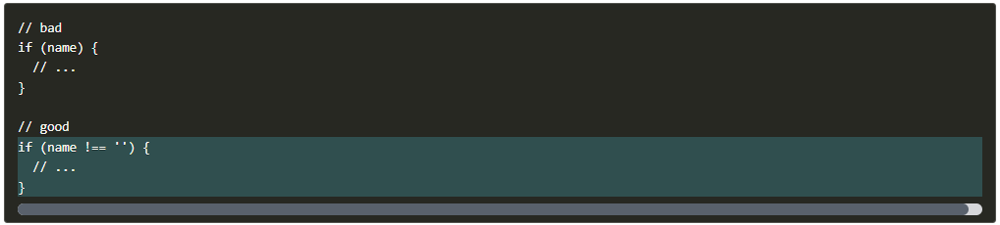
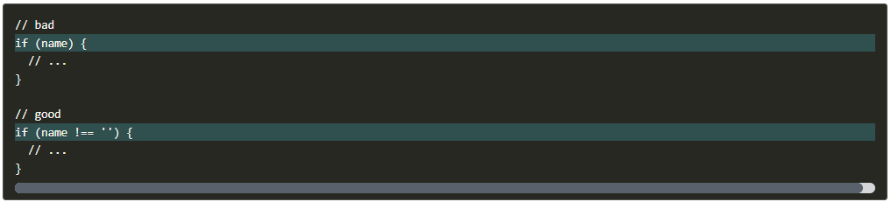
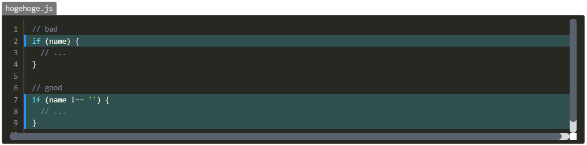
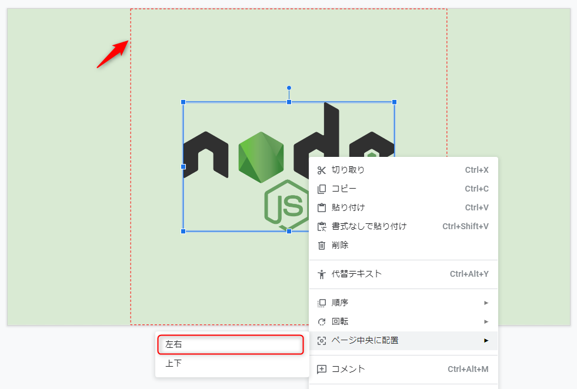

MSEN Inc. blog content
---

## 著作権について

MSEN Inc. All rights reserved.

本リポジトリ内のコンテンツに関する著作権は株式会社 MSEN が保有しています。

これらの記事は https://mseeeen.msen.jp/ でお読みいただけます。

本リポジトリのコンテンツは、下記の場合を除き、そのままお読みいただく一次利用以外の目的には利用いただけません。

- 引用の際は https://mseeeen.msen.jp/ にある公開記事に対してリンクをお願いいたします。
- 記事で紹介されているソースコードについては再利用いただいてかまいませんが、引用の際は GitHub のソースコードへのリンクをお願いします。

よろしくお願いいたします。

- - -

以下は執筆者のための案内です。

## 記事を書き始めるには

### セットアップ

環境は Linux を想定しています。
**Windows の場合は WSL2 で Ubuntu 20.04 をインストール**してください。（参考：[Windows 10でLinuxを使う(WSL2) - Qiita](https://qiita.com/whim0321/items/ed76b490daaec152dc69)）

#### リポジトリのクローン

*ホームディレクトリ (`~`) にリポジトリを clone* してください。以下、この README では `~/blog` をリポジトリのディレクトリとして説明します。

```sh
$ cd ~
$ git clone https://github.com/mseninc/blog
```

#### スクリプトのセットアップ

Node のパッケージをインストールしたあと、ルートディレクトリのスクリプトに権限を与えてください。

```sh
$ cd ~/blog
$ npm ci
$ chmod +x ./*.sh
```


### プレビュー環境 (Docker コンテナー)

自分の PC 上で本番と同じプレビューを見ながら編集したい場合は、下記のコマンドを実行して docker コンテナーを起動してください。

#### イメージのダウンロード・コンテナーの起動

```sh
$ cd ~/blog
$ docker run -d --name blog-gatsby -v $PWD:/content -p 8000:8000 ghcr.io/mseninc/blog-gatsby:main
```

docker イメージのダウンロード・起動が終わると http://localhost:8000 でプレビューが可能です。記事を保存するとブラウザー側も自動で更新されます。

起動完了まで少し時間がかかります。

#### コンテナーの操作

```sh
$ docker start blog-gatsby 👈 コンテナー起動
$ docker stop blog-gatsby 👈 コンテナー停止
```

#### イメージ入れ替え

イメージが更新されているときは一旦削除した上で「起動」手順を行ってください。

```sh
$ docker stop blog-gatsby && docker rm blog-gatsby 👈 コンテナー停止・削除
$ docker images -a | grep "blog-gatsby" | awk '{print $3}' | xargs docker rmi 👈 イメージ削除
```


### 記事テンプレートの作成

`new.sh` を使うと記事のスラグを指定するだけで

1. 最新の release ブランチのチェックアウト
1. Git ブランチ作成
1. 記事のディレクトリ作成
1. `index.md` の作成

をまとめて行えます。

git でワークツリーに変更中のファイルがある場合など、 git 操作がうまくいかなかった場合はエラーで中断されます。
ワークツリーをクリーンな状態にして再試行してください。

著者の一覧は [author.yaml](author.yaml) から読み込まれます。

```sh
$ ./new.sh 記事のスラグ
```

#### 実行例

```sh
$ ./new.sh hogehoge 👈 記事のスラグを指定
================================================================================
著者番号を指定してください
1) norikazum           3) kenzauros          5) kosshii            7) k-so16             9) kohei-iwamoto-wa
2) kiyoshin            4) jinna-i            6) hiroki-Fukumoto    8) junya-gera        10) linkohta
> 3 👈 自分の番号を入力して Enter
================================================================================
スラグ: "hogehoge"
ブランチ: "post/hogehoge"
著者: "kenzauros"
作成されるファイル:
  "kenzauros/2022/hogehoge/images" (ディレクトリ)
  "kenzauros/2022/hogehoge/index.md"
よろしいですか? [y/N] > y 👈 確認して問題なければ y を入力して Enter
================================================================================
フェッチしています...
================================================================================
release ブランチをチェックアウトしています...
HEAD is now at 40790bb Release pre-process
新しいブランチを作成しています...
Switched to a new branch 'post/hogehoge'
images ディレクトリを作成しています...
index.md を作成しています...
VS code で md ファイルを開きますか? [y/N] > y 👈 y を選ぶと VS code で index.md を開く
================================================================================
さぁ、執筆をはじめましょう！

ヒント
  文章校正 (textlint) と構文チェック : F5 キー (2回目からは Ctrl+Shift+F5 キー) ※VS Code のみ
  md ファイルを開く : code kenzauros/2022/hogehoge/index.md
  アイキャッチ画像 : images/HERO.png または images/HERO.jpg に配置
```

### 文章校正 (textlint) と構文チェック

プッシュ前に文章校正 (textlint) と構文チェックを実行し、修正するようにしてください。

**VS Code では `F5` キー (デバッグ実行) で文章校正 (textlint) と構文チェックが同時に実行できます。**
2回目 (デバッグツールバーが表示されている状態）からは `Ctrl+Shift+F5` で再チェックできます。



### 手動実行

手動で実行する場合は下記のようにコマンドを実行します。

```sh
$ node .github/scripts/lint/lint.js <ファイルパス>
$ npx textlint <ファイルパス>
```

VS Code の場合、ファイルパスは `Copy Relative Path` で取得できます。



Pull Request で `textlint` ラベルをつけると GitHub 上でも文章校正が行われます。

#### 実行例

```sh
$ npx textlint <ファイルパス>

/home/yamada/blog/sample.md
   10:1    error    Line 10 sentence length(154) exceeds the maximum sentence length of 100.
Over 54 characters   ja-technical-writing/sentence-length
   10:33   ✓ error  ユーティリティ => ユーティリティー                                         prh
  118:30   warning  一文に二回以上利用されている助詞 "は" がみつかりました。                   ja-technical-writing/no-doubled-joshi
```

```sh
$ node .github/scripts/lint/lint.js <ファイルパス>

/home/yamada/blog/sample.md

L45: コードブロックのタイトルが正しく設定されていない可能性があります
    ```title=hoge
    ```:title=hoge
L210: コードブロックのタイトルの空白は &nbsp; を使用してください
     ```JSON:title=hoge shoge
     ```JSON:title=JSON&nbsp;hoge
L259: alt 属性はダブルクオーテーションで括る必要はありません
     
     
L260: アクセシビリティ向上のため alt 属性を指定してください
     
     
L261: 画像のキャプションはダブルクオーテーションで括ります
     
     
```


## 記事の執筆ルール

### 記事執筆の流れ

大まかな記事執筆の流れは下記の通りです。

1. `origin/release` ブランチをチェックアウト  
`git checkout origin/release`
2. スラグを考える (例. `hoge-hoge`)
3. `./hew.sh` で記事のひな型を作成
4. `index.md` に記事を執筆
5. アイキャッチ画像を配置
6. コミット・プッシュ  
`git add <ディレクトリ>`  
`git commit -m "コミットメッセージ"`  
`git push -u origin HEAD`
7. Pull Reqeust を発行

### ディレクトリ構成

記事を格納する**ディレクトリ（フォルダ）構成**は下記のようにしてください。

```
GitHub アカウント名/
  年/
    記事slug/
      images/ 👈 画像ディレクトリ
        HERO.{jpg,png} 👈 アイキャッチ画像
        その他の画像ファイル 👈 記事中の画像
      index.md 👈 記事本文
```

### スラグ

スラグに使用可能な文字 : アルファベット・数字・半角ダッシュ (`-`)

### ブランチ

ブランチ名は `post/<slug>` としてください。ただし記事のディレクトリ名を後から変更した場合でもブランチ名は変更しなくてもかまいません。

`git switch -c post/<slug>`

基本的には **1 記事につき 1 ブランチ**にしてください。

ただし、前後編などで同時にリリースする場合は 1 ブランチで複数記事を含めてください。その場合でもディレクトリ名が記事の URL になるため、ディレクトリごとに 1 つの記事しか配置できません。下記の例のように個別のディレクトリに分けてください。

```
GitHub アカウント名/
  年/
    前編の記事slug/
      index.md 👈 前編の記事本文
    後編の記事slug/
      index.md 👈 後編の記事本文
```

### レビュー依頼

レビュー依頼は GitHub の Pull Request を発行することで行います。作成したブランチから release ブランチに向けて Pull Request を作成してください。

- [Pull requests · mseninc/blog](https://github.com/mseninc/blog/pulls)


### 記事のフォーマット

記事 (`index.md`) は frontmatter と本文から構成されます。下記のようになります。

```md
---
title: "<タイトル>"
date: 
author: <GitHub アカウント名>
tags: [<タグ1>, <タグ2>, ...]
---

本文
```

frontmatter | 説明
-- | --
`title` | 記事のタイトルを記述（80 文字を目安）<br>`[]` などを使いたい場合はクオテーション `""` でくくる
`date` | 公開時に自動設定されるため、空にしておく
`author` | 自身の GitHub アカウント名を記載
`tags` | 記事に関連するタグを記述（複数可）<br>最も関連性の高いタグを先頭に記述<br>タグについては過去の記事を参考に

本文には `##` (`h2`) を最上位として適切な見出しを設定してください。見出しがない場合、記事の目次が生成されません。

### 画像について

**画像は `images/` ディレクトリに配置**し、Markdown 記法で挿入してください。

```md

```

「*画像の説明*」は省略可能ですが、できる限り設定してください。

画像下に表示する「**キャプション**」を設定する場合は、画像パスの後ろに下記のように記述してください。

```md

```

キャプションがない場合は「画像の説明」が表示されます。

### コードブロックについて

コードブロックでは言語の他、タイトル指定、行番号表示、強調行指定ができます。

- 言語指定
    ```
    ```js
    ```
    
- タイトル指定
    ```
    ```:title=hogehoge.js
    ```
    
- 行番号表示
    ```
    ```{numberLines:1}
    ```
    
- 強調行指定 (単一行指定)
    ```
    ```{7}
    ```
    
- 強調行指定 (範囲行指定)
    ```
    ```{7-9}
    ```
    
- 強調行指定 (複数行指定)
    ```
    ```{2,7}
    ```
    
- まとめて指定
    ```
    ```js{numberLines:1}{2,7-9}:title=hogehoge.js
    ```
    

### アイキャッチ画像について

記事を書いたら**アイキャッチ画像**を必ず作成してください。

アイキャッチ画像は `images/` ディレクトリの下に `HERO.png` または `HERO.jpg` というファイル名で配置します。フォーマットは下記の通りです。

- 縦横比: **16:9**
- 幅: 960 px 以上 1600 px 未満
- 圧縮形式: JPEG, PNG

16:9 の画像を作成するには Google スライドなど、キャンバスが 16:9 になっているツールを使うと簡単です。

Google スライドの場合、メニューの「ファイル」➡「ダウンロード」➡「PNG 画像 (.png、現在のスライド)」で出力できます。

#### アイキャッチ画像作成上の注意

- **背景色はサービスのロゴ等に含まれる色の単色か濃色**を使うとよい場合が多いです。わからなければ **無彩色（グレー）** にしておくとよいでしょう。 Google スライドの場合は、スライドの背景を右クリックして「背景を変更」から設定します。
- 特に理由がなければ**主要素は中央揃え**にします。 Google スライドの場合は、右クリックから「ページ中央に配置」➡「左右」でセンタリングできます。
- ロゴ等は下図の赤枠で示したように中央の正方形に収まるようにします。これは SNS 等でアイキャッチ画像が自動的にトリミングされるときのためです。


