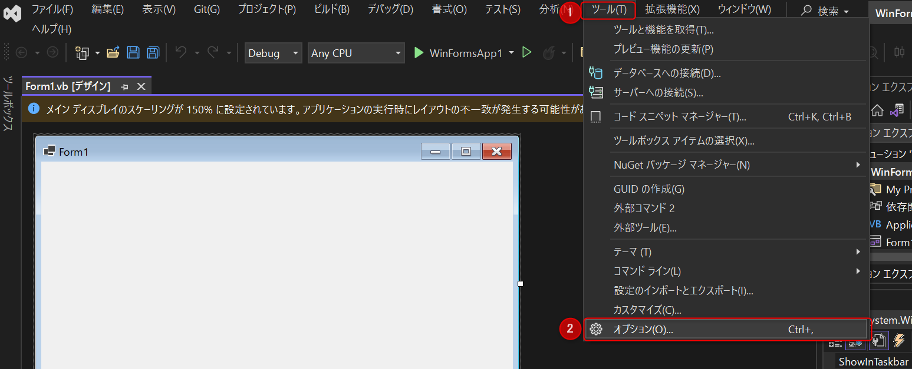
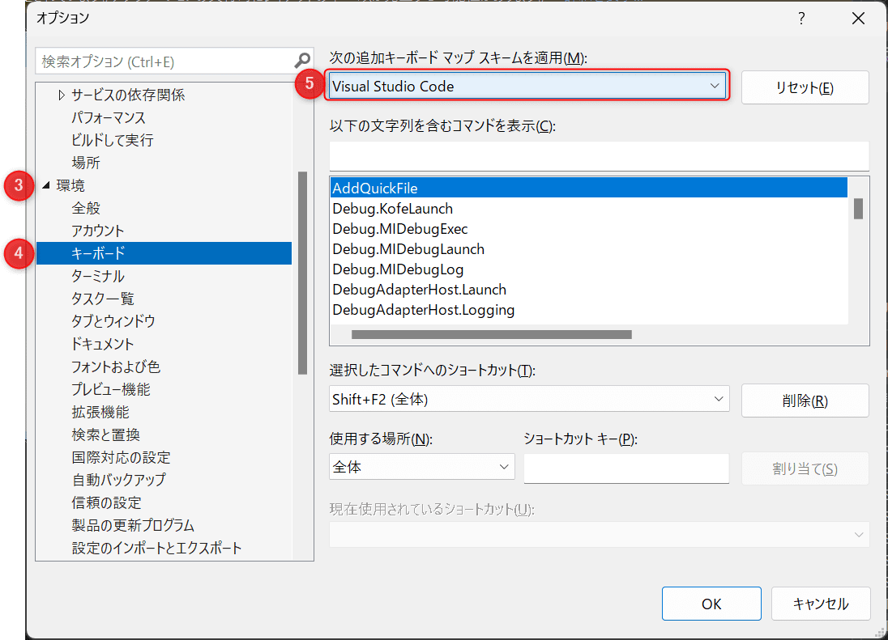
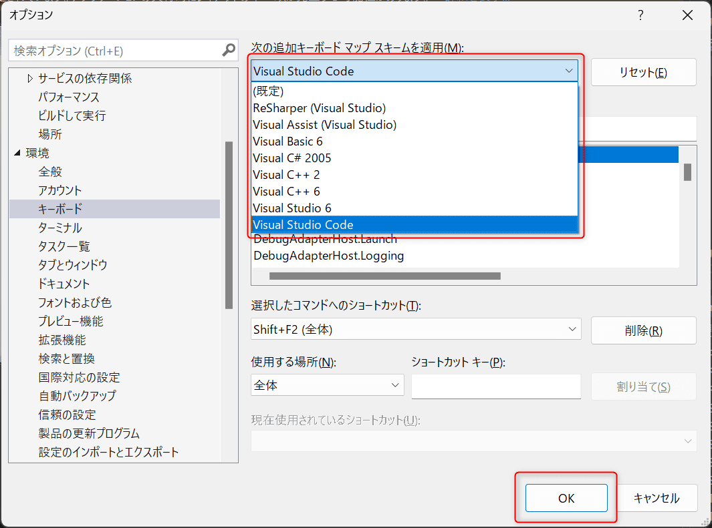

普段 VSCode と Visual Studio を使用して開発をしていますが、キーバインド設定が異なっており無駄な操作をしてしまうことが多々ありました。
そこで今回は Visual Studio 2022 のキーバインド設定を変更する方法を紹介します。

## 想定環境

- Windows 11
- Microsoft.VisualStudio.2022.Community 17.5.5

## 設定方法

1. Visual Studio 2022 を開き、ツールからオプションを開きます。

2. 環境タブを探し、キーボードの設定項目を開きます。

3. 次の追加キーボードマップ スキームを適用の場所で 「Visual Studio Code」 を選択します。

選択後、最後に OK を押して適用完了です。

## まとめ

Visual Studio 2022 のキーバインド設定を変更する方法を紹介しました。

ツール > オプション > 環境タブ > キーボードの設定項目から設定できます。

個人的に、「Ctrl + Alt + ↑/↓」でカーソルを複数挿入するショートカットキーを多用していたので、今回の設定でとても快適になりました 😊

それでは、また。
