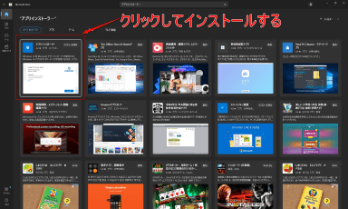

こんにちは、 Makky です。

Visual Studio 2022 のバージョンを `17.6.4` に上げた後から、立ち上げるとすぐクラッシュするようになりました。

```{4}:title=イベントビューアーでのエラーログ
Description: A .NET application failed.
Application: ServiceHub.RoslynCodeAnalysisService.exe
Path: C:\Program Files\Microsoft Visual Studio\2022\Community\Common7\ServiceHub\Hosts\ServiceHub.Host.Dotnet.x64\ServiceHub.RoslynCodeAnalysisService.exe
Message: Failed to read environment variable [DOTNET_STARTUP_HOOKS], HRESULT: 0x800700CB
```

これについて調べてみると、同じような問題が発生していることが分かりました。

> 17.6.0 Preview 5.0 は、MVC ネットワークフレームワークから net8 への変換プロジェクトをロードしようとするとクラッシュします。
>
> 説明: .NET アプリケーションが失敗しました。
> アプリケーション: ServiceHub.Host.dotnet.x64.exe
> パス: C:\Program Files\Microsoft Visual Studio\2022\Preview\Common7\ServiceHub\Hosts\ServiceHub.Host.Dotnet.x64\ServiceHub.Host.dotnet.x64.exe
> メッセージ: 環境変数 [DOTNET_STARTUP_HOOKS] の読み取りに失敗しました、HRESULT: 0x800700CB
> <cite>[Developer Community](https://developercommunity.visualstudio.com/t/Failed-to-read-environment-variable-DOT/10352220?q=visual+studio+2022+Failed+to+read+environment+variable)</cite>

しかし、記事を執筆した時点での Microsoft からの回答は「現在調査中」とのこと。
> This issue is currently being investigated. Our team will get back to you if either more information is needed, a workaround is available, or the issue is resolved.
> <cite>[Microsoft からの回答](https://developercommunity.visualstudio.com/t/Failed-to-read-environment-variable-DOT/10352220#T-N10357862)</cite>

社内で確認すると、バージョン `17.5` 台を使用している方は正常に動作していました。

そこで、今回は 正常に動作しているバージョンに Visual Studio 2022 をダウングレードする方法を紹介します。

## 想定環境

- Windows 11
- winget : v1.5.1572
- Visual Studio 2022 : v17.6台

当記事では `winget` をインストールしていることが前提となっています。 `winget` をインストールしていない方は、まずは[winget をインストールされていない方へ](#winget-をインストールされていない方へ)を参考にインストールしてください。

## ダウングレードの手順

### 1. インストールされているバージョンを取得する
以下のコマンドで現在インストールされているバージョンを取得します。

```:title=インストールされているバージョンを取得
$ winget list Microsoft.VisualStudio.2022.Community
```
バージョンと書いてある場所には、**現在インストールされているバージョン**が記載されています。

利用可能と書いてある場所は、**インストール可能な最新のバージョン**が記載されています。
```{1,4}:title=バージョン取得結果
$ winget list Microsoft.VisualStudio.2022.Community
名前                         ID                                    バージョン 利用可能 ソース
---------------------------------------------------------------------------------------------
Visual Studio Community 2022 Microsoft.VisualStudio.2022.Community 17.5.5     17.6.5   winget
```
### 2. インストール可能なバージョンの一覧を表示する
ダウングレードの前に、以下のコマンドでインストール可能なバージョンを確認しておきます。

```:title=インストール可能なバージョンの一覧を表示
$ winget show Microsoft.VisualStudio.2022.Community --versions
```
正常に実行できると、インストール可能なバージョンが出力されます。

当記事では、バージョン `17.5.5` にダウングレードするため、**バージョン `17.5.5` がインストール可能であること**を確認します。
```{1,11}:title=インストール可能なバージョンの一覧表示結果
$ winget show Microsoft.VisualStudio.2022.Community --versions
見つかりました Visual Studio Community 2022 [Microsoft.VisualStudio.2022.Community]
バージョン
----------
17.6.5
17.6.4
17.6.3
17.6.2
17.6.1
17.6.0
17.5.5
17.5.4
17.5.3
17.5.2
17.5.0
17.4.5
17.4.4
```

### 3. Visual Studio 2022 をアンインストールする

ダウングレードをするために一度、**アンインストール**します。

PowerShell やコマンドプロンプトで以下のコマンドを実行してください。

```:title=アンインストール
$ winget uninstall --id Microsoft.VisualStudio.2022.Community
```

正常にアンインストールされると以下の結果が出ます。
```{1,4}:title=アンインストール結果
$ winget uninstall --id Microsoft.VisualStudio.2022.Community
見つかりました Visual Studio Community 2022 [XPDCFJDKLZJLP8]
パッケージのアンインストールを開始しています...
正常にアンインストールされました
```
### 4. 問題が発生していないバージョンの Visual Studio 2022 をインストールする

以下のコマンドで `version` を指定して Visual Studio 2022 を**インストール**します。

`version 17.5.5` で動作確認済みですので、`17.5.5` を指定しています。

```:title=インストール
winget install --id Microsoft.VisualStudio.2022.Community --version 17.5.5
```

正常にインストールされると以下の結果が出ます。

```{1,9}:title=インストール結果
$ winget install --id Microsoft.VisualStudio.2022.Community --version 17.5.5
見つかりました Visual Studio Community 2022 [Microsoft.VisualStudio.2022.Community] version 17.5.5
このアプリケーションは所有者からライセンス供与されます。
Microsoft はサードパーティのパッケージに対して責任を負わず、ライセンスも付与しません。
ダウンロード中 https://download.visualstudio.microsoft.com/download/pr/7ac7457f-ba6e-4a12-ba2c-1adebad20070/f756de6bf2354a30cfb9cfa5836e2c7671e53645afe163a60c233dff0cd15849/vs_Community.exe
  ██████████████████████████████  3.53 MB / 3.53 MB
インストーラーハッシュが正常に検証されました
パッケージのインストールを開始しています...
インストールが完了しました
```

これで完了です。お疲れさまでした。

## winget をインストールされていない方へ

#### Windows Package Manager (winget) とは

Microsoft が開発している、**コマンド1つ**でソフトのインストールやアンインストールができる便利なツールです。

バッチ処理も可能なので一括でインストールやアップグレードを行うことができます！

#### インストール方法

Microsoft Store で「**アプリ インストーラー**」と検索してインストールします。



PowerShell やコマンドプロンプトで以下のコマンドを実行してください。
```:title=動作確認としてバージョンを出力する
$ winget -v
```
以下のようにバージョンが返ってきたら使用できるようになっています。
```{2}:title=出力結果
$ winget -v
v1.5.1572
```

## あとがき

今回は winget を使ってダウングレードする方法を紹介しました。

ダウングレードをするついでに便利な winget を気に入っていただけると幸いです。

それではまた。
