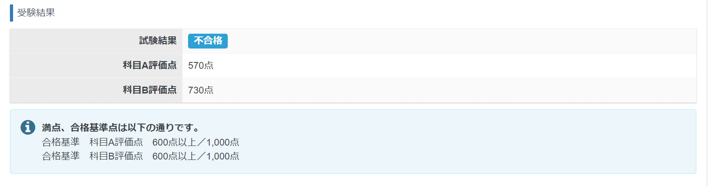

2023年の4月から制度が大きく変わった、基本情報技術者試験に合格するまでを記事にしました。
少しでも受ける方のお役に立てれば幸いです。

## 筆者のスペック
- ソフトウェア開発会社( MSEN )に入社して半年
- 高校の時にプログラムをかじった程度
- 旧制度を合わせると 5回目の挑戦(高校で2回、社会人になって3回)

## 過去の制度と何が変わったか？
- PBT 方式から CBT 方式への変更
- 科目B の大幅な変更
- 詳しくは公式 [HP](https://www.ipa.go.jp/shiken/kubun/fe.html) で

## 受験結果
半年間くらいかけてようやく合格できました。サボっている期間もありましたが...。

資格なので「受かれば勝ち」と言いたいところですが、大切なのは資格を取るまでに得た知識です。

そのため、もっと点数が取れれば良かったなと思います。

とはいえ合格は合格なのでとてもうれしいです（笑）

## 何が一番合格につながったか

ズバリ **過去問道場** と **情報処理教科書 出るとこだけ！基本情報技術者［科目B］** です！

でも、どれくらいやれば合格するの？という方もいらっしゃると思います。

次は、この2つにどれくらい時間をかけたかを紹介しようと思います。

### 科目A 過去問道場
科目A はひたすら過去問道場をやっていました。

その時の出題設定は、「模擬試験形式で出題」を選んで、「平成21年度以降から作成」を設定していました。

本番と同じ問題数で文字通り模擬試験が可能ですので、オススメです！

#### で、どれくらいやったの？
筆者は **網羅度43％** **正解率65％** で合格できました。

執筆しながら思ったのが、成績レポートの正解率が**本番の正解率とほぼ一緒**だったということです。

過去問道場の全期間の正解率を参考にして、今自分がどれぐらい点数を取れるかを計ることができそうです。

### 科目B 情報処理教科書 出るとこだけ！基本情報技術者［科目B］
科目B は**疑似言語の問題**と**情報セキュリティ**の問題が出てきます。

筆者にとって一番大きな壁だったのが、疑似言語の問題でした...。

そこで、疑似言語の問題をどうにかしなきゃと思い[情報処理教科書 出るとこだけ！基本情報技術者［科目B］](https://www.amazon.co.jp/%E6%83%85%E5%A0%B1%E5%87%A6%E7%90%86%E6%95%99%E7%A7%91%E6%9B%B8-%E5%87%BA%E3%82%8B%E3%81%A8%E3%81%93%E3%81%A0%E3%81%91%EF%BC%81%E5%9F%BA%E6%9C%AC%E6%83%85%E5%A0%B1%E6%8A%80%E8%A1%93%E8%80%85%EF%BC%BB%E7%A7%91%E7%9B%AEB%EF%BC%BD%E7%AC%AC3%E7%89%88-%E6%A9%8B%E6%9C%AC-%E7%A5%90%E5%8F%B2/dp/4798177679)を購入しました。

この本には、「**最初は問題が理解できなくても、とにかくトレースをすればいい**」といったことが書かれていました。

そして書いてあった通りに、問題が理解できなくてもトレースをしてみることにしました。

すると、どんな問題でも時間さえあれば解けるということが分かりました😂

#### それはなぜか?

基本情報技術者の疑似言語の問題は、ほとんどが「**プログラムの穴埋め問題**」もしくは「**プログラムの実行結果**」を問う問題だからです。

よって、穴埋め問題であれば、問題文に選択肢を1つずつ当てはめてトレース。

プログラムの実行結果であれば、そのままトレースすれば答えを出せます。

#### どうやってトレースするか?

紙に手書きでのトレースに慣れていない方は一定数いると思っています。筆者がその中の一人でした。

そこで、本に書いてあったトレースの方法がとてもやりやすかったので紹介します。

たとえば以下の問題があるとします。

このように**表に起こしてトレース**します。

| 処理 | x | y | z |
| ---- | ---- | ---- | ---- |
| x ← 1 | 1 | | |
| y ← 2 | 1 | 2 | |
| z ← 3 | 1 | 2 | 3 |
| x ← y | **2** | 2 | 3 |
| y ← z | 2 | **3** | 3 |
| z ← x | 2 | 3 | **2** |

表形式にすることで、**処理による変数の推移が分かりやすくなる**ので複雑になることなく、トレースできます。

あとは、このトレースのやり方を何度も[サンプル問題](https://www.ipa.go.jp/shiken/syllabus/henkou/2022/20221226.html)で練習して、慣れるだけです。

これで苦手だった科目 Bを攻略できます！

科目B は方法さえ覚えれば解ける問題ですので、勉強した期間は一週間程度でした。

## あとがき

基本情報技術者試験については情報技術に関する基本的なことが広く出題されるため、合格を目指すプロセスで無駄なことは一切ないと思ってます。

よって、合格に向けて勉強していることは試験のためですが、試験のためではなく**自分ため**なのです。

将来絶対に役に立つ勉強ですので、モチベーションを維持して頑張っていきましょう！

筆者も次は応用情報技術者試験と TOEIC に向けて勉強をがんばります！