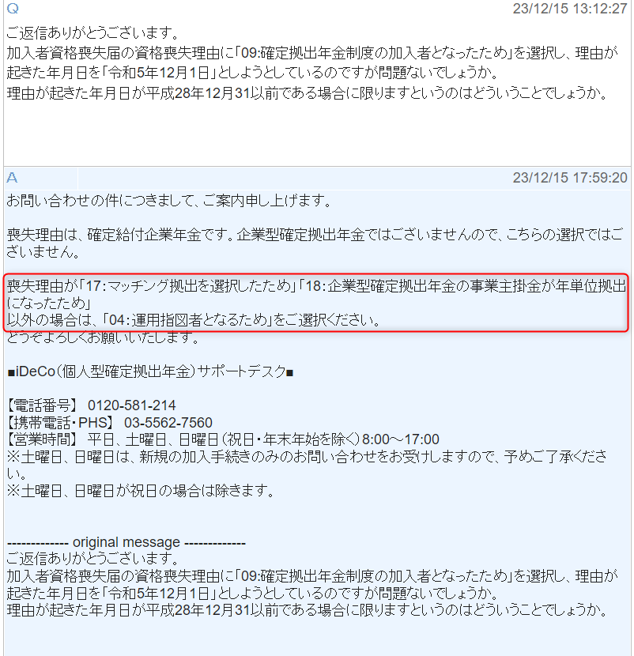
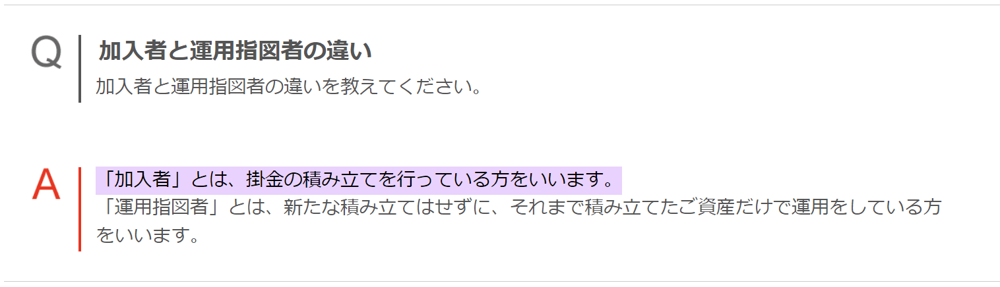
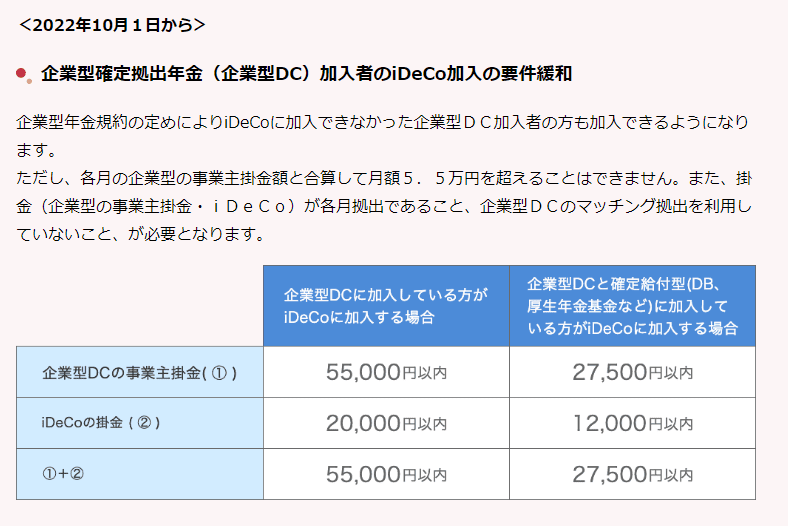

会社を辞めて一度 企業型 DC の資産を iDeCo に移換した方など、もともと iDeCo に資産を持っていらっしゃる方などいるかと思います。

当記事では iDeCo をやめて 企業型 DC に移換する手順を紹介します。

## 手順

### 1. iDeCo の資格喪失手続きを行う

手続きの方法は iDeCo の運営管理機関によって異なるので、問い合わせが必要です。
例としては、著者の場合 SBI 証券で iDeCo を利用していたため、以下のフォームから加入者資格喪失届を申請しました。
https://site0.sbisec.co.jp/marble/dc/application/changeRequest/input.do?Param6=522

喪失理由については「04:運用指図者」になるためでいいようです。

iDeCo には掛け金を搬出しないので「運用指図者」となります。

### 2.個人別管理資産移換依頼書（DC）を提出する

会社の担当の方に「 iDeCo から 企業型 DC に移換したい」と伝え、個人別管理資産移換依頼書をもらいます。
個人別管理資産移換依頼書に必要事項を記入し、会社の担当の方に提出します。

あとは移換完了まで待ちましょう。

## まとめ

**iDeCo の資格喪失手続きと資産移換依頼をしましょう。**

著者の場合、移換依頼のみで十分だと思っていたため意図せず iDeCo と 企業型 DC の同時加入をしておりました。

調べたところ、2022 年 10 月から同時加入が可能になっていたため、資格喪失をしないとそのような状態になるようです。

[iDeCo 公式サイトより](https://www.ideco-koushiki.jp/library/2022kaisei/)

この記事が、少しでもみなさんのお役に立てれば幸いです。

それではまた！
