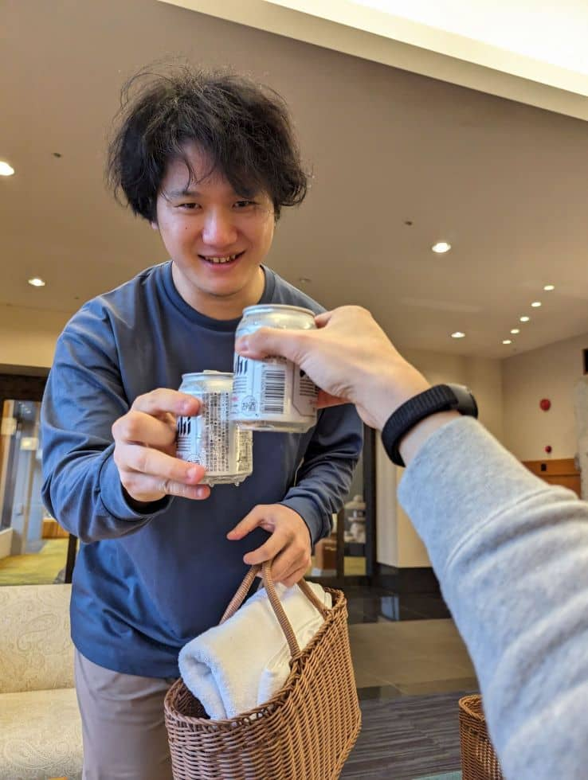

2024年1月20日 ～ 2024年1月21日にかけて
和歌山県の**那智勝浦町**へ社員旅行に行ってきました。

楽しい雰囲気が伝わればいいなと思い、その様子をお届けします！

## 1日目
### 昼食 すさみ食堂
車で向かうこと3時間、[すさみ食堂](https://tabelog.com/wakayama/A3004/A300403/30000335/)に到着！

ここでは、和歌山県すさみ町名産の**イノブタ**を使った料理や**サンマ寿司**などの珍しい料理から、丼ものや麺類などの定番メニューをいただけます。

筆者は名物のサンマ寿司とイノブタラーメンをいただきました！

ここからは旅館に向かいました。

#### カフェで一息

道中でおしゃれなカフェ ([ログキッチン「ヴァレ・ノアール」](https://www.inakagurashi-kushimoto.jp/sub04_05.html)) に立ち寄りました。

おいしいケーキ&コーヒーをいただきました！

### いざ中の島へ！
なんと、旅館には船でいきます。

旅館に到着！

[碧き島の宿 熊野別邸 中の島](https://kb-nakanoshima.jp/) という旅館に泊まります😊

広くてきれいな和室で、すばらしいオーシャンビューです。

#### 温泉へ行こう

さっそく乾杯して(?) 温泉に向かいます。

実際の写真はありませんが、露天風呂からは海が見えて最高の温泉でした。

湯上りには、飲み放題のビールと食べ放題のアイスで至福の時を過ごします。

### 夕食 桂城

夕食は船で本島に戻り[桂城](https://tabelog.com/wakayama/A3005/A300502/30000173/)でいただきました！

ここでは主に海鮮料理がいただけます。

マグロのレアカツというものがあり、初めて食べたのですがめちゃくちゃおいしかったです。

食後は旅館に戻ります。

しかし、いつのまにか外は暴風雨になっていました。

船が出ていなかったら旅はここで終わっていましたかもしれません(笑)

#### 温泉へ行こう 2

雨の中でしたが、それもまた一興。

最高の露天風呂です。

湯上りはラウンジでゆっくり。なんと梅酒も日本酒も飲み放題です。

おいしいご飯食べて温泉に2回も入れて充実した1日でした！

[2日目](https://mseeeen.msen.jp/2024-winter-recreation-in-wakayama-day2/)へと続く...。