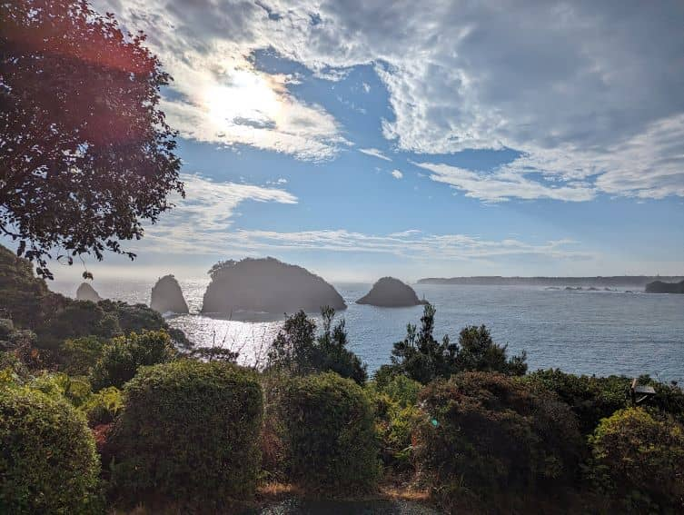
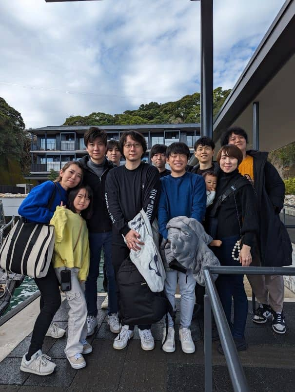
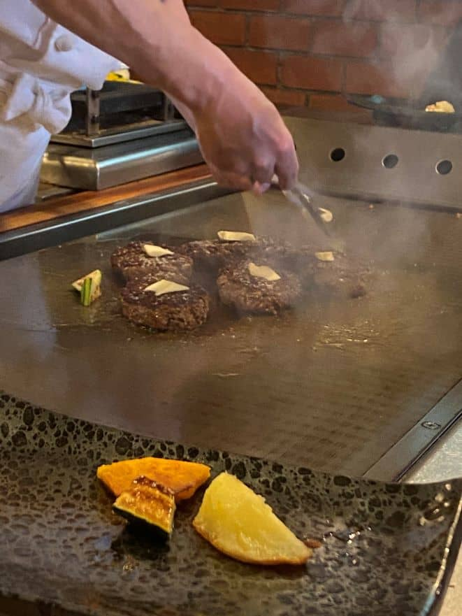

[1日目](https://mseeeen.msen.jp/2024-winter-recreation-in-wakayama-day1/)の続きです。

2日目はいい天気に恵まれました😊

## 2日目

#### 温泉へ行こう 3

至高の朝風呂です。

なんと、露天風呂は2種類あり日替わりになっています。

さらに夕方や夜とはまた違う海の景色が見られるので、3回入っても飽きることはありません。

どうしても写真がないのは残念です😓

#### 島内散策

湯上りに島内の見晴らし台に行ってきました！

ここからの景色は圧巻でした。

#### チェックアウト

サービスが充実しており質が高く、大満足の旅館でした。

### 昼食 ステーキハウスひのき

途中、お土産屋さんに立ち寄りながら[ステーキハウスひのき](https://steakhousehinoki.com/)に向かいます。

ステーキハウスひのきでは目の前の鉄板でハンバーグを焼いてもらえます。

とてもジューシーでおいしかったです！

### 那智の滝

昼食を食べたあとは世界遺産である**那智の滝**に向かいました。

とても迫力がある滝でした。

滝との距離は結構あるのですが、水しぶきが飛んでくるほどです。

#### アイスで一息

自家製牛乳で作っているアイスクリーム！

甘くておいしいです。

### 串本海中公園

今回のレクリエーション最後の大きなイベント[串本海中公園](https://www.kushimoto.co.jp/)

ここには水族館と海中展望塔、海中観光船があります。

今回は**水族館**と**海中展望塔**に行ってきました！

この水族館で特に珍しかったのが**ウミガメタッチ！**

かわいいウミガメと触れ合うことができます。

海中展望塔では本物の**海中**が見られます。

たくさん見られました！

オリジナルの掛け声で記念撮影も！

### あとがき

お土産屋さんに寄って、無事帰ることができました。

運転してくれた方々や企画してくださった方々、ありがとうございました。

次回も、楽しいレクリエーションができるように頑張っていきたいです！