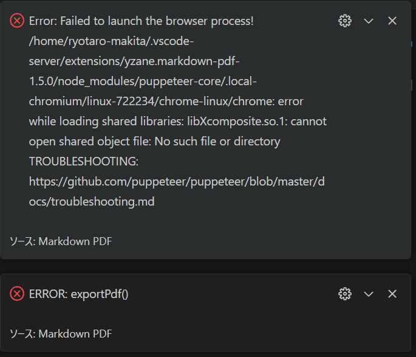
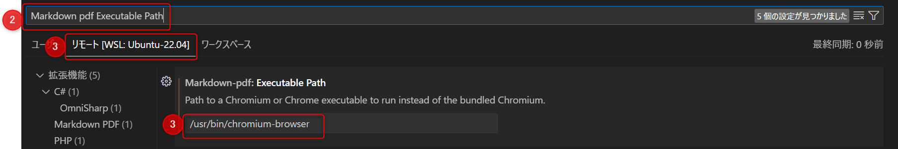

Markdown PDF を WSL で使用した時に **「Failed to launch the browser process!」** エラーが発生しました。



エラーを解決した方法と原因を紹介します。

本記事では下記の環境で動作確認を行っています。

- Ubuntu 22.04.4 LTS (WSL2)

## 解決方法

**WSL にブラウザをインストールし、そのパスを Markdown PDF に設定することで解決しました。**

その手順を紹介します。

### 1. WSL にブラウザをインストールする

WSL 内でブラウザをインストールします。

私は Chromium を使用しました。

```bash:title=Chromiumのインストール
$ sudo apt-get install -y chromium-browser
```

```bash:title=Chromiumのインストール確認
$ chromium-browser --version
```

`which chromium-browser` で表示されるブラウザのパスを確認してください。

```bash:title=Chromiumのパスを確認
$ which chromium-browser
```

### 2. Markdown PDF の設定を変更する

1. vscode のショートカットを使い `Ctrl` + `,` で設定画面を開きます。

2. 検索欄に `Markdown pdf Executable Path` と入力します。

3. リモートを選択し、`Markdown pdf: Executable Path` に `which chromium-browser` で表示されるブラウザのパスを設定してください。



以上でエラー解消されると思います！

## エラーの原因

Markdown PDF 拡張機能は、内部的にブラウザを使用して Markdown を PDF に変換しているようです。

しかし、WSL 環境ではブラウザがインストールされておらずエラーが発生しました。

Markdown PDF の README を見てみると自動でダウンロードされるみたいですが、なぜかダウンロードされていませんでした😓

> インストール
> Markdown PDF をインストールして、Visual Studio Code で Markdownファイルを最初に開いた時、Chromium のダウンロードが自動で始まります。
>
> しかしサイズが大きい為 (~170Mb Mac, ~282Mb Linux, ~280Mb Win) 、環境によっては時間がかかります。 ダウンロード中は、ステータスバーに Installing Puppeteer のメッセージが表示されます。
>
> もしプロキシを使う必要がある場合、settings.json に http.proxy でプロキシを設定し、Visual Studio Code を再起動してください。
>
> ダウンロードが上手くいかない場合や、Markdown PDF のバージョンアップの度にダウンロードするのを避けたい場合、markdown-pdf.executablePath オプションでインストール済みの Chrome か Chromium を指定してください。
>
><cite>[Markdown PDF - README](https://github.com/yzane/vscode-markdown-pdf/blob/HEAD/README.ja.md#%E3%82%A4%E3%83%B3%E3%82%B9%E3%83%88%E3%83%BC%E3%83%AB)</cite>

## まとめ

WSL 環境で Markdown PDF の「Failed to launch the browser process!」エラーは、WSL 内にブラウザをインストールし、そのパスを設定することで解決できます。

同様の問題を抱えている方のお役に立てれば幸いです！

それではまた！

## 参考文献

- [Markdown PDFで Error: Failed to launch the browser process! が発生した際の解消方法 - Qiita](https://qiita.com/I_s/items/5ba9a19d933598bc7f69)
- [Markdown PDF - README](https://github.com/yzane/vscode-markdown-pdf/blob/HEAD/README.ja.md#%E3%82%A4%E3%83%B3%E3%82%B9%E3%83%88%E3%83%BC%E3%83%AB)