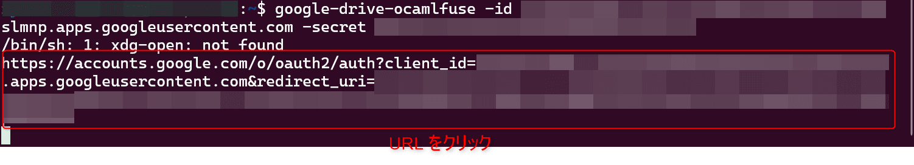

Ubuntu に Google Drive をマウントする方法を紹介します。

本記事では下記の環境で動作確認を行っています。

- Ubuntu 22.04.4 LTS

## Google Drive API を有効化する

Ubuntu に Google Drive をマウントするには、**Google Drive API** を有効化する必要があります。

[Google Cloud コンソール](https://console.cloud.google.com) にアクセスしてプロジェクトのコンソールに入ります。

プロジェクトがない方は適当な名前で問題ないので作成しましょう。

左のサイドメニューのライブラリをクリックし API ライブラリの画面を表示します。


そこで `google drive api` と入力し、一番上に出てきた `Google Drive API` を選択し有効にします。

## 認証情報を作成する

認証情報から新しく OAuth クライアント ID を作成します。
OAuth 同意画面の設定をされていない方は先にそちらを済ませてください。

作成した OAuth クライアント ID のクライアント ID と クライアントシークレットはのちほど使用します。

## google-drive-ocamlfuse をインストールする

google-drive-ocamlfuse は Linux に Google Drive をマウントするアプリケーションです。

- [astrada/google-drive-ocamlfuse: FUSE filesystem over Google Drive](https://github.com/astrada/google-drive-ocamlfuse)

Ubuntu に google-drive-ocamlfuse をインストールします。

```:title=google-drive-ocamlfuseをインストール
$ sudo add-apt-repository ppa:alessandro-strada/ppa
$ sudo apt update
$ sudo apt-get install google-drive-ocamlfuse
```

## google-drive-ocamlfuse を使って Ubuntu にマウントする

google-drive-ocamlfuse を認証します。

先ほど作成した OAuth クライアント ID のクライアント ID と クライアントシークレットを入力してください。

```:title=google-drive-ocamlfuseの認証
$ google-drive-ocamlfuse -id <クライアントID> -secret <クライアントシークレット>
```

コマンドを実行すると、コンソールに URL が表示されます。

URL をクリックして Google アカウントで認証します。



この画面が出たら認証完了です。


もし、GUI 環境がない場合は以下のリンクを参照して認証してください。

- [google-drive-ocamlfuse で Google ドライブをマウント](https://qiita.com/cabbage_lettuce/items/c4544b3e5cd28caf04bc#%E8%AA%8D%E8%A8%BC)

あとは以下のコマンドでお好きな場所にマウントしてください。

```:title=例としてgoogle-driveというディレクトリにマウント
$ mkdir google-drive
$ google-drive-ocamlfuse google-drive
```

マウントされていることが確認できました。

```:title=マウントされたディレクトリ
$ ls -l google-drive/
total 3745
-rw-r--r-- 1 user user  374638 Apr 10  2023  sample.pdf
-rw-r--r-- 1 user user 1276683 Apr 10  2023  example.pdf
drwxr-xr-x 1 user user    4096 Jun  7  2023  sampleDir
```

デフォルトではマイドライブがマウントされています。

`~/.gdfuse/default/config` を編集することでいろいろとできるようです。

試しにフォルダを指定してマウントしようとしてみたところ、フォルダ ID を指定しているはずが、変わらずマイドライブがマウントされていたので動作確認はできておりません。

- 参考記事 [google-drive-ocamlfuse 複数の GoogleDrive アカウントを ubuntu で使う](https://coush.jp/206.html)

## アンマウントする

以下のコマンドでマウントしたディレクトリをアンマウントできます。

```
$ fusermount -u google-drive
```

## あとがき

今回は Ubuntu に Google Drive をマウントする方法を紹介しました。

1 人でも困っている方のお役に立てれば幸いです。

それではまた！
