最近、iPad をもっと活用したいなと思い、iPad 用のキーボードを買いました！

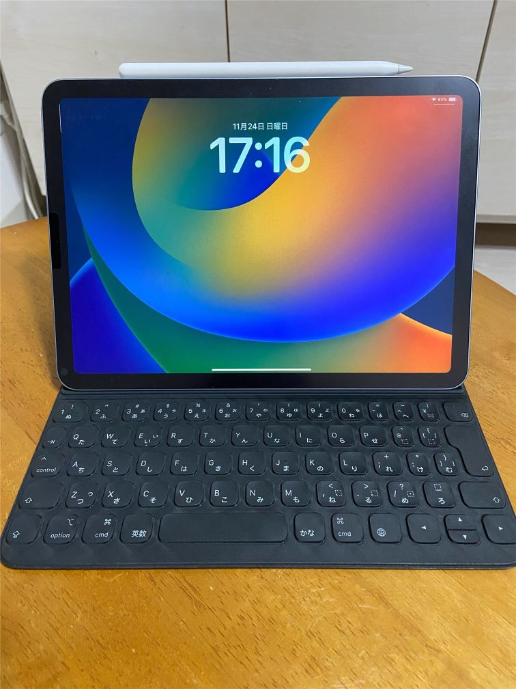

iPad で VSCode が使えれば、PC のような感覚で開発ができるのではないかと思い、調べてみると VSCode をブラウザ上で使える **GitHub Codespaces** というものを見つけました。

ブラウザが使える端末であれば良いので、iPad などで使うのに適していると思いました。

そこで、今回は GitHub Codespaces を使ってみた手順を紹介しようと思います。

## GitHub Codespaces とは

公式のドキュメントに書かれている通り、codespace はクラウドでホストされている開発環境です。

GitHub のリポジトリがあればすぐに開発を始められます。

リポジトリがなくても、用意されているテンプレートから開発を始められます。

>codespace は、クラウドでホストされている開発環境です。 構成ファイルをリポジトリにコミットすることで、GitHub Codespaces >のプロジェクトをカスタマイズできます (コードとしての構成とよく呼ばれます)。これにより、プロジェクトのすべてのユーザーに対して繰り返し可能な codespace 構成が作成されます。 「開発コンテナーの概要」を参照してください。
>
>作成する各 codespace は、仮想マシン上で実行されている Docker コンテナー内の GitHub によってホストされます。 仮想マシンの種類は、2 コア、8 GB RAM、32 GB ストレージから、最大 32 コア、64 GB RAM、128 GB ストレージまでの範囲から選択できます。
><cite>[GitHub Codespaces の概要](https://docs.github.com/ja/codespaces/overview)</cite> 

## GitHub Codespaces を使ってみる

実際に GitHub Codespeces を iPad で使ってみました。

その手順を紹介します。

### 1. Codespace を作成する

普段、Git clone する時に使用する Code ボタンから Codespace を作成します。

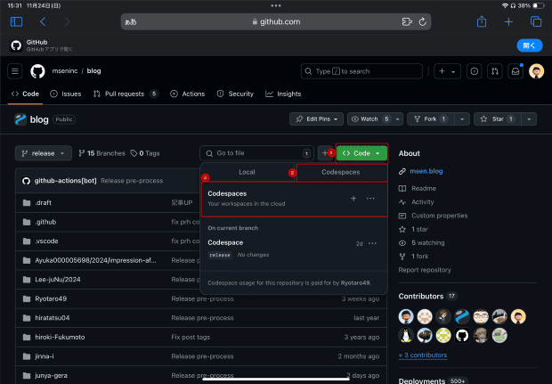

### 2. Codespace を利用する

作成すると、ブラウザ上で VSCode が立ち上がります。

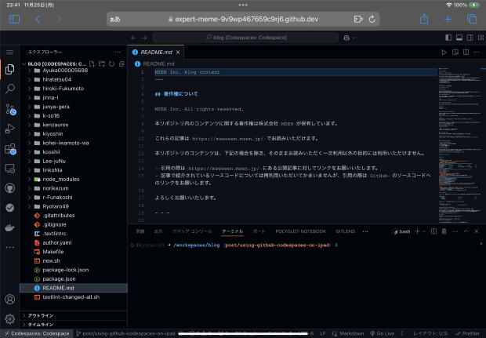

これだけでセットアップ完了です！

私は普段から VSCode 使っているのですが、Codespace で特に違和感なく VSCode を使えました。

このブログも iPad + Codespace の環境で執筆しています。

なんと、拡張機能も設定の同期をオンにすることで同期できます。

そのやり方も[Codespace とローカルの VSCode の設定を同期する](#codespace-とローカルの-vscode-の設定を同期する)のセクションで紹介しています。

### Codespace で Docker を使ってみる

Codespace 上で Docker も使えるようなので、使ってみました。

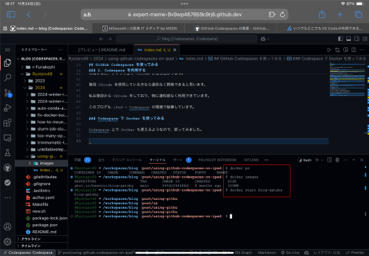

Docker コマンドは問題なく使えていますね。

Docker コンテナーを起動して localhost:8000 でアプリーションを起動してみます。

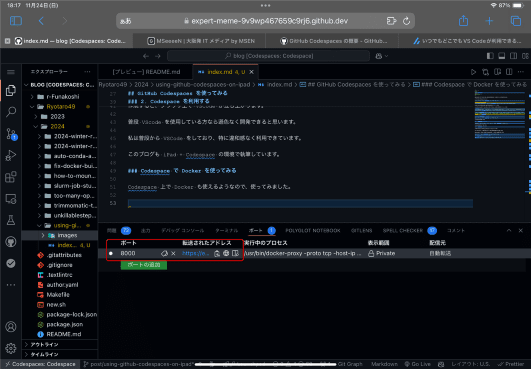

すると、自動でポートフォワーディングされ、リモートアクセス用の URL が生成されました！

無事、URL からアプリケーションが動いていることを確認できました👏

### iPad で使ってみた感想

特に大きな不満はなく使えました！

iPad では PC のように画面分割できるので、右側にアプリケーションを表示したり、調べものをしたりしながら作業していました。

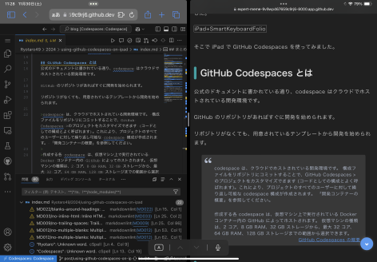

フォルダに画像をアップロードなども簡単にできます。

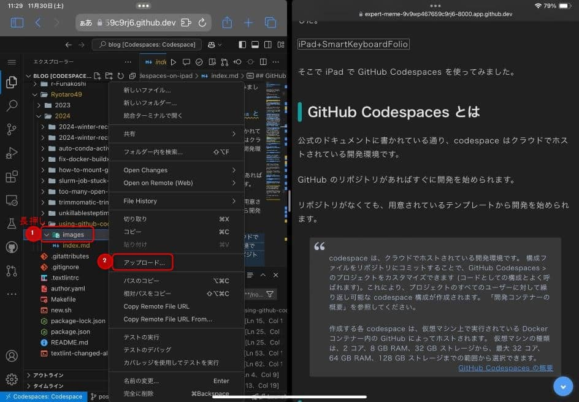

しかし、やはり画面が小さいのは難点です😅

外出先などでちょっとした作業をしたいときに使うのがよさそうです。

### Codespace とローカルの VSCode の設定を同期する

[アカウントの GitHub Codespaces をパーソナライズする](https://docs.github.com/ja/codespaces/setting-your-user-preferences/personalizing-github-codespaces-for-your-account) を参考に設定しました。

同期する手順を紹介します。

#### 1. ローカル側の VSCode で設定の同期をオンにする

ローカル側の VSCode で左下の設定から設定の同期をオンにします。

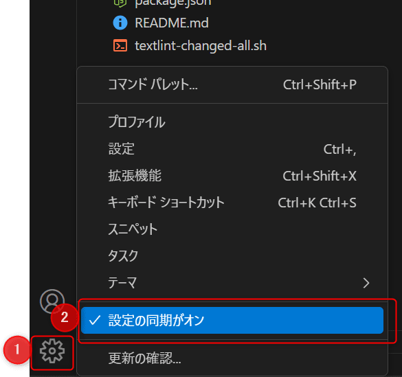

#### 2. GitHub で Settings Sync を有効にする

GitHub の設定のサイドバーから Codespaces をクリックします。

Settings Sync の Enable にチェックをいれます。

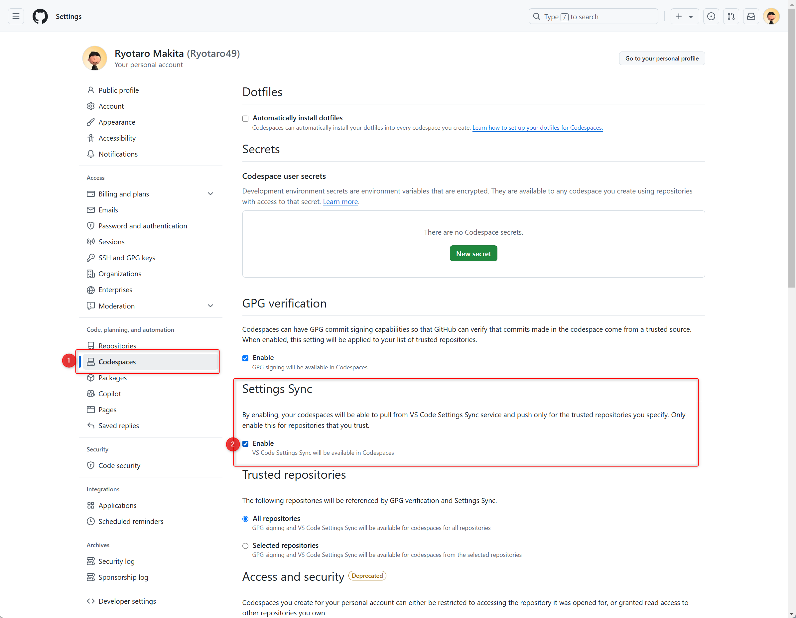

#### 3. Codespace で設定の同期をオンにする

ローカル側で設定の同期をオンにしたのと同じ手順で、Codespace 側でも設定の同期をオンにします。

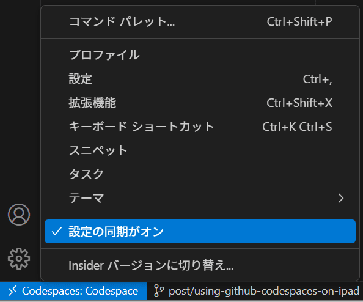

これで、ローカルで使っていた拡張機能などがそのまま使えるようになると思います！

## GitHub Codespaces と github.dev の違い

ちなみにコード修正や閲覧だけ行う場合は **github.dev** の方が良いと思います。

github.dev は無料で使えて、コード修正や閲覧だけ行うなら十分な機能を持っていると思っています。

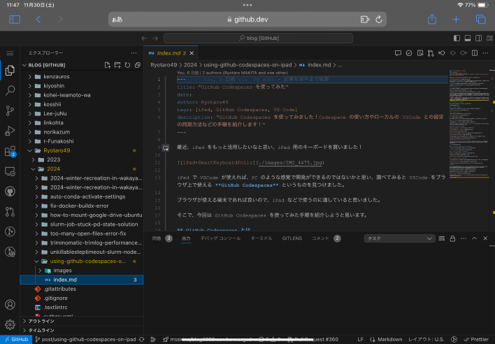

一番簡単な開き方は、**リポジトリの画面で `.` キーを押す**と開けます。

他の方法は [github.dev エディターを開く](https://docs.github.com/ja/codespaces/the-githubdev-web-based-editor#githubdev-%E3%82%A8%E3%83%87%E3%82%A3%E3%82%BF%E3%83%BC%E3%82%92%E9%96%8B%E3%81%8F) に記載されています。

GitHub Codespaces との大きな違いとして、github.dev はターミナルが使用できなかったり、拡張機能が Web で実行できるものに限られます。

**フル機能を使いたいなら GitHub Codespaces を使う**ということになるかと思います。

## あとがき

気になる料金についてですが、[GitHub Codespaces の請求について](https://docs.github.com/ja/billing/managing-billing-for-your-products/managing-billing-for-github-codespaces/about-billing-for-github-codespaces) に詳しく書かれていました。

私は 2コアで利用しているので、無料枠で60時間使えるみたいです。

サブとして利用するなら無料枠でも問題なさそうだと思いました！

ちなみに GitHub の 設定の [Plans and usage](https://github.com/settings/billing/summary) から利用状況を確認できます。

それではまた！