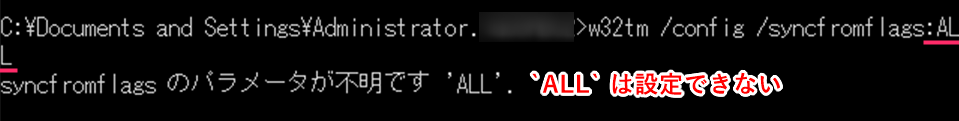
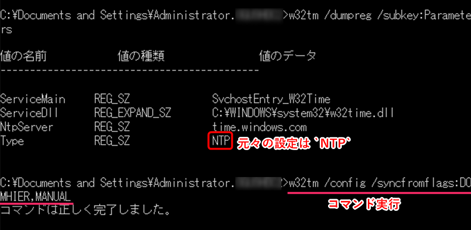
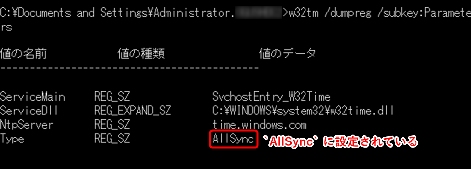

こんにちは、ひらたつです。

先日、Windows Server 2003 の NTP(Network Time Protocol) 設定を変更しましたが、最初はうまく設定できず苦労したので、備忘録として残しておきます。

Windows Server 2003 を使っておられる方は少ないかもしれませんが、何かの役に立てば幸いです。

## 【前置き】NTP の設定項目
NTP の設定項目には以下の2つがあります。
- `Type`：時刻同期を行う方法
- `NtpServer`：`Type` が NTP または AllSync の時に参照される NTP サーバー はどれか

それぞれ以下の設定が可能です。

#### Type

| &nbsp;&nbsp;&nbsp;&nbsp;&nbsp;値&nbsp;&nbsp;&nbsp;&nbsp;&nbsp; | 意味 |
| :---: | -- |
| NoSync | 同期を行わない |
| NTP | NtpServer レジストリ値（次の表参照）で指定したサーバーから同期を行う |
| NT5DS | ドメイン階層により決定されたサーバーから同期を行う |
| AllSync | ドメイン階層と外部NTPサーバーの両方から同期を行う |

#### NtpServer

| &nbsp;&nbsp;値&nbsp;&nbsp; | 意味 |
| :---: | -- |
| 0x1 | Symmetric Active モードで同期／Windows で実装した一定間隔での同期 |
| 0x2 | Symmetric Active モードで同期／フォールバック時に利用する NTP サーバー を指定 |
| 0x4 | Symmetric Active モードで同期／RFC 1305 に準拠した間隔での同期 |
| 0x8 | Client モードで同期／RFC 1305 に準拠した間隔での同期 |

※上記の 0x1 ～ 0x8 はそれぞれを組み合わせて使うこともできます。  
例：0x8 + 0x2 = 0xa。

## Windows Server 2003 では単純に AllSync を設定できない

Windows Server 2008 以降の OS では、`Type` エントリーの設定は以下のコマンドで行います。  
```
w32tm /config /syncfromflags:[Type]
```
もしくは、同時に `NtpServer` も設定する場合は以下のコマンドになります。  
```
w32tm /config /syncfromflags:[Type] /manualpeerlist:[NtpServer] /update
```

（より詳細な設定は[この記事](https://mseeeen.msen.jp/set-ntp-server-with-command-in-windows-server/)をご参照ください。）

この `Type` に以下を設定することで、任意の設定に変更可能です。

| &nbsp;&nbsp;Typeへの指定値&nbsp;&nbsp; | &nbsp;&nbsp;Typeへ設定される値&nbsp;&nbsp; |
| -- | -- |
| NO | NoSync |
| MANUAL | NTP |
| DOMHIER | NT5DS |
| ALL | AllSync |

しかし、Windows Server 2003 環境では `Type` に `ALL` を指定するとエラーとなってしまいます。



## Windows Server 2003 での AllSync 設定方法

`ALL` 以外の指定値があるのかと調べましたが、他の指定値は見つかりませんでした。

試しに以下のように2つを指定すると `AllSync` となることが分かりました。 
```
w32tm /config /syncfromflags:DOMHIER,MANUAL
```



AllSync は、ドメイン階層と外部 NTP サーバーの両方から同期を行うという設定ですので、それらを意味する、`DOMHIER`と`MANUAL`を設定すれば良いみたいでした。

Microsoftの公式サイトではないですが、以下でも同じ方法が紹介されていました。  
[Windowsで時刻同期が正常に出来てるか確認する方法。w32tmコマンド](https://blog.putise.com/windows%E3%81%A7%E6%99%82%E5%88%BB%E5%90%8C%E6%9C%9F%E3%81%8C%E6%AD%A3%E5%B8%B8%E3%81%AB%E5%87%BA%E6%9D%A5%E3%81%A6%E3%82%8B%E3%81%8B%E7%A2%BA%E8%AA%8D%E3%81%99%E3%82%8B%E6%96%B9%E6%B3%95%E3%80%82w32t/)

以上です。
