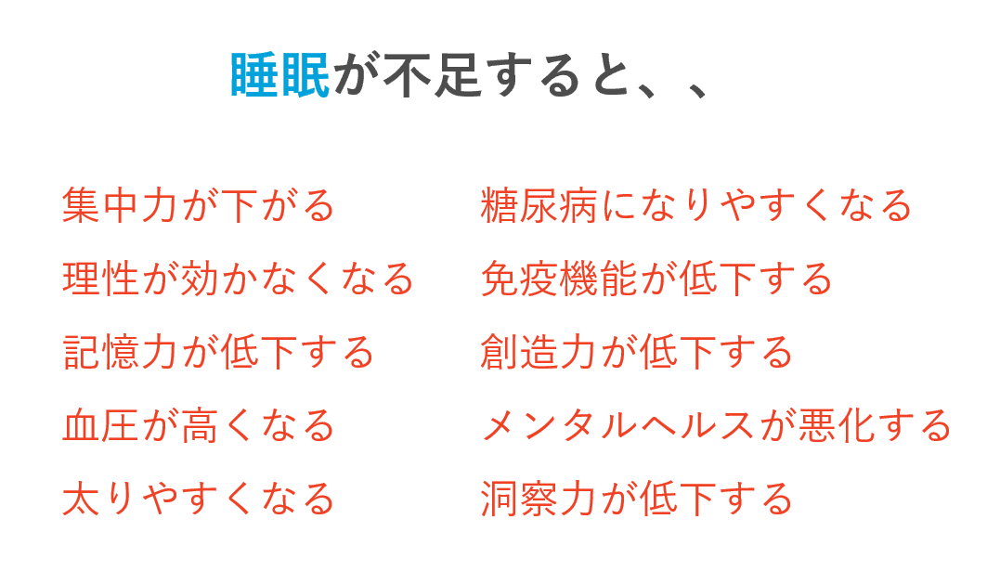
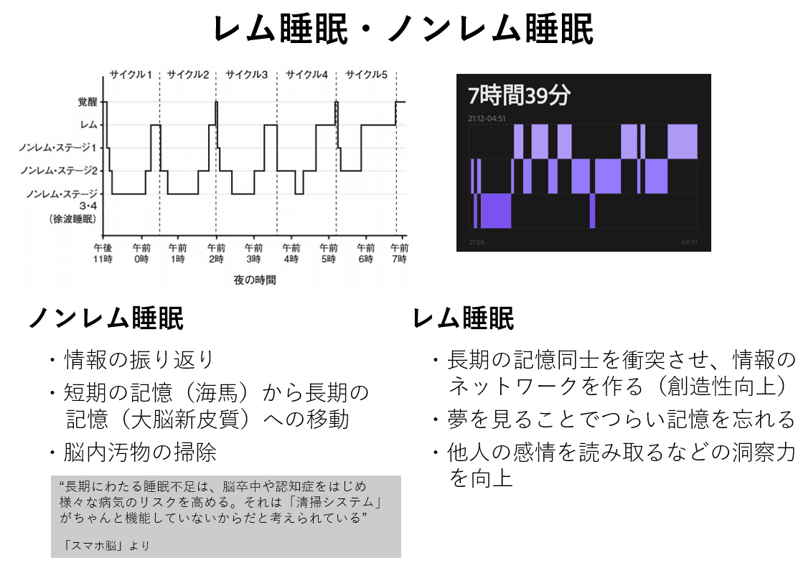

こんにちは、ひらたつです。

いつもは技術的な記事を書いていますが、たまには趣向を変えて健康に関しての記事を書いてみようと思います。

今回は**睡眠**についてです。

2年ほど前にいろいろなきっかけが重なり、健康に目覚めました。  
運動習慣、食習慣、睡眠習慣をがらっと見直しました。

睡眠習慣に関しては、21:30 に寝て、5:00 に起きる生活にしました。

この時間になったことに対して特に理由はなかったのですが、体に合っていたのか今でも平日も休日もこの睡眠リズムで過ごしています。

今回、ふと「なぜ睡眠が必要で、自分は良い睡眠がとれているのか」疑問に思ったため調べてみました。

夜遅くにパソコンやスマホを見ることは睡眠に悪いとなんとなく感じていても、どうしても見なければいけないこともあると思います。  
システムエンジニアの方々は仕事柄そうなってしまう傾向にあるような気がします。

睡眠について理解することで、何か対策できることがあるかもしれません。
本記事がご参考になれば幸いです。

本記事では以下の本を参考にしています。  
**[睡眠こそ最強の解決策である](https://www.amazon.co.jp/%E7%9D%A1%E7%9C%A0%E3%81%93%E3%81%9D%E6%9C%80%E5%BC%B7%E3%81%AE%E8%A7%A3%E6%B1%BA%E7%AD%96%E3%81%A7%E3%81%82%E3%82%8B-%E3%83%9E%E3%82%B7%E3%83%A5%E3%83%BC%E3%83%BB%E3%82%A6%E3%82%A9%E3%83%BC%E3%82%AB%E3%83%BC/dp/4797395842)**

## 睡眠不足の怖さ

### 睡眠不足の症状

まず怖い話からですが、睡眠が不足することで以下の状態になってしまうそうです。
- 集中力低下
- 記憶力低下
- 想像力が低下する
- 洞察力が低下する
- 血圧上昇
- 太りやすくなる
- 理性が効かなくなる
- 免疫機能が低下する
- メンタルヘルスが悪化する

私も数年前に生活を見直す前はいくつか当てはまるものがあったように思います。

睡眠は6時間未満でほぼ毎日お酒も飲んでいる時期がありました。  
その時は、集中力と想像力は確実に低下していました。  
課題に対する解決策を考える集中力がなく、また課題に対して解決策を思い付く想像力もありませんでした。

今思えば慢性的な睡眠不足だったと思います。

### 経済への影響

上記のような症状になることで、経済にも影響があります。

なんと、**平均8時間眠る人に比べて、睡眠時間が7時間に満たない人による経済的損失は GDP 比で約 2% にもなる**とのことです。  

国の防衛費と同程度の損失があります。

また、さまざまな方を集めて、単純作業から複雑なタスク（問題解決能力・想像力が徐々に必要になる）を被験者に選ばせる実験が行われました。  
被験者はどのタスクに取り組むかは自由に選べます。

驚くべきことに、タスクは自由に選べるにもかかわらず、**一番簡単なタスクを選ぶのは決まって睡眠不足の被験者**でした。

それに加えて恐ろしいのは、**寝不足の被験者は自分が簡単な仕事を選んでいることも、仕事の効率が落ちていることも自覚していなかった**、らしいのです。

上述しましたが私も数年前はこのような状況だったと思います。  
そして今思えば睡眠不足の症状が出ていたなと思いますが、当時は出勤時間には間に合っていますし、特に寝坊することもなかったので自覚がありませんでした。

**睡眠不足は自覚しにくい**ため、定期的に自分の生活を見直す機会を設けることが大切だと思います。

## なぜ眠くなるのか

睡眠不足の怖さが分かったところで、眠気のメカニズムを整理しようと思います。

眠気は2つのシステムの相互作用によって発生します。

1つは、**概日リズム**、もう1つは**睡眠圧**です。  
これらは別々に駆動するシステムです。

### 概日リズム

概日リズムは、**睡眠・食事、 血圧、 体温、 心拍数などのリズムを調整**します。

この概日リズムは体内時計と運動・睡眠・食事リズムによって調整されます。  

ヒトの体内時計は約25時間であり、何もしないと1日24時間のリズムからずれてしまいます。  
そこでよく言われるように、**光を浴びることで体内時計を調整**します。

体内時計は光に敏感です。  
夜に人工光を浴びると**体内時計は 2,3 時間遅れてしまう**そうです。  
よくデジタル機器を寝室に持ち込むなと言われますが、このような理由からでした。

ここでも私の話ですが、昔生活リズムが悪い時は以下のようになっていたと思います。

夜遅くにテレビ、スマホを見る。  
体内時計が 2,3 時間遅れ、寝つきが悪くなり、睡眠不足になる。  
日中の生産性が下がる。
日中に何もできていないような気がして、夜に焦ってしまって夜更かしをしてしまう（リベンジ夜更かし）。  
また睡眠不足になる。  
以下繰り返し、、、。

当時、自分は夜型だと思っていました。  
でもそれは上記のような生活リズムになっていたからかもしれません。  

自分は夜型だと思っている方もおられるかもしれませんが、上記のような悪循環になっていて夜更かしをしているだけかもしれません。  
一度思い切って、21:00 に寝る生活を1週間続けるなど試してみてはいかがでしょうか。

※後述していますが、朝型・夜型は遺伝子レベルで決まっていますので、無理はされず1,2週間試す程度で実験してみてください。

### 睡眠圧

概日リズムとは別のシステムとして、睡眠圧があります。  
これは**アデノシン**という物質が、脳内にある受容体（アデノシン受容体）と結合することで発生する現象です。

アデノシンは、**覚醒中枢の抑制し、睡眠中枢の活性化させる**物質であり、眠ることで減少します。  
起きている間にアデノシンは脳内にどんどん蓄積するため、起きている時間が長くなればなるほど眠気も大きくなります。

#### カフェイン

眠くなったらカフェインを摂取すると思いますが、カフェインの眠気覚ましの効果はアデノシンと関係があります。

カフェインは脳にあるアデノシン受容体を占領します。  
占領されることでアデノシンが受容体に結合できなくなるので、脳は眠気を感じなくなります。

これがカフェインの眠気覚ましのしくみです。

カフェインを摂取してからしばらくして一気に眠くなるので、カフェインがなくなることでアデノシンが一斉に受容体と結合するためです。  
このカフェインがなくなる期間の目安として半減期があり、カフェインの半減期は5-7時間だそうです。  
つまり、19:30 にコーヒーを飲むと、1:30 まで残り、睡眠圧が抑制されてしまいます。

カフェインを摂取するタイミングは非常に重要だと言えます。

いったんここで整理しますと、概日リズムと睡眠圧の2つのシステムによって眠気は発生します。  
そして**これらのシステムは別々に駆動**します。

従って、自分が寝たい時間に最大の眠気が来るように**これらのシステムを意識して生活することが大切**です。

たとえば、朝日を浴びてリズムを整える、平日も休日も同じリズムで生活する、15時以降はカフェインを摂取しない、などです。

## 良い睡眠のためにできること

眠気のメカニズムが分かったところでよい睡眠をとるためにできることについて整理します。

**理想の睡眠時間**と**健やかな眠りのための12のアドバイス**の2つがあります。

### 理想の睡眠時間

理想の睡眠時間は、**最低でも8時間**です。  
以下の理由からです。

- 認知力など脳の機能を維持できるのは16時間だから
- 睡眠負債がたまるから（睡眠負債＝アデノシン）

認知力に関して、**７時間以下の睡眠が10日続くと、脳の働きは24時間起きていたときと同じレベルにまで低下**してしまいます。  
また、睡眠不足が続くとアデノシンがたまり続け、慢性的な疲労状態になってしまいます。

そして、この**慢性的な睡眠不足状態は自分では自覚しにくい**ため自分のパフォーマンスが低下していることに気付けません。

### 健やかな眠りのための12のアドバイス

「睡眠こそ最強の解決策である」の巻末に記載されていたアドバイスを以下に記載します。

著者は、以下の内どれか1つだけ実行するとすれば、**1つ目の「いつも同じ時間に寝て、同じ時間に起きる」をぜひ実行してほしい**とコメントされています。  
私も平日も休日も同じリズムで生活していますが、これを実行するだけで日中の活力が大幅に向上したと感じました。

##### 1.いつも同じ時間に寝て、同じ時間に起きる  
人間は習慣の生き物。週末に寝だめしても、平日の睡眠不足の埋め合わせにはならない。
##### 2.夜寝る前に運動してはいけない  
運動（最低でも 30分）は健康によいが、寝る 2,3時間前に終わらせること。
##### 3.カフェインとニコチンを摂取しない  
コーヒー、コーラ、お茶の一部、チョコレートにはカフェインが含まれている。アデノシンを阻害して寝つきを悪くする。  
##### 4.寝る前にアルコールを摂取しない  
脳内の受容体と結合し、ニューロンの発火を抑える働きをする。レム睡眠が失われ、眠りも浅くなる。睡眠中の呼吸も奪われる。
##### 5.夜の遅い時間に大量の飲食をしない  
消化不良を起こし睡眠の妨げになる。夜中にトイレに行きたくなる。
##### 6.可能なら、睡眠を妨げるような薬を飲まない  
心臓病、高血圧、喘息の一般的な処方箋、咳止めの漢方薬、風邪薬、アレルギー薬には、睡眠を妨げる成分が入っていることもある。医師か薬剤師に相談しよう。
##### 7.午後3時を過ぎたら昼寝をしない  
昼寝は失われた睡眠を取り戻すよい方法だが、午後の遅い時間に寝てしまうと夜に眠れなくなる。
##### 8.寝る前にリラックスする  
寝る直前までスケジュールを詰めすぎないこと。リラックスすることで入眠がスムーズになる。
##### 9.寝る前にお風呂につかる  
お風呂から出たときに中核温が下がり、自然な眠気が訪れる助けになる。  
##### 10.寝室を暗くする、寝室を涼しくする、寝室にデジタル機器を持ち込まない  
室温は少し寒いくらい（理想は18.3度）の方がよく眠れる。テレビ、スマートフォン、パソコンも睡眠の邪魔になる。
##### 11.日中に太陽の光を浴びる  
最低でも 30分は外に出て日光を浴びる。もし可能なら太陽の光で目覚めるようにする。人口の光でもよい。
##### 12.眠れないままずっと布団の中にいない  
眠れないという不安のせいで、ますます眠れなくなる。 20分以上寝付けなかったら、布団から出て、眠くなるまでリラックスできる活動をする。

## 【コラム】ノンレム睡眠・レム睡眠

睡眠に**ノンレム睡眠**、**レム睡眠**があることは有名な話だと思いますが、それぞれの睡眠にどのような役割があるのかはあまり知られていないのではないかと思います。  
以下にそれぞれの役割を整理していますが、どちらもきちんとした役割があることが分かります。

また、睡眠のパターンとして、眠り始めはノンレム睡眠の割合が多くなり、朝方にかけてレム睡眠が多くなります。  

ベッドでの睡眠時間が短くなってしまうために通勤の移動で仮眠したり、昼寝をして睡眠時間を確保することもあると思いますが、その場合はレム睡眠が短くなってしまいます。  

レム睡眠が短くなることで、創造性が低下したり、メンタルヘルスが悪化することもあるので、できるだけベッドで睡眠時間を確保することが重要だと思います。

### ノンレム睡眠

- 情報の振り返り
- 短期の記憶（海馬）から長期の記憶（大脳新皮質）への移動
- 脳内汚物の掃除

> 長期にわたる睡眠不足は、脳卒中や認知症をはじめ様々な病気のリスクを高める。それは「清掃システム」がちゃんと機能していないからだと考えられている
>
>  「スマホ脳」より引用

### レム睡眠

- 長期の記憶どうしを衝突させ、情報のネットワークを作る（創造性向上）
- 夢を見ることでつらい記憶を忘れる
- 他人の感情を読み取るなどの洞察力を向上

## 【コラム】朝型・夜型

> 朝型と夜型の分類は、「クロノタイプ」とも呼ばれている。大人の場合、クロノタイプはほぼ遺伝で決まることが多い。

とのことで、朝型と夜型は遺伝子レベルで決まっているみたいです。

なぜかというと、人間が狩猟採集民だったころに、全員で8時間眠っていると外敵に襲われてしまいます。  
そこで、21:00 - 5:00 で眠る人と 1:00 - 9:00 まで寝る人に分けることで外敵に襲われやすい時間を4時間に減らしていたみたいです。  
このことで生存率を 50% 上昇させることができます。

このような背景から、朝型の遺伝子を引き継ぐ人は朝型に、夜型の遺伝子を引き継ぐ人は夜型になってしまいます。

以上、ご参考になれば幸いです。

ではまた。
