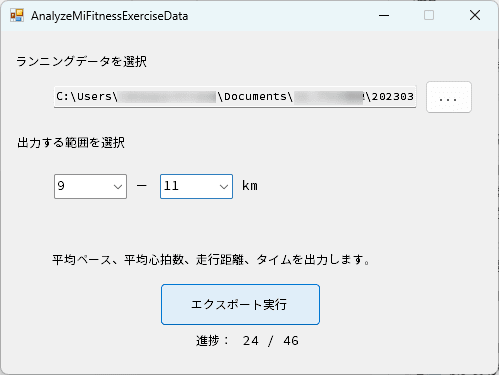

こんにちは、ひらたつです。

[Mi Fitness のワークアウトデータを分析する方法 (データ抽出編)](https://mseeeen.msen.jp/analyze-exercise-data-of-mi-fitness)
の続きになります。

上記の記事では、Mi Fitness に保存されているデータをダウンロードしました。

今回はダウンロードしたデータを分析しようと思います。

**任意のランニング距離の範囲に該当するデータに対して、平均ペースのデータを日付ごとに並べること**が目標です。

そのデータを見ることで、トレーニングによる走力への影響を確認しようと思います。

## 作成したもの


このようなものを作成しました。

- 入力データ：前回の記事でダウンロードした `<ダウンロード日>_<アカウントID>_MiFitness_hlth_center_sport_record.csv`
- 出力データ：ランニング毎の、ランニング実施日時・平均心拍数・走行距離・所要時間・平均ペースが記載された Excel ファイル

最上段で分析するファイルを選択します。

次に出力するランニング距離の範囲を選択します。  
ここでは 0.5km 刻みで選択できるようにしています。

最後に「エクスポート実行」ボタンで、選択したランニングデータの中から、指定したランニング距離の範囲のデータを Excel に出力します。



## 出力されるデータ

出力例は以下です。


以下のデータを出力します。
- ランニングを実施した日時 (「日にち+時間」と「日にちのみ」の2通り)
- 平均心拍数 [bpm]
- 走行距離 [m]
- 所要時間 [s]
- 平均ペース（[min] と [min:s] の2通り）

## データ分析

私のランニングデータの分析結果の1つ目が以下です。

※ランニング距離ごとに出力したデータを別途 Excel で1つのグラフにまとめています。


2021年4月からランニングを始めています。

初めのころは距離も短く、タイムも遅いのが分かります。

半年、1年くらい経過したころから次第に距離を伸ばし始め、タイムも縮んできています。

成長を感じます。

2022年5月以降に 0 - 5 km の距離でも遅いタイムなのはアップでゆっくり走っている & 初めの 1km は衛星測位システムの都合かタイムが遅く出やすい、ためだと思われます。

次に、9 - 12 km に注目したデータが以下です。

トレーニングの結果やさぼった結果が如実に出ています。

現在のトレーニング効果が見えてくるのは4月以降くらいでしょうか？


## 分析に使ったプログラムの説明

以下では今回作成したプログラムデータの内容を紹介したいと思います。

ソースコード全文は以下のリポジトリに公開しています。

https://github.com/hiratatsu04/analyze-mi-fitness.git

### 1. CSV から JSON 部分を取り出し、Dictionary に格納

以下の流れで CSV データを List に格納しています。

1. CSV データをカンマで区切る
2. 区切ったデータから運動データの詳細 (JSON 形式) を抜き出す
3. JSON データを Dictionary 型に変換
4. Dictionary 型データを List に格納する

#### 1-1. CSV データをカンマで区切る

始めは、CSV データを一行読み込み、カンマで区切って配列への格納を試みました。

しかし、データの1つに JSON 形式のデータがあり、そこのカンマにも反応してしまいました。

そこで以下を参考にさせていただき、データを抜き出すようにしています。

**[〔C#〕CSVのデータ内にカンマがあっても、カンマ区切りでデータを取得する - ぺやろぐ](https://www.peyarogu.com/entry/2016/05/08/182252)**

```cs{numberLines:1}{8-20}:title=JSONのカンマを無視して、CSVデータをカンマで区切る
// ファイル名と文字エンコードを指定してパーサを実体化
using (TextFieldParser txtParser =
    new TextFieldParser(
            filePass,
            Encoding.GetEncoding("utf-8")))
{
    // 内容は区切り文字形式
    txtParser.TextFieldType = FieldType.Delimited;

    // デリミタはカンマ
    txtParser.SetDelimiters(",");

    // ファイルの終わりまで一行ずつ処理
    while (!txtParser.EndOfData)
    {
        // 一行を読み込んで配列に結果を受け取る
        string[] splittedResult = txtParser.ReadFields();

        ...
    }

    // エクセルに出力
    ExcelOutput(data);
}
```

#### 1-2. 区切ったデータから運動データの詳細 (JSON 形式) を抜き出す

1-1の作業でカンマで区切られたデータが `splittedResult` に格納されています。

`splittedResult` は2次元配列となっており、各要素の3列目にトレーニング種類、6列目にトレーニングの詳細データが格納されています。

11行目でランニングデータ (`splittedResult[2] == "outdoor_running`) のみを選択し、14行目の `splittedResult[5]` でトレーニングの詳細データを抜き出しています。

```cs{numberLines:1}{11-16}:title=区切ったデータから運動データの詳細(JSON形式)を抜き出す
...
{
    ...
    // ファイルの終わりまで一行ずつ処理
    while (!txtParser.EndOfData)
    {
        // 一行を読み込んで配列に結果を受け取る
        string[] splittedResult = txtParser.ReadFields();
  
        // ランニングデータのみ取得する
        if (splittedResult[2] == "outdoor_running")
        {
            // splittedResult[5] の json 型データを Dictionary 型に変換
            Dictionary<string, dynamic> dic = ParseJson(splittedResult[5]);
            ...
        }
    }
}
...
```

#### 1-3. JSON データを Dictionary 型に変換

`ParseJson()` 関数で JSON 形式のデータを `Dictionary<string, dynamic>` 型に変換しています。

JSON データを Dictionary 型に変換する部分は以下を参考にさせていただいています。

**[\[C#\] JSON文字列をDictionaryに変換する](https://yaspage.com/cs-json-to-dictionary/)**

```cs{numberLines:1}{8,16-35}:title=JSONデータをDictionary型に変換
...
{
    ...
    {
        ...
        {
            // splittedResult[5] の json 型データを Dictionary 型に変換
            Dictionary<string, dynamic> dic = ParseJson(splittedResult[5]);
            ...
        }
    }
...
}
  
// JSON文字列をDictionary<string, dynamic>型に変換するメソッド
public static Dictionary<string, dynamic> ParseJson(string json)
{
    // JSON文字列をDictionary<string, JsonData>型に変換
    Dictionary<string, JsonElement> dic = JsonSerializer.Deserialize<Dictionary<string, JsonElement>>(json);
  
    // JsonElementから値を取り出してdynamic型に入れてDictionary<string, dynamic>型で返す
    return dic.ToDictionary(d => d.Key, d => JsonData(d.Value));
}
  
private static dynamic JsonData(JsonElement elem)
{
    switch (elem.ValueKind)
    {
        case JsonValueKind.String:
            return elem.GetString();
        case JsonValueKind.Number:
            return elem.GetDecimal();
    }
    return elem;
}
```

#### 1-4. Dictionary 型データを List に格納する

2行目で Dictionary 型のリスト `data` を作成します。

14行目で、[フォームで入力された距離]と[作業1-3で作成したデータの距離]を比較し、特定の要素のみを `data` に追加します。

```cs{numberLines:1}{2,14-17}:title=Dictionary型データをListに格納する
// json 形式のデータを格納する変数を用意
List<Dictionary<string, dynamic>> data = new List<Dictionary<string, dynamic>>();
...
{
    ...
    {
        // ランニングデータのみ取得する
        if (splittedResult[2] == "outdoor_running")
        {
            // splittedResult[5] の json 型データを Dictionary 型に変換
            Dictionary<string, dynamic> dic = ParseJson(splittedResult[5]);

            // 指定の範囲のデータのみ取り出し、data に格納
            if (dic["distance"] > Decimal.Parse(MinDistanceRangeComboBox.SelectedItem.ToString()) * 1000 && dic["distance"] < Decimal.Parse(MaxDistanceRangeComboBox.Text.ToString()) * 1000)
            {
                data.Add(dic);
            }
        }
    }

    // エクセルに出力
    ExcelOutput(data);
}
```

### 2. Excel に出力

Excel への出力は `ExcelOutput` 関数にまとめています。

出力方法は以下を参考にさせていただいています。

**[備忘録：C#からエクセルファイルを出力する - Qiita](https://qiita.com/hakuaneko/items/332cf7dd9fcd70ccc052)**

引数として、Dictionary 型データを格納した List を指定しています。

ハイライト部分でデータを Excel の各セルに格納しています。

データが Dictionary 型ですので、`key` を指定してデータを抜き出しています。

日付データは扱いやすいように、`dateTime.Date` で日付のみを抜き出しています。

また、ペースは `distance` と `duration` から計算しています。

```cs{numberLines:1}{33-87}:title=ExcelOutput関数
private void ExcelOutput(List<Dictionary<string, dynamic>> data)
{
    //Excelオブジェクトの初期化
    Excel.Application excelApp = null;
    Excel.Workbooks wbs = null;
    Excel.Workbook wb = null;
    Excel.Sheets shs = null;
    Excel.Worksheet ws = null;

    try
    {
        //Excelシートのインスタンスを作る
        excelApp = new Excel.Application();
        wbs = excelApp.Workbooks;
        wb = wbs.Add();

        shs = wb.Sheets;
        ws = shs[1];
        ws.Select(Type.Missing);

        excelApp.Visible = false;

        // タイトル行をセット
        // Excelのcell指定
        ws.Cells[1, 1] = "ランニング日時";
        ws.Cells[1, 2] = "ランニング日";
        ws.Cells[1, 3] = "平均心拍数";
        ws.Cells[1, 4] = "走行距離 [m]";
        ws.Cells[1, 5] = "所要時間 [s]";
        ws.Cells[1, 6] = "平均ペース [min]";
        ws.Cells[1, 7] = "平均ペース [min:s]";

        // エクセルファイルにデータをセットする
        for (int i = 1; i < data.Count; i++)
        {
            ProgressLabel.Text = $"{i} / {data.Count - 1}";

            for (int j = 1; j < 8; j++)
            {
                // Excelのcell指定
                Excel.Range range = ws.Cells[i + 1, j];

                try
                {
                    DateTimeOffset dateTime = DateTimeOffset.FromUnixTimeSeconds(decimal.ToInt64(data[i - 1]["time"])).ToLocalTime();
                    
                    Decimal distanceKm = data[i - 1]["distance"] / 1000;
                    Decimal durationMin = data[i - 1]["duration"] / 60;
                    Decimal pace = durationMin / distanceKm;

                    int paceMinKm = decimal.ToInt32(data[i - 1]["duration"] / distanceKm) / 60;
                    int paceSecKm = decimal.ToInt32(data[i - 1]["duration"] / distanceKm) % 60;

                    // Excelにデータをセット
                    switch (j)
                    {
                        case 1:
                            range.Value2 = dateTime.ToString();
                            break;
                        case 2:
                            range.Value2 = dateTime.Date.ToString();
                            break;
                        case 3:
                            range.Value2 = data[i - 1]["avg_hrm"];
                            break;
                        case 4:
                            range.Value2 = data[i - 1]["distance"];
                            break;
                        case 5:
                            range.Value2 = data[i - 1]["duration"];
                            break;
                        case 6:
                            range.Value2 = pace.ToString("0.00");
                            break;
                        case 7:
                            range.Value2 = $"0:{paceMinKm}:{paceSecKm}";
                            break;
                    }
                }
                finally
                {
                    // Excelのオブジェクトはループごとに開放する
                    Marshal.ReleaseComObject(range);
                    range = null;
                }
            }
        }
    }
...
}
```

## 最後に

2回にわたって Mi Fitness のデータを分析する方法を紹介しました。

Mi Fitness を使ってランニングをしている方のご参考になれば幸いです。
