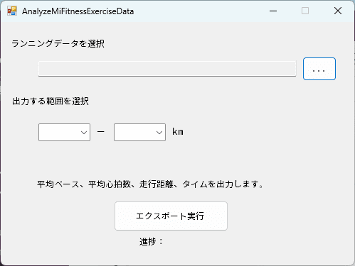
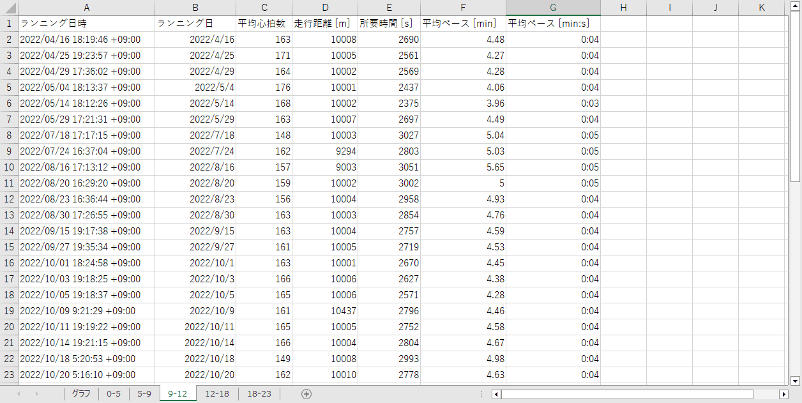
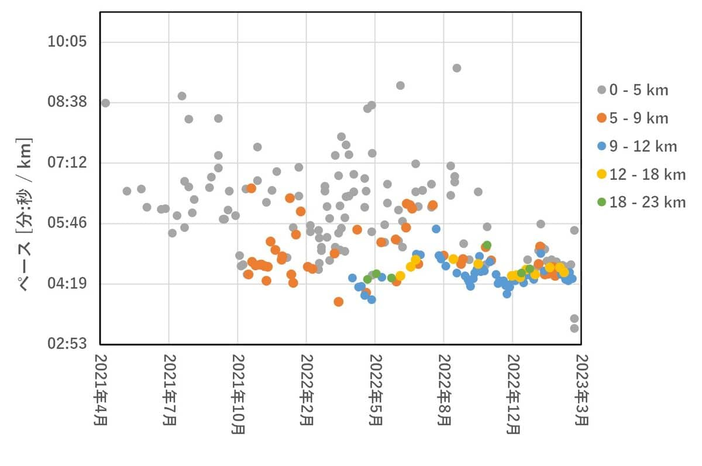
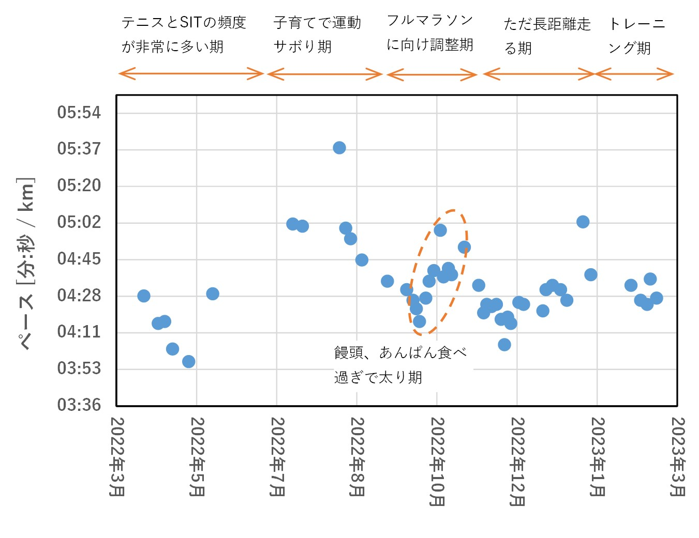

こんにちは、ひらたつです。

[Mi Fitness のワークアウトデータを分析する方法 (データ抽出編)](https://mseeeen.msen.jp/analyze-exercise-data-of-mi-fitness)
の続きになります。

上記の記事では、Mi Fitness に保存されているデータをダウンロードしました。

今回はダウンロードしたデータを分析しようと思います。

**任意のランニング距離の範囲に該当するデータに対して、平均ペースのデータを日付ごとに並べること**が目標です。

そのデータを見ることで、トレーニングによる走力への影響を確認しようと思います。

## 作成したもの



このようなものを作成しました。

- 入力データ：前回の記事でダウンロードした `<ダウンロード日>_<アカウントID>_MiFitness_hlth_center_sport_record.csv`
- 出力データ：ランニング毎の、ランニング実施日時・平均心拍数・走行距離・所要時間・平均ペースが記載された Excel ファイル

最上段で分析するファイルを選択します。

次に出力するランニング距離の範囲を選択します。  
ここでは 0.5km 刻みで選択できるようにしています。

最後に「エクスポート実行」ボタンで、選択したランニングデータの中から、指定したランニング距離の範囲のデータを Excel に出力します。

## 出力されるデータ

出力例は以下です。



以下のデータを出力します。
- ランニングを実施した日時 (2通り (日時 と 日にち))
- 平均心拍数 [bpm]
- 走行距離 [m]
- 所要時間 [s]
- 平均ペース（2通り ([min] と [min:s])）

## データ分析

私のランニングデータの分析結果の1つ目が以下です。

※ランニング距離ごとに出力したデータを1つのグラフにまとめています。



2021年4月からランニングを始めています。

初めのころは距離も短く、タイムも遅いのが分かります。

半年、1年くらいたったころから次第に距離を伸ばし始め、タイムも縮んできています。

成長を感じます。

2022年5月以降に 0 - 5 km の距離でも遅いタイムなのは、アップでゆっくり走っている & 初めの 1km は衛星測位システムの都合かタイムが遅く出やすい、ためだと思われます。

次に、9 - 12 km に注目したデータが以下です。

トレーニングの結果やさぼった結果が如実に出ています。

現在のトレーニング効果が見えてくるのは4月以降くらいでしょうか？



## 分析内容

以下では今回作成したプログラムデータの内容を紹介したいと思います。

### 全文

```c#
using System;
using System.Collections.Generic;
using System.Data;
using System.Linq;
using System.Text;
using System.Windows.Forms;
using System.IO;
using Microsoft.VisualBasic.FileIO;
using System.Text.Json;
using Excel = Microsoft.Office.Interop.Excel;
using System.Runtime.InteropServices;

namespace analyze_mi_fitness
{
    public partial class Form1 : Form
    {
        // ファイルパスを格納する
        string filePass = String.Empty;

        public Form1()
        {
            InitializeComponent();
        }

        private void SelectFileButton_Click(object sender, EventArgs e)
        {
            OpenFileDialog ofDialog = new OpenFileDialog();

            // デフォルトのフォルダを指定する
            ofDialog.InitialDirectory = @"C:";

            //ダイアログのタイトルを指定する
            ofDialog.Title = "開くファイルを選択ください";

            //ダイアログを表示する
            if (ofDialog.ShowDialog() == DialogResult.OK)
            {
                FilePassTextBox.Text = ofDialog.FileName;
                filePass = ofDialog.FileName;
            }
            else
            {
                Console.WriteLine("キャンセルされました");
            }

            // オブジェクトを破棄する
            ofDialog.Dispose();
        }

        private void ExportButton_Click(object sender, EventArgs e)
        {
            //指定したcsvを開く
            StreamReader sr = new StreamReader(@filePass);

            // json 形式のデータを格納する変数を用意
            List<Dictionary<string, dynamic>> data = new List<Dictionary<string, dynamic>>();

            // ファイル名と文字エンコードを指定してパーサを実体化
            using (TextFieldParser txtParser =
                new TextFieldParser(
                        filePass,
                        Encoding.GetEncoding("utf-8")))
            {
                // 内容は区切り文字形式
                txtParser.TextFieldType = FieldType.Delimited;
                // デリミタはカンマ
                txtParser.SetDelimiters(",");

                // ファイルの終わりまで一行ずつ処理
                while (!txtParser.EndOfData)
                {
                    // 一行を読み込んで配列に結果を受け取る
                    string[] splittedResult = txtParser.ReadFields();

                    // ランニングデータのみ取得する
                    if (splittedResult[2] == "outdoor_running")
                    {
                        // splittedResult[5] の json 型データを Dictionaly 型に変換
                        var dic = ParseJson(splittedResult[5]);

                        // 指定の範囲のデータのみ取り出し、data に格納
                        if (dic["distance"] > Decimal.Parse(MinDistanceRangeComboBox.SelectedItem.ToString()) * 1000 && dic["distance"] < Decimal.Parse(MaxDistanceRangeComboBox.Text.ToString()) * 1000)
                        {
                            data.Add(dic);
                        }
                    }
                }
            }

            // エクセルに出力
            ExcelOutPutEx(data);
        }

        // JSON文字列をDictionary<string, dynamic>型に変換するメソッド
        public static Dictionary<string, dynamic> ParseJson(string json)
        {
            // JSON文字列をDictionary<string, JsonData>型に変換
            var dic = JsonSerializer.Deserialize<Dictionary<string, JsonElement>>(json);

            // JsonElementから値を取り出してdynamic型に入れてDictionary<string, dynamic>型で返す
            return dic.Select(d => new { key = d.Key, value = JsonData(d.Value) })
            .ToDictionary(a => a.key, a => a.value);
        }
        
        private static dynamic JsonData(JsonElement elem)
        {
            switch (elem.ValueKind)
            {
                case JsonValueKind.String:
                    return elem.GetString();
                case JsonValueKind.Number:
                    return elem.GetDecimal();
            }

            return elem;
        }

        private void ExcelOutPutEx(List<Dictionary<string, dynamic>> data)
        {
            //Excelオブジェクトの初期化
            Excel.Application ExcelApp = null;
            Excel.Workbooks wbs = null;
            Excel.Workbook wb = null;
            Excel.Sheets shs = null;
            Excel.Worksheet ws = null;

            try
            {
                //Excelシートのインスタンスを作る
                ExcelApp = new Excel.Application();
                wbs = ExcelApp.Workbooks;
                wb = wbs.Add();

                shs = wb.Sheets;
                ws = shs[1];
                ws.Select(Type.Missing);

                ExcelApp.Visible = false;

                // タイトル行をセット
                // Excelのcell指定
                ws.Cells[1, 1] = "ランニング日時";
                ws.Cells[1, 2] = "ランニング日";
                ws.Cells[1, 3] = "平均心拍数";
                ws.Cells[1, 4] = "走行距離 [m]";
                ws.Cells[1, 5] = "所要時間 [s]";
                ws.Cells[1, 6] = "平均ペース [min]";
                ws.Cells[1, 7] = "平均ペース [min:s]";

                // エクセルファイルにデータをセットする
                for (int i = 1; i < data.Count; i++)
                {
                    ProgressLabel.Text = $"{i} / {data.Count - 1}";

                    for (int j = 1; j < 8; j++)
                    {
                        // Excelのcell指定
                        Excel.Range rgn = ws.Cells[i + 1, j];

                        try
                        {
                            var dateTime = DateTimeOffset.FromUnixTimeSeconds(decimal.ToInt64(data[i - 1]["time"])).ToLocalTime();
                            
                            Decimal distance_km = data[i - 1]["distance"] / 1000;
                            Decimal duration_min = data[i - 1]["duration"] / 60;
                            Decimal pace = duration_min / distance_km;

                            int pace_min_km = decimal.ToInt32(data[i - 1]["duration"] / distance_km) / 60;
                            int pace_s_km = decimal.ToInt32(data[i - 1]["duration"] / distance_km) % 60;

                            // Excelにデータをセット
                            switch (j)
                            {
                                case 1:
                                    rgn.Value2 = dateTime.ToString();
                                    break;
                                case 2:
                                    rgn.Value2 = dateTime.Date.ToString();
                                    break;
                                case 3:
                                    rgn.Value2 = data[i - 1]["avg_hrm"];
                                    break;
                                case 4:
                                    rgn.Value2 = data[i - 1]["distance"];
                                    break;
                                case 5:
                                    rgn.Value2 = data[i - 1]["duration"];
                                    break;
                                case 6:
                                    rgn.Value2 = pace.ToString("0.00");
                                    break;
                                case 7:
                                    rgn.Value2 = $"0:{pace_min_km}:{pace_s_km}";
                                    break;
                            }
                        }
                        finally
                        {
                            // Excelのオブジェクトはループごとに開放する
                            Marshal.ReleaseComObject(rgn);
                            rgn = null;
                        }
                    }
                }

                // SaveFileDialogを表示
                SaveFileDialog saveFileDialog = new SaveFileDialog();

                //ダイアログのタイトルを指定する
                saveFileDialog.Title = "ファイルを保存する";
                // デフォルトのフォルダを指定する
                saveFileDialog.InitialDirectory = @"C:";

                // デフォルトファイル名
                saveFileDialog.FileName = @"output.xlsx";

                //ダイアログを表示する
                if (saveFileDialog.ShowDialog() == DialogResult.OK)
                {
                    wb.SaveAs(saveFileDialog.FileName);
                    wb.Close(false);
                    ExcelApp.Quit();
                }
                else
                {
                    Console.WriteLine("キャンセルされました");
                }

                // オブジェクトを破棄する
                saveFileDialog.Dispose();

                ProgressLabel.Text = "出力完了";
            }
            finally
            {
                //Excelのオブジェクトを開放し忘れているとプロセスが落ちないため注意
                Marshal.ReleaseComObject(ws);
                Marshal.ReleaseComObject(shs);
                Marshal.ReleaseComObject(wb);
                Marshal.ReleaseComObject(wbs);
                Marshal.ReleaseComObject(ExcelApp);
                ws = null;
                shs = null;
                wb = null;
                wbs = null;
                ExcelApp = null;

                GC.Collect();
            }
        }
    }
}
```

### ファイル読み込み

```c#
private void SelectFileButton_Click(object sender, EventArgs e)
{
    OpenFileDialog ofDialog = new OpenFileDialog();

    // デフォルトのフォルダを指定する
    ofDialog.InitialDirectory = @"C:";

    //ダイアログのタイトルを指定する
    ofDialog.Title = "開くファイルを選択ください";

    //ダイアログを表示する
    if (ofDialog.ShowDialog() == DialogResult.OK)
    {
        FilePassTextBox.Text = ofDialog.FileName;
        filePass = ofDialog.FileName;
    }
    else
    {
        Console.WriteLine("キャンセルされました");
    }

    // オブジェクトを破棄する
    ofDialog.Dispose();
}
```

画面右上の「...」ボタンでファイルを選択します。

ダイアログを開いてファイルを指定し、`filePass` にパスを代入しています。

### csv から json 部分を取り出し、Dictionary に格納

以下の流れで csv データを List に格納しています。

1. csv データをカンマで区切る
2. 区切ったデータからエクササイズデータ部分 (json 形式) を抜き出す
3. json データを Dictionary 型に変換
4. Dictionary 型データを List に格納する

```c#
//指定したcsvを開く
StreamReader sr = new StreamReader(@filePass);

// json 形式のデータを格納する変数を用意
List<Dictionary<string, dynamic>> data = new List<Dictionary<string, dynamic>>();

// ファイル名と文字エンコードを指定してパーサを実体化
using (TextFieldParser txtParser =
    new TextFieldParser(
            filePass,
            Encoding.GetEncoding("utf-8")))
{
    // 内容は区切り文字形式
    txtParser.TextFieldType = FieldType.Delimited;
    // デリミタはカンマ
    txtParser.SetDelimiters(",");

    // ファイルの終わりまで一行ずつ処理
    while (!txtParser.EndOfData)
    {
        // 一行を読み込んで配列に結果を受け取る
        string[] splittedResult = txtParser.ReadFields();

        // ランニングデータのみ取得する
        if (splittedResult[2] == "outdoor_running")
        {
            // splittedResult[5] の json 型データを Dictionaly 型に変換
            var dic = ParseJson(splittedResult[5]);

            // 指定の範囲のデータのみ取り出し、data に格納
            if (dic["distance"] > Decimal.Parse(MinDistanceRangeComboBox.SelectedItem.ToString()) * 1000 && dic["distance"] < Decimal.Parse(MaxDistanceRangeComboBox.Text.ToString()) * 1000)
            {
                data.Add(dic);
            }
        }
    }

    // エクセルに出力
    ExcelOutPutEx(data);
}
```

```c#
// JSON文字列をDictionary<string, dynamic>型に変換するメソッド
public static Dictionary<string, dynamic> ParseJson(string json)
{
    // JSON文字列をDictionary<string, JsonData>型に変換
    var dic = JsonSerializer.Deserialize<Dictionary<string, JsonElement>>(json);

    // JsonElementから値を取り出してdynamic型に入れてDictionary<string, dynamic>型で返す
    return dic.Select(d => new { key = d.Key, value = JsonData(d.Value) })
    .ToDictionary(a => a.key, a => a.value);
}

private static dynamic JsonData(JsonElement elem)
{
    switch (elem.ValueKind)
    {
        case JsonValueKind.String:
            return elem.GetString();
        case JsonValueKind.Number:
            return elem.GetDecimal();
    }

    return elem;
}
```

始めは、csv データを一行読み込み、カンマで区切って配列への格納を試みました。

しかし、データの1つに json 形式のデータがあり、そこのカンマにも反応してしまいました。

そこで以下を参考にさせていただき、データを抜き出すようにしています。

**[〔C#〕CSVのデータ内にカンマがあっても、カンマ区切りでデータを取得する - ぺやろぐ](https://www.peyarogu.com/entry/2016/05/08/182252)**

```c#
/ ランニングデータのみ取得する
if (splittedResult[2] == "outdoor_running")
{
    // splittedResult[5] の json 型データを Dictionaly 型に変換
    var dic = ParseJson(splittedResult[5]);

    // 指定の範囲のデータのみ取り出し、data に格納
    if (dic["distance"] > Decimal.Parse(MinDistanceRangeComboBox.SelectedItem.ToString()) * 1000 && dic["distance"] < Decimal.Parse(MaxDistanceRangeComboBox.Text.ToString()) * 1000)
    {
        data.Add(dic);
    }
}
```

上記の部分で、以下を実行しています。

- ランニングデータのみに絞り込む
- json 形式のデータを Dictionary 型に変更
- 指定の範囲に該当するデータのみをリスト (`data`) に追加

json データを Dictionary 型に変換する部分は以下を参考にさせていただいています。

**[\[C#\] JSON文字列をDictionaryに変換する](https://yaspage.com/cs-json-to-dictionary/)**

### Excel に出力

```c#
private void ExcelOutPutEx(List<Dictionary<string, dynamic>> data)
{
    //Excelオブジェクトの初期化
    Excel.Application ExcelApp = null;
    Excel.Workbooks wbs = null;
    Excel.Workbook wb = null;
    Excel.Sheets shs = null;
    Excel.Worksheet ws = null;

    try
    {
        //Excelシートのインスタンスを作る
        ExcelApp = new Excel.Application();
        wbs = ExcelApp.Workbooks;
        wb = wbs.Add();

        shs = wb.Sheets;
        ws = shs[1];
        ws.Select(Type.Missing);

        ExcelApp.Visible = false;

        // タイトル行をセット
        // Excelのcell指定
        ws.Cells[1, 1] = "ランニング日時";
        ws.Cells[1, 2] = "ランニング日";
        ws.Cells[1, 3] = "平均心拍数";
        ws.Cells[1, 4] = "走行距離 [m]";
        ws.Cells[1, 5] = "所要時間 [s]";
        ws.Cells[1, 6] = "平均ペース [min]";
        ws.Cells[1, 7] = "平均ペース [min:s]";

        // エクセルファイルにデータをセットする
        for (int i = 1; i < data.Count; i++)
        {
            ProgressLabel.Text = $"{i} / {data.Count - 1}";

            for (int j = 1; j < 8; j++)
            {
                // Excelのcell指定
                Excel.Range rgn = ws.Cells[i + 1, j];

                try
                {
                    var dateTime = DateTimeOffset.FromUnixTimeSeconds(decimal.ToInt64(data[i - 1]["time"])).ToLocalTime();
                    
                    Decimal distance_km = data[i - 1]["distance"] / 1000;
                    Decimal duration_min = data[i - 1]["duration"] / 60;
                    Decimal pace = duration_min / distance_km;

                    int pace_min_km = decimal.ToInt32(data[i - 1]["duration"] / distance_km) / 60;
                    int pace_s_km = decimal.ToInt32(data[i - 1]["duration"] / distance_km) % 60;

                    // Excelにデータをセット
                    switch (j)
                    {
                        case 1:
                            rgn.Value2 = dateTime.ToString();
                            break;
                        case 2:
                            rgn.Value2 = dateTime.Date.ToString();
                            break;
                        case 3:
                            rgn.Value2 = data[i - 1]["avg_hrm"];
                            break;
                        case 4:
                            rgn.Value2 = data[i - 1]["distance"];
                            break;
                        case 5:
                            rgn.Value2 = data[i - 1]["duration"];
                            break;
                        case 6:
                            rgn.Value2 = pace.ToString("0.00");
                            break;
                        case 7:
                            rgn.Value2 = $"0:{pace_min_km}:{pace_s_km}";
                            break;
                    }
                }
                finally
                {
                    // Excelのオブジェクトはループごとに開放する
                    Marshal.ReleaseComObject(rgn);
                    rgn = null;
                }
            }
        }

        // SaveFileDialogを表示
        SaveFileDialog saveFileDialog = new SaveFileDialog();

        //ダイアログのタイトルを指定する
        saveFileDialog.Title = "ファイルを保存する";
        // デフォルトのフォルダを指定する
        saveFileDialog.InitialDirectory = @"C:";

        // デフォルトファイル名
        saveFileDialog.FileName = @"output.xlsx";

        //ダイアログを表示する
        if (saveFileDialog.ShowDialog() == DialogResult.OK)
        {
            wb.SaveAs(saveFileDialog.FileName);
            wb.Close(false);
            ExcelApp.Quit();
        }
        else
        {
            Console.WriteLine("キャンセルされました");
        }

        // オブジェクトを破棄する
        saveFileDialog.Dispose();

        ProgressLabel.Text = "出力完了";
    }
    finally
    {
        //Excelのオブジェクトを開放し忘れているとプロセスが落ちないため注意
        Marshal.ReleaseComObject(ws);
        Marshal.ReleaseComObject(shs);
        Marshal.ReleaseComObject(wb);
        Marshal.ReleaseComObject(wbs);
        Marshal.ReleaseComObject(ExcelApp);
        ws = null;
        shs = null;
        wb = null;
        wbs = null;
        ExcelApp = null;

        GC.Collect();
    }
}
```

Excel への出力は `ExcelOutPutEx` 関数にまとめています。

出力方法は以下を参考にさせていただいています。

**[備忘録：C#からエクセルファイルを出力する - Qiita](https://qiita.com/hakuaneko/items/332cf7dd9fcd70ccc052)**

引数として、Dictionary 型データを格納した List を指定しています。

以下の部分でデータを Excel の各セルに格納しています。

データが Dictionary 型ですので、`key` を指定してデータを抜き出しています。

日付データは扱いやすいように、`dateTime.Date` で日付のみを抜き出しています。

また、ペースは `distance` と `duration` から計算しています。

```c#
// エクセルファイルにデータをセットする
for (int i = 1; i < data.Count; i++)
{
    ProgressLabel.Text = $"{i} / {data.Count - 1}";

    for (int j = 1; j < 8; j++)
    {
        // Excelのcell指定
        Excel.Range rgn = ws.Cells[i + 1, j];

        try
        {
            var dateTime = DateTimeOffset.FromUnixTimeSeconds(decimal.ToInt64(data[i - 1]["time"])).ToLocalTime();
            
            Decimal distance_km = data[i - 1]["distance"] / 1000;
            Decimal duration_min = data[i - 1]["duration"] / 60;
            Decimal pace = duration_min / distance_km;

            int pace_min_km = decimal.ToInt32(data[i - 1]["duration"] / distance_km) / 60;
            int pace_s_km = decimal.ToInt32(data[i - 1]["duration"] / distance_km) % 60;

            // Excelにデータをセット
            switch (j)
            {
                case 1:
                    rgn.Value2 = dateTime.ToString();
                    break;
                case 2:
                    rgn.Value2 = dateTime.Date.ToString();
                    break;
                case 3:
                    rgn.Value2 = data[i - 1]["avg_hrm"];
                    break;
                case 4:
                    rgn.Value2 = data[i - 1]["distance"];
                    break;
                case 5:
                    rgn.Value2 = data[i - 1]["duration"];
                    break;
                case 6:
                    rgn.Value2 = pace.ToString("0.00");
                    break;
                case 7:
                    rgn.Value2 = $"0:{pace_min_km}:{pace_s_km}";
                    break;
            }
        }
        finally
        {
            // Excelのオブジェクトはループごとに開放する
            Marshal.ReleaseComObject(rgn);
            rgn = null;
        }
    }
}
```

## 最後に

2回にわたって Mi Fitness のデータを分析する方法を紹介しました。

Mi Fitness を使ってランニングをしている方のご参考になれば幸いです。
