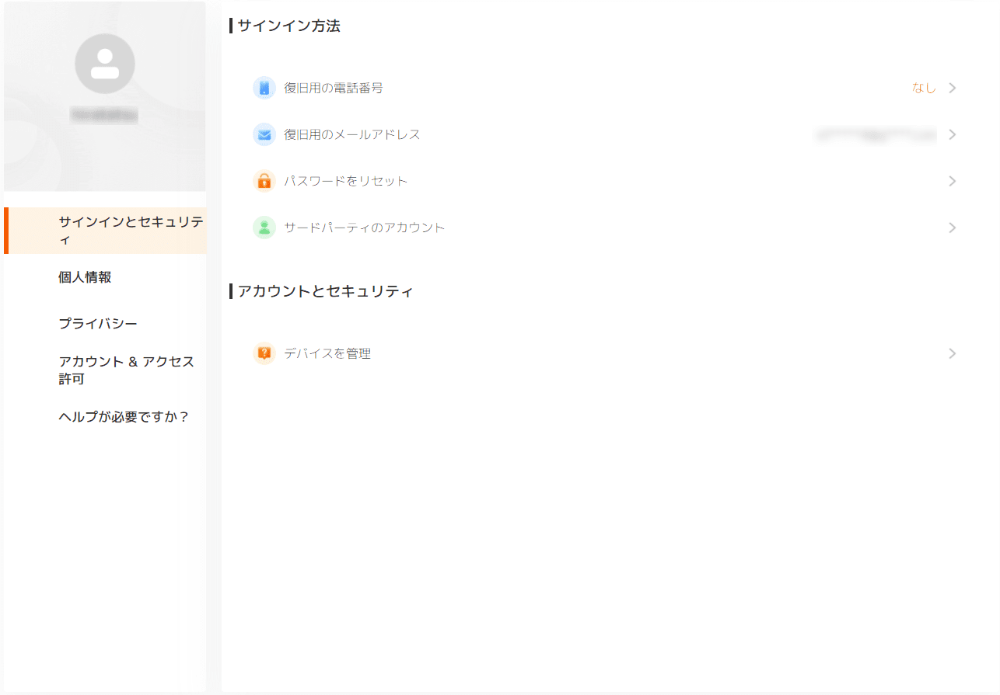

こんにちは、ひらたつです。

普段、趣味でランニング、筋トレ、テニスなどをしています。  
（最近テニスはあまりできていませんが、、）

特にランニングに関しては、今年の年末にフルマラソンに出て昨年の記録を更新することを目標に取り組んでいます。

そのため、ただ走るだけでなく、LSD (Long Slow Distance) や SIT (Sprint Interval Training)、通常のインターバルトレーニングなどを取り入れたメニューを組んでいます。

ランニングする時には心拍数やペースなど記録したいので、スマートウォッチ (Xiaomi 製の Mi Watch) で各種のデータを測定しています。

ランニング時にスマホを持ちたくなかったので、衛星測位システム内蔵の Mi Watch を使っています。

Mi Watch で測定したデータを確認するには **Mi Fitness** というアプリを使います。

このアプリではランニングごとの心拍数やペースなどが確認できます。


いつもランニング後にはこのデータを確認していましたが、トレーニングする中で1ヵ月や3ヵ月前と比べて現在の走力が向上しているのか確認したくなりました。

しかし、Mi Fitness の標準機能では確認する術がありません。

そこで、自分でワークアウトの生データを取得して、分析してみようと思い立ちました。

データ抽出、データ分析の2段階の構想で、今回は **データ抽出編** です。

## 想定環境

- アプリケーション：Mi Fitness
- ハードウェア：Mi Watch
- その他：Mi アカウント作成済み

## データ抽出

### ログイン

データはアプリからダウンロードするのではなく、Xiaomi の Web サイトからダウンロードします。

下記の URL にアクセスし、ご自身の登録しているアカウントでサインインしてください。

**[Xiaomi アカウント - サインイン ](https://account.xiaomi.com/pass/userLogin?&_locale=ja_JP)**


無事サインインできると以下のページが表示されます。



### データダウンロード

データをダウンロードするには、左にあるメニューから「プライバシー」に移動します。


プライバシーに移動するとアカウント認証が求められます。

「送信」ボタンを押すと画面に表示されている（事前に登録している）メールアドレスに認証コードが送られます。


メールアドレスに送られてきたコードを入力するとプライバシーページを閲覧できるようになります。


「データを管理」をクリックします。

アカウントに紐づいているデータ項目が表示されます。  
今回は Mi Fitness のデータをダウンロードしたいので、Mi Fitness 項目のダウンロードボタンをクリックします。


下図の表示が出ますので、60秒待ってから「OK」ボタンを押します。

データを送るまで最大15営業日必要と書かれていますが、私の場合は5分くらいでダウンロードリンクが記載されているメールが届きました。


「Copy of personal data- MI Fitness」というタイトルでメールが届きます。

メールに記載されている「Download」ボタンを押すとダウンロードできるサイトへ飛びます。

メールにデータ解凍用のパスワードが記載されていますので、メールを消さないように注意ください。


リンク先に飛ぶと「file #1」という記載があり、そこをクリックすることでようやくデータがダウンロードできます。


ダウンロード後はメールに記載されているパスワードで解凍してください。

## データの種類

### データの説明

解凍後に確認すると、以下の14個のデータが入っていると思います。

それぞれのファイルの中身を確認し、概要を整理しました。

※ `MiFitness_data_copy_guide.pdf` というファイルに各ファイルの概要が記載されていますが、分かりにくかったので自分なりの理解で記載しています。

\# | ファイル名 | 内容
-- | -- | --
1 | <ダウンロード日>_<アカウントID>_MiFitness_hlth_center_aggregated_fitness_data.csv | 消費カロリー、歩数、中強度のワークアウト時間のデータと目標値の一日ごとのデータ
2 | <ダウンロード日>_<アカウントID>_MiFitness_hlth_center_data_source.csv | Mi Fitness にデータを取り込むことができるデバイスなどのソース情報   (Mi Watch など)
3 | <ダウンロード日>_<アカウントID>_MiFitness_hlth_center_fitness_data.csv | 心拍数とエネルギーデータ※1、ストレス値の1分ごとのデータ
4 | <ダウンロード日>_<アカウントID>_MiFitness_hlth_center_sport_record.csv | ワークアウトのデータ
5 | <ダウンロード日>_<アカウントID>_MiFitness_hlthappUserFeedback.csv | 過去のサポートへの問い合わせ内容一覧
6 | <ダウンロード日>_<アカウントID>_MiFitness_user_device_setting.csv | Mi Fitness のトップ画面に表示する項目設定
7 | <ダウンロード日>_<アカウントID>_MiFitness_user_fitness_data_records.csv | いろんなデータが煩雑に記載されている。<br>2021年3月以降は「hlthcenter_recodes」を参照するように記載されており、それ以降はデータが残っていない。
8 | <ダウンロード日>_<アカウントID>_MiFitness_user_fitness_profile.csv | 一日の目標歩数、消費カロリーなどのデータ
9 | <ダウンロード日>_<アカウントID>_MiFitness_user_fitness_with_uuid_data_records.csv | 中身なし
10 | <ダウンロード日>_<アカウントID>_MiFitness_user_health_plan_records.csv | 中身なし
11 | <ダウンロード日>_<アカウントID>_MiFitness_user_member_profile.csv | 身長、体重、ID などのデータ
12 | <ダウンロード日>_<アカウントID>_MiFitness_user_pk_invite_record.csv | 中身なし
13 | <ダウンロード日>_<アカウントID>_MiFitness_user_pk_record.csv | 中身なし
14 | <ダウンロード日>_<アカウントID>_MiFitness_user_pk_result_statistics.csv | 中身なし

※1 Mi Warch は日常の活動、ワークアウト、ストレスなどから使用者の残エネルギー値を計算してくれる。

今回はワークアウトデータを分析したいので、`<ダウンロード日>_<アカウントID>_MiFitness_hlth_center_sport_record.csv` が該当するファイルになります。

### ランニングデータの詳細

`<ダウンロード日>_<アカウントID>_MiFitness_hlth_center_sport_record.csv` の中身は以下のようになっています。


`Uid` はアカウントID、`Sid` はデータのソースデバイスID、`Key` は `Category` を細分化した分類、`Time` はトレーニングが終了した時間、`Category` はトレーニングの分類、`Value` はトレーニングの詳細データ、`UpdateTime` はデータの更新日時。

この中で、**`Value` にワークアウトデータの詳細が入っていました。**

`Category` によって `Value` の中身は少し違うようです。

ランニングの `Value` は以下のようになっていました。

※ データの右側の `👈 標高の平均 [m]"` などは私が追加しています。

```json
{
  "avg_height":7.687015,  👈 標高の平均 [m]
  "avg_hrm":171,  👈 心拍数 の平均
  "calories":587,  👈 活動で消費したカロリー [kcal]
  "distance":10144,  👈 走った距離 [m]
  "duration":2635,  👈 BPM の平均
  "end_time":1678136264,  👈 トレーニング終了時間 (UNIX時間)
  "energy_consume":28,  👈 エネルギー消費量
  "fall_height":0.0,  👈 下降した標高の長さ
  "hrm_aerobic_duration":188,  👈 心拍数が有酸素運動の領域になっている時間 [s]
  "hrm_anaerobic_duration":603,  👈 心拍数が無酸素運動の領域になっている時間 [s]
  "hrm_extreme_duration":1791,  👈 心拍数が最大酸素摂取量の領域になっている時間 [s]
  "hrm_fat_burning_duration":23,  👈 心拍数が脂肪燃焼の領域になっている時間 [s]
  "hrm_warm_up_duration":10,  👈 心拍数がウォーミングアップの領域になっている時間 [s]
  "max_cadence":192,  👈 ケイデンス (1分間の歩幅) の最大値
  "max_height":8.8,  👈 標高の最大値
  "max_hrm":195,  👈 心拍数の最大値
  "max_pace":247,  👈 最高ペース [s/km]
  "max_speed":18.31163,  👈 最大スピード [km/h]
  "min_height":5.7,  👈 標高の最低値
  "min_hrm":78,  👈 心拍数の最低値
  "min_pace":287,  👈 最低ペース [s/km]
  "proto_type":1,  👈 ？
  "recover_time":72,  👈 トレーニングの疲れから回復するために必要な時間 [h]
  "rise_height":2.0,  👈 上昇した標高の長さ
  "sport_type":1,  👈 ？
  "start_time":1678133623,  👈 トレーニング開始時間 (UNIX時間)
  "steps":7923,  👈 歩数の合計
  "time":1678133623,  👈 トレーニング開始時間 (UNIX時間)
  "total_cal":636,  👈 運動+基礎代謝?の合計消費カロリー
  "train_effect":5.0,  👈 トレーニング効果 (0から5)
  "timezone":36,  👈 タイムゾーン
  "version":3,  👈 ？
  "vo2_max":55,  👈 最大酸素摂取量
}
```

ランニングに関するデータのほとんどすべてが入っていますが、心拍数やペースのより詳細なデータはありませんでした。

他のファイルを見てもなかったので、詳細なデータは手に入らないのかもしれません。

## 次回はデータを分析しようと思います

今回はデータを抽出する方法と、ランニングデータの詳細を確認しました。

次回はこのデータを分析しようと思います。

目標は、10km ± 1km の範囲に当てはまるランニングデータを抽出して、平均ペースや平均心拍数のデータを日付ごとに並べることです。

## 最後に

今回は Mi Watch の例を紹介しましたが、Mi Fitness には他のデバイス（POCO Watch や Redmi Watch 2 Lite など）も登録できます。

それらのデバイスでも同様の方法でデータがダウンロードできるはずですので、試してみてください。

では、またお会いしましょう。


