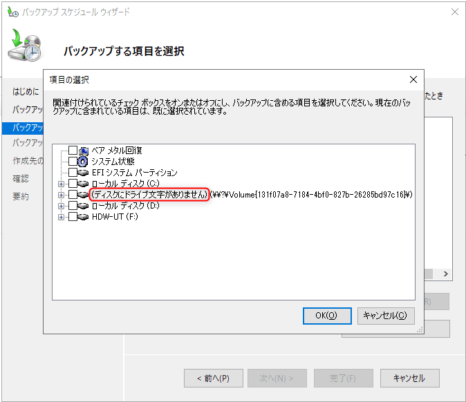
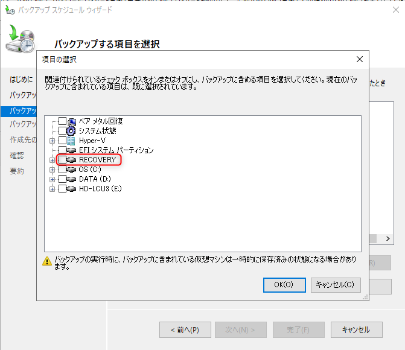
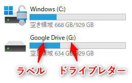
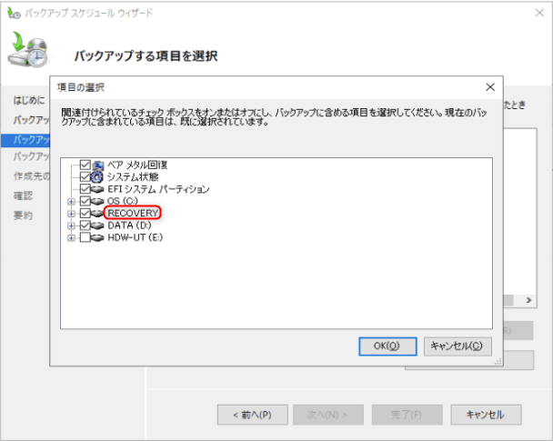

こんにちは、ひらたつです。

先日 Windows Server 2022 を構築する機会をいただきました。

構築作業の一部としてバックアップタスクを設定しているときに、`(ディスクにドライブ文字がありません)(\\?|Volume{131f07a8-...}}\)` と表示されているディスクが存在していることに気付きました。



このディスクは 回復パーティション であり、Windows Server 2019 の環境では `RECOVERY` と表示されていました。




`(ディスクにドライブ文字がありません)(\\?|Volume{131f07a8-...}}\)` と表示されていると、何のディスクをバックアップしているのか分からず困ります。

Windows Server 2019 の環境と比較して原因を調査すると、**対象のディスクにラベルがついていないこと**が原因だと分かりました。

**ディスクにラベルを付けること**で上記問題が解決され、`RECOVERY` と表示されることが分かりました。

この記事では、ディスクにラベルを設定する方法を記載します。
この方法を用いると、回復パーティションに限らず他のディスクのラベル名も変更可能です。  
ご参考になれば幸いです。

※ラベルとはディスクに付ける名称のことで、ドライブ文字（ドライブレター）はディスクに付けるアルファベットのことです。


## システム構成
- Windows Server 2022
- PowerShell バージョン：5.1.20348.1366

## 現状確認

### Windows Server 2022 環境での確認

まずは現状の状態を把握します。  
以下の手順でディスクの現状を確認できます。

コマンドプロンプトで以下を実行し、diskpart コマンド インタープリター を起動します。
```cmd
diskpart
```

起動後、以下のコマンドで各ディスクの状態を確認します。
```cmd
DISKPART> list volume
```

私の実行環境ではディスクの状態は以下でした。

```cmd
DISKPART> list volume

  Volume ###  Ltr Label        Fs    Type        Size     Status     Info
  ----------  --- -----------  ----  ----------  -------  ---------  --------
  Volume 0     D                       DVD-ROM         0 B  メディアなし
  Volume 1     C                NTFS   Partition     59 GB  正常         ブー ト
  Volume 2                      FAT32  Partition    100 MB  正常         シス テム
  Volume 3                      NTFS   Partition    599 MB  正常         非表 示
```

この結果から、C ドライブ、D ドライブにドライブ文字 (Ltr 列) が割り振られているだけで、その他はドライブ文字もラベル (Label 列) も割り振られていないことが分かります。

この状態ではどれが回復パーティションか分かりませんが、おそらく Info 列が `非表示` となっている `Volume 3` が回復パーティションだと思われます。

今回はこの `Volume 3` のラベルを `RECOVERY` に変更します。

### Windows Server 2019 環境での確認

一例として、とある Windows Server 2019 環境での結果を以下に示します。  
回復パーティションの Label 列に `RECOVERY` が割り振られていることが分かります。  
Ltr 列は何も入っていません。

```cmd
DISKPART> list volume

  Volume ###  Ltr Label        Fs    Type        Size     Status     Info
  ----------  --- -----------  ----  ----------  -------  ---------  --------
  Volume 0     Q                       DVD-ROM         0 B  メディアなし
  Volume 1     C   OS           NTFS   Partition    300 GB  正常         ブート
  Volume 2     D   DATA         NTFS   Partition    627 GB  正常
  Volume 3         ESP          FAT32  Partition    200 MB  正常         システム
  Volume 4         RECOVERY     NTFS   Partition   3072 MB  正常         非表示
```

以下では Windows Server 2022 の構成を上記と同じにしていきます。

## ディスク情報取得

ラベルを設定する下準備として、ラベルを設定したいディスクの `GUID` を取得します。

取得には以下のコマンドを用います。  
管理者権限で起動した Poweshell で実行ください。

```powershell
Get-Partition | fl
```

以下が実行結果です。  
`Type` が `Recovery` となっている回復パーティションの部分だけ抜き出していますが、ディスクの数だけ同じような結果が表示されます。

のちほど使うので、この結果の `GUID` をメモして残しておいてください。  
（今回の場合は、`ce1494bd-30bc-4ed3-a898-ab0dc1700766` ）

```powershell

...

UniqueId             : {00000000-0000-0000-0000-70da0e000000}6000C2994906E9DBF4FD6F
                       80098BA264
AccessPaths          : {\\?\Volume{ce1494bd-30bc-4ed3-a898-ab0dc1700766}\}
DiskNumber           : 0
DiskPath             : \\?\scsi#disk&ven_vmware&prod_virtual_disk#5&1ec51bf7&0&0000
                       00#{53f56307-b6bf-11d0-94f2-00a0c91efb8b}
DriveLetter          :
Guid                 : {ce1494bd-30bc-4ed3-a898-ab0dc1700766}
IsActive             : False
IsBoot               : False
IsHidden             : True
IsOffline            : False
IsReadOnly           :
IsShadowCopy         :
IsDAX                :
IsSystem             : False
NoDefaultDriveLetter :
Offset               : 63794315264
OperationalStatus    : Online
PartitionNumber      : 4
Size                 : 599 MB
Type                 : Recovery
```

## ラベルを変更する

それでは実際にラベルを変更していきます。

変更するには `label` コマンドを用います。  
`label` コマンドの詳細については以下をご参照ください。  
[label | Microsoft Learn](https://learn.microsoft.com/ja-jp/windows-server/administration/windows-commands/label)

管理者権限でコマンドプロンプトを開き以下を実行ください。  
このコマンドでラベルを変更できます。

```cmd
label \\?\Volume{<GUID>} <label name>
```

この際 `<GUID>` には上記でコピーした `GUID` を、`<label name>` にはラベルとして設定したい文字列を入力ください。  
たとえば、今回の場合だと、`label \\?\Volume{ce1494bd-30bc-4ed3-a898-ab0dc1700766} RECOVERY` となります。

## 結果の確認

最初に確認した時と同様のコマンドを実行し、ラベルの状態を確認します。  
`Volume 3` のラベルが `RECOVERY` に変更されていることが分かります。

```cmd
diskpart
DISKPART> list volume

  Volume ###  Ltr Label        Fs    Type        Size     Status     Info
  ----------  --- -----------  ----  ----------  -------  ---------  --------
  Volume 0     D                       DVD-ROM         0 B  メディアなし      
  Volume 1     C                NTFS   Partition     59 GB  正常         ブー ト
  Volume 2                      FAT32  Partition    100 MB  正常         シス テム
  Volume 3         RECOVERY     NTFS   Partition    599 MB  正常         非表 示
```

バックアップタスクから確認しても、回復パーティションのラベルが `RECOVERY` に変わっていました。



## 最後に

ちなみに、冒頭で記載した Windows Server 2019 環境では初期状態でラベルが設定されていました。  
Windows Server 2022 からは明示的に設定しないといけないように変わったのかもしれません。  

では、また。
