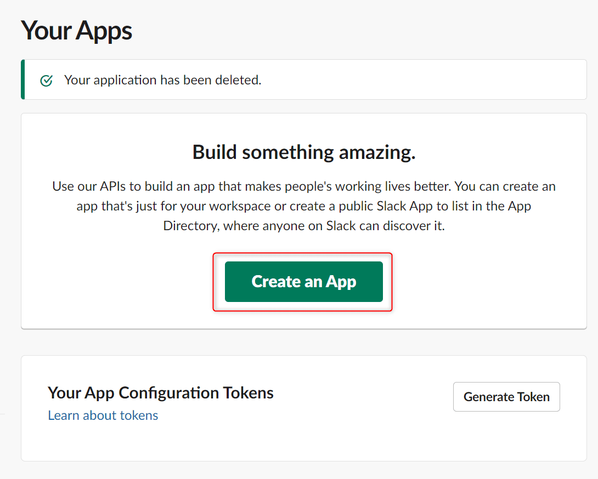
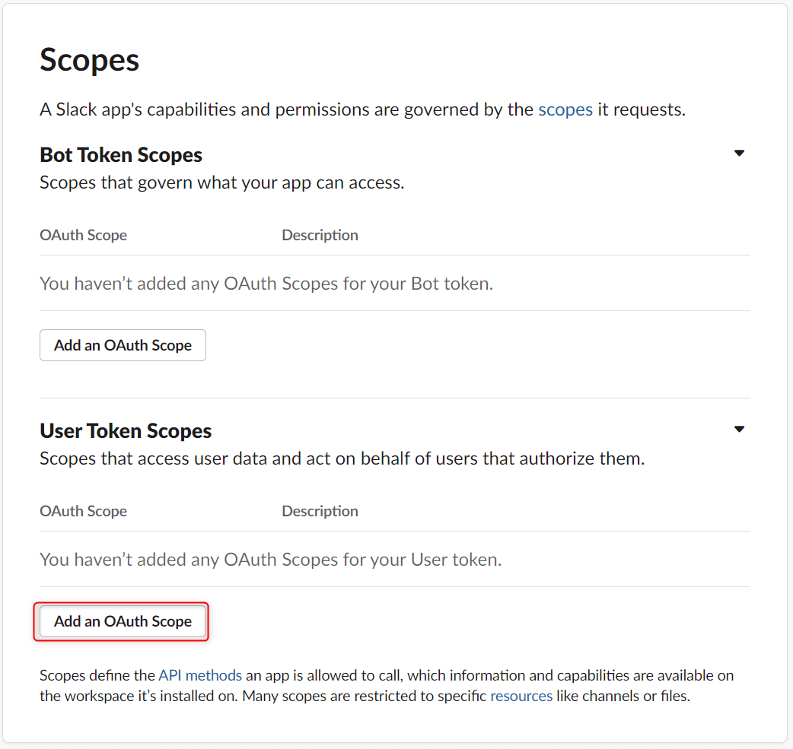
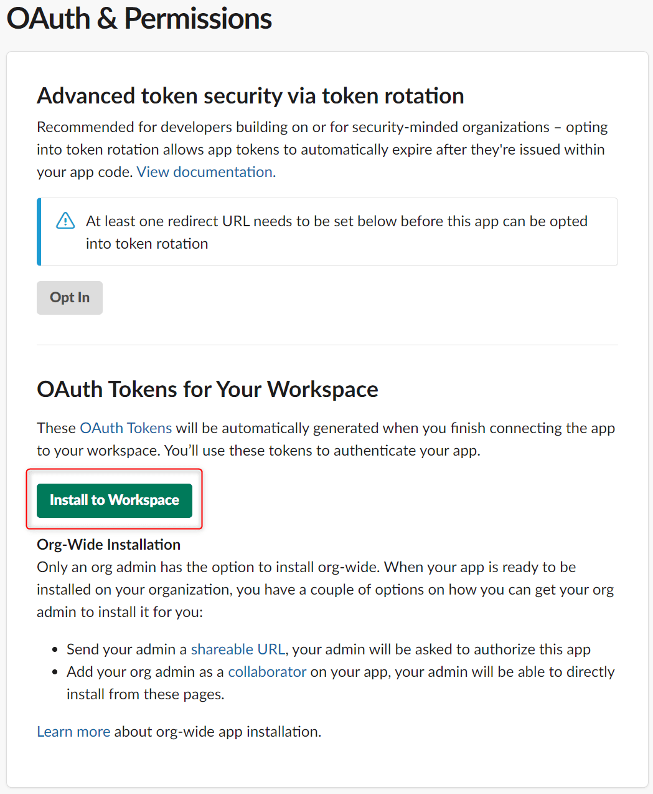
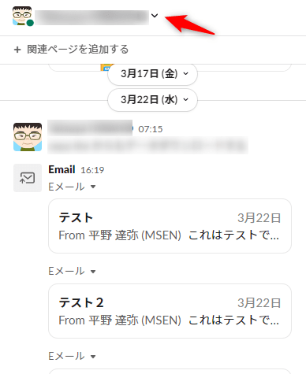
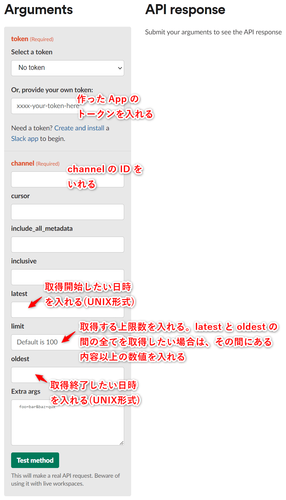
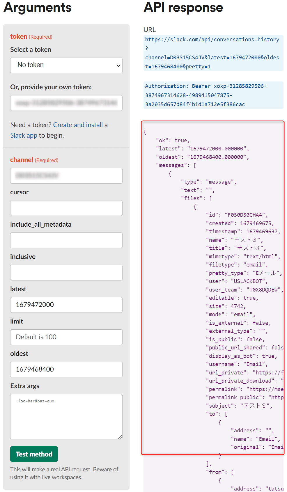

こんにちは、ひらたつです。

MSEN では Zabbix からのアラートメールを Slack で受信して確認しています。

この Slack に届くメールの件名と日時を取り出したい機会がありました。

そこで、今回は **Slack に届くメール通知から必要な内容のみを取得する方法** を紹介します。

Zabbix に限らず、Slack に届くメールから任意の項目を取り出す際に役立てば幸いです。

大まかな流れは以下です。

1. 通知取得用の App を作成する
2. App のトークンを使って通知を取得する
3. 取得したデータから必要な箇所のみ取り出す

※ 3の工程で Python を使います。今回は Python を使う準備工程は省いています。

## Slack API で App を作成する

**[Slack API: Applications | Slack](https://api.slack.com/apps)** にアクセスして、「Create an App」をクリックください。



「From scratch」を選択します。


「App Name」には任意の App 名を入力します。

「Pick a workspace to develop your app in:」では、通知を取得したい対象の workspace を選択ください。


上記で App が作成され、設定画面が表示されます。

次に作成した App と Slack でやりとりできるようにします。

「Permissions」を押してください。


遷移後の画面の「Scopes」にある、「Add an OAuth Scope」を押してください。



下図のように `history` に関係する4つを追加してください。

- **channels:history**  
  (説明：パブリックチャンネルのメッセージやその他のコンテンツの取得)
- **groups:history**  
  (説明：プライベートチャネルのメッセージやその他のコンテンツの取得)
- **im:history**  
  (説明：ダイレクトメッセージのメッセージやその他のコンテンツの取得)
- **mpim:history**  
  (説明：グループダイレクトメッセージのメッセージやその他のコンテンツの取得)


画面上の方に移動し、「Install to Workspace」をクリックして作成した App を workspace に紐づけます。



以下のような画面が出るので、「許可」を押します。


以上で App の作成は完了です。

## Slack への通知を取得する

まずは通知取得のために必要な情報を入手します。

### Token の取得

上で作成した App を開き、左ペインの「OAuth & Permissions」をクリックしてください。

開かれた画面の「OAuth Tokens for Your Workspace」にある「User OAuth Token」をコピーして任意の場所に残しておいてください。


### channel ID の取得

次に通知を取得したい Slack の channel を開いてください。

channel の上部にある「∨」押してください。



開かれた画面で一番下まで移動して、channel ID をコピーして任意の場所に残しておいてください。


### 通知を取得する

では、実際に通知を取得しましょう。

以下リンク先にアクセスしてください。

**[conversations.history method | Slack](https://api.slack.com/methods/conversations.history/test)** 

上記でコピーした情報を入力します。

日時を入れることで、取得する期間を決めることができます。



必要事項を入力後、「Test method」をクリックすると、右側に取得した内容が表示されます。



この結果をすべてコピーして、「.json」形式で保存ください。

以下のような形式のデータが取得できます。

```json
{
    "ok": true,
    "latest": "1679472000.000000",
    "oldest": "1679468400.000000",
    "messages": [
        {
            "type": "message",
            "text": "",
            "files": [
                {
                    "id": "F050D50CHA4",
                    "created": 1679469675,
                    "timestamp": 1679469637,
                    "name": "テスト３",
                    "title": "テスト３",
                    "mimetype": "text/html",
                    "filetype": "email",
                    "pretty_type": "Eメール",
                    "user": "USLACKBOT",
                    "user_team": "T0X8DQDEW",
                    "editable": true,
                    "size": 4742,
                    "mode": "email",
                    "is_external": false,
                    "external_type": "",
                    "is_public": false,
                    "public_url_shared": false,
                    "display_as_bot": true,
                    "username": "Email",
                    "url_private": "https://files.slack.com/files-pri/T0X8DQDEW-F050D50CHA4/____________",
                    "url_private_download": "https://files.slack.com/files-pri/T0X8DQDEW-F050D50CHA4/download/____________",
                    "permalink": "https://mseninc.slack.com/files/USLACKBOT/F050D50CHA4/____________",
                    "permalink_public": "https://slack-files.com/T0X8DQDEW-F050D50CHA4-aa1fcaf05c",
                    "subject": "テスト３",
                    "to": [
                        {
                            "address": "",
                            "name": "Email",
                            "original": "Email <>"
                        }
                    ],
                    "from": [
                        {
                            "address": "example@msen.jp",
                            "name": "hiratatsu04",
                            "original": "hiratatsu04"
                        }
                    ],
                    "cc": [],
                    "attachments": [],
                    "original_attachment_count": 0,
                    "plain_text": "これもテストです。,
                    "preview_plain_text": "これもテストです。,
                    "headers": {
                        "date": "Wed, 22 Mar 2023 16:20:37 +0900",
                        "in_reply_to": null,
                        "reply_to": null,
                        "message_id": "<CAJVkpaRuANtp=TD6=4C9JYwiABG2cVTfmQ6dDBLz68v7bLuuvg@mail.gmail.com>"
                    },
                    "has_more": false,
                    "sent_to_self": false,
                    "bot_id": "B04UWREG34N",
                    "is_starred": false,
                    "has_rich_preview": false,
                    "file_access": "visible"
                }
            ],
            "upload": true,
            "user": "USLACKBOT",
            "display_as_bot": true,
            "bot_id": "B04UWREG34N",
            "ts": "1679469676.283429"
        },
・・・・・・
上記  "messages" の繰り返し
・・・・・・
    ],
    "has_more": false,
    "pin_count": 0,
    "channel_actions_ts": null,
    "channel_actions_count": 0
}
```

## 必要な情報のみフィルタリングする

上記で保存したデータから必要な情報のみをフィルタリングします。

今回は **「通知メールの件名」** と **「通知日時」** のみを取得します。

`name` で「通知メールの件名」を選択し、`timestamp` で「通知日時」を選択しています。  
※ `timestamp` は UNIX 形式ですので、日付文字列に変更しています。

必要に応じてフィルタリングする情報は変更してください。

以下の Python のコードを実行すると「通知メールの件名」と「通知日時」を抜き出した csv ファイルが出力されます。

```python{13,14}
import json
import csv
import datetime

print("start")

json_file = open('/path/to/source.json', 'r', encoding="utf-8")
json_object = json.load(json_file)

with open('/path/to/destination.csv', 'w', newline="") as f:
  
  writer = csv.writer(f)
  for i in range(len(json_object["messages"])):
    name = json_object["messages"][i]["files"][0]["name"]
    timestamp_unix = json_object["messages"][i]["files"][0]["timestamp"]
    timestamp = datetime.datetime.fromtimestamp(timestamp_unix)
    
    writer.writerow([name, timestamp])

print("end")
```

上記を実行すると、下図のように出力されます。


これで必要な情報のみを保存できました。

## 最後に

今回は **Slack に届くメール通知から必要な内容のみを取得する方法** を紹介しました。

ご参考になれば幸いです。

では、次の記事でお会いしましょう。
