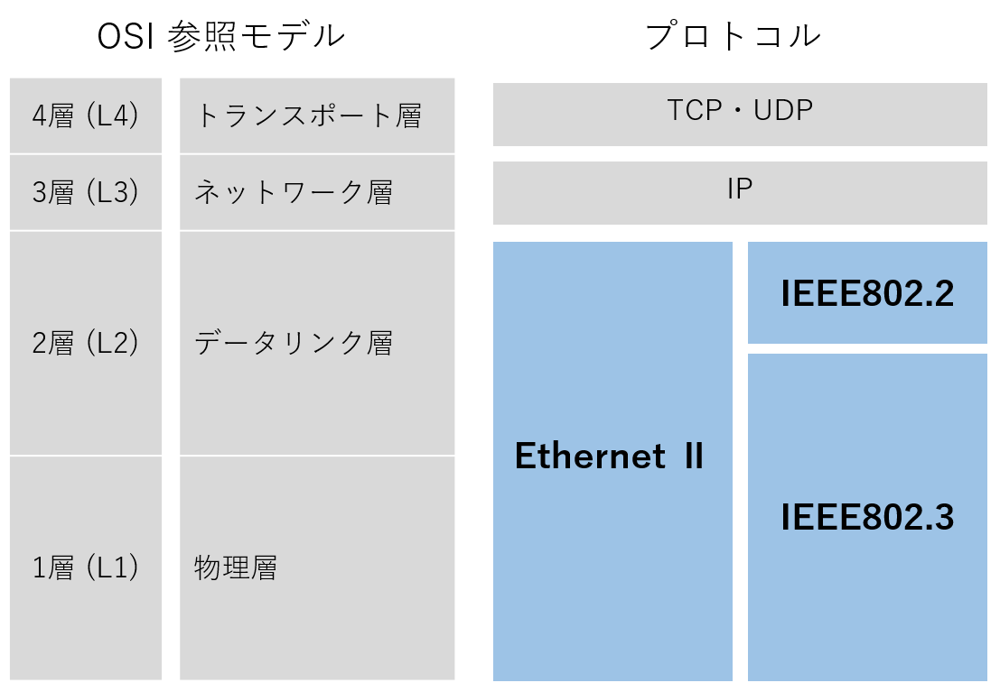
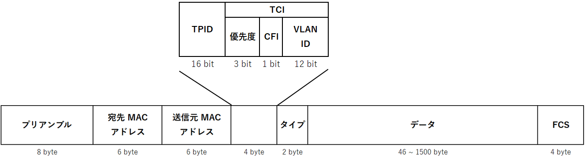

こんにちは、ひらたつです。

IT 業界に転職してきてから1年が経とうとしています。

この1年はあっという間で、さまざまなことを学びました。

Windows Server、Linux、Active Directory、FortiGate、VMware、ネットワーク全般、ISMS 活動、などです。

この中で特に感動したのがネットワーク技術でした。

日ごろ友人と連絡を取ったり、調べごとをしたり、動画を見たり、と何気なく使っているインターネットですが、知れば知るほど実に奥が深い技術だと感じました。

ネットワークについてより知りたいと思っていた時にネットワークスペシャリスト試験のことを知り、せっかくなら資格を取ってみようと思い立ち勉強に取り組み始めました。

資格の勉強にあたり、本を読んでインプットすることも大切ですが加えてアウトプットするとより理解が深まります。

そこで、「自分の理解を深めるため」＋「同じようにネットワークスペシャリストを目指している方のため」、学んだことを記事として整理していこうと思います。

まず第1回は **Ethernet のフレームフォーマット** についてです。

## フレームフォーマットの前に

### OSI 参照モデルでの Ethernet の立ち位置

Ethernet のフレームフォーマットの詳細の前に、OSI 参照モデルでの Ethernet の立ち位置を把握しておきます。

まず、OSI 参照モデルの復習として、OSI 参照モデルの階層構造と各階層の役割、各階層に対応する物理的なイメージを下図にまとめています。

Ethernet はこの物理層・データリンク層に対応します。

また、下図のように上位層から下位層に向かってデータが渡され、伝送路上を伝達していきます。

より詳細には、第4層で *セグメント* が作成され、第3層でセグメントに IP ヘッダーが付き *パケット* になり、第2層でパケットに Ethernet ヘッダーとフッタが付き **フレーム** になります。

従って、Ethernet のフレームは、第2層で扱われるものになります。

### Ethernet の種類

「Ethernet フレーム」と言っても、Ethernet フレームを規定している規格には大きく以下の2つがあります。

- Ethernet Ⅱ (DIX 規格 Ethernet) 
- IEEE 802.3

Ethernet Ⅱ は DIX (Xerox 社・Intel 社・DEC 社 (現 Hewlett Packard 社) の3社) が策定した規格で、IEEE 802.3 は標準規格を策定することを目指して IEEE 802 委員会が制定したものです。

[Ethernetフレームタイプ番号一覧](https://www.infraexpert.com/study/tea13.htm) を参照させていただくと、以下の使い分けがされているようです。

- TCP/IP 向け：Ethernet Ⅱ 
- Netware、Netbios 向け：IEEE 802.3

上記のような違いがあるので、OSI 参照モデルとの関係も少し異なります。

「OSI 参照モデルでの Ethernet の立ち位置」章で、Ethernet は物理層・データリンク層に対応すると記載しましたが、厳密には Ethernet の規格で対応関係が異なります。

Ethernet Ⅱ は物理層・データリンク層を規格化した仕様です。

IEEE 802.3 はデータリンク層を LLC (Logical Link Control) 副層と MAC (Media Access Control) 副層の2つに分け、物理層・MAC 副層の仕様を規格化しています。    
LLC 副層は IEEE802.2 で規格化されており、CSMA/CD 以外の伝送方法を規定しています。

上記の違いがあるので、フレームフォーマットも異なります。

以下で確認しましょう。

## フレームフォーマットと各領域の説明

### 各規格のフレームフォーマット

#### Ethernet Ⅱ

#### IEEE802.3

### 各領域の説明

MAC アドレスは良く説明がありご存じの方も多いと思うので、それ以外のプリアンブルとタイプ、FCS について整理します。

#### プリアンブル

端末間の同期を取るために、プリアンブルを使って**フレームの始まりを表します。**

具体的にプリアンブルの中身は以下です。

`0xAAAAAAAAAAAAAAAB`  
`10101010 10101010 10101010 10101010 10101010 10101010 10101011`

最後に `11` を続けることで、フレームの始まりを表しています。

※ プリアンブルは物理層で破棄されるため、厳密には **フレームの定義には含まれない** ようです。  
「ネスペの基礎力」でも「マスタリングTCP/IP」でもフレームにはプリアンブルが含まれておらず、なぜだろうと思っていましたがこのような事情がありました。

#### タイプ

データ領域部にどのようなタイプのデータが入っているかを示します。

ここに入る内容としては以下があります。

タイプ番号 (16進数) | プロトコル
-- | --
0000-05DC | IEEE802.3 Length Field
0101-01FF | 実験用
0800 | IPv4
0806 | Address Resolution Protocol ( ARP )
8035 | Reverse Address Resolution Protocol ( RARP )
814C | SNMP over Ethernet
8191 | NetBIOS/NetBEUI
86DD | IP version 6 ( IPv6 )
8863 | PPPoE Discovery Stage
8864 | PPPoE Session Stage
8906 | Fibre Channel over Ethernet (FCoE)
9000 | Loopback ( Configuration Test Protocol )

##### 【参考】VLAN が入る場合

VLAN が入る場合、フレームは以下となります。

VLAN のフレームはタイプの前に入るので、タイプに VLAN を表す信号を入れても読み取れません。

従って、**VLAN フレームでは `TPID` に VLAN を表す `0x8100` が入ります。**

その他の項目については別の記事で整理できたらと思います。

#### FCS (Frame Check Sequence)

名前の通り、フレームが壊れていないかチェックする領域です。

フレームが壊れていると判断されれば、フレーム自体が破棄されます。

FCS アルゴリズムとして良く用いられるのが CRC (Cyclic Redundancy Check、巡回冗長検査) だそうです。

## 最後に

勉強した知識を整理しようと思い、まずは Ethernet フレームフォーマットについてまとめてみました。

まとめる中で、やはり自分の理解が浅かったりあいまいに理解している部分があると分かりました。

アウトプットすることは大切だと再認識できました。

これからも勉強した内容を共有できたらと思います。

では、次の記事でお会いしましょう。

## 参考

- [ネスペの基礎力 -プラス20点の午後対策 (情報処理技術者試験) | 左門 至峰, 平田 賀一 |本 | 通販 | Amazon](https://www.amazon.co.jp/%E3%83%8D%E3%82%B9%E3%83%9A%E3%81%AE%E5%9F%BA%E7%A4%8E%E5%8A%9B-%E3%83%97%E3%83%A9%E3%82%B920%E7%82%B9%E3%81%AE%E5%8D%88%E5%BE%8C%E5%AF%BE%E7%AD%96-%E6%83%85%E5%A0%B1%E5%87%A6%E7%90%86%E6%8A%80%E8%A1%93%E8%80%85%E8%A9%A6%E9%A8%93-%E5%B7%A6%E9%96%80-%E8%87%B3%E5%B3%B0/dp/4774189863)
- [情報処理教科書 ネットワークスペシャリスト 2023年版 | ICTワークショップ |本 | 通販 | Amazon](https://www.amazon.co.jp/%E6%83%85%E5%A0%B1%E5%87%A6%E7%90%86%E6%95%99%E7%A7%91%E6%9B%B8-%E3%83%8D%E3%83%83%E3%83%88%E3%83%AF%E3%83%BC%E3%82%AF%E3%82%B9%E3%83%9A%E3%82%B7%E3%83%A3%E3%83%AA%E3%82%B9%E3%83%88-2023%E5%B9%B4%E7%89%88-ICT%E3%83%AF%E3%83%BC%E3%82%AF%E3%82%B7%E3%83%A7%E3%83%83%E3%83%97/dp/4798177571/ref=zg_bs_2157078051_sccl_17/356-6462194-6887117?psc=1)
- [Ethernet LAN - イーサネットフレームのフォーマットとMACアドレス](https://www.infraexpert.com/study/ethernet4.html)
- [イーサネットII規格のフレームフォーマット(まとめ)](https://zenn.dev/masahiro_toba/articles/273189798f9968)
- [EtherType - Wikipedia](https://ja.wikipedia.org/wiki/EtherType#cite_note-ethtypes-7)
