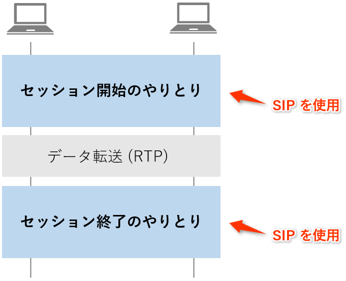
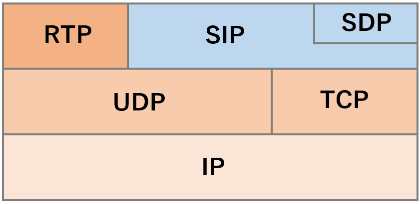
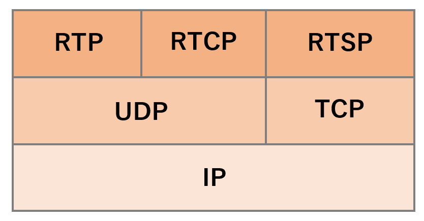
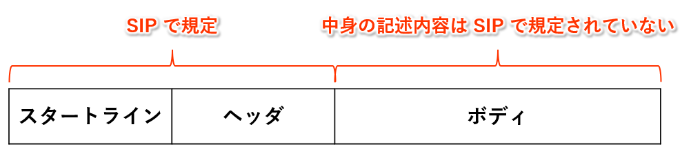
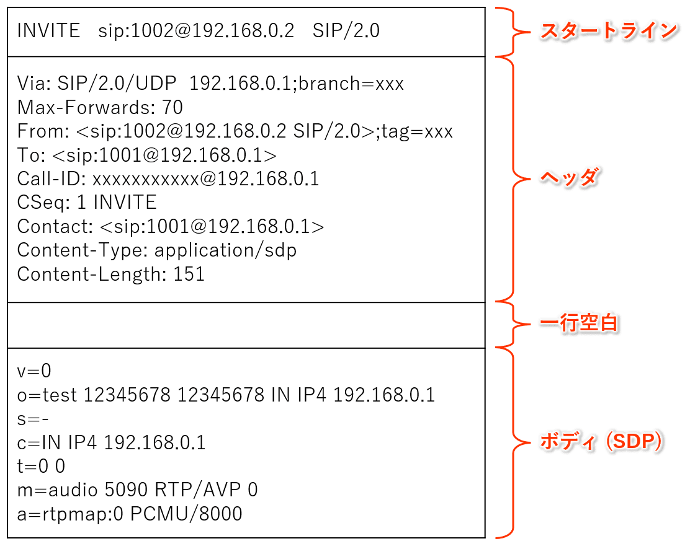
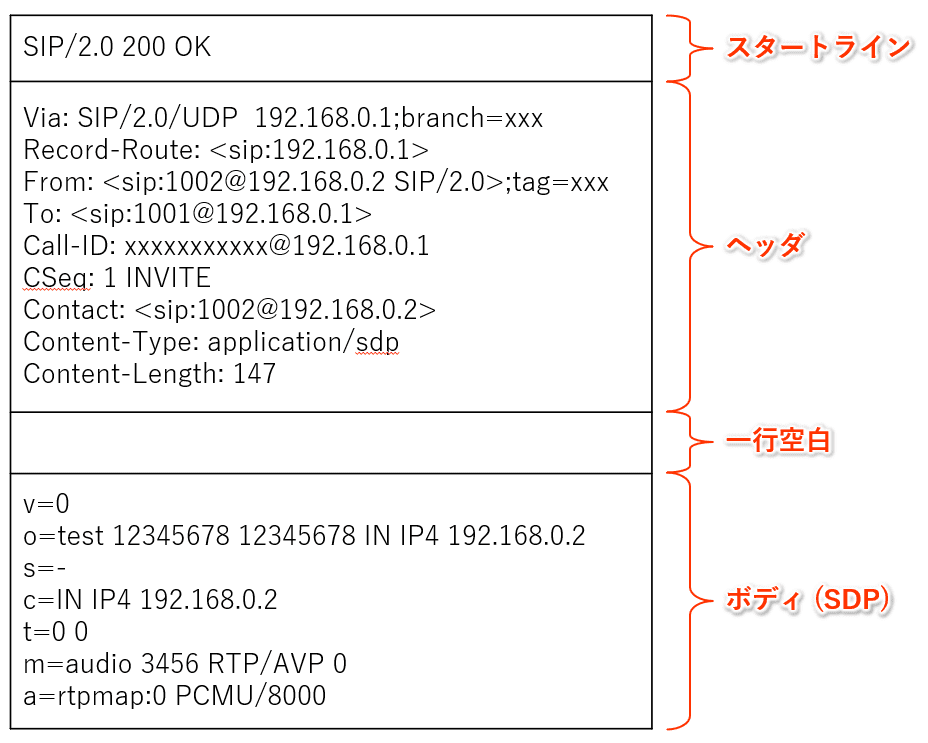
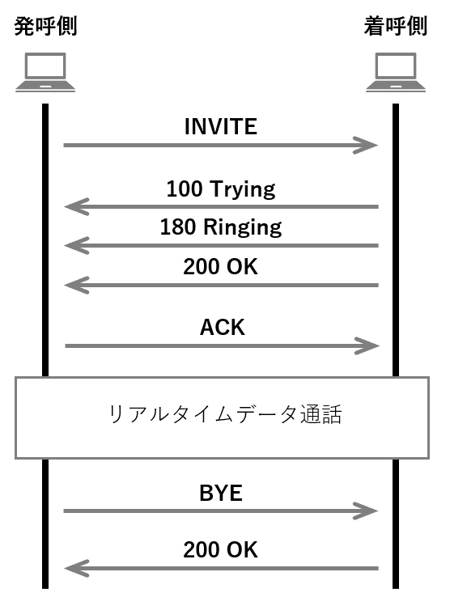
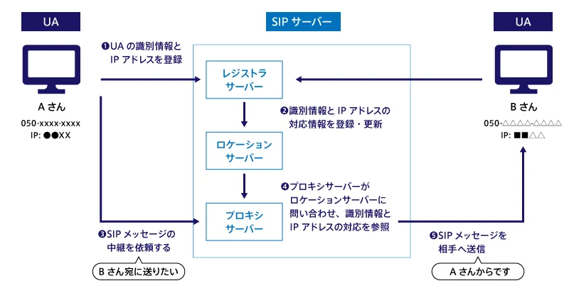
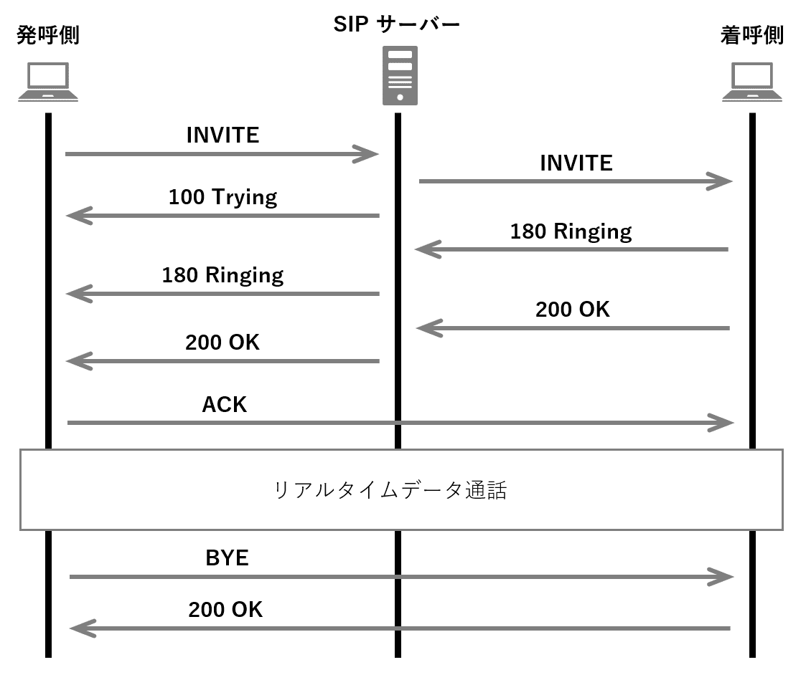

こんにちは、ひらたつです。

今回もネットワークスペシャリストの知識に関する記事を書きました。

前回の第1回では、「[Ethernet のフレームフォーマットと各領域の説明](https://mseeeen.msen.jp/network-specialist-ethernet-frame-format/)」と題して Ethernet のフレームフォーマットについての記事を書きました。

流れ的に今回は *IP パケット* といきたかったのですが、学習に使っている本 ([情報処理教科書 ネットワークスペシャリスト 2023年版（ICTワークショップ）｜翔泳社の本](https://www.shoeisha.co.jp/book/detail/9784798177571)) では先に **SIP (Session Initiation Protocol)** が出てきました。

SIP が初耳で内容が良くわからずいろいろと調べましたのでその内容を整理します。

ネットワークスペシャリストを目指している方の参考になれば幸いです。

## SIP とは？

> SIP (Session Initiation Protocol) とは **セッションを制御する** プロトコルであり、データの転送には主に *RTP (Real-time Transport Protocol)* が用いられる。  
> RTP などのデータ転送で必要な情報の記述には *SDP (Session Description Protocol)* が用いられる。

というような説明が多くの記事、本でされていますが、私は良く分かりませんでした。  
この文を読んで SIP、RTP、SDP の役割が分かれば以下の説明を読む必要はないかもしれません。(笑)

**SIP はセッションを制御するプロトコルであり、データを転送するためのプロトコルではない。**

ここが私の中では非常に大切でした。

イメージは以下です。

SIP は **セッションの開始と終了のみを管理** して、データは別のプロトコルでやりとりされます。

データ転送で主に用いられるのが *RTP (Real-time Transport Protocol)* です。  
RTP の通信には相手の IP アドレスやポート番号、音声の圧縮方式の情報が必要です。

**これらの情報を SIP でやりとりします。**

ただ、SIP 自体はセッション制御だけの役割しかなく、IP アドレスやポート番号、音声の圧縮方式の情報をどう SIP フォーマットの中に記載するかのルールは決まっていません。  
この記載ルールを決めているのが *SDP (Session Description Protocol)* です。

以上をまとめると SIP は以下の特徴があります。

- セッションの開始と終了を管理する
- セッションの開始時に通信相手とデータ通信で使用する IP アドレスやポート番号、サポートしている圧縮方式などをやりとりする

### プロトコルスタックでの位置付け

SIP は TCP/IP モデルの「アプリケーション層」に該当します。

従って、UDP か TCP を使用されますが、デフォルトでは UDP が使用されます。

また、SDP は SIP の *ボディ* で用いられます（詳細は [3. ボディ](#3-ボディ) をご確認ください）。

### SIP は何に使われている？

> 現在の主な用途は電話、テレビ電話やインスタント・メッセージングのような双方向のリアルタイム通信である。
>
> <cite>[Session Initiation Protocol - Wikipedia](https://ja.wikipedia.org/wiki/Session_Initiation_Protocol)</cite>

SIP はセッションを制御するプロトコルですので、双方向の通信で用いられます。

Zoom や Skype、LINE 電話などで VoIP (Voice over Internet Protocol) が使われていますが、VoIP にも SIP が使われています。

- Zoom

> Zoom の VoIP 電話サービス
> Zoom Phone は VoIP 業界のリーダーです。 Zoom Phone があれば、企業はコミュニケーション システムを最新化して、コストを削減し、生産性を向上させ、よりよいビジネス成果を達成することができます。
> 
> <cite>[VoIP 電話とは | Zoom](https://explore.zoom.us/ja/what-is-voip-phone/)</cite>

- Skype や LINE 電話

> スマートフォンの普及に伴い、米Microsoftの「Skype」といったサービスだけでなく、NTTコミュニケーションズが提供する「050 plus」（関連記事）やNHN Japanの「LINE」（関連記事）など、音声通話ができる数多くのサービスが登場しています。これらのサービスは、従来の電話サービスが採用している回線交換方式ではなく、VoIP（Voice over IP）技術を用いたデータ通信による音声通話を可能としています。
> 
> <cite>[LINEやcommの通話の仕組みを解析―準備編 | 日経クロステック（xTECH）](https://xtech.nikkei.com/it/article/COLUMN/20121108/435987/)>

### 【補足】RTP とは？

> RTP (Real-time Transport Protocol) は TCP/IP ネットワーク上で音声や動画のように連続するデータの流れをリアルタイムに伝送するための通信プロトコルです。
> <cite>[RTP/RTCPとは？【第2回】RTP/RTCPパケットにはどんな情報が含まれているか｜TECHブログ | 株式会社PALTEK](https://www.paltek.co.jp/techblog/techinfo/230201_01)</cite>

RTP は UDP を用いるアプリケーション層のプロトコルです。

プロトコルスタックは下図です。

RTP は UDP を用いますが、TCP を用いる RTSP (Real Time Streaming Protocol) もあるみたいです。  
また、通信状況（遅延時間、パケット損失率、送出と受信のパケット数など）を含む管理パケットを通信参加者に提供するプロトコルである RTCP (Real Time Control Protocol) もあります。  

RTP の詳細は別の記事で整理できたらと思います。

## SIP のメッセージフォーマット

SIP のメッセージフォーマットは下図です。

具体的な中身は下図のようになっています。

- リクエスト例

- レスポンス例

スタートラインに SIP メソッドなどが記載されており、ヘッダーにリクエストの着信先や生成元、リクエストが経由したパスなどが記載されます。

ボディには、RTP で使う IP アドレスやポート番号、音声の圧縮方式などの情報が記載されます。  
このボディの記載方法は SIP では規定されておらず、SDP で決められています。

### 1. スタートライン

SIP の通信は、リクエストとレスポンスのやりとりで行われます。

SIP は HTTP を例に設計されたらしく、リクエストとレスポンスというしくみは HTTP と同じになっています。

<table>
<caption><b>【リクエスト】</b></caption>
	<tr>
		<th>SIPメソッド</th>
		<th>説明</th>
	</tr>
	<tr>
		<td>INVITE</td>
		<td>セッション開始要求</td>
	</tr>
	<tr>
		<td>ACK</td>
		<td>セッション確立の確認</td>
	</tr>
	<tr>
		<td>BYE</td>
		<td>セッション終了</td>
	</tr>
	<tr>
		<td>CANCEL</td>
		<td>セッション確立のキャンセル</td>
	</tr>
	<tr>
		<td>REGISTER</td>
		<td>情報の登録</td>
	</tr>
	<tr>
		<td>OPTIONS</td>
		<td>サーバ機能問い合わせ</td>
	</tr>
	<tr>
		<td>PRACK</td>
		<td>暫定応答に対する確認</td>
	</tr>
	<tr>
		<td>INFO</td>
		<td>セッション内の情報通知</td>
	</tr>
	<tr>
		<td>SUBSCRIBE</td>
		<td>イベントの通知要請</td>
	</tr>
	<tr>
		<td>NOTIFY</td>
		<td>要請されたイベントの通知</td>
	</tr>
	<tr>
		<td>MESSAGE</td>
		<td>テキストメッセージなどの送信</td>
	</tr>
	<tr>
		<td>UPDATE</td>
		<td>セッションの変更</td>
	</tr>
	<tr>
		<td>PUBLISH</td>
		<td>ステータス情報の通知</td>
	</tr>
	<tr>
		<td>REFER</td>
		<td>転送指示</td>
	</tr>
</table>

<table>
<caption><b>【レスポンス】</b></caption>
	<tr>
		<th>ステータス</th>
		<th>コード</th>
		<th>メッセージ</th>
		<th>応答内容</th>
	</tr>
	<tr>
		<td rowspan="2">暫定応答 (コード：100～199)</td>
		<td>100</td>
		<td>Trying</td>
		<td>暫定応答</td>
	</tr>
	<tr>
		<td>180</td>
		<td>Ringing</td>
		<td>呼び出し中</td>
	</tr>
	<tr>
		<td>成功応答 (コード：200～299)</td>
		<td>200</td>
		<td>OK</td>
		<td>リクエスト成功</td>
	</tr>
	<tr>
		<td rowspan="2">転送応答 (コード：300～399)</td>
		<td>301</td>
		<td>Moved Permanently</td>
		<td>恒久的に移動した</td>
	</tr>
	<tr>
		<td>302</td>
		<td>Moved Temporary</td>
		<td>一時的に移動した</td>
	</tr>
	<tr>
		<td rowspan="6">リクエストエラー (コード：400～499)</td>
		<td>400</td>
		<td>Bad Request</td>
		<td>リクエストが不正な構文</td>
	</tr>
	<tr>
		<td>401</td>
		<td>Unauthorized</td>
		<td>ユーザ認証が必要</td>
	</tr>
	<tr>
		<td>403</td>
		<td>Forbidden</td>
		<td>禁止されている</td>
	</tr>
	<tr>
		<td>404</td>
		<td>Not Found</td>
		<td>見つからなかった</td>
	</tr>
	<tr>
		<td>486</td>
		<td>Busy Here</td>
		<td>ビジー状態である（通話中など）</td>
	</tr>
	<tr>
		<td>487</td>
		<td>Request Terminated</td>
		<td>リクエストが終了させられた</td>
	</tr>
	<tr>
		<td rowspan="2">サーバーエラー (コード：500～599)</td>
		<td>500</td>
		<td>Server Internal Error</td>
		<td>サーバー内部エラー</td>
	</tr>
	<tr>
		<td>503</td>
		<td>Service Unavailable</td>
		<td>サーバー利用不可</td>
	</tr>
	<tr>
		<td rowspan="2">グローバルエラー (コード：600～699)</td>
		<td>600</td>
		<td>Busy Everywhere</td>
		<td>どの場所もビジー</td>
	</tr>
	<tr>
		<td>603</td>
		<td>Decline</td>
		<td>どの端末も参加できない</td>
	</tr>
</table>

### 2. ヘッダー

リクエストの着信先や生成元、リクエストが経由したパスなどが記載されます。

パラメーター | 内容
-- | --
Call-ID | ユニークな ID であり、セッションの識別に使用される
To | リクエストの着信先 URI
From | リクエストの生成元 URI
Contact | 以後、自分へのリクエストを送ってほしい URI
Cseq | 同一 Call-ID で何個目のリクエストかを表示
Via | リクエストが経由してきた経路。レスポンスを転送する経路として使われる。
Content-Type | ボディメッセージの MIME タイプ
Content-Length | ボディの長さ（バイト数）

※ URI (Uniform Resource Identifier) とは URL (Uniform Resource Locator) と URN (Uniform Resource Name) の総称です。

### 3. ボディ

ボディの記載方法について SIP では MIME (Multipurpose Internet Mail Extensions) 形式で記載することのみを規定しています。

実際どのように記載されるかは、使用する `MIME Type` に依存します。

[MIME Type一覧](https://manual.iij.jp/cwh/manual/37913919.html)

使用される MIME 形式はヘッダーの `Content-Type` に記載されるようです。

調べると、`Content-Type` の記載例は以下があるようですが、他のリクエストでの記載例は分かりませんでした。  
実際にパケットをキャプチャすると分かるかもしれません。

- INVITE リクエスト：application/SDP
- NOTIFY リクエスト：application/xpidftxml or application/cpim-pidftxml
- MESSAGE リクエスト：text/plain

おそらく、使用される MIME は SDP (Session Description Protocol) が最も多く、どの本やサイトでも詳細に説明されていました。

## SIP シーケンス

### UA 間での直接のやりとり

SIP では端末のことを `User Agent (UA)` と呼びます。

この UA どうしでのやりとりが一番単純なシーケンスとなります。

1. 発呼側から `INVITE` リクエストが送られる
2. 着呼側から暫定応答が送られる(`100 Trying`, `180 Ringing`)
3. 着呼側が応答すれば、`200 OK (成功応答)` のレスポンスが送られる
4. 発呼側から `ACK` が送られ、成功応答を受信したことが着呼側へ伝えられる
5. (リアルタイムデータ通話が行われる)
6. 発呼側か着呼側どちらかから `BYE` リクエストが送られる
7. `BYE` リクエストを受け取った側から `200 OK (成功応答)` のレスポンスが送られる

### SIP サーバーがある場合のやりとり

UA どうしがお互いの IP アドレスを知らない場合は SIP サーバーが通信を仲介します。

SIP サーバーには以下の役割があります。

- レジストラサーバー：UA が送信した登録リクエスト (`REGISTER`) を受け取り、ロケーションサーバーに登録する
- ロケーションサーバー：UA の位置情報（SIP URI に IP アドレスを紐づけた情報）を保管する
- プロキシサーバー：UA からの通信を受信し転送する

イメージは以下です。  
[インターネット通話を実現する「VoIP」と「SIP」とは？初心者にもわかりやすく解説](https://cloudapi.kddi-web.com/magazine/twilio-sip/what-internet-call-voip-sip) から引用しています。

レジストラサーバーとロケーションサーバーとしての役割は UA からやりとりをしたいリクエスト (`INVITE`) より前に完了している必要があります。

SIP サーバーがプロキシサーバーとして UA 間のやりとりを行う場合は以下の流れになります。

1. 発呼側から SIP サーバーに `INVITE` リクエストが送られる
2. SIP サーバーは発呼側からの `INVITE` リクエストの着呼側 SIP URI から IP アドレスを割り出し着呼側へ転送する
3. SIP サーバーは `100 Trying (暫定応答)` を送り、`INVITE` リクエストの転送を知らせる
4. 着呼側から暫定応答が送られ、SIP サーバーは発呼側へ転送する(`180 Ringing`)
5. 着呼側が応答すれば、`200 OK (成功応答)` のレスポンスが送られ、SIP サーバーは発呼側へ転送する
6. 発呼側から `ACK` が直接着呼側へ送られ、成功応答を受信したことが伝えられる
7. (リアルタイムデータ通話が行われる)
8. 発呼側か着呼側どちらかから `BYE` リクエストが送られる
9.  `BYE` リクエストを受け取った側から `200 OK (成功応答)` のレスポンスが送られる

## 最後に

SIP の応用先として VoIP※ があり、VoIP でのシーケンスや問題点なども調べたのですが、長くなったので次回の記事に分けようと思います。

※ VoIP (Voice over Internet Protocol) とは、インターネットやイントラネットのような IP ネットワーク上で音声通話を実現する技術のことです。音声をデジタル信号に変換し、パケットとして IP ネットワークを通してリアルタイムに送受信します。

では次回の記事でお会いしましょう。
