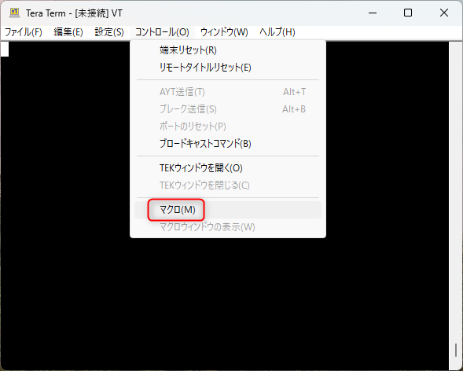
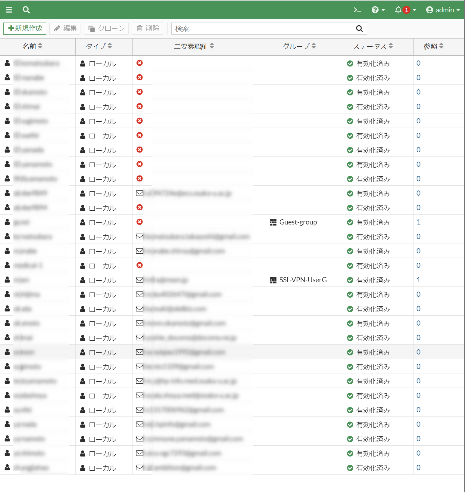

こんにちは、ひらたつです。

FortiGate では SSL VPN に二要素認証を設定できます。

設定方法は以下を参考にしてください。

[[FortiGate] SSL VPN に二要素認証 (Slack) を設定する | MSeeeeN](https://mseeeen.msen.jp/configure-two-factor-authentication-for-fortigate-ssl-vpn/)

また、二要素認証用トークンが送られるメールの送信元アドレスも変更できます。

設定方法は以下を参考にしてください。

[[FortiGate] SSL VPN の二要素認証(メール)に送信元アドレスを設定する方法 | MSeeeeN](https://mseeeen.msen.jp/setting-sender-email-address-for-fortigate-ssl-vpn/)

上記のように、SSL-VPN に二要素認証を設定できる便利な FortiGate ですが、ユーザーを登録する場合は一人一人手入力する必要があります。

※ Active Directory 連携などしている場合は、一人一人の登録は不要です。

2,3 人であればそこまで手間ではないかもしれませんが、数十人になってくると工数がかかってしまいます。

そこで、今回は **「ユーザー登録 & 二要素認証のメールアドレス登録」をバッチ処理してくれる Tera Term マクロ** を作成しましたので紹介します。

ご参考になれば幸いです。

## 想定環境

- FortiGate 60F
- Forti OS v6.4.11
- FortiClient VPN 7.0.6.0290
- Tera Term Version 4.106

## 準備

### FortiGate 接続先ファイル

FortiGate への接続情報用ファイルを作成します。

`authentication.csv` というファイル名で、中身を以下としてください。

```:title=authentication.csv
<FortiGate のIP アドレス>,<管理者のユーザー名>,<管理者のパスワード>
```

たとえば、FortiGate のIP アドレス : `192.168.0.1`、管理者のユーザー名 : `admin`、管理者のパスワード : `pass`、であれば以下のようになります。

```:title=authentication.csv
192.168.0.1,admin,pass
```

### 登録ユーザー定義ファイル

次に登録するユーザー情報をまとめたファイルを作成します。

以下の要領で、`user.csv` というファイルを作成してください。

```:title=user.csv
<ユーザー名>,<パスワード>,<二要素認証用メールアドレス>
<ユーザー名>,<パスワード>,<二要素認証用メールアドレス>
<ユーザー名>,<パスワード>,<二要素認証用メールアドレス>
<ユーザー名>,<パスワード>,<二要素認証用メールアドレス>
<ユーザー名>,<パスワード>,<二要素認証用メールアドレス>
...
```

たとえば、ユーザー名 : `user1`、パスワード : `pass1`、二要素認証用メールアドレス : `user1@sample.com`、であれば以下のようになります。

```:title=user.csv
user1,pass1,user1@sample.com
user2,pass2,user2@sample.com
user3,pass3,user3@sample.com
...
```

### ユーザー & 二要素認証用メールアドレス登録マクロ

以下が **ユーザー登録と SSL VPN の二要素認証メールアドレス登録をまとめて行う Tera Term マクロ** です。

各コマンドの説明はコードの中に記載しています。

このコードをコピーしてファイルを作成してください。

ファイル名は任意ですが、Tera Term でマクロを実行するため、拡張子は `.ttl` としてください。

以下ではファイル名を `registration.ttl` としています。

```:title=registration.ttl
; csv ファイル読み込み用
separator = ','

;--------------- SSH 接続 ---------------

; FortiGate 接続情報読み込み
authenticationfile = 'authentication.csv'
fileopen authentication authenticationfile 0 0

; SSH 接続コマンドを格納する変数
COMMAND_SSH = ''

; SSH 接続コマンドを作成する

while 1

  ; FortiGate 接続情報ファイルから1行を読み込む
  filereadln authentication buf

  ; filereadln で最後の行になると result に 1 が格納される。それ以外は 0 が格納される。
  if result then
    break
  endif

  ; buf を 区切り文字 separator で区切る。区切られた部分文字列を取り出して、システム変数 groupmatchstr1 ～ groupmatchstr3 に返す。
  strsplit buf separator
  ssh_ip = groupmatchstr1
  ssh_user = groupmatchstr2
  ssh_passwd = groupmatchstr3

  ; COMMAND_SSH に接続コマンドを格納
  sprintf2 COMMAND_SSH '%s /ssh /auth=password /user=%s /passwd=%s' ssh_ip ssh_user ssh_passwd

endwhile

; authentication をクローズする
fileclose authentication

; SSH 接続開始
connect COMMAND_SSH

; ログ採取開始。任意のフォルダを指定してください。以下では C ドライブ直下にログを残しています。
logopen 'C:\registration.log' 0 0

;---------------------------------------


;-------------- ユーザー登録 --------------

; ユーザー情報読み込み
userfile = 'user.csv'
fileopen users userfile 0 0

while 1

  ; ユーザー情報ファイルから1行を読み込む
  filereadln users buf

  ; filereadln で最後の行になると result に 1 が格納される。それ以外は 0 が格納される。
  if result then
    break
  endif

  ; buf を 区切り文字 separator で区切る。区切られた部分文字列を取り出して、システム変数 groupmatchstr1 ～ groupmatchstr3 に返す。
  strsplit buf separator
  name = groupmatchstr1
  passwd = groupmatchstr2
  mail = groupmatchstr3

  ; 送信するコマンドの作成
  sprintf2 COMMAND_USER 'edit %s' name
  sprintf2 COMMAND_PASS 'set passwd %s' passwd
  sprintf2 COMMAND_MAIL 'set email-to %s' mail

  ; ローカルユーザーの構成を開始
  wait '#'
  sendln 'config user local'
  
  ; ユーザーが登録されていなければ新規作成。登録されていれば該当するユーザーを編集。
  wait '#'
  sendln COMMAND_USER

  ; パスワードを設定
  wait '#'
  sendln COMMAND_PASS

  ; mail にアドレスが入力されていなければ、result に 0 が入る
  strcompare mail ''

  ; mail にアドレスが入力されていればメールアドレスを登録する
  if result != 0 then

    wait '#'
    sendln 'set two-factor email'

    wait '#'
    sendln COMMAND_MAIL

  endif

  ; 設定を終了
  wait '#'
  sendln 'end'

  ; コマンド初期化
  COMMAND_MAIL = ''
  COMMAND_PASS = ''
  COMMAND_USER = ''

endwhile

; users をクローズする
fileclose users

;---------------------------------------

; ログ取得終了
wait '#'
logclose

; ログアウト
sendln 'exit'

```

## マクロ実行

上記で作成した、**`authentication.csv` と `user.csv`、`registration.ttl` は同じフォルダに配置してください。**

次に Tera Term でマクロを実行します。

Tera Term を開き、[コントロール] > [マクロ] をクリックし、`registration.ttl` を選択・実行します。



### 実行結果

実行後、FortiGate の管理コンソールにログインし、ユーザーを確認すると登録されていることが確認できると思います。



また、ログ (`registration.log`) にも以下のようなログが記録されていると思います。

```:title=registration.log
<ホスト名> # config user local

<ホスト名> (local) # edit <ユーザー名>
new entry '<ユーザー名>' added

<ホスト名> (<ユーザー名>) # set passwd <パスワード>

<ホスト名> (<ユーザー名>) # end

<ホスト名> # config user local

<ホスト名> (local) # edit <ユーザー名>
new entry '<ユーザー名>' added

<ホスト名> (<ユーザー名>) # set passwd <パスワード>

<ホスト名> (<ユーザー名>) # set two-factor email

<ホスト名> (<ユーザー名>) # set email-to user@sample.com

<ホスト名> (<ユーザー名>) # end

...
```

## 最後に

今回は、「ユーザー登録 & 二要素認証のメールアドレス登録」をバッチ処理してくれる Tera Term マクロを紹介しました。

ご参考になれば幸いです。

では次の記事でお会いしましょう。
