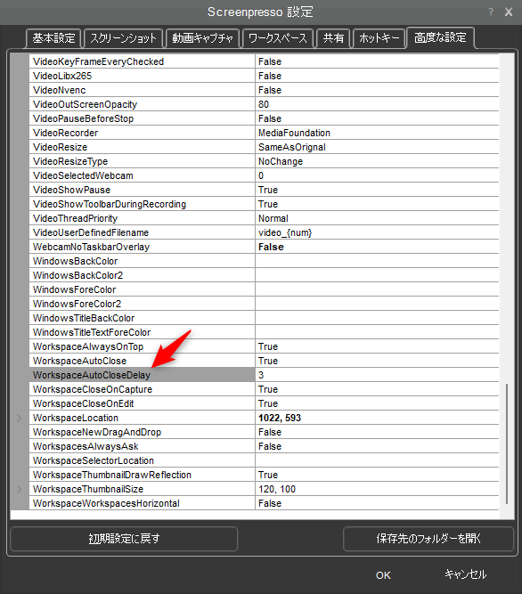

こんにちは、ひらたつです。

PC での作業を記録するツールとして Screenpresso を使っています。  
「ボタン1つでスクリーンショットが撮影」でき、「撮影範囲の変更も柔軟」なうえ、「画像の編集も可能」と至れり尽くせりなツールです。  
サーバー構築時のエビデンスを残す際にも重宝しています。  

そんな便利な Screenpresso ですが、半年くらい使用し続けて、少し使いづらいなと思う部分が出てきました。  
それは**スクリーンショットを撮影した後や画像を編集した後に、ワークスペースが3秒ほど表示され続けること**です。

スクリーンショット直後にワークスペースの後ろ側にあるウィンドウを操作したい時に邪魔になってしまいます。  
ワークスペースが消えるギリギリのタイミングでマウスカーソルを持っていくと、ワークスペースが消え切らず再度表示されるということも何度かありました。

[設定] > [スクリーンショットタブ] > [スクリーンショット後の操作：] を `通知を表示` や `何もしない` に変更するとスクリーンショット後にワークスペースを開かなくできます。
しかし、編集後にはいつものようにワークスペースが表示されます。

また、スクリーンショット後にすぐ編集したい時には、ワークスペースを開くという1アクションが増えることになります。

上記のような課題を解決する方法を見つけましたので、記事にしようと思います。

## 高度な設定を変更する

特に難しいことはなく、設定値の1つを変更するだけです。  
Screenpresso を開き以下の設定項目を見つけてください。  

**[設定] > [高度な設定タブ] > [WorkspaceAutoCloseDelay]**

設定項目の名称の通り、ここを変更することでワークスペースが閉じるまでの遅延時間を設定できます。  
おそらく、デフォルトでは `3` が入っていると思います。  
`0, 1, 2,,,` というように秒単位で設定でき、`0` とすることで一瞬だけ表示させることができます。

ただ、`0` だと本当に一瞬ですので、いくつか試してみて最適な時間を探してみてください。

短いですが以上です。  
ご参考になれば幸いです。

ではまた。
