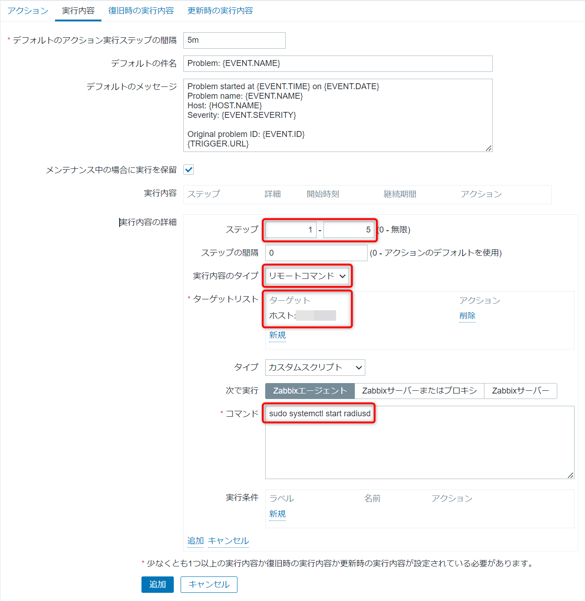
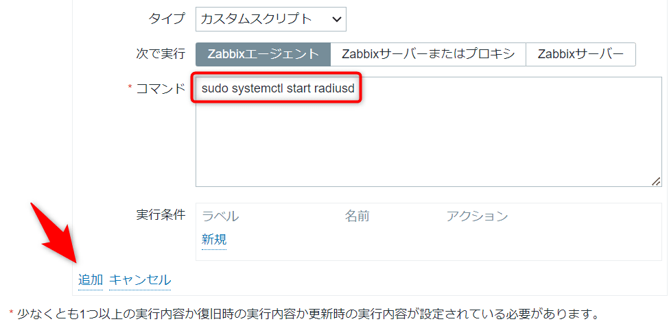
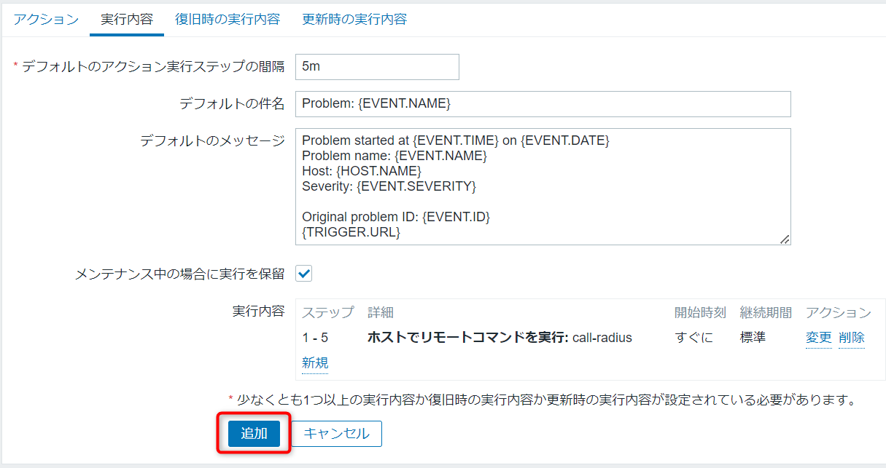

こんにちは、ひらたつです。

先日、再起動後に CentOS 上で動いている radiusd サービスが立ち上がりませんでした。

他の CentOS サーバー上に構築していた slapd.service (OpenLDAP) が起動する前に、radiusd サービスが起動してしまったことが原因でした。

Zabbix で監視設定を入れていましたので起動に失敗した通知はきていました。

もちろん機転を利かせて自動的に起動してくれるなんてことはありません。

そこで、今回は CentOS で動いているサービスが起動しなかったときに、Zabbix からサービスを起動する方法を紹介します。

※以下の手順では radiusd サービスを起動するように設定していますが、他のサービスに設定する場合は radiusd の部分を読み替えてください。

## 想定環境

- CentOS 7.7
- Zabbix Server 4.0 LTS
- Zabbix Agent 4.0.16
- Zabbix サーバーから対象エージェントの監視を設定済み

## エージェント側の設定

### 1. リモートコマンドが実行できるようにする

エージェント側でリモートコマンドが実行できるように設定します。

> リモートコマンドにより、監視しているホストで、ある条件を満たした時にあらかじめ設定したコマンドを自動的に実行されるようにできます。

引用元：[2 リモートコマンド](https://www.zabbix.com/documentation/2.2/jp/manual/config/notifications/action/operation/remote_command)

#### 1.1. 現状確認

現在の設定を確認します。

以下コマンドを実行ください。

```bash
[root@hiratatsupc ~]# cat /etc/zabbix/zabbix_agentd.conf | grep EnableRemoteCommands=1
[root@hiratatsupc ~]#
```

何も表示されなければ、リモートコマンドは無効です。  
以下の手順で設定してください。

`EnableRemoteCommands=1` が表示されればリモートコマンドは有効ですので、「2. zabbix ユーザーがパスワードなしでサービスの起動ができるようにする」に進んでください。

#### 1.2. 設定

以下の流れで、オリジナルのコンフィグを保存してから設定を変更してください。

```bash
[root@hiratatsupc ~]# cp -p /etc/zabbix/zabbix_agentd.conf{,.org}
[root@hiratatsupc ~]#
[root@hiratatsupc ~]# vi /etc/zabbix/zabbix_agentd.conf
[root@hiratatsupc ~]# diff /etc/zabbix/zabbix_agentd.conf{,.org}
73c73
< EnableRemoteCommands=1
---
> # EnableRemoteCommands=0
[root@hiratatsupc ~]#
[root@hiratatsupc ~]# cat /etc/zabbix/zabbix_agentd.conf | grep EnableRemoteCommands=1
EnableRemoteCommands=1
[root@hiratatsupc ~]#
[root@hiratatsupc ~]# reboot
```

### 2. zabbix ユーザーがパスワードなしでサービスの起動ができるようにする

#### 2.1. 設定

`zabbix-agent` サービスで使用される実行ユーザーは `zabbix` です。

`zabbix` ユーザーに対して、`systemctl start radiusd` の実行のみを許可するように設定します。

```bash
[root@hiratatsupc ~]# visudo
[root@hiratatsupc ~]#
[root@hiratatsupc ~]# cat /etc/sudoers | tail -n 4
## Read drop-in files from /etc/sudoers.d (the # here does not mean a comment)
#includedir /etc/sudoers.d

zabbix ALL=(ALL) NOPASSWD: /bin/systemctl start radiusd　👈追加
```

#### 2.2. 動作確認

上記にように設定することで、パスワードを聞かれずに `sudo systemctl start radiusd` を実行できます。

```bash{3, 8}
[root@hiratatsupc ~]# su -s /bin/bash zabbix
bash-4.2$
bash-4.2$ sudo systemctl start radiusd　👈パスワードを聞かれない
bash-4.2$
bash-4.2$ systemctl status radiusd
● radiusd.service - FreeRADIUS high performance RADIUS server.
   Loaded: loaded (/etc/systemd/system/radiusd.service; enabled; vendor preset: disabled)
   Active: active (running) since 火 2023-03-28 13:11:45 JST; 8s ago
  Process: 10623 ExecStart=/usr/sbin/radiusd -d /etc/raddb (code=exited, status=0/SUCCESS)
  Process: 10619 ExecStartPre=/usr/sbin/radiusd -C (code=exited, status=0/SUCCESS)
  Process: 10617 ExecStartPre=/bin/chown -R radiusd.radiusd /var/run/radiusd (code=exited, status=0/SUCCESS)
 Main PID: 10626 (radiusd)
   CGroup: /system.slice/radiusd.service
           mq10626 /usr/sbin/radiusd -d /etc/raddb
```

`sudo systemctl start radiusd` 以外の実行にはパスワードが必要です。

```bash{15,24}
[root@hiratatsupc ~]# su -s /bin/bash zabbix
bash-4.2$
bash-4.2$ cat /etc/hosts
127.0.0.1   localhost localhost.localdomain localhost4 localhost4.localdomain4
::1         localhost localhost.localdomain localhost6 localhost6.localdomain6
bash-4.2$ sudo vi /etc/hosts

あなたはシステム管理者から通常の講習を受けたはずです。
これは通常、以下の3点に要約されます:

    #1) 他人のプライバシーを尊重すること。
    #2) タイプする前に考えること。
    #3) 大いなる力には大いなる責任が伴うこと。

[sudo] zabbix のパスワード:
bash-4.2$ sudo systemctl stop radiusd

あなたはシステム管理者から通常の講習を受けたはずです。
これは通常、以下の3点に要約されます:

    #1) 他人のプライバシーを尊重すること。
    #2) タイプする前に考えること。
    #3) 大いなる力には大いなる責任が伴うこと。

[sudo] zabbix のパスワード:
```

## サーバー側の設定

サーバーからエージェント側のサービスを操作するように設定します。

以下の例では `5分` 間隔で `5回` サービスの起動を試みるように設定しています。  
必要に応じて数値を変更してください。

#### 1. アクションを作成する

[設定] > [アクション] から「アクションの作成」をクリックし、新規アクションの作成を開始してください。

#### 2. 名前、実行条件を設定する

- 名前: 任意の名前を入力してください
- 実行内容: もともと設定しているサービスステータスのトリガーを設定してください


#### 3. 実行内容を設定する

1. 「デフォルトのアクション実行ステップの間隔」を `5m` にします  
   ※ `5m` は 5 分 置きにアクションを実行する設定です。  
   必要に応じて変更してください。

2. 実行内容タブを開き、「実行内容」の「新規」をクリックしてください


3. 開かれた詳細画面に設定を入力してください

- ステップ: `1 - 5`
- 実行内容のタイプ: `リモートコマンド`
- ターゲットリスト: `監視対象のホスト`
- コマンド: `sudo systemctl start radiusd`



4. 「追加」をクリックして設定を反映させます




1. 「追加」をクリックして設定を保存します



## 動作確認

### 1. radiusd サービスを起動不可にした状態で Zabbix サーバーからの起動を確認する

radiusd サービスの config を変更しサービスの起動を不可にした状態で Zabbix サーバーから繰り返し 5 回 起動が試みられるか確認します。

エージェントへの接続を 2 つ起動させておき、一方では `tail -f /var/log/messages` でサービスの起動状態を確認します。

もう一方では、`systemctl stop radiusd` コマンドでサービスを停止します。  
※ アクション実行トリガーに、サービスの停止を設定しています。

以下が実行結果です。  
設定した回数 (5 回) 起動を試行しているため OK です。

```bash
 [root@hiratatsupc ~]# tail -f /var/log/messages
Apr  5 18:23:55 start systemd: Stopping FreeRADIUS high performance RADIUS server....
Apr  5 18:23:55 start systemd: Stopped FreeRADIUS high performance RADIUS server..
Apr  5 18:24:19 start clamd[9343]: SelfCheck: Database status OK.
Apr  5 18:26:55 start systemd: Started Session c2 of user root.
Apr  5 18:26:55 start systemd: Starting FreeRADIUS high performance RADIUS server....　👈 1回目
Apr  5 18:27:10 start systemd: Failed at step EXEC spawning /usr/sbin/radius: No such file or directory
Apr  5 18:27:10 start systemd: radiusd.service: control process exited, code=exited status=203
Apr  5 18:27:10 start systemd: Failed to start FreeRADIUS high performance RADIUS server..
Apr  5 18:27:10 start systemd: Unit radiusd.service entered failed state.
Apr  5 18:27:10 start systemd: radiusd.service failed.
Apr  5 18:27:55 start systemd: Started Session c3 of user root.
Apr  5 18:27:55 start systemd: Starting FreeRADIUS high performance RADIUS server....　👈 2回目
Apr  5 18:28:10 start systemd: Failed at step EXEC spawning /usr/sbin/radius: No such file or directory
Apr  5 18:28:10 start systemd: radiusd.service: control process exited, code=exited status=203
Apr  5 18:28:10 start systemd: Failed to start FreeRADIUS high performance RADIUS server..
Apr  5 18:28:10 start systemd: Unit radiusd.service entered failed state.
Apr  5 18:28:10 start systemd: radiusd.service failed.
Apr  5 18:28:55 start systemd: Started Session c4 of user root.
Apr  5 18:28:55 start systemd: Starting FreeRADIUS high performance RADIUS server....　👈 3回目
Apr  5 18:29:11 start systemd: Failed at step EXEC spawning /usr/sbin/radius: No such file or directory
Apr  5 18:29:11 start systemd: radiusd.service: control process exited, code=exited status=203
Apr  5 18:29:11 start systemd: Failed to start FreeRADIUS high performance RADIUS server..
Apr  5 18:29:11 start systemd: Unit radiusd.service entered failed state.
Apr  5 18:29:11 start systemd: radiusd.service failed.
Apr  5 18:29:16 start systemd-logind: Removed session 3602.
Apr  5 18:29:16 start systemd: Removed slice User Slice of higashi-n.
Apr  5 18:29:55 start systemd: Started Session c5 of user root.
Apr  5 18:29:55 start systemd: Starting FreeRADIUS high performance RADIUS server....　👈 4回目
Apr  5 18:30:01 start systemd: Started Session 3627 of user root.
Apr  5 18:30:11 start systemd: Failed at step EXEC spawning /usr/sbin/radius: No such file or directory
Apr  5 18:30:11 start systemd: radiusd.service: control process exited, code=exited status=203
Apr  5 18:30:11 start systemd: Failed to start FreeRADIUS high performance RADIUS server..
Apr  5 18:30:11 start systemd: Unit radiusd.service entered failed state.
Apr  5 18:30:11 start systemd: radiusd.service failed.
Apr  5 18:30:56 start systemd: Started Session c6 of user root.
Apr  5 18:30:56 start systemd: Starting FreeRADIUS high performance RADIUS server....　👈 5回目
Apr  5 18:31:11 start systemd: Failed at step EXEC spawning /usr/sbin/radius: No such file or directory
Apr  5 18:31:11 start systemd: radiusd.service: control process exited, code=exited status=203
Apr  5 18:31:11 start systemd: Failed to start FreeRADIUS high performance RADIUS server..
Apr  5 18:31:11 start systemd: Unit radiusd.service entered failed state.
Apr  5 18:31:11 start systemd: radiusd.service failed.
これ以降起動を試みた形跡なし ➡ OK
```

### 2. radiusd サービスを起動不可にした状態で Zabbix サーバーからの起動を確認し、途中で radiusd サービスを起動可能にする

上記と同じように実行して、途中で radiusd サービスを起動可能にします。

設定変更した後の 5 回目の `start` で起動に成功しており OK です。

```bash
[root@hiratatsupc ~]# tail -f /var/log/messages
Apr  5 18:39:08 start systemd: Stopping FreeRADIUS high performance RADIUS server....
Apr  5 18:39:08 start systemd: Stopped FreeRADIUS high performance RADIUS server..
Apr  5 18:40:01 start systemd: Started Session 3628 of user root.
Apr  5 18:41:55 start systemd: Started Session c8 of user root.
Apr  5 18:41:55 start systemd: Starting FreeRADIUS high performance RADIUS server....　👈 1回目
Apr  5 18:42:12 start systemd: Failed at step EXEC spawning /usr/sbin/radius: No such file or directory
Apr  5 18:42:12 start systemd: radiusd.service: control process exited, code=exited status=203
Apr  5 18:42:12 start systemd: Failed to start FreeRADIUS high performance RADIUS server..
Apr  5 18:42:12 start systemd: Unit radiusd.service entered failed state.
Apr  5 18:42:12 start systemd: radiusd.service failed.
Apr  5 18:42:12 start systemd: Removed slice User Slice of root.
Apr  5 18:42:55 start systemd: Created slice User Slice of root.
Apr  5 18:42:55 start systemd: Started Session c9 of user root.
Apr  5 18:42:55 start systemd: Starting FreeRADIUS high performance RADIUS server....　👈 2回目
Apr  5 18:43:11 start systemd: Failed at step EXEC spawning /usr/sbin/radius: No such file or directory
Apr  5 18:43:11 start systemd: radiusd.service: control process exited, code=exited status=203
Apr  5 18:43:11 start systemd: Failed to start FreeRADIUS high performance RADIUS server..
Apr  5 18:43:11 start systemd: Unit radiusd.service entered failed state.
Apr  5 18:43:11 start systemd: radiusd.service failed.
Apr  5 18:43:11 start systemd: Removed slice User Slice of root.
Apr  5 18:43:55 start systemd: Created slice User Slice of root.
Apr  5 18:43:55 start systemd: Started Session c10 of user root.
Apr  5 18:43:55 start systemd: Starting FreeRADIUS high performance RADIUS server....　👈 3回目
Apr  5 18:44:10 start systemd: Failed at step EXEC spawning /usr/sbin/radius: No such file or directory
Apr  5 18:44:10 start systemd: radiusd.service: control process exited, code=exited status=203
Apr  5 18:44:10 start systemd: Failed to start FreeRADIUS high performance RADIUS server..
Apr  5 18:44:10 start systemd: Unit radiusd.service entered failed state.
Apr  5 18:44:10 start systemd: radiusd.service failed.
Apr  5 18:44:10 start systemd: Removed slice User Slice of root.
Apr  5 18:44:55 start systemd: Created slice User Slice of root.
Apr  5 18:44:55 start systemd: Started Session c11 of user root.
Apr  5 18:44:55 start systemd: Starting FreeRADIUS high performance RADIUS server....　👈 4回目
Apr  5 18:45:10 start systemd: Failed at step EXEC spawning /usr/sbin/radius: No such file or directory
Apr  5 18:45:10 start systemd: radiusd.service: control process exited, code=exited status=203
Apr  5 18:45:10 start systemd: Failed to start FreeRADIUS high performance RADIUS server..
Apr  5 18:45:10 start systemd: Unit radiusd.service entered failed state.
Apr  5 18:45:10 start systemd: radiusd.service failed.
Apr  5 18:45:10 start systemd: Removed slice User Slice of root.
Apr  5 18:45:22 start systemd: Reloading.　👈 ここで正常に起動されるように設定を元に戻し、daemon-reload を実行
Apr  5 18:45:55 start systemd: Created slice User Slice of root.
Apr  5 18:45:55 start systemd: Started Session c12 of user root.
Apr  5 18:45:55 start systemd: Starting FreeRADIUS high performance RADIUS server....　👈 5回目
...
Apr  5 18:46:10 start systemd: Started FreeRADIUS high performance RADIUS server..　👈 ここでサービスが起動している
Apr  5 18:46:10 start systemd: Removed slice User Slice of root.
```

## 最後に

今回は CentOS で動いているサービスが起動しなかったときに、Zabbix からサービスの起動を試みる方法を紹介しました。

監視に加えて、サービスの起動もしてほしいと思っている方のご参考になれば幸いです。

では、次回の記事でお会いしましょう。

## 参考

- [Zabbix アクションでサービスの自動復旧を実現！ - RAKUS Developers Blog | ラクス エンジニアブログ](https://tech-blog.rakus.co.jp/entry/20221107/zabbix)
