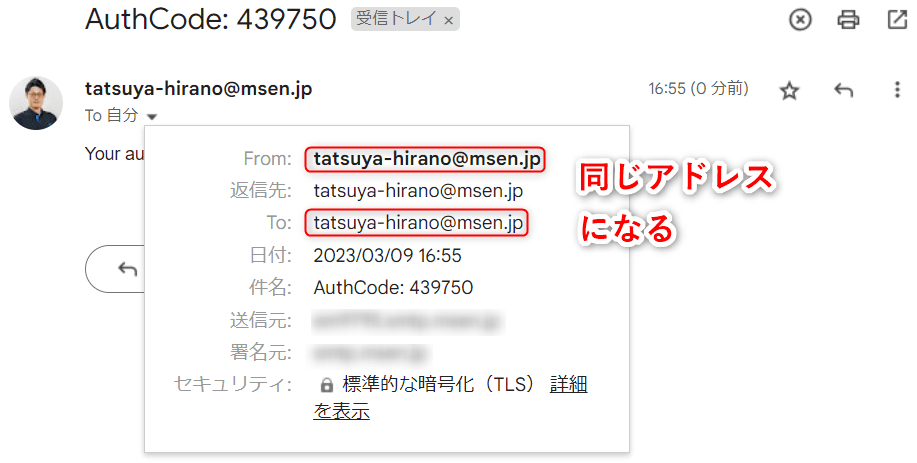
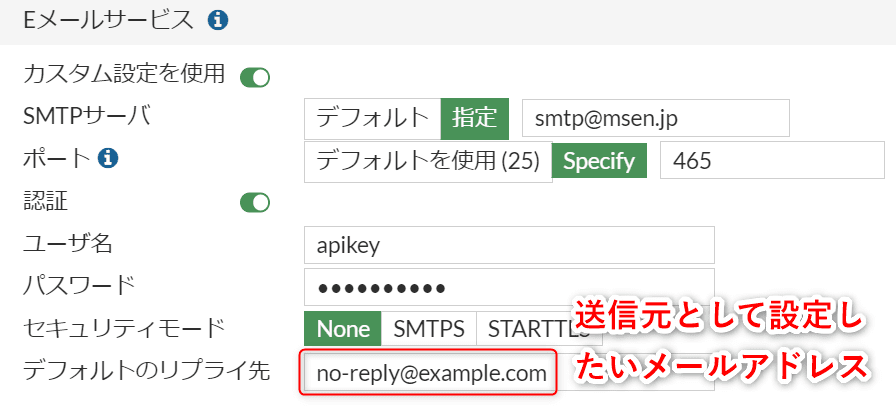
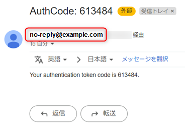
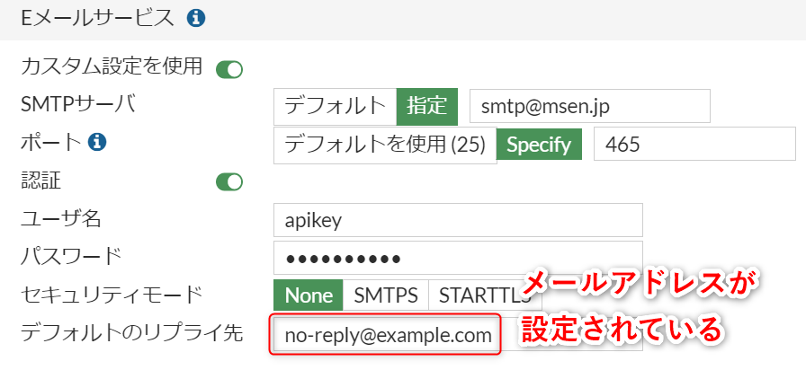

こんにちは、ひらたつです。

FortiGate では SSL VPN に二要素認証を設定できます。

具体的な設定方法は以下を参考にしてください。  
[[FortiGate] SSL VPN に二要素認証 (Slack) を設定する | MSeeeeN](https://mseeeen.msen.jp/configure-two-factor-authentication-for-fortigate-ssl-vpn/)

上記の記事では送信先を Slack としていますが、任意のメールアドレスを設定することで Slack 以外（たとえば Gmail）にもトークンを送れます。

この登録したトークン送信先のメールアドレスは、送信元のメールアドレスにもなります。



Gmail のサービスを利用していると問題ないですが、Outlook などのサービスを利用していると迷惑メールに振り分けられてしまいます。

そこで、送信元のメールアドレスを変更する方法を記事にしようと思います。

GUI と CLI の設定方法がございます。

ご参考になれば幸いです。

## 想定環境

- FortiGate 60F
- Forti OS v6.4.11
- FortiClient VPN 7.0.6.0290
- メールによる二要素認証を設定している

## 設定方法 (GUI)

FortiGate の管理コンソールにログインします。

[システム] > [設定] > [Eメールサービス] の **`デフォルトのリプライ先` に送信元として設定したいメールアドレスを設定します。**

以下の例では、`no-reply@example.com.com` を設定しています。



適用を押して設定を反映させます。

この状態でクライアントから VPN に接続すると、**トークンメールの送信元が変更されています。**



## 設定方法 (CLI)

Tera Term などで FortiGate にアクセスします。

アクセス後に以下コマンドを実行します。

```
<ホスト名> # config system email-server
<ホスト名> (email-server) # set reply-to <送信元メールアドレス>
<ホスト名> (email-server) # end
```

たとえば、`no-reply@example.com.com` を設定する場合は以下となります。

```
<ホスト名> # config system email-server
<ホスト名> (email-server) # set reply-to no-reply@example.com.com
<ホスト名> (email-server) # end
```

設定後に GUI から [システム] > [設定] > [Eメールサービス] を確認すると、デフォルトのリプライ先に `no-reply@example.com.com` が設定されています。



この状態でクライアントから VPN に接続すると、**トークンメールの送信元が変更されています。**

## 最後に

今回は、SSL VPN の二要素認証 (メール) に送信元アドレスを設定する方法を紹介しました。

ご参考になれば幸いです。

では次の記事でお会いしましょう。
