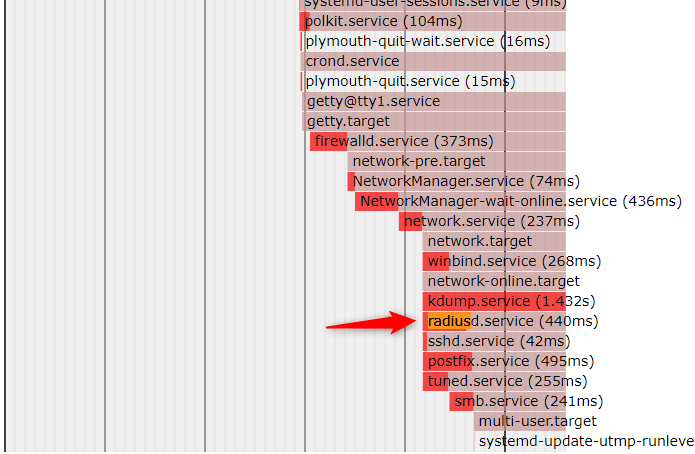
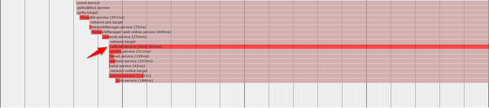

こんにちは、ひらたつです。

先日、再起動後に CentOS 上で動いている radiusd サービスが立ち上がりませんでした。

他の CentOS サーバー上に構築していた slapd.service (OpenLDAP) が起動する前に、radiusd サービスが起動してしまったことが原因でした。

CentOS で動いているサービスの起動を遅延させることで解決しましたので、今回はその方法を紹介します。

同様の問題で困っている方の参考になれば幸いです。

※今回は slapd.service との兼ね合いで radiusd サービスに 5 分 の遅延設定を入れていますが、他のサービスを遅延させる場合は radiusd の部分を読み替えてください。

## 想定環境

- CentOS 7.7

## 現状確認

事前に現在の起動時間を確認しておきます。
以下のコマンドで各サービスの起動時間を `plot.svg` に書き出します。

```bash
[user@hiratatsupc ~]$ systemd-analyze plot > plot.svg
```

※ `systemd-analyze plot` では、各サービスがどの順序で起動されたのか、またどれくらい時間がかかっているのかを SVG 形式で出力できます。

書き出したファイルを手元の環境にコピーする、GUI の Linux 環境であればブラウザで表示する、などの方法でファイルを開いて起動時間を確認してください。



今回は `radiusd.service` の起動を遅延させますが、現状の起動時間は 440ms だと分かります。

## 遅延設定の手順

### 1. タイムアウト時間の確認

**各サービスには、サービス起動の試みを断念するタイムアウト時間が設定されています。**  
デフォルトでは 1 分 30 秒 となっています。

参考：[17.16. タイムアウト制限の変更 Red Hat Enterprise Linux 8 | Red Hat Customer Portal](https://access.redhat.com/documentation/ja-jp/red_hat_enterprise_linux/8/html/configuring_basic_system_settings/proc_changing-the-timeout-limit_assembly_working-with-systemd-unit-files)

`systemctl start [SERVICE NAME]` などでサービスを起動して 1 分 30 秒 経ってもサービスが起動しない場合は、以下のようにタイムアウトで起動に失敗します。

```bash
[root@hiratatsupc ~]# systemctl status radiusd
● radiusd.service - FreeRADIUS high performance RADIUS server.
   Loaded: loaded (/etc/systemd/system/radiusd.service; enabled; vendor preset: disabled)
   Active: failed (Result: timeout) since 水 2023-03-22 14:34:59 JST; 149ms ago
```

従って、1 分 30 秒 を超える遅延を設定したい場合は、まずサービスのタイムアウト時間を変更する必要があります。  
サービスのタイムアウト時間を変更せずに 1 分 30 秒 を超える遅延を設定すると、サービスの起動に失敗して手動での起動が必要になります。

※ 1 分 30 秒 以内の遅延を設定する場合は以下の作業は不要ですので、「3. 遅延設定」に進んでください。  
ただし、厳密な実際の起動は `遅延設定 + サービス起動時間` ですので、遅延設定を 1 分 30 秒 付近に設定する場合はタイムアウト時間を変更することをおすすめします。

対象サービスの現状のタイムアウト時間を確認するには以下のコマンドを実行してください。  
以下では `radiusd` のタイムアウト時間を確認しています。

```bash
[root@hiratatsupc ~]# systemctl show radiusd | grep ^Timeout
TimeoutStartUSec=1min 30s
TimeoutStopUSec=1min 30s
```

1 分 30 秒 が設定されていることが分かります。

### 2. タイムアウト時間の変更

今回は `radiusd` サービスを 5 分 遅延させますので、タイムアウト時間を 5 分 より長い 10 分 に設定します。

対象サービスの設定を変更すればよいのですが、ここで注意点があります。

各サービスの設定は `/usr/lib/systemd/system/` にあります。  
`radiusd` サービスだと以下です。  
`/usr/lib/systemd/system/radiusd.service`

ただ、**ここを直接変更するのはルール違反** になるそうです。

> /usr/lib/systemd/system のフォルダは CentOS 7 のデフォルトで設定されているサービスや、yum などで提供されているソフトウェアをインストールした際のデフォルト設定を保存するルールになっています。 よってサーバーの管理者が編集・変更したファイルをここに配置してはいけません。
> サーバーの管理者が独自に変更・編集した設定ファイルは /etc/systemd/system フォルダに配置するルールになっています。 具体的には、/usr/lib/systemd/system 配下のファイルをここにコピーしてきて変更を加えることが多いでしょう。

引用元：[CentOS 7 における systemd のファイル・フォルダ構成 |](https://weblabo.oscasierra.net/centos7-systemd-files/)

従って、`/etc/systemd/system` 配下に対象サービスの設定ファイルを作成して、そこに設定を書いていきます。

以下の流れでタイムアウト設定を変更します。  
タイムアウト時間を設定するには、`TimeoutStartSec=` に設定値を記載します。

```bash
[root@hiratatsupc ~]# cp -p /usr/lib/systemd/system/radiusd.service /etc/systemd/system/radiusd.service
[root@hiratatsupc ~]# vi /etc/systemd/system/radiusd.service
[root@hiratatsupc ~]# cat /etc/systemd/system/radiusd.service
[Unit]
Description=FreeRADIUS high performance RADIUS server.
After=syslog.target network.target ipa.service dirsrv.target krb5kdc.service

[Service]
Type=forking
PIDFile=/var/run/radiusd/radiusd.pid
ExecStartPre=-/bin/chown -R radiusd.radiusd /var/run/radiusd
ExecStartPre=/usr/sbin/radiusd -C
ExecStart=/usr/sbin/radiusd -d /etc/raddb
ExecReload=/usr/sbin/radiusd -C
ExecReload=/bin/kill -HUP $MAINPID
TimeoutStartSec=10min　👈 10分のタイムアウト時間を設定

[Install]
WantedBy=multi-user.target
```

#### 【参考】`TimeoutStartUSec=` とは

> 起動を待つ時間を設定します。
> デーモンサービスが構成された時間内に起動完了を通知しない場合、サービスは失敗したと見なされ、再びシャットダウンされます。
> 秒単位の単位のない値、または 5min 20s などのタイムスパン値を取ります。

[man systemd.service 日本語訳 - Qiita](https://qiita.com/JhonnyBravo/items/a28074c20fa9adf02be3)

### 3. 遅延設定

遅延設定も 2. タイムアウト時間の変更 と同様に `/etc/systemd/system` 配下の設定ファイルを編集します。

`ExecStartPre=` は `ExecStart=` で指定しているコマンドの前に実行されるコマンドを指定します。

```bash
[root@hiratatsupc ~]# vi /etc/systemd/system/radiusd.service
[root@hiratatsupc ~]# cat /etc/systemd/system/radiusd.service
[Unit]
Description=FreeRADIUS high performance RADIUS server.
After=syslog.target network.target ipa.service dirsrv.target krb5kdc.service

[Service]
Type=forking
PIDFile=/var/run/radiusd/radiusd.pid
ExecStartPre=-/bin/chown -R radiusd.radiusd /var/run/radiusd
ExecStartPre=/usr/sbin/radiusd -C
ExecStartPre=/usr/bin/bash -c "sleep 5m;"　👈 5分遅延設定を追加
ExecStart=/usr/sbin/radiusd -d /etc/raddb
ExecReload=/usr/sbin/radiusd -C
ExecReload=/bin/kill -HUP $MAINPID

[Install]
WantedBy=multi-user.target
```

※ 同様に `ExecStart=` にも遅延設定を追加可能ですが、今回はサービス起動前に遅延を入れる目的なので `ExecStartPre=` に設定する方が適切だと思います。

#### 【参考】`ExecStartPre=` とは

> [ExecStart=](https://qiita.com/JhonnyBravo/items/a28074c20fa9adf02be3#execstart) のコマンドの前または後に実行される追加のコマンドを指定します。
> 構文は [ExecStart=](https://qiita.com/JhonnyBravo/items/a28074c20fa9adf02be3#execstart) の場合と同じですが、複数のコマンド行が許可され、コマンドが順番に連続して実行される点が異なります。
> これらのコマンドのいずれかが失敗した(そして - が前に付いていない)場合、失敗後のコマンド行は実行されず、ユニットは失敗したと見なされます。

引用元：[man systemd.service 日本語訳 - Qiita](https://qiita.com/JhonnyBravo/items/a28074c20fa9adf02be3#execstartpre-execstartpost)

## 設定後の確認

設定前に確認した方法と同じ方法で設定後の遅延時間を確認します。

サーバーを再起動させる、または `systemctl restart [SERVICE NAME]` でサービスを再起動して、以下コマンドを実行ください。

```bash
[user@hiratatsupc ~]$ systemd-analyze plot > plot.svg
```

5 分の遅延が設定されていることが分かります。



## 最後に

今回はサービスに起動遅延を入れる方法を紹介しました。

複数サーバー間のサービス連携で悩まれている方の参考になれば幸いです。

## 参考

- [【CentOS7/systemd の設定】サービス(デーモン)の遅延起動 | SE の道標](https://milestone-of-se.nesuke.com/sv-basic/linux-basic/systemd-service-delay-load/)
