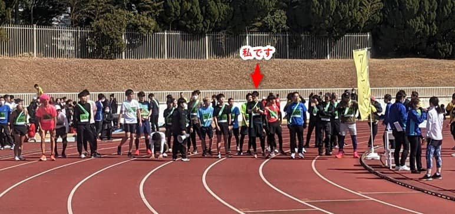
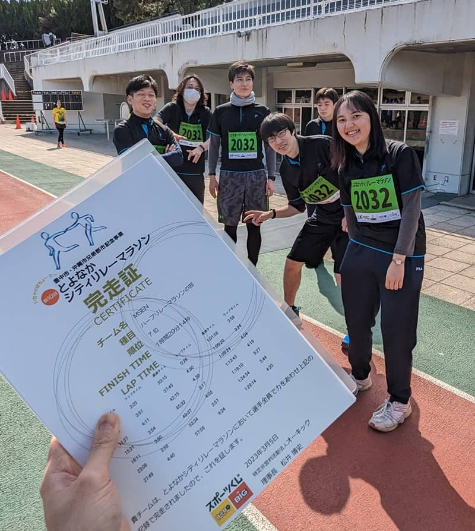

こんにちは、ひらたつです。

今回、趣味のランニングが高じて、会社で参加者を募りリレーマラソンに参加しました。

3/5(日) に無事開催されましたので、その様子をお届けします！

当日は非常に天気もよく、全員で楽しく走ることができました🏃

## 参加した大会

参加した大会は **[とよなかシティリレーマラソン](https://toyonakarelay.jp/)** で、自分を含めて8人でハーフマラソンに挑戦しました。

開催場所は大阪府豊中市にある服部緑地公園で、スタート時間はフルリレーマラソンもハーフリレーマラソンも 11:00 です。

コースは陸上競技場からスタートし、一度場外に出て、再度戻ってくるコースです。  
1周 1km の距離です。

走行順や走行距離は自由で、一度走った人も復帰できます。  
今回は 1km 交代で、事前に順番を決めて走りました。

陸上競技場で走ることが初めてでテンションが上がりました⤴  
テレビでよく見ていた、マラソンの最後に陸上競技場でゴールする場面を自分も経験でき楽しかったです。

## 到着＆準備

メンバー全員で同じポロシャツにゼッケンを付けてマラソンに挑みます！

社長は親子で参加されました。

ワークマンのランニングシューズ率が上がっていました。  
会社でおすすめし続けた成果を感じることができました。

ワークマンのランニングシューズ本当におすすめです。

## いざ、スタート

私はトップバッターを任されました。

ハーフリレーマラソンには30組くらいが参加されているように見えます。

2走者目からは競技場内のリレーゾーンでタスキをリレーします。

最初に私がタスキをほどいて渡したため、皆さんもタスキを掛けず手に持って走っていました。  
タスキというよりはバトンをリレーするみたいになってしまいました。

1kmという距離だけ聞くとそこまで長くないですが、そのぶんスピードを出せてしまうので、想像以上にきつかったです💦

加えて、周りで走っている人を抜かそうとしたり、逆に抜かれないようにしたりと普段よりペースを上げてしまいました。

1人あたり 2,3 kmを走りましたが、私は最後の1周は気合で走り切りました。

席に戻ると応援に来てくれていた娘がお腹を空かせていたのでミルクタイム🍼

## 見事完走 & すばらしい結果

見事ゴールしました！  
最終走者はもちろん社長🌟

完走証をいただきましたが、なんと順位は **7位** でした！！！  
初リレーマラソンで驚きの順位です！

しかも、完走タイムは1時間半を切ることができました！

ワークマンのランニングシューズのおかげかもしれません。

## 最後に

晴天に恵まれ、完走 & 1時間半を切る偉業も達成でき、とても楽しい時間でした。   
チームでバトンをつなぎながらゴールを目指すことは高校生以来の経験かもしれません。  

BBQ や 飲み会も楽しいですが、たまにはリレーマラソンもよいなと思ったひらたつでした。

今年の年末か来年の年始くらいにまたリレーマラソンに参加しようと思います🏃
